# 🚀 AWS IAM Role Chaining & S3 Access Control

This project demonstrates how to securely manage access to AWS S3 using:
- IAM Users
- IAM Roles
- Role Chaining (User → Role1 → Role2)
- AWS CLI (STS AssumeRole)

---

# 📌 Objective

- Create an IAM user with limited permissions
- Allow access to S3 using roles instead of direct permissions
- Implement **Role Chaining**
- Perform S3 operations using temporary credentials

---

---

# 🔹 Task 1: Create IAM User & S3 Access Policy

## Step 1: Create IAM User

- Created a user: `cloudmaven-user`


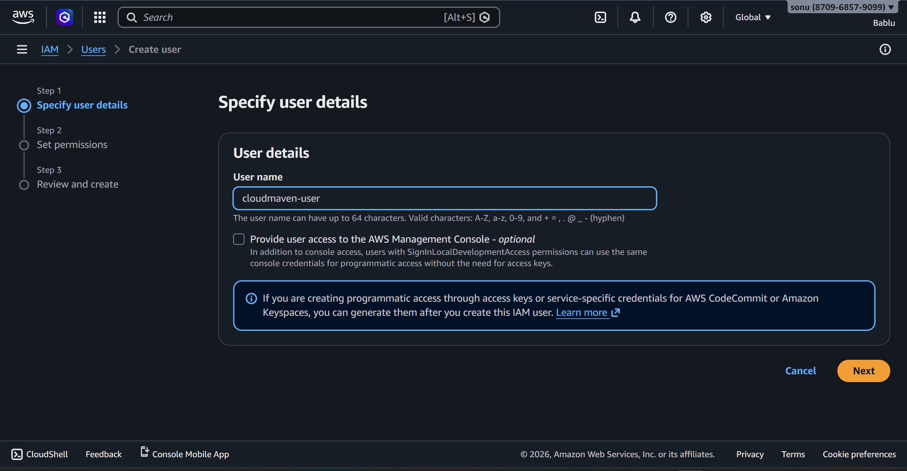


---

## Step 2: Create S3 Policy

* Allowed permission:

  * `s3:CreateBucket`


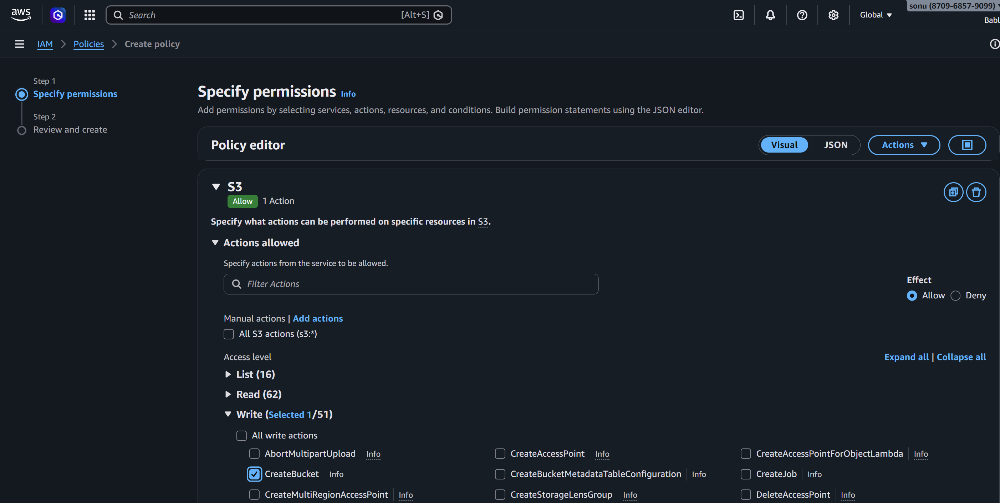


---

## Step 3: Name the Policy


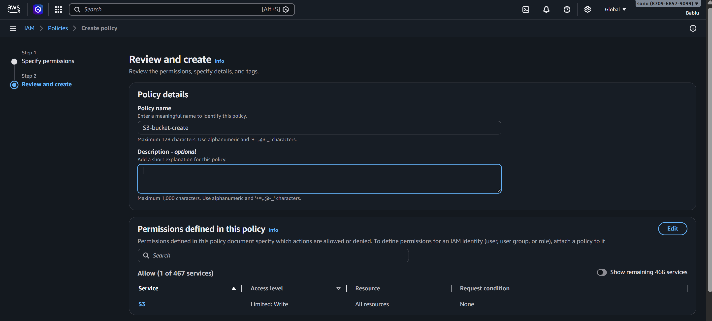


---

## Step 4: Attach Policy to User


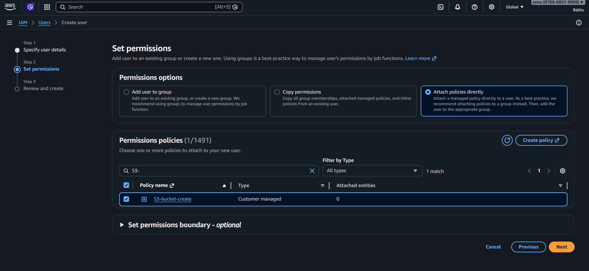


---

## Step 5: Create User

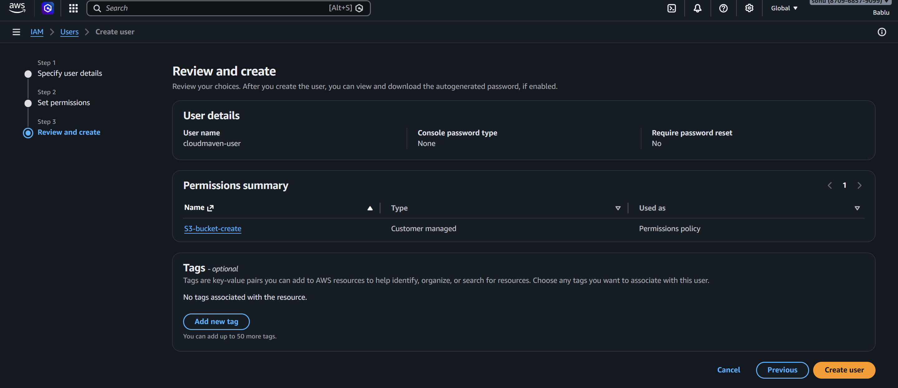


---

## Step 6: Generate Access Key (for CLI)


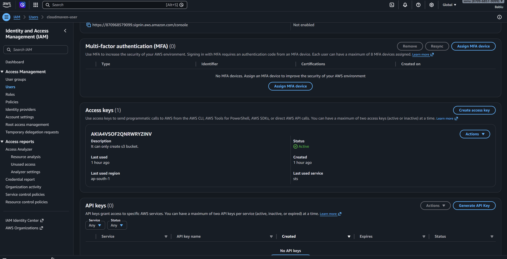


---

## Step 7: Create S3 Bucket via CLI


aws s3 mb s3://cloud-maven7011 --region ap-south-1


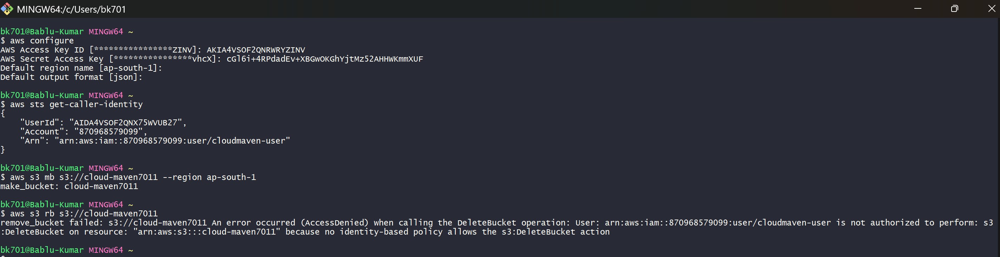


---

## Step 8: Verify Bucket

```bash
aws s3 ls
```

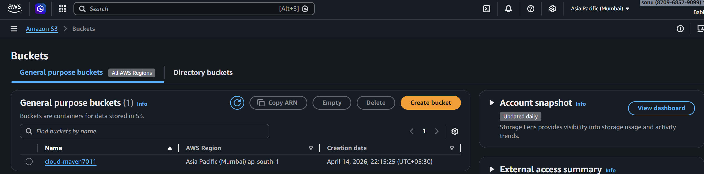


---

# 🔹 Task 2: Create Role for Bucket Deletion

## Step 1: Create IAM Role

* Trusted entity: AWS Account


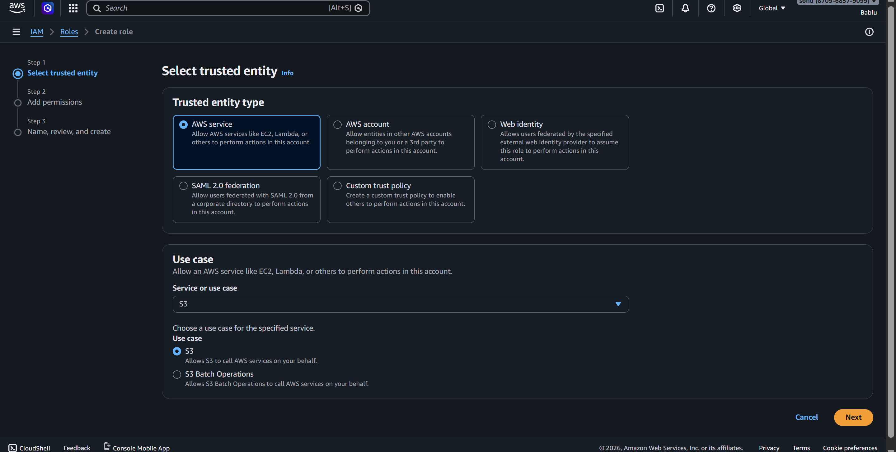


---

## Step 2: Add Trust Policy (User → Role)

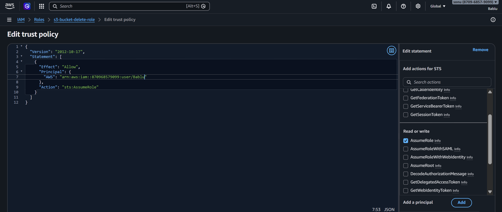


---

## Step 3: Add S3 Delete Policy

Permissions:

* `s3:DeleteBucket`
* `s3:ListBucket`


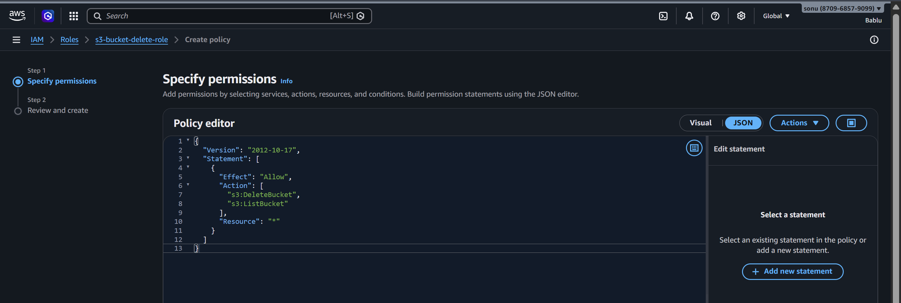


---

## Step 4: Name Policy

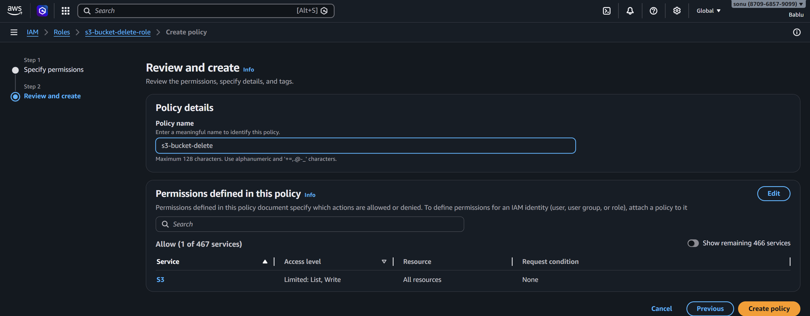


---

## Step 5: Attach Policy to Role


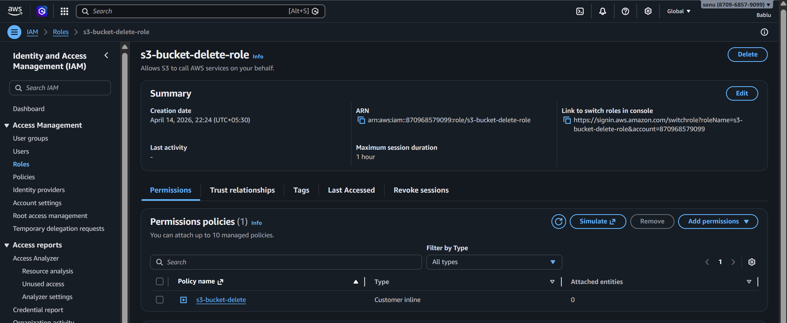


---

## Step 6: Assume Role & Delete Bucket

```bash
aws sts assume-role \
--role-arn arn:aws:iam::<ACCOUNT_ID>:role/s3-bucket-delete-role \
--role-session-name test-session
```


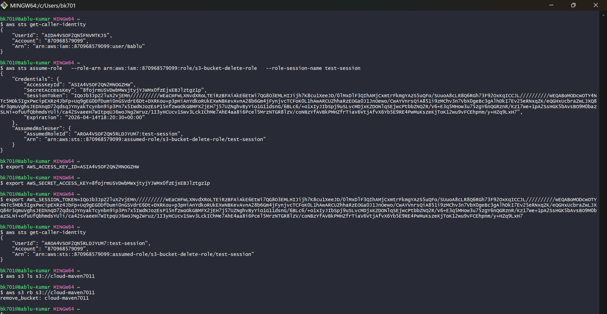

---

## Step 7: Delete Bucket


aws s3 rb s3://cloud-maven7011


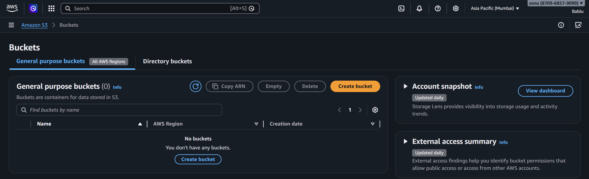

---

# 🔹 Task 3: IAM Role Chaining (Advanced)

## 🎯 Goal

Instead of giving direct access:

* IAM User → Role 1 → Role 2 → S3

---

## Step 1: Create IAM Role 1

* Trusted entity: IAM User


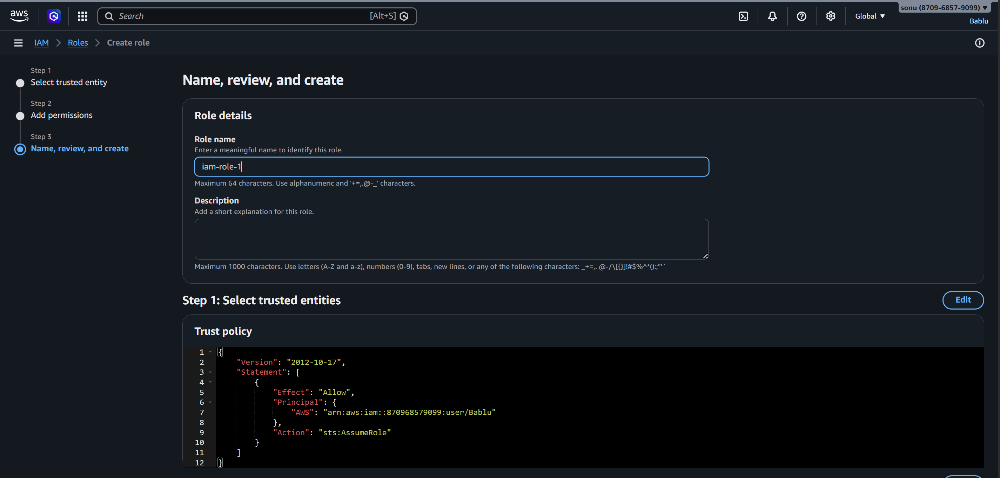


---

## Step 2: Create IAM Role 2

* Trusted entity: Role 1


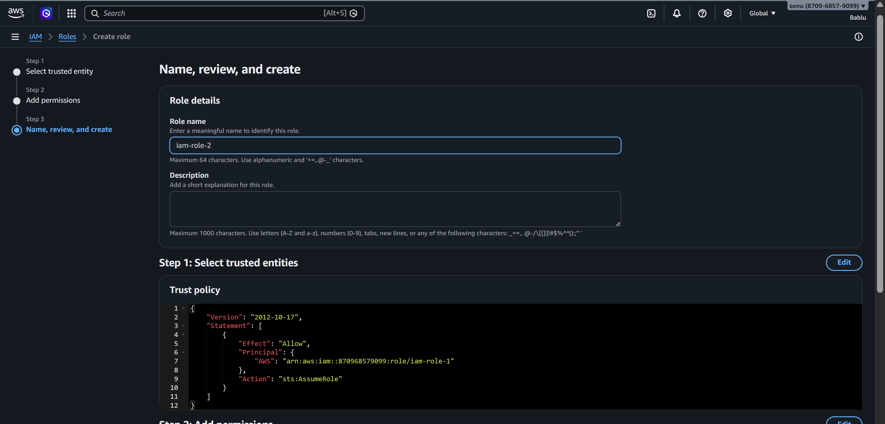


---

## Step 3: Attach Role1 to User


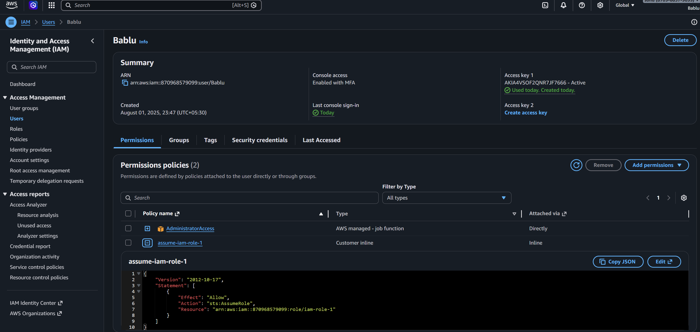


---

## Step 4: Allow Role1 → Assume Role2


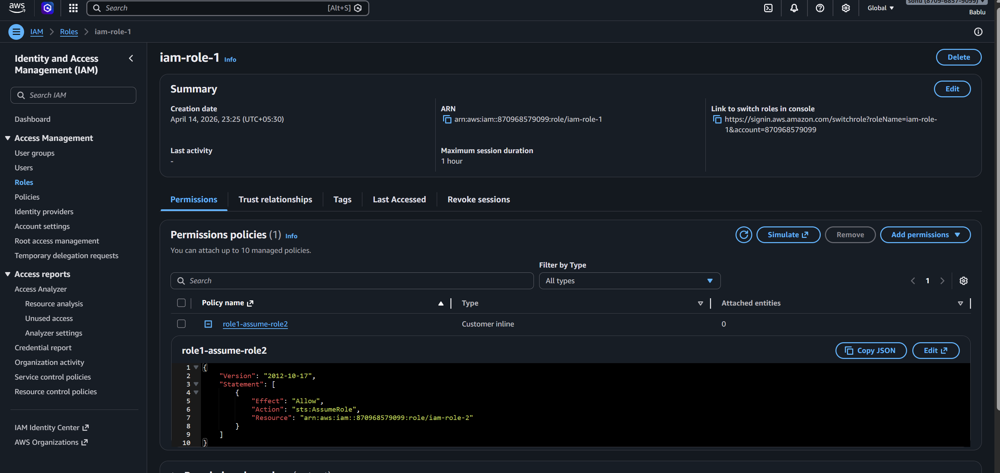


---

## Step 5: Attach S3 Policy to Role2

Permissions:

* `s3:CreateBucket`
* `s3:ListBucket`
* `s3:ListAllMyBuckets`


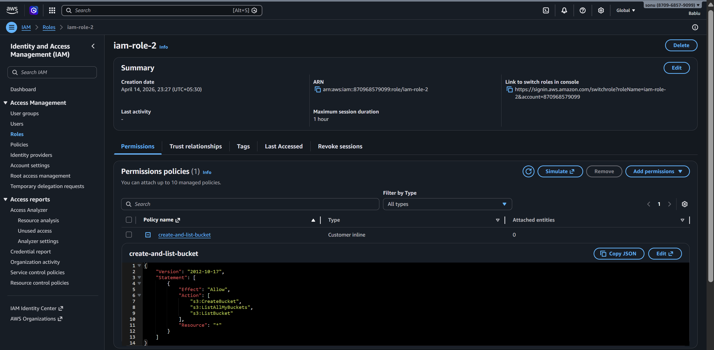


---

## Step 6: Assume Role 1

```bash
aws sts assume-role \
--role-arn arn:aws:iam::<ACCOUNT_ID>:role/iam-role-1 \
--role-session-name role1-session
```


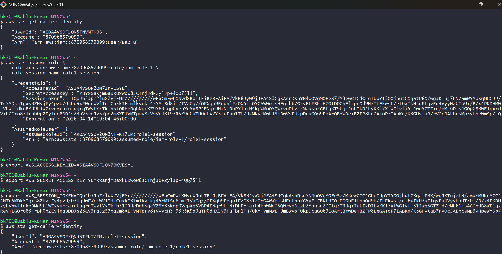


---

## Step 7: Assume Role 2 (Role Chaining)

```bash
aws sts assume-role \
--role-arn arn:aws:iam::<ACCOUNT_ID>:role/iam-role-2 \
--role-session-name role2-session
```


---

## Step 8: Create Bucket Using Role2

```bash
aws s3 mb s3://cloud-maven7011
aws s3 ls
```
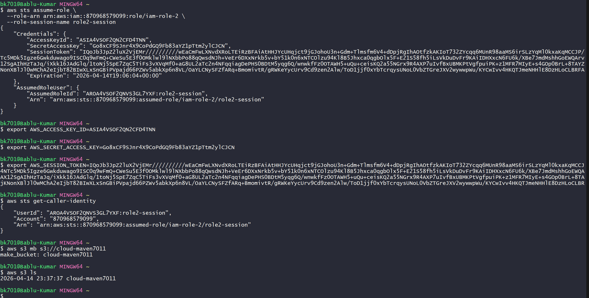

## Bucker Verification
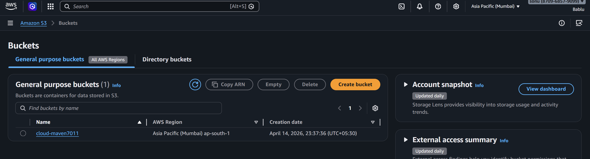


---

# 🔐 Key Concepts Learned

### ✅ IAM User vs Role

* User = Permanent identity
* Role = Temporary access

---

### ✅ Assume Role (STS)

* Provides temporary credentials
* More secure than static keys

---

### ✅ Role Chaining

* One role assumes another role
* Helps implement **least privilege**

---

### ✅ Why Not Direct Permissions?

* Improves security
* Better control
* Temporary access only

---

# ⚠️ Common Errors Faced

### ❌ AccessDenied (AssumeRole)

* Missing trust relationship
* Wrong principal

---

### ❌ Cannot delete bucket

* Bucket not empty
* Missing `s3:DeleteBucket`

---

### ❌ `aws s3 ls` not working

* Missing `s3:ListAllMyBuckets`

---

# 🏁 Conclusion

This project demonstrates:

* Secure AWS access using IAM roles
* Role chaining implementation
* Real-world DevOps security practices

---

