# 🚀 AWS Auto Scaling Group (ASG) with Launch Template

This project demonstrates how to use **AWS Launch Templates and Auto Scaling Groups (ASG)** to automatically manage EC2 instances and deploy web servers (Apache & Nginx).

---

# 📌 Project Objective

* Create a **Launch Template**
* Deploy multiple EC2 instances using **Auto Scaling Group**
* Install **Apache Web Server**
* Update configuration to **Nginx**
* Handle issue where changes are not reflected using **Instance Refresh**

---

# 🧱 Architecture Overview

```
Launch Template → Auto Scaling Group → EC2 Instances → Web Server
```

---

# 🛠️ Step 1: Create Launch Template

### 🔹 Configuration

* AMI: Ubuntu
* Instance Type: t2.micro
* Key Pair: Created
* Security Group:

  * Allow SSH (22)
  * Allow HTTP (80)

📷 Image:
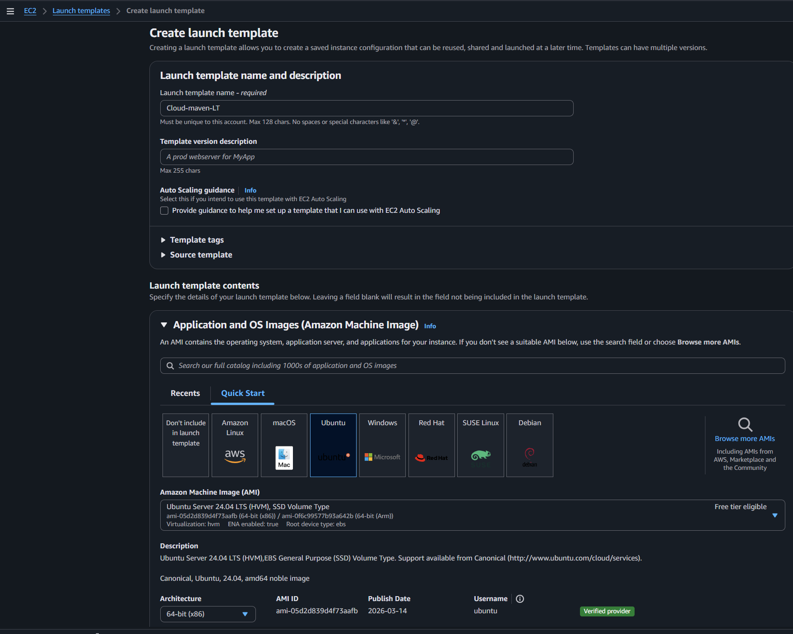

---

### 🔹 Instance & Key Configuration

📷 Image:
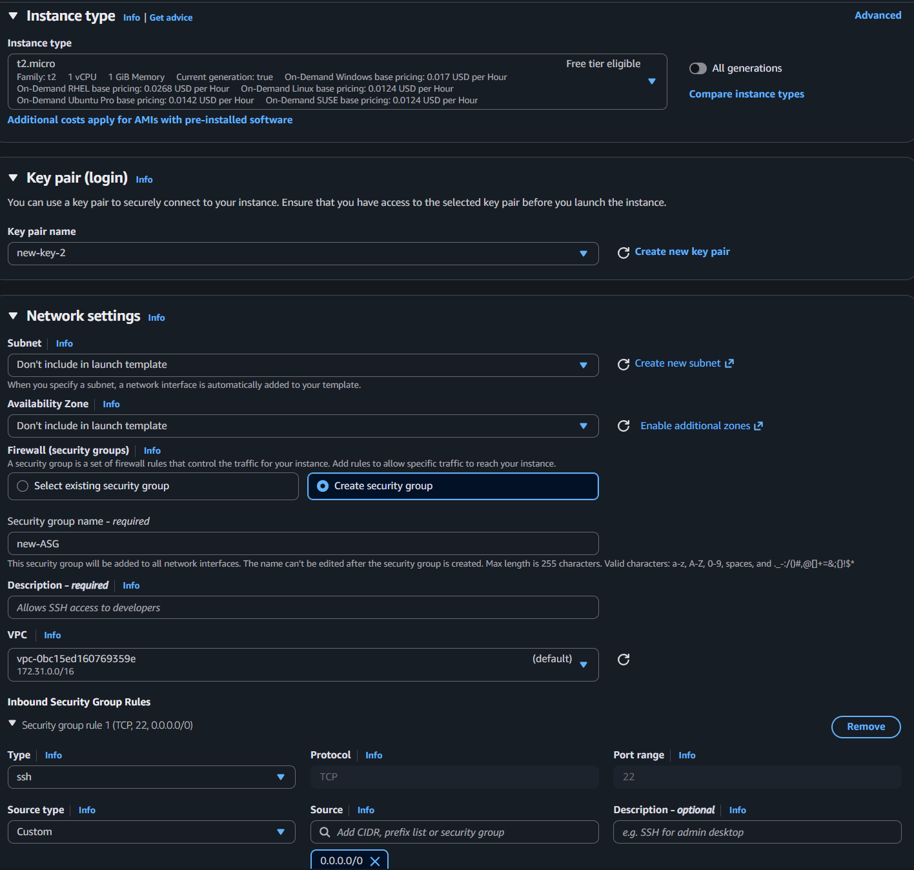

---

### 🔹 Security Group (Ports)

📷 Image:
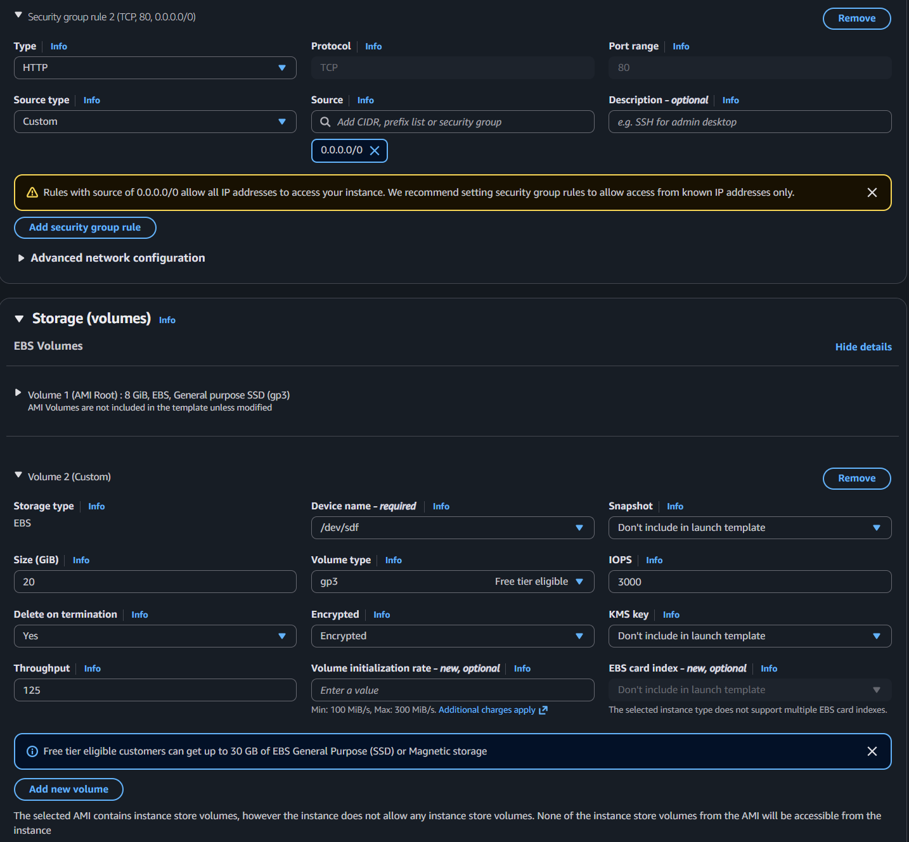

---

### 🔹 User Data Script (Apache Setup)

```bash
#!/bin/bash
apt update -y
apt install apache2 -y
systemctl start apache2
systemctl enable apache2

echo "<html>
<head><title>Apache Test</title></head>
<body>
<h1>Apache - Hello from Your Bablu!</h1>
</body>
</html>" > /var/www/html/index.html
```

📷 Image:
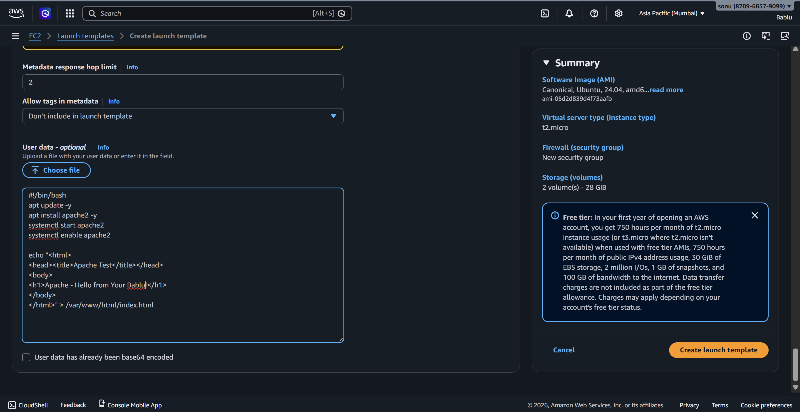

---

### ✅ Launch Template Created

📷 Image:
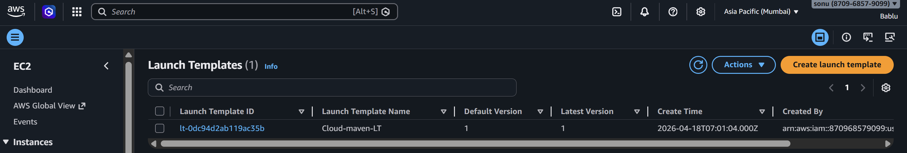

---

# ⚙️ Step 2: Create Auto Scaling Group (ASG)

### 🔹 Select Launch Template

📷 Image:
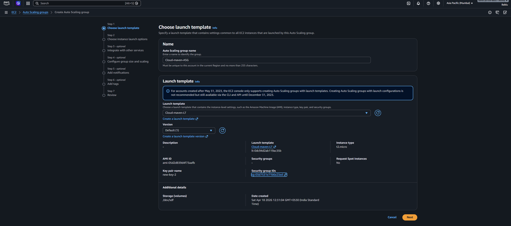

---

### 🔹 Configure Network (Multi-AZ)

📷 Image:
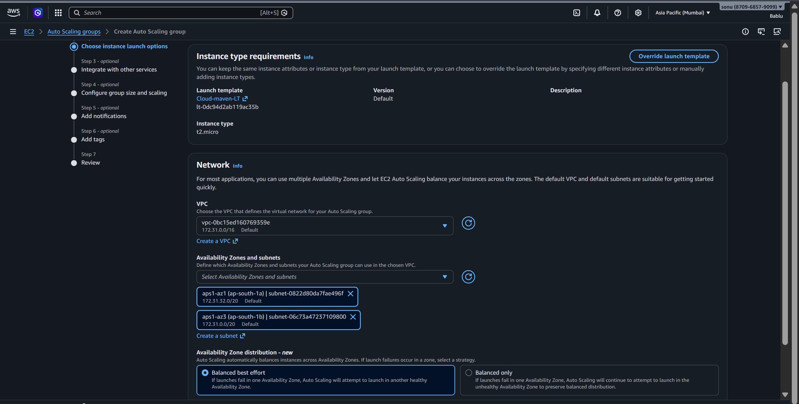

---

### 🔹 Attach Load Balancer

📷 Image:
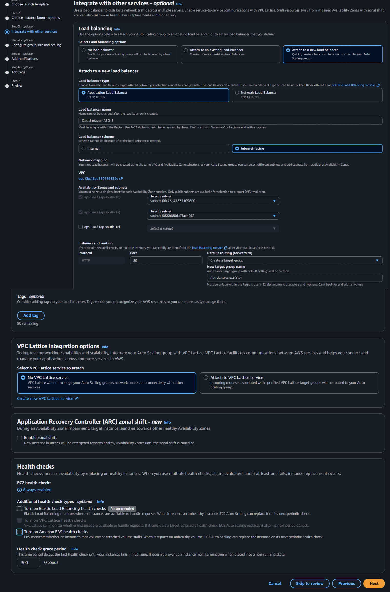

---

### 🔹 Configure Scaling

* Desired Capacity: 2
* Min: 1
* Max: 3

📷 Image:
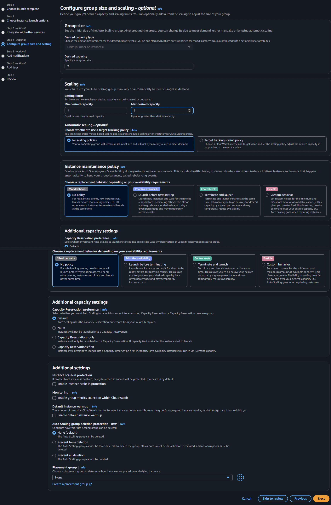

---

### ✅ ASG Created

📷 Image:
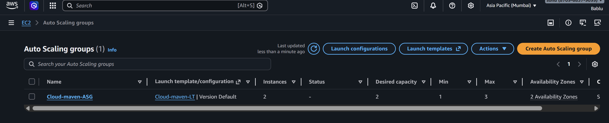

---

# 🌐 Step 3: Verify Apache Web Server

### 🔹 Instances Running

📷 Image:
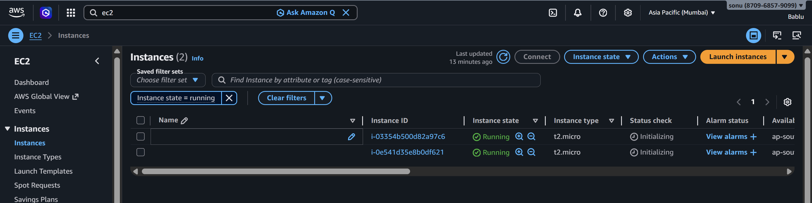

---

### 🔹 Access Web Page

👉 Open in browser:

```
http://<Public-IP>
```

📷 Output:
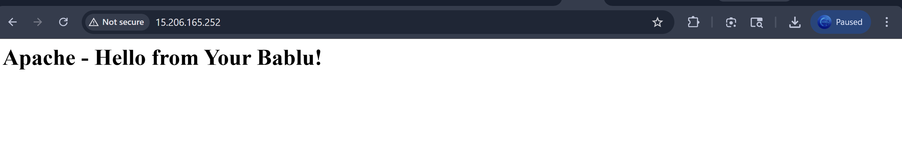

---

# 🔄 Step 4: Scale Instances

### 🔹 Increase Instance Count

📷 Image:
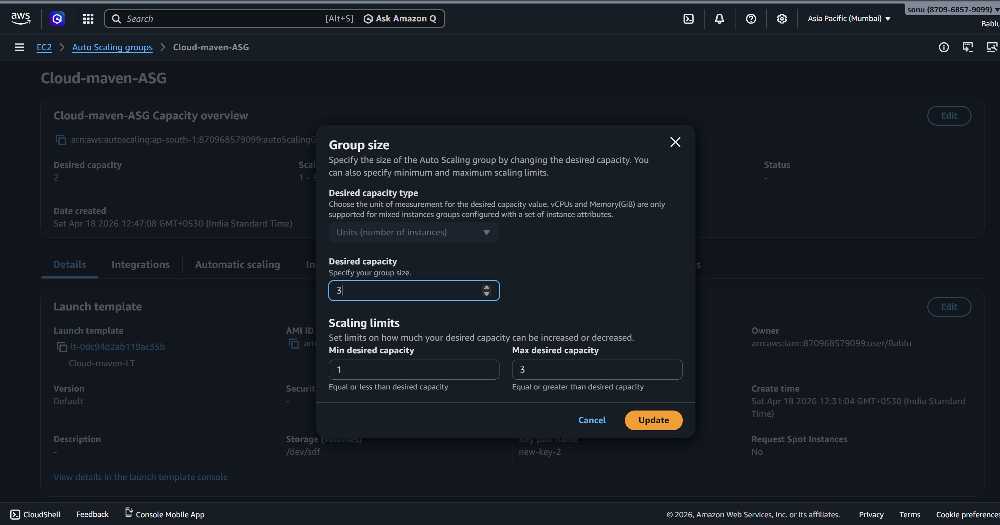

---

### 🔹 New Instances Running

📷 Image:
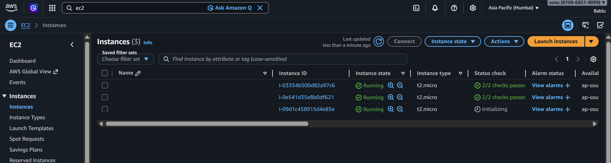

---

# 🔁 Step 5: Update Launch Template (Apache → Nginx)

### 🔹 Updated User Data Script

```bash
#!/bin/bash
apt update -y
apt install -y nginx
systemctl start nginx
systemctl enable nginx

cat <<EOF > /var/www/html/index.html
<html>
<head>
<title>Nginx Test</title>
</head>
<body>
<h1>Nginx - Hello from Bablu!</h1>
</body>
</html>
EOF
```

📷 Image:
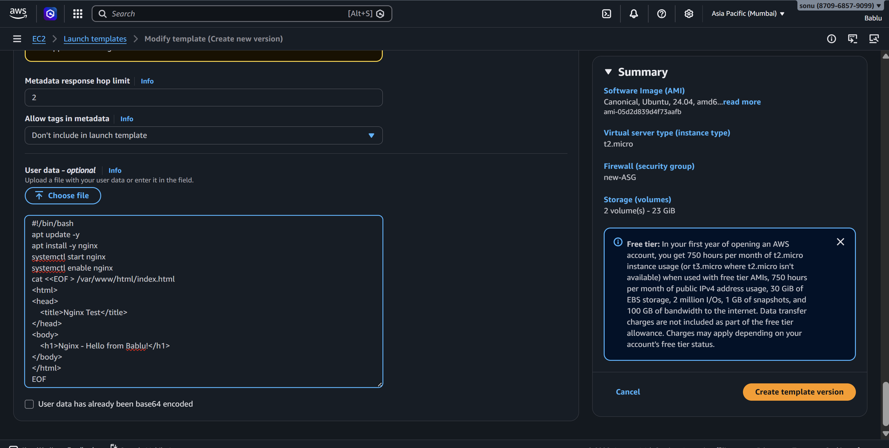

---

### 🔹 New Launch Template Version Created

📷 Image:
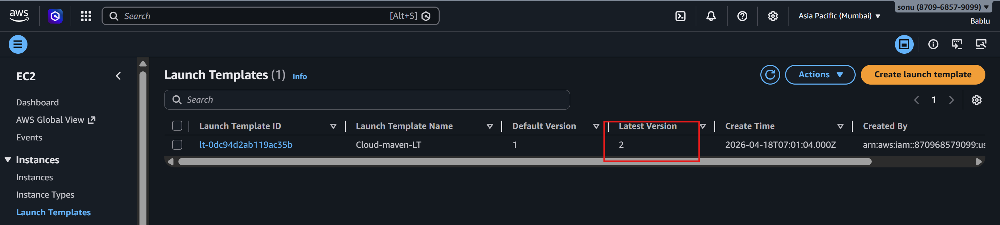


---

# ⚠️ Important Issue Faced

👉 After updating Launch Template & ASG
**Webpage was still showing Apache instead of Nginx**

### ❓ Why this happens?

* ASG **does NOT update existing instances automatically**
* Only **new instances** use updated template

---

# ✅ Solution: Instance Refresh (Very Important)

👉 To apply new configuration:

* Go to ASG
* Update Launch Template version
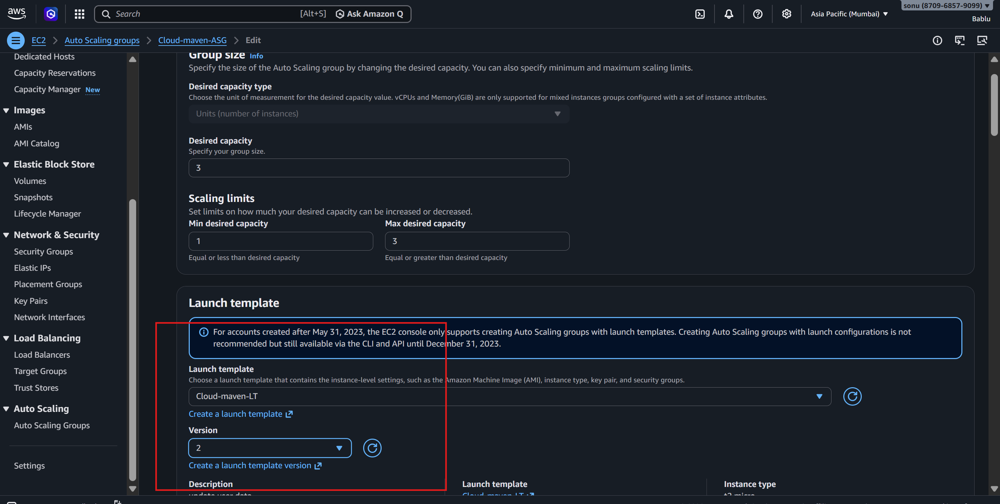
* Perform **Instance Refresh**


---

### 🔹 Perform Instance Refresh

📷 Image:
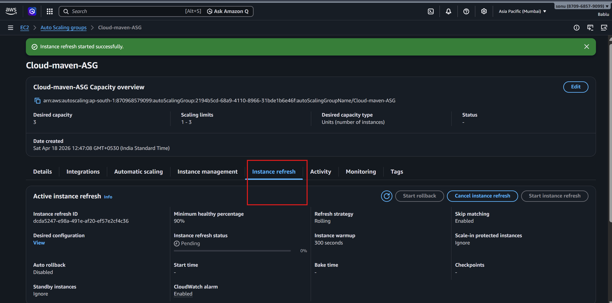

---

# 🌐 Final Output (Nginx)

After refresh, all instances recreated with new config

📷 Output:


---

# 🎯 Key Learnings

* Launch Template = Configuration Blueprint
* ASG = Automation & Scaling
* Scaling helps handle traffic dynamically
* **Instance Refresh is required to apply updates**

---

