# 🚀 AWS VPC Setup with Public & Private Subnets

This project demonstrates how to build a **custom VPC architecture** in AWS with:
- Public & Private Subnets
- Internet Gateway (IGW)
- NAT Gateway
- Route Tables
- Security Groups & NACL
- EC2 Instances (Public + Private)
- Nginx Deployment & Verification

---

# 📌 Architecture Overview

```

Internet
↓
Internet Gateway (IGW)
↓
Public Subnets (EC2 - Bastion Host)
↓
NAT Gateway
↓
Private Subnets (EC2 - Application Server)

````

---

# 🧱 Step 1: Create VPC

- **Name:** `Test-vpc`
- **CIDR:** `10.0.0.0/16`

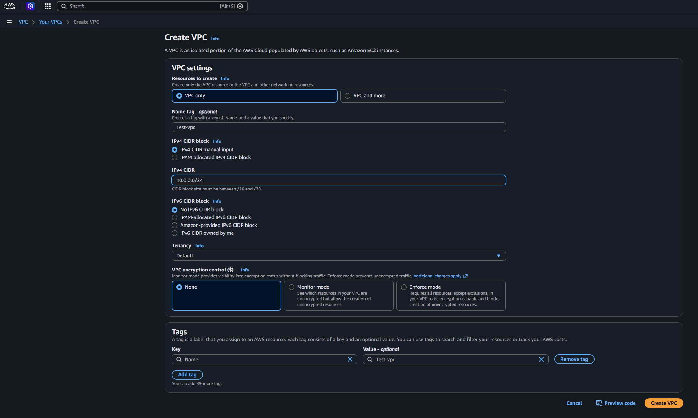

👉 This creates an isolated network in AWS.

---

# ✅ Step 2: Verify VPC Creation

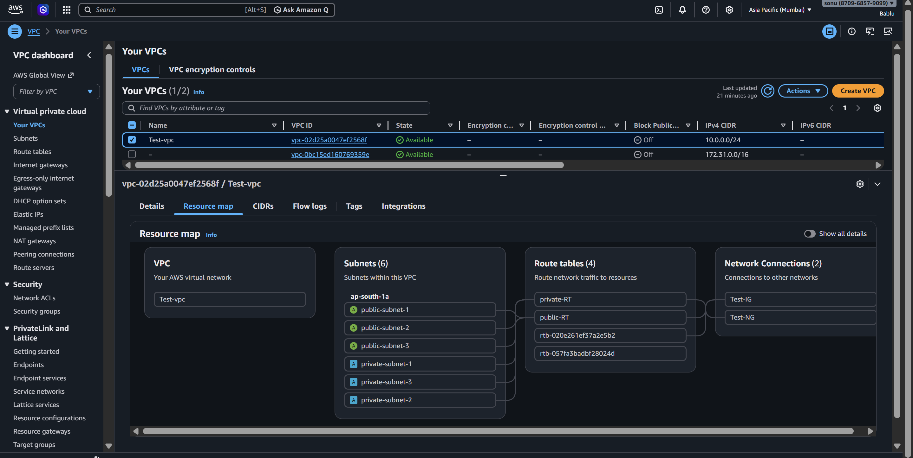

👉 Confirm that the VPC is successfully created and available.

---

# 🌐 Step 3: Create Subnets

## 🔹 Public Subnets
- public-subnet-1 → `10.0.0.0/26`
- public-subnet-2 → `10.0.0.64/26`
- public-subnet-3 → `10.0.0.128/26`

## 🔹 Private Subnets
- private-subnet-1 → `10.0.0.192/28`
- private-subnet-2 → `10.0.0.208/28`
- private-subnet-3 → `10.0.0.224/28`

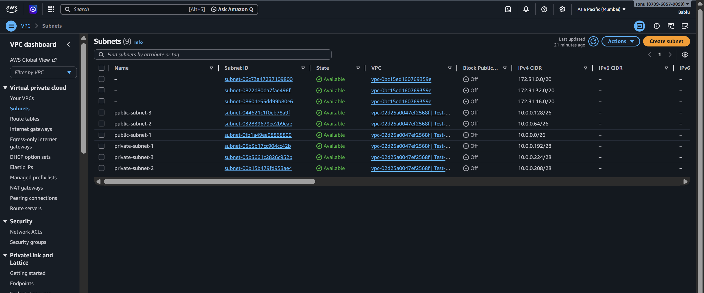

👉 Public subnets allow direct internet access, while private subnets are secured.


---

# 🛣️ Step 4:  Route Table Configuration & Subnet Association

- **Public Route Table:** `public-RT`
- **Private Route Table:** `private-RT`

👉 Route tables control traffic flow inside the VPC.

### 🌍 Public Route Table (`public-RT`)
- Attached to **Internet Gateway (Test-IG)**
- Route added:
```

0.0.0.0/0 → Internet Gateway (IGW)

```
- Associated Subnets:
- public-subnet-1
- public-subnet-2
- public-subnet-3

👉 This allows all public subnets to access the internet directly.

---

### 🔒 Private Route Table (`private-RT`)
- Attached to **NAT Gateway (Test-NG)**
- Route added:
```

0.0.0.0/0 → NAT Gateway

```
- Associated Subnets:
- private-subnet-1
- private-subnet-2
- private-subnet-3

👉 This allows private subnets to access the internet securely (outbound only) via NAT Gateway.


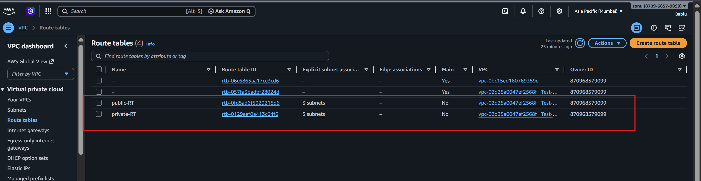


---

# 🌍 Step 5: Create Internet Gateway (IGW)

- **Name:** `Test-IG`
- Attach to VPC

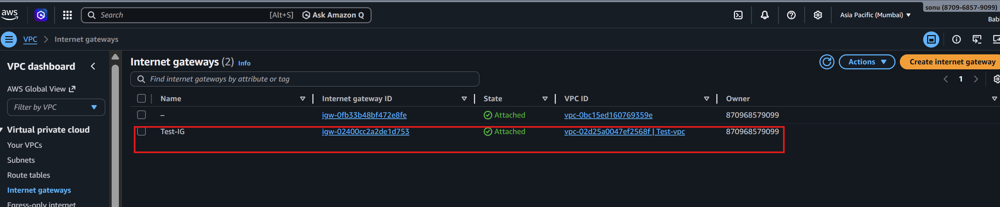

👉 Enables internet access for public subnets.

---

# 🔁 Step 6: Create NAT Gateway

- **Name:** `Test-NG`
- Created in Public Subnet

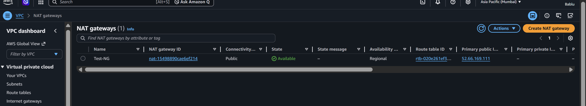

👉 Allows private subnet instances to access the internet (outbound only).

---

# 🔐 Step 7: Configure NACL

- Allow all traffic (`0.0.0.0/0`) as required

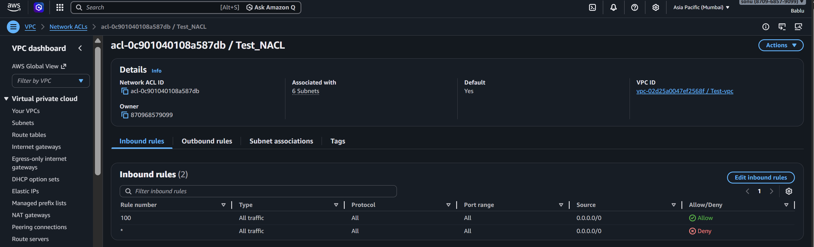

👉 Acts as an additional security layer at subnet level.

---

# 🛡️ Step 8: Create Security Group

- **Name:** `TEST_SG`

## Inbound Rules:
- SSH (22) → `0.0.0.0/0`
- HTTP (80) → `0.0.0.0/0`

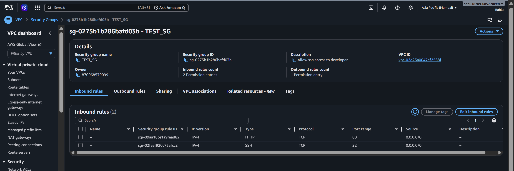

👉 Controls traffic at instance level.

---

# 🖥️ Step 9: Launch EC2 Instances

- **Public Instance:** `Test-server-public`
- **Private Instance:** `Test-private-server`

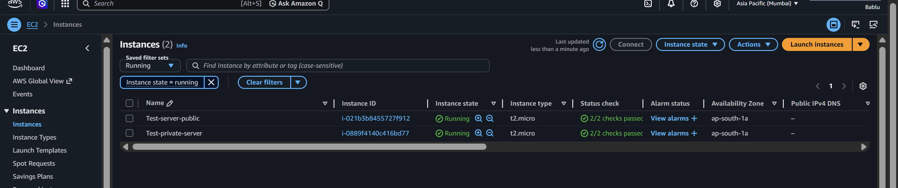

---

# ⚙️ Step 10: Install Nginx on Public EC2

```bash
sudo apt update -y
sudo apt install nginx -y
````

👉 Access via browser:

```
http://<Public-IP>
```

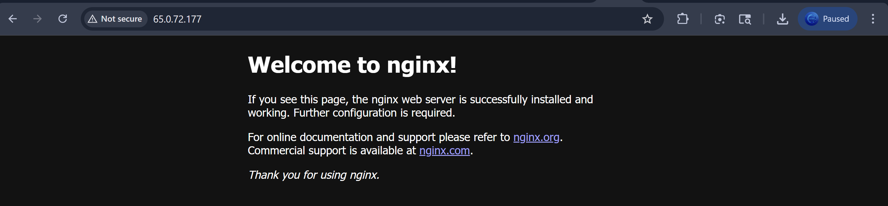

✅ Nginx webpage successfully loaded.

---

# 🔐 Step 11: Access Private EC2 (Bastion Host)

* SSH into Public EC2
* Then connect to Private EC2 using private IP

```bash
ssh -i test-key.pem ubuntu@10.0.0.196
```

---

# ⚙️ Step 12: Install Nginx on Private EC2

```bash
sudo apt update -y
sudo apt install nginx -y
```

---

# 🌐 Step 13: Verify Private EC2

From Public EC2:

```bash
curl -I http://<Private-IP>:80
```

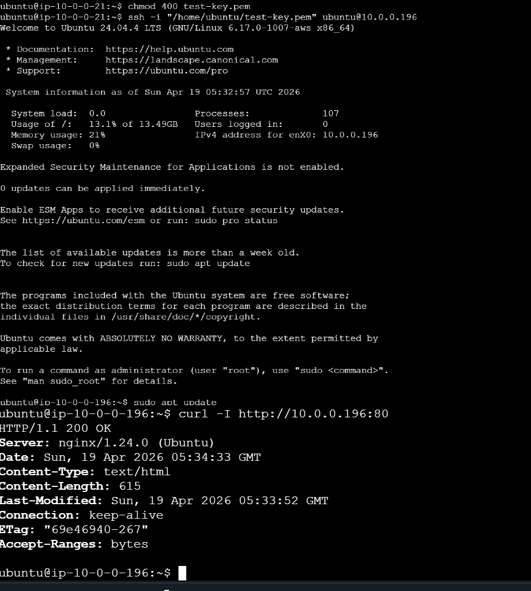

✅ Output:

```
HTTP/1.1 200 OK
Server: nginx
```

---


