# 📘 Day 6 – AWS S3 & CloudFront (CDN)

This project demonstrates the implementation of **Amazon S3 (Static Website Hosting)** and **AWS CloudFront (CDN)** for fast and secure content delivery.

---

# 🚀 Tasks Covered

* ✅ Task 1: Setup S3 Static Website Hosting
* ✅ Task 2: Access Objects via URL
* ⚠️ Task 3: Bucket Policies (In Progress)
* ⚠️ Task 4: CloudFront with S3 (In Progress – Facing Access Issue)

---

# 🧪 Task 1: S3 Static Website Hosting

## 🔹 Step 1: Create S3 Bucket

Created a bucket in AWS S3.

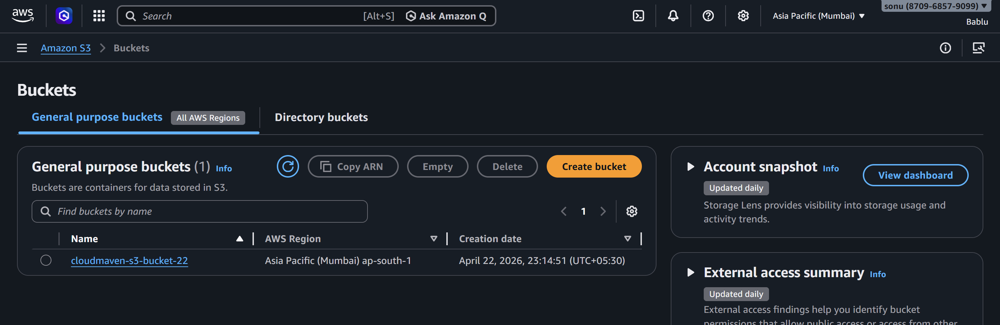

---

## 🔹 Step 2: Upload index.html

Uploaded static website files.

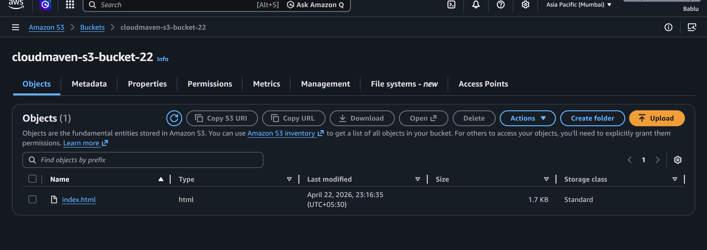

---

## 🔹 Step 3: Enable Static Website Hosting

Enabled hosting and configured `index.html` as entry point.

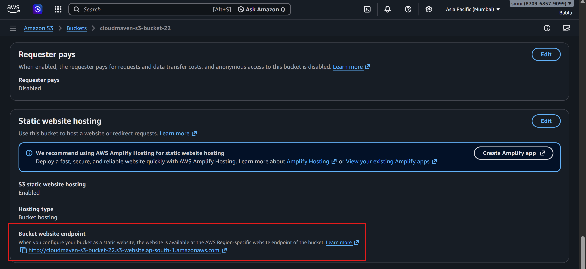

---

## 🔹 Step 4: Add Bucket Policy

Allowed public access to objects.

```json
{
  "Version": "2012-10-17",
  "Statement": [
    {
      "Sid": "PublicRead",
      "Effect": "Allow",
      "Principal": "*",
      "Action": "s3:GetObject",
      "Resource": "arn:aws:s3:::cloudmaven-s3-bucket-22/*"
    }
  ]
}
```

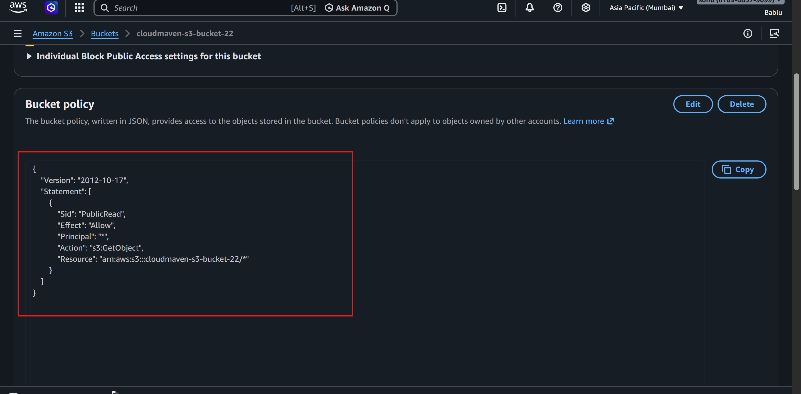

---

## 🔹 Step 5: Verify Website

Accessed website using S3 endpoint.

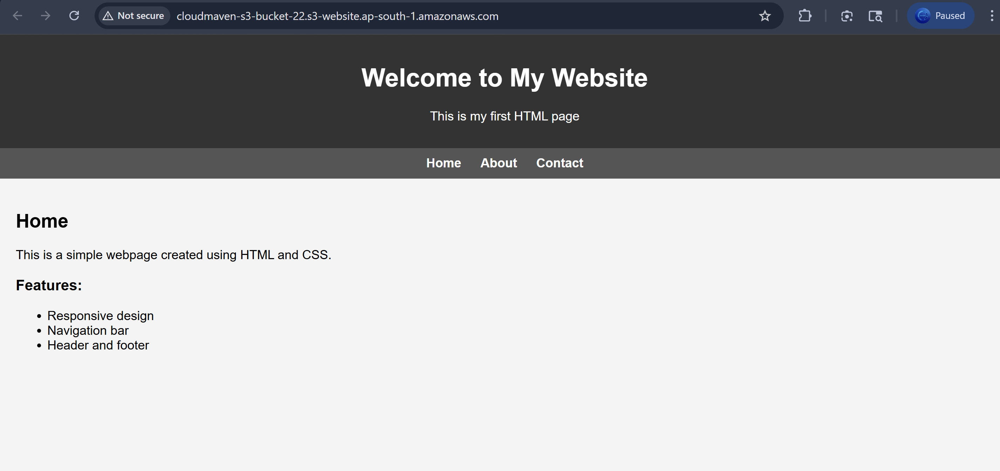

---

# 🧪 Task 2: Access Objects via URL

## 🔹 Step 1: Upload Image

Uploaded image file to S3.

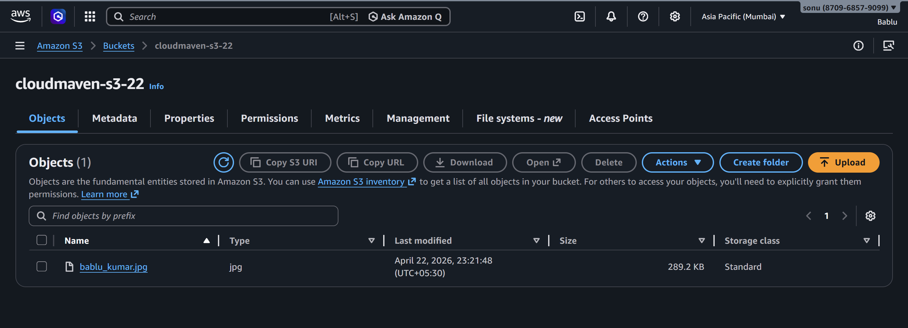

---

## 🔹 Step 2: Copy Object URL

Copied object URL from S3.

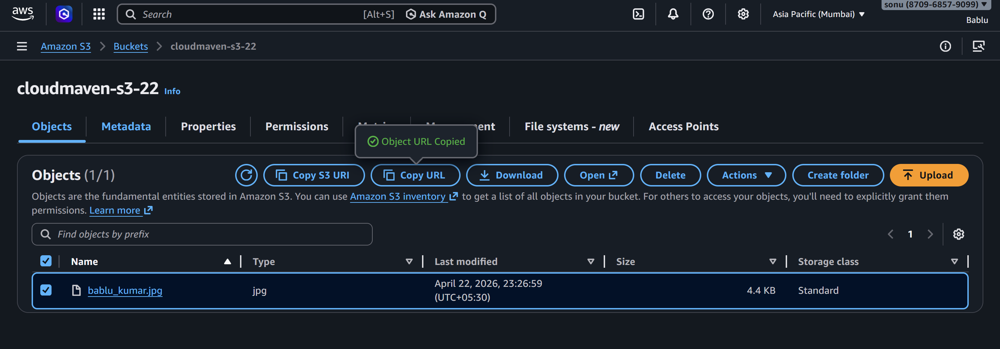

---

## 🔹 Step 3: Access Image in Browser

Successfully accessed image directly.

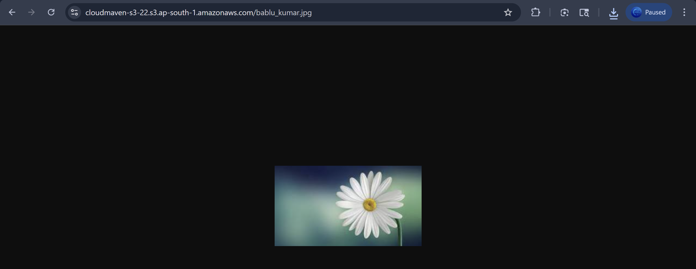

---

# 🧪 Task 3: Bucket Policies (In Progress)


---

## ⚠️ Issue:

While testing advanced policies (like restricting access), some configurations caused **Access Denied errors**.


---

# 🧪 Task 4: CloudFront with S3 (CDN)

## 🔹 Step 1: Create CloudFront Distribution

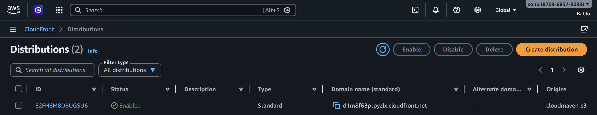

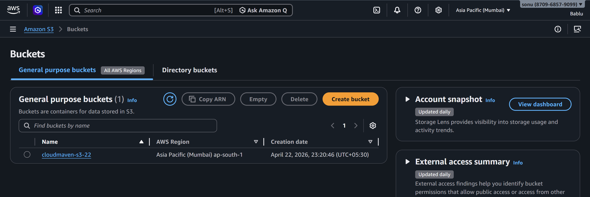
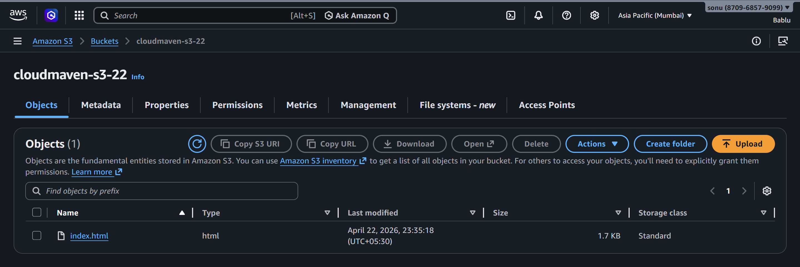
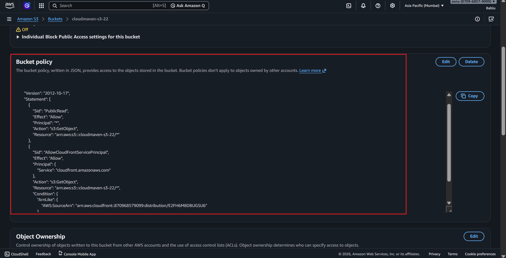

---

## 🔹 Goal:

Access S3 content via CloudFront URL for:

* Faster delivery
* Reduced latency

---

## ⚠️ Issue Faced:

Getting error:

```xml
<Error>
  <Code>AccessDenied</Code>
  <Message>Access Denied</Message>
</Error>
```

---

## 🔍 Possible Cause:

* Incorrect Bucket Policy
* CloudFront OAC (Origin Access Control) not properly configured
* Mismatch in Distribution ARN

---

## 🛠️ Current Fix Attempts:

* Updated bucket policy with CloudFront service principal
* Verified distribution ID
* Checking OAC attachment

---

# 🎯 Learning Outcome

* Understood S3 static hosting
* Learned object access via URL
* Explored bucket policies
* Practiced CloudFront integration
* Debugging real-world access issues

---

# ✅ Conclusion

* S3 successfully hosts static website
* Objects are publicly accessible
* CloudFront integration is partially complete
* Working on resolving access control issues for secure CDN delivery

---

# 📌 Next Steps

* Fix CloudFront AccessDenied error
* Complete restricted access setup
* Test full CDN workflow

---
