# 📘 Day 8 – AWS RDS & ElastiCache Hands-on

## 🚀 Overview

This project demonstrates hands-on implementation of:

* ✅ Amazon RDS (MySQL) in a private subnet
* ✅ EC2 connectivity to RDS
* ✅ Database & user-level access control
* ✅ Security Group testing (break & fix)
* ✅ Snapshot & scaling
* ⚠️ ElastiCache (Redis) – Work in Progress

---

# 🧱 Architecture

* RDS → Private Subnet (secure)
* EC2 → Public Subnet (access point)
* Connection → EC2 → RDS (MySQL client)

---

# 🔹 Step 1: Create RDS Instance

* Engine: MySQL

📌 Reference:
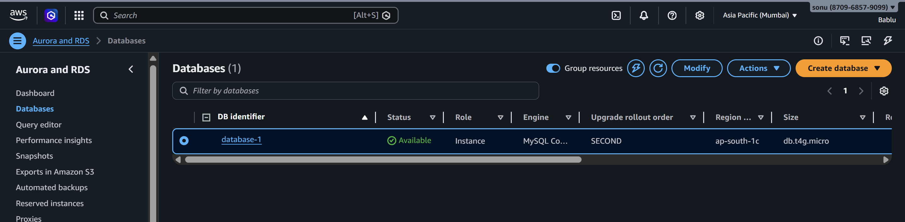

---

# 🔹 Step 2: Configure Security Group

* Allowed **MySQL (3306)** access
* Source: EC2 Security Group

📌 This allows EC2 → RDS connection

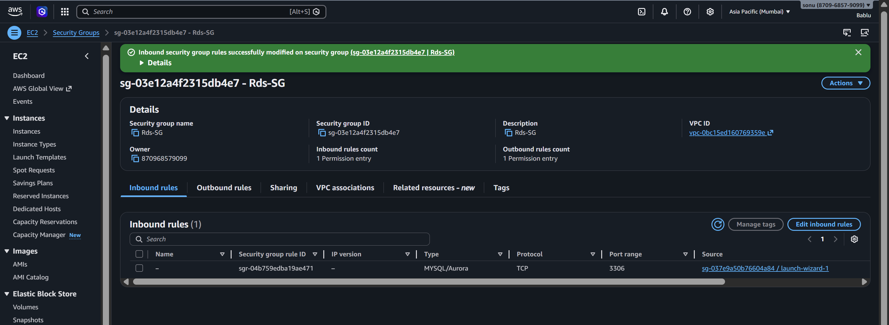

---

# 🔹 Step 3: Connect EC2 → RDS

Installed MySQL client and connected:

```bash
mysql -h <RDS-ENDPOINT> -u admin -p
```

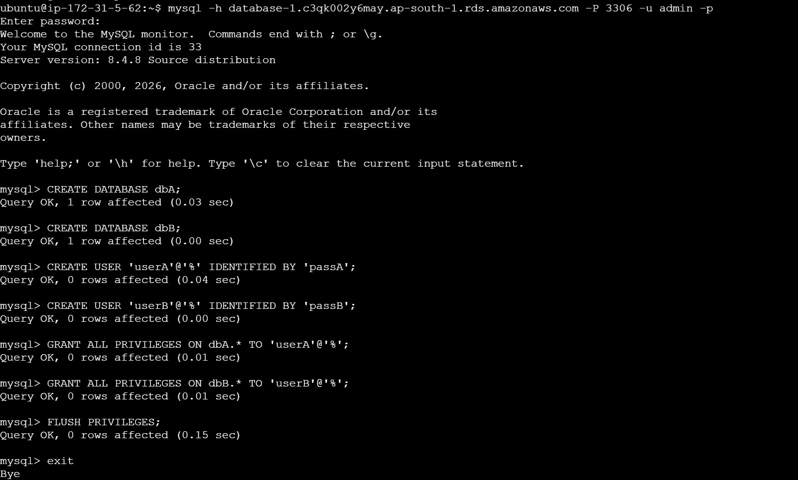

---

# 🔹 Step 4: Create Databases & Users

Created:

* dbA → userA
* dbB → userB

```sql
CREATE DATABASE dbA;
CREATE DATABASE dbB;

CREATE USER 'userA'@'%' IDENTIFIED BY 'passA';
CREATE USER 'userB'@'%' IDENTIFIED BY 'passB';

GRANT ALL PRIVILEGES ON dbA.* TO 'userA'@'%';
GRANT ALL PRIVILEGES ON dbB.* TO 'userB'@'%';
```

---

# 🔹 Step 5: Test Access Control

### ✅ userA → dbA

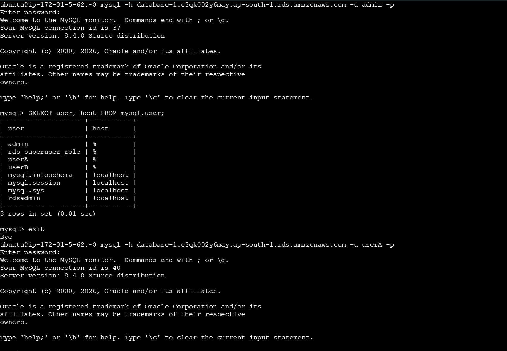

### ✅ userB → dbB

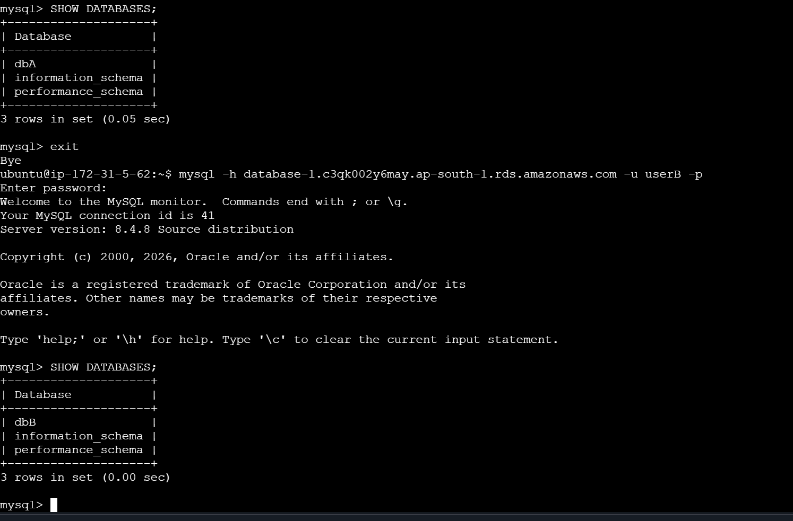

📌 Verified:

* userA cannot access dbB ❌
* userB cannot access dbA ❌

---

# 🔹 Step 6: Break & Fix (Security Testing)

### ❌ Break:

Removed port **3306** from Security Group

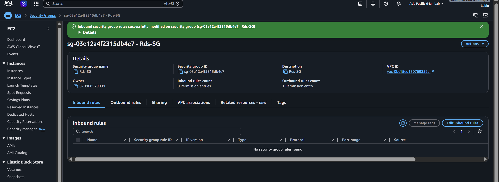

### ❌ Result:

Connection failed

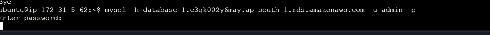

### ✅ Fix:

Re-added port 3306 → connection restored

---

# 🔹 Step 7: Snapshot

Took manual snapshot of DB

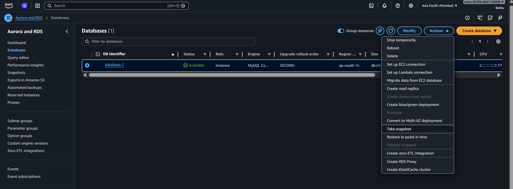
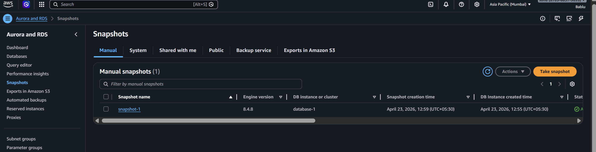

---

# 🔹 Step 8: Scaling (Instance Type Change)

Changed instance type:

* From: small instance
* To: **db.t3.2xlarge**

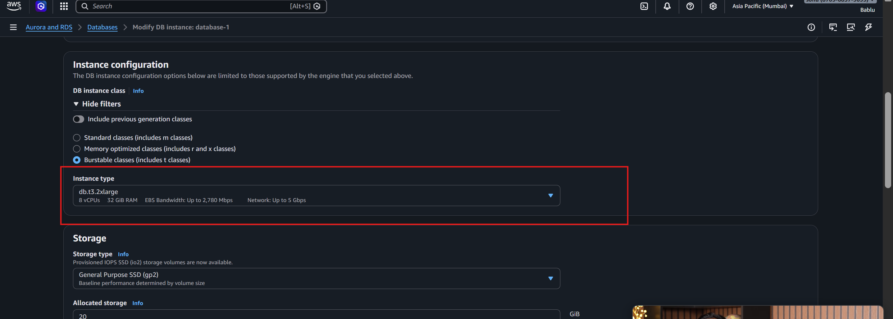
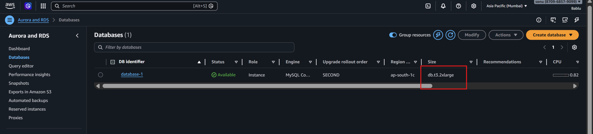

---

# ⚠️ ElastiCache (Redis) – Work in Progress

Currently working on:

* Redis cluster creation
* Security group configuration
* EC2 → Redis connection

⚠️ Facing configuration issues:

* Connection setup not yet successful
* Debugging Security Group / Auth / Endpoint

👉 Will update once resolved

---

# 🧠 Key Learnings

* Difference between **EC2 DB vs RDS (Managed Service)**
* Importance of **Security Groups**
* Database-level access control
* Real-world troubleshooting (break & fix)
* Snapshot & scaling operations

---

