# 📘 Azure Networking Day-3 (NSG, VM, Routing Lab)

---

## 🔹 Step 1: Create Virtual Network with Subnets

### 🎯 Objective

Create a Virtual Network and divide it into multiple subnets for better security and structure.

---

## 📌 Step 1.1: Configure VNet and Subnets

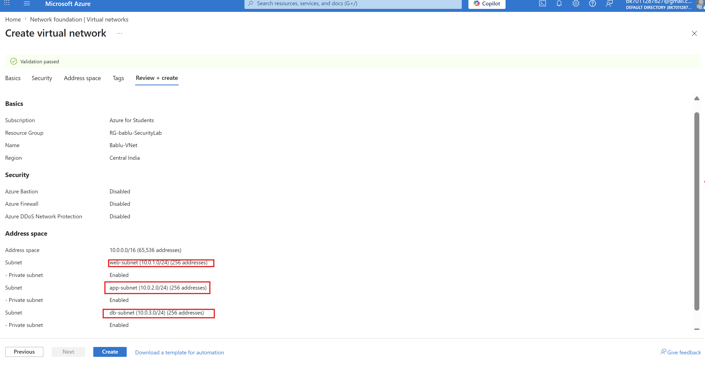

### 🧠 Explanation

* Created **Bablu-VNet** with address space `10.0.0.0/16`
* Created 3 subnets:

  * **web-subnet** → `10.0.1.0/24`
  * **app-subnet** → `10.0.2.0/24`
  * **db-subnet** → `10.0.3.0/24`

👉 This follows **3-tier architecture**:

* Web → Public layer
* App → Backend layer
* DB → Secure layer

---

## 🔹 Step 2: Create Network Security Groups (NSG)

### 🎯 Objective

Control traffic using firewall rules.

---

## 📌 Step 2.1: Create NSG for Web

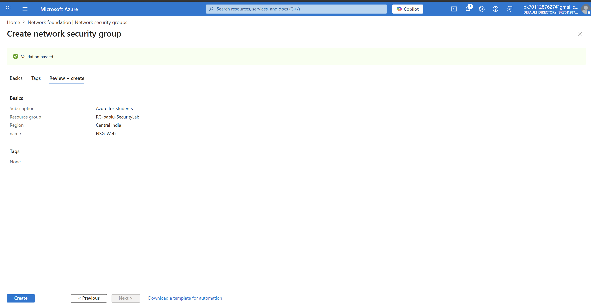

### 🧠 Explanation

* Created **NSG-Web**
* This will control traffic for Web subnet

---

## 📌 Step 2.2: Create NSG for App

### 🧠 Explanation

* Created **NSG-App**
* This will secure backend application layer

---

## 🔹 Step 3: Configure NSG Rules & Attach to Subnet

### 🎯 Objective

Allow only required traffic.

---

## 📌 Step 3.1: Add Rule in NSG-Web

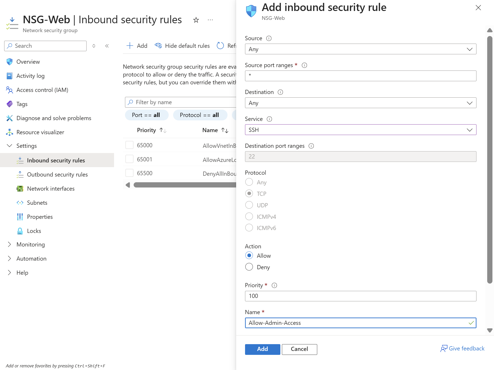

### 🧠 Explanation

* Allowed **SSH (port 22)** from anywhere
  * 👉 So we can login into Web VM

---

## 📌 Step 3.2: Attach NSG-Web to Web Subnet

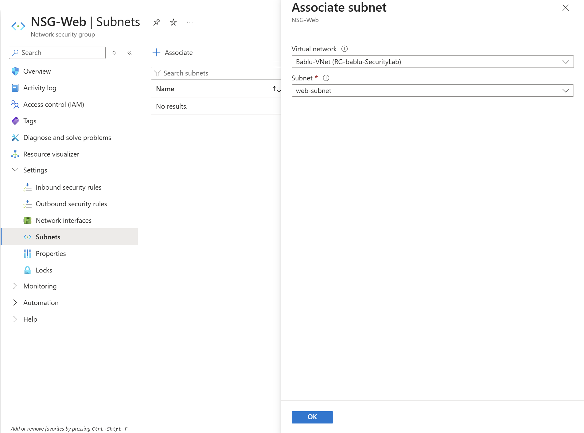

### 🧠 Explanation

* Linked NSG-Web with **web-subnet**
  * 👉 All VMs in this subnet will follow these rules

---

## 📌 Step 3.3: Add Rule in NSG-App

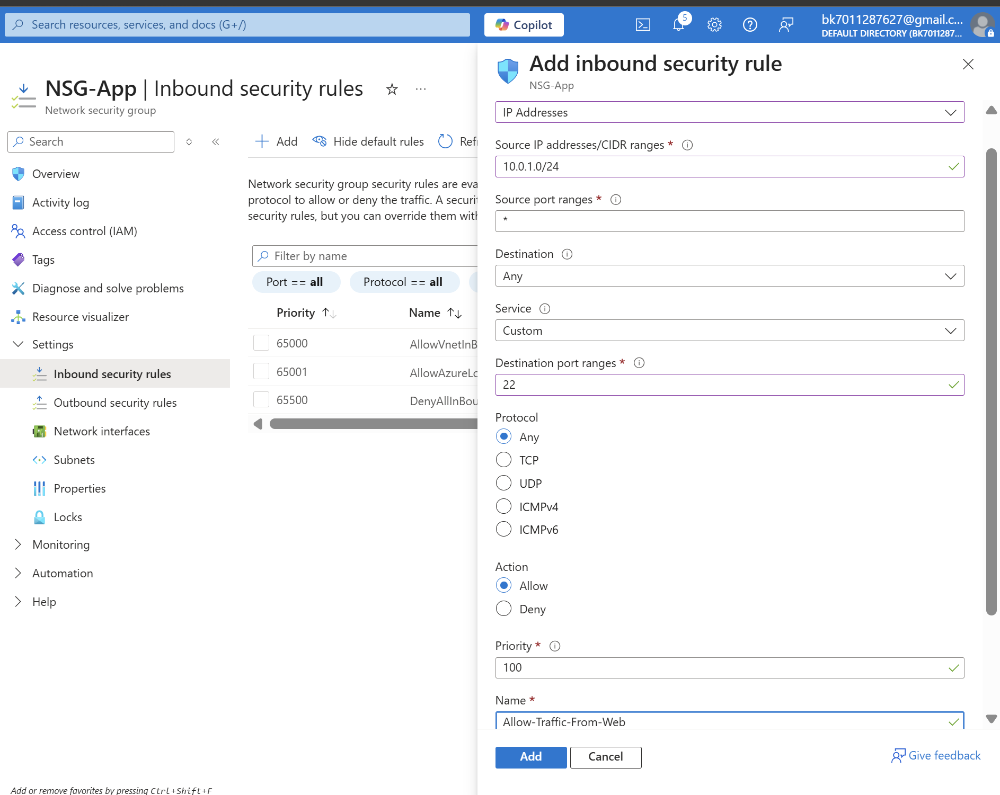

### 🧠 Explanation

* Allowed traffic **only from web-subnet (10.0.1.0/24)**
* 👉 This means:
  * Web → App ✔️
  * Internet → App ❌

---

## 📌 Step 3.4: Attach NSG-App to App Subnet

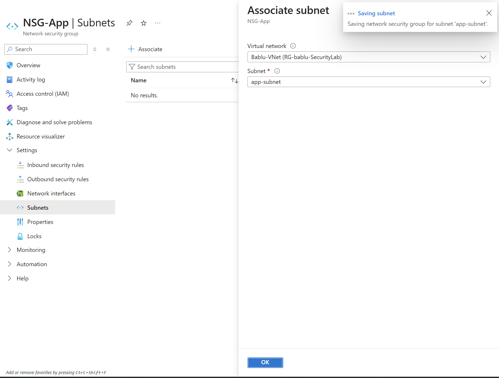

### 🧠 Explanation

* Linked NSG-App with **app-subnet**
  * 👉 Backend is now protected

---

## 🔹 Step 4: Create Virtual Machines

### 🎯 Objective

Deploy VMs inside subnets to test connectivity.

---

## 📌 Step 4.1: Create Web VM

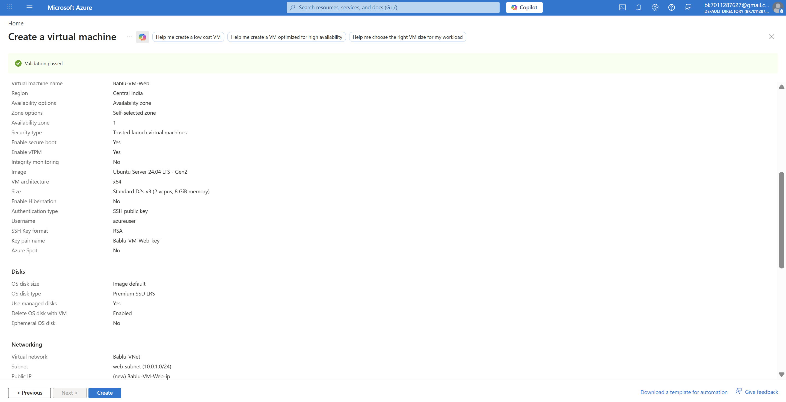

### 🧠 Explanation

* Created **Bablu-VM-Web**
* Placed inside **web-subnet**

---

## 📌 Step 4.2: Create App VM

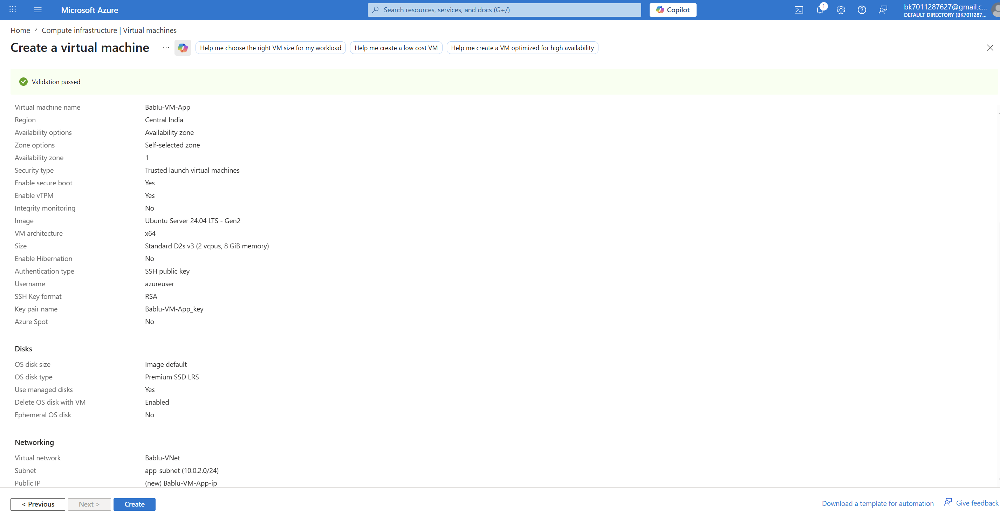

### 🧠 Explanation

* Created **Bablu-VM-App**
* Placed inside **app-subnet**

---

## 📌 Step 4.3: Verify Both VMs

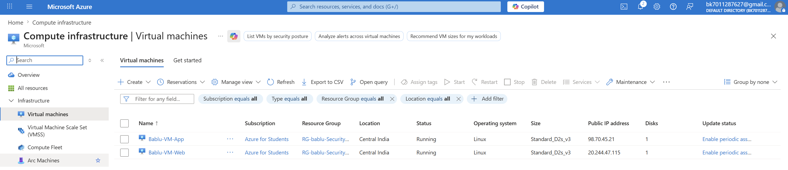

### 🧠 Explanation

* Both VMs are running successfully

---

## 🔹 Step 5: Test Connectivity (Security Check)

### 🎯 Objective

Verify NSG behavior.

---

## 📌 Step 5.1: Try Direct Access to App VM

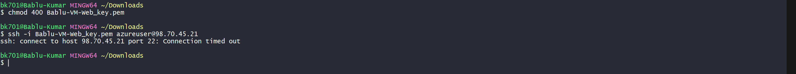

### 🧠 Explanation

* Tried SSH directly to App VM
* ❌ Connection failed

* 👉 Because NSG-App blocks internet access

---

## 📌 Step 5.2: Connect to Web VM

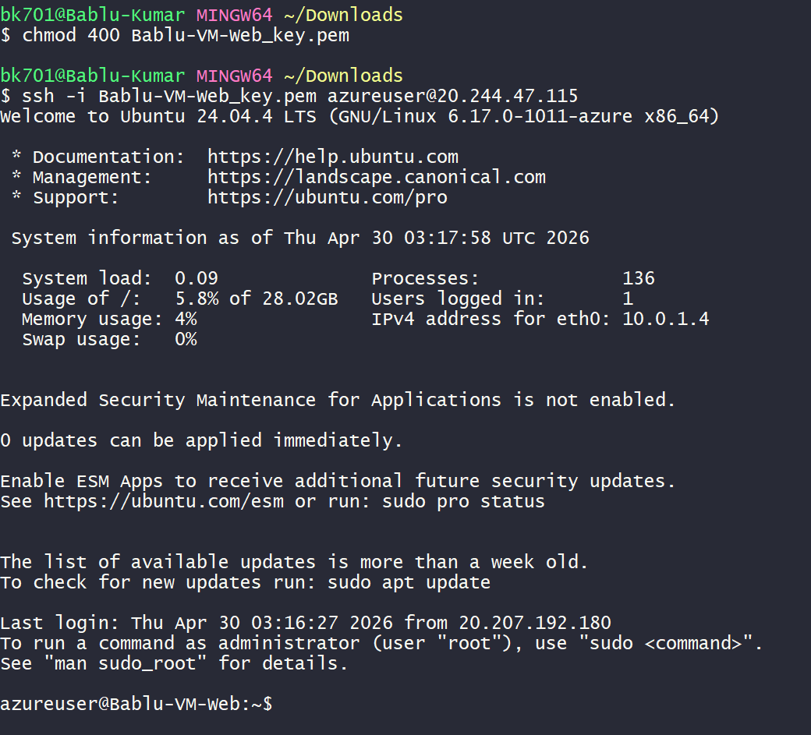

### 🧠 Explanation

* Successfully logged into Web VM
  * 👉 Allowed because NSG-Web allows SSH

---

## 📌 Step 5.3: Connect App VM via Web VM

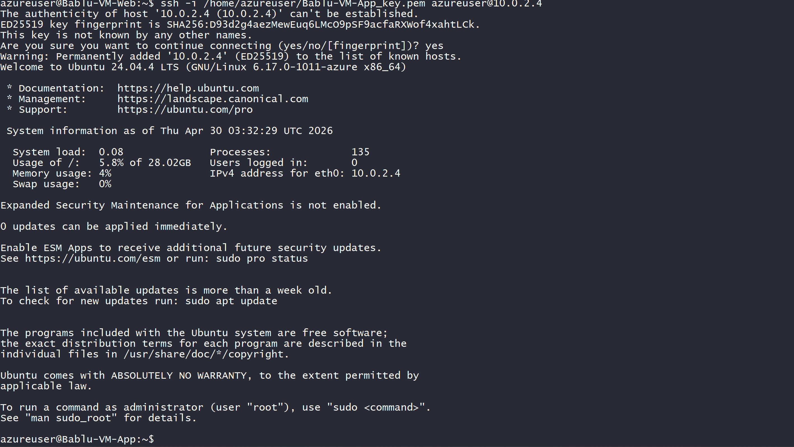

### 🧠 Explanation

* From Web VM → connected to App VM
* ✔️ Success

* 👉 This is called **Jumpbox concept**

---

## 🔹 Step 6: Create Route Table (Block Internet)

### 🎯 Objective

Prevent backend VM from accessing internet.

---

## 📌 Step 6.1: Create Route Table

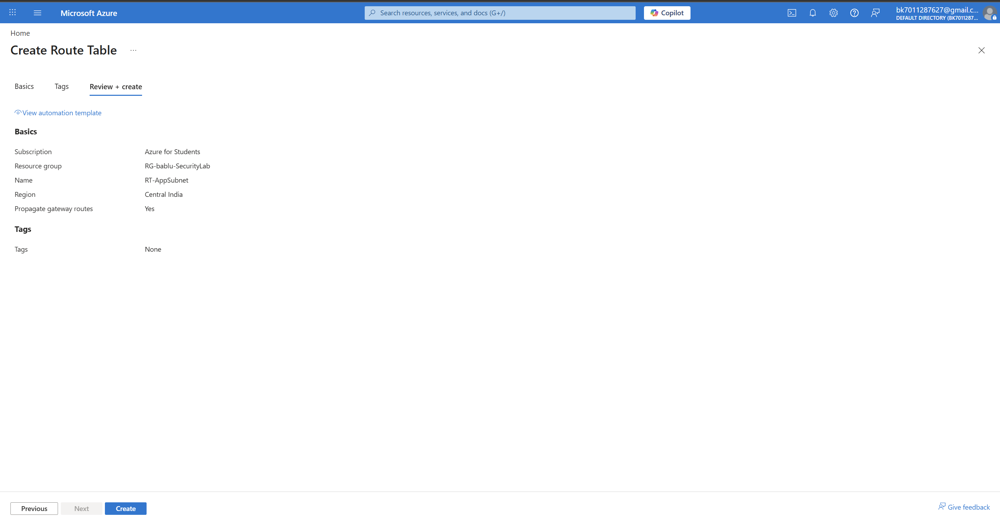

### 🧠 Explanation

* Created **RT-AppSubnet**

---

## 📌 Step 6.2: Add Route (Block Internet)

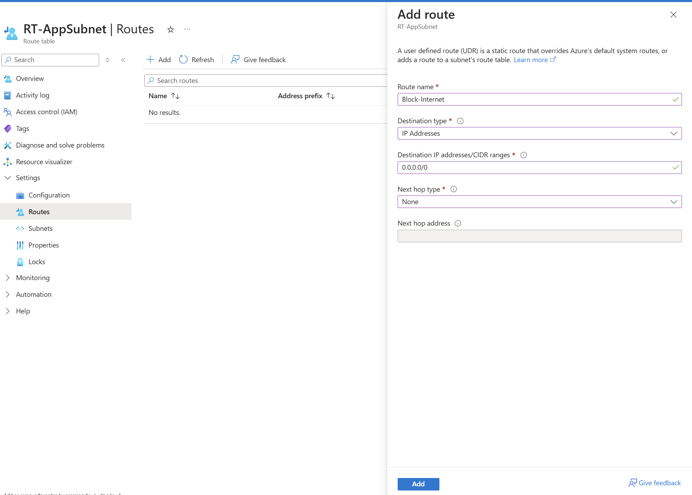

### 🧠 Explanation

* Destination: `0.0.0.0/0`
* Next hop: **None**

👉 Meaning:

* Block all internet traffic

---

## 📌 Step 6.3: Associate Route Table

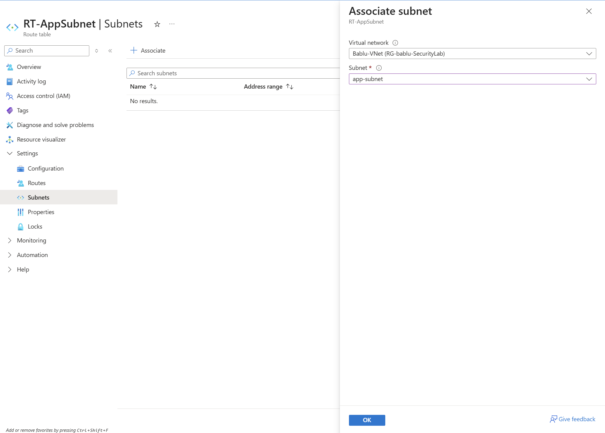

### 🧠 Explanation

* Attached route table to **app-subnet**

---

## 📌 Step 6.4: Verify Internet Block

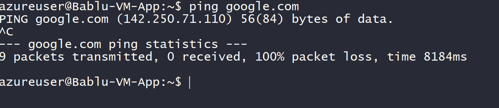

### 🧠 Explanation

* Tried `ping google.com` from App VM
* ❌ Failed

👉 Internet successfully blocked

---

