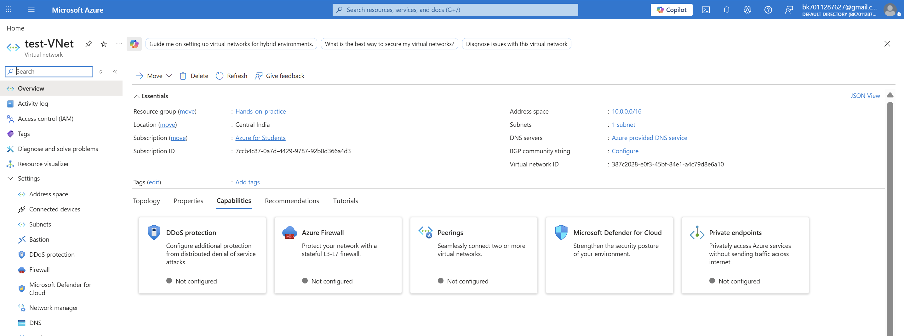
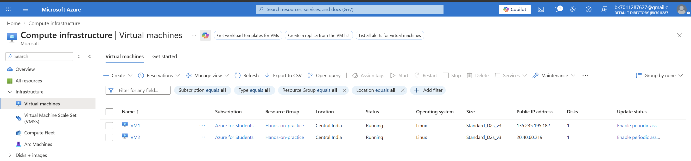
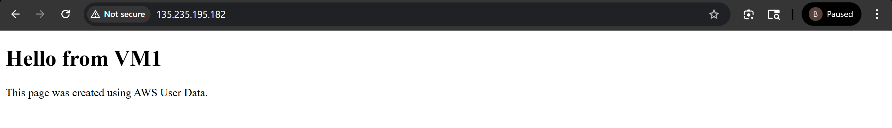
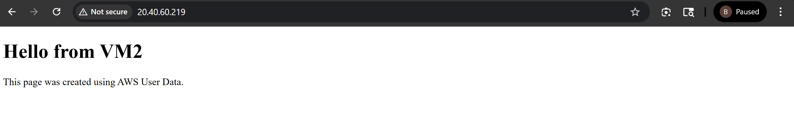
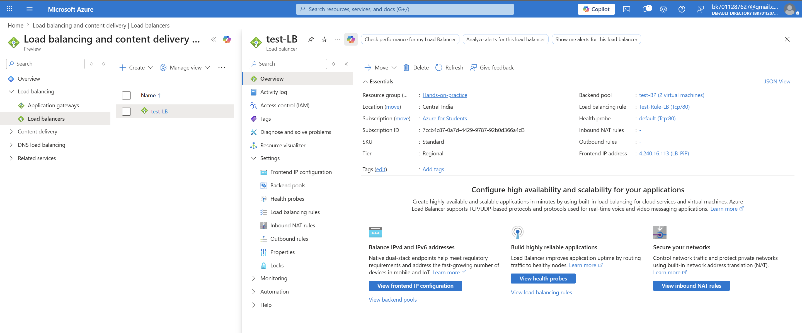
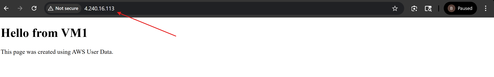
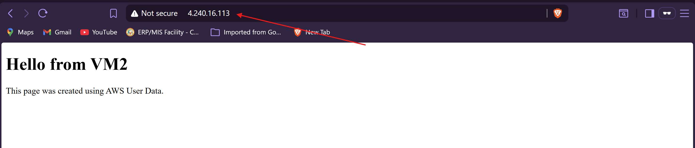

# 📘 Azure Load Balancer Hands-on (Practical Implementation)

## 🚀 Overview

In this hands-on lab, I created a highly available architecture in **Microsoft Azure** using:

* Virtual Network (VNet)
* Virtual Machines (VM1 & VM2)
* Azure Load Balancer
* Web server setup on both VMs

The goal was to understand how **load balancing distributes traffic across multiple servers** to ensure high availability and reliability.

---

# 🧱 Step 1: Create Virtual Network

A Virtual Network (VNet) acts as a private network in Azure where all resources communicate securely.

📷 **VNet Creation**


### 🔹 Key Points:

* Created VNet with address space `10.0.0.0/16`
* Created subnet inside VNet
* This acts as the base infrastructure

---

# 💻 Step 2: Create Virtual Machines

Created two Linux virtual machines:

* VM1
* VM2

📷 **VM Creation**


### 🔹 Key Points:

* Both VMs are running
* Installed web server (Apache/Nginx)
* Each VM shows a different message:

  * VM1 → "Hello from VM1"
  * VM2 → "Hello from VM2"

---

# 🌐 Step 3: Verify Individual VM Access

Each VM was accessed using its public IP.

📷 **VM1 Output**


📷 **VM2 Output**


### 🔹 Understanding:

* Both servers are working independently
* But if one fails → user cannot access service ❌

👉 This is where Load Balancer comes in

---

# ⚖️ Step 4: Create Azure Load Balancer

Created a Load Balancer to distribute traffic between VM1 and VM2.

📷 **Load Balancer Configuration**


### 🔹 Configuration:

* Backend Pool → VM1 & VM2
* Health Probe → Port 80
* Load Balancing Rule → HTTP (Port 80)
* Frontend IP → Public IP

---

# 🔄 Step 5: Test Load Balancer

Accessed Load Balancer Public IP multiple times.

📷 **Load Balancer Response (VM1)**


📷 **Load Balancer Response (VM2)**


---

# 🧠 What Happened?

👉 When I refresh the browser:

* Sometimes response comes from **VM1**
* Sometimes from **VM2**

### 🔥 This is Load Balancing

### 🧠 Simple Example:

Think of:

* 2 shopkeepers 👨‍💼👨‍💼
* 1 entrance 🚪

Customers are automatically sent to:

* Shopkeeper 1
* Shopkeeper 2

👉 So no one is overloaded

---

# 🔐 Benefits of Load Balancer

* ✔ High Availability
* ✔ Fault Tolerance (if one VM fails, other works)
* ✔ Traffic Distribution
* ✔ Better Performance

---

# ⚠️ Real World Insight

Without Load Balancer:

```
User → VM1 ❌ (if down)
```

With Load Balancer:

```
User → Load Balancer → VM1 / VM2 ✔
```

---

