# 📘 Day-5: Azure Storage (Data Foundation)

## 🚀 Overview

In this lab, I worked on **Azure Storage**, which is the backbone of any cloud application.

The goal was to:

* Store data in the cloud
* Manage it efficiently
* Secure access properly
* Access it from another service (VM) securely

---
# Hands-On Lab 1

## 🧱 Step 1: Create Storage Account

### 👉 What I did:

Created a **Storage Account** in Azure Portal with standard settings.

📸
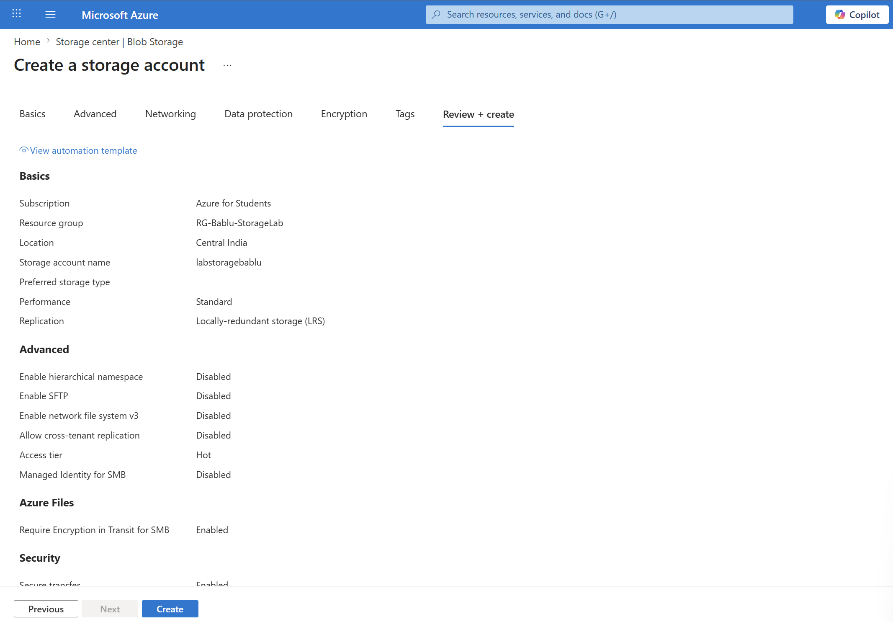

### 👉 Why I did this:

* Storage Account is required before storing any data
* It acts as a **central place to manage all storage services**

### 👉 What happens after this:

* Azure creates a scalable storage system
* Now I can create:

  * Containers
  * Blobs (files)
  * Queues, Tables

💡 Think of it like:
👉 Storage Account = Building where all data lives

---

# 📦 Step 2: Create Container & Upload Blob

## 🔹 2.1 Create Container

### 👉 What I did:

Created a container inside the storage account.

📸
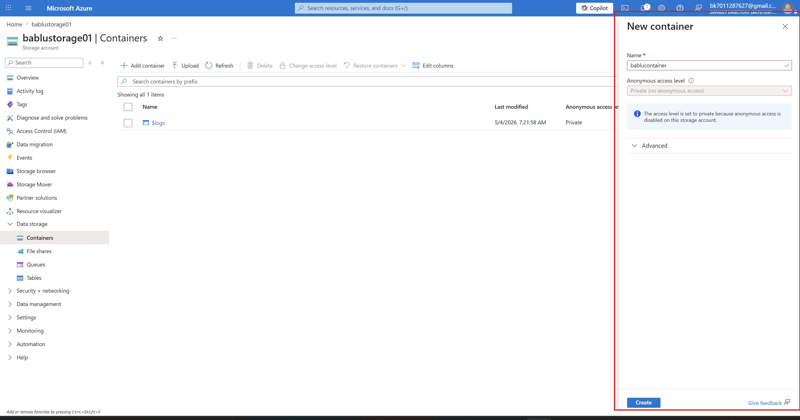

### 👉 Why:

* Containers organize files (like folders)

### 👉 What happens:

* Azure creates a logical folder
* Ready to store multiple files inside it

---

## 🔹 2.2 Upload Blob

### 👉 What I did:

Uploaded a file (`devops.png`) into the container.

📸
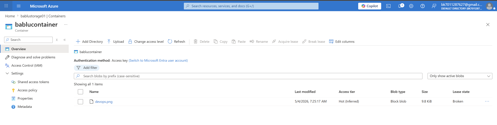

### 👉 Why:

* Blob storage is used for storing unstructured data (images, videos, docs)

### 👉 What happens:

* File is stored in cloud storage
* Azure generates a **unique URL** for accessing it

💡 Important:
👉 This file is not stored on VM → it’s stored in scalable cloud storage

---

# 🔄 Step 3: Lifecycle Management

## 🔹 3.1 Create Rule

### 👉 What I did:

Created a lifecycle rule for automatic data management.

📸
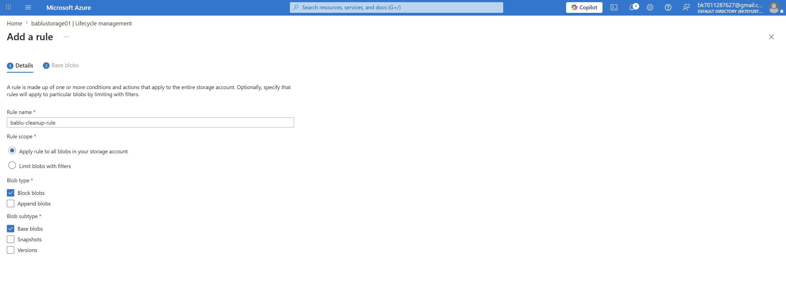

---

## 🔹 3.2 Define Conditions

📸
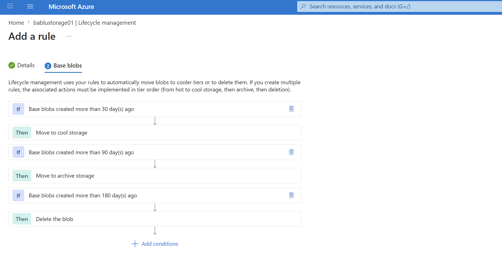

---

## 🔹 3.3 Final Rule Setup

📸
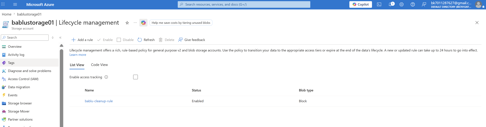

### 👉 Why:

* To automatically manage old data
* Reduce storage cost

### 👉 What happens:

* Azure monitors file age automatically
* Moves data between tiers:

  * 30 days → Cool (cheaper)
  * 90 days → Archive (very cheap)
  * 180 days → Delete

💡 No manual work required → fully automated

---

# 🔐 Step 4: Secure Storage Access

## 🔹 Option 1: Disable Public Access

### 👉 What I did:

Disabled public access for storage.

📸
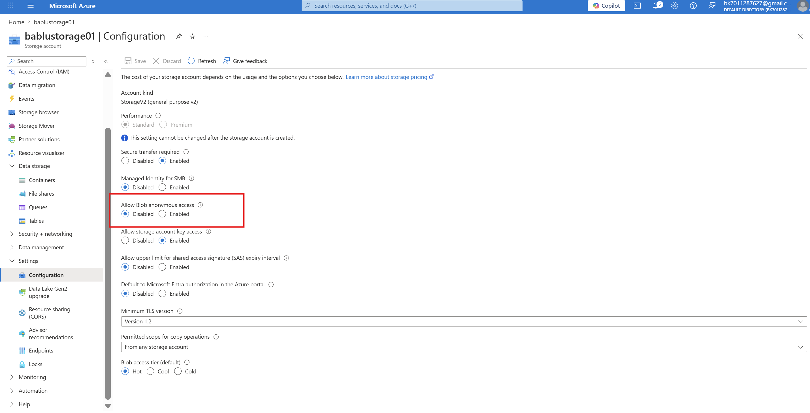

### 👉 Why:

* Prevent anyone from accessing data via URL

---

## 🔹 Test Access (Failure)

📸
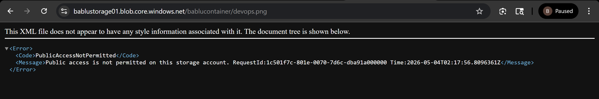

### 👉 What happens:

* When trying to open blob URL → ❌ Access denied

💡 Meaning:
* 👉 Storage is now **secure and private**

---

## 🔹 Option 2: SAS Token

### 👉 What I did:

Generated SAS (Shared Access Signature)

📸
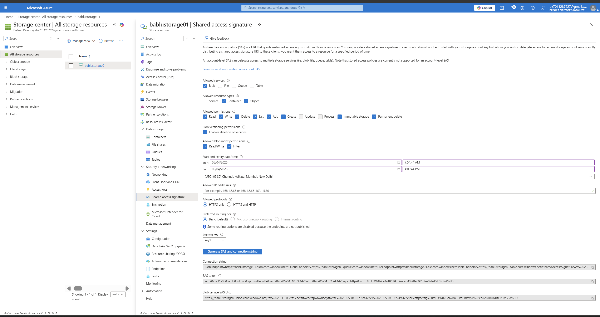

### 👉 Why:

* To provide temporary access without exposing keys

### 👉 What happens:

* Azure generates a secure URL with permissions
* Access is:

  * Time-limited
  * Permission-based

---

## 🔹 Option 3: RBAC

### 👉 What I did:

Assigned role:
👉 Storage Blob Data Reader

📸
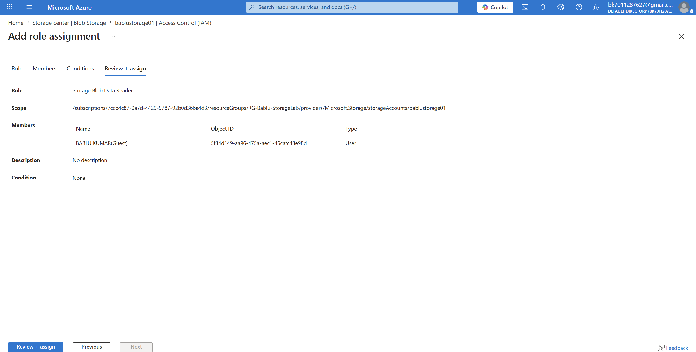

### 👉 Why:

* To control access using Azure identity

### 👉 What happens:

* Only authorized users/services can access storage
* No need to share keys

💡 This is **recommended in real-world DevOps**

---

# 🌐 Step 5: Test Storage Access

### 👉 What I did:

Copied blob URL and tested access

📸
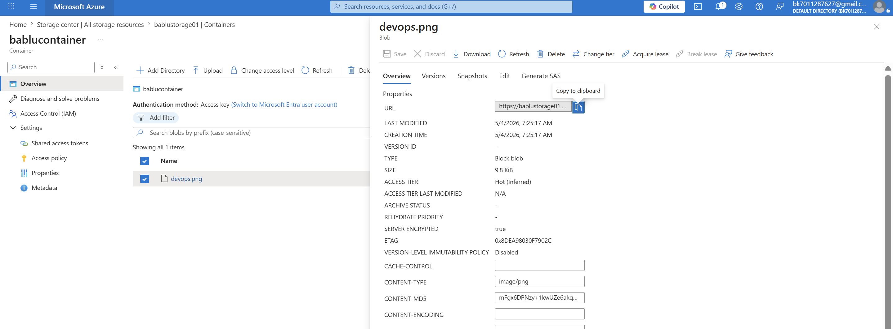

📸
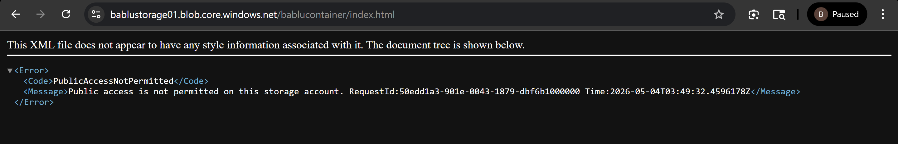

### 👉 What happens:

* Access depends on:

  * Public access → Disabled ❌
  * SAS → Allowed ✅
  * RBAC → Controlled ✅

---


# Hands-On Lab 2

## 🧪 Step 6: Access Storage from VM (Managed Identity)

## 🔹 6.1 Create Storage Account

📸
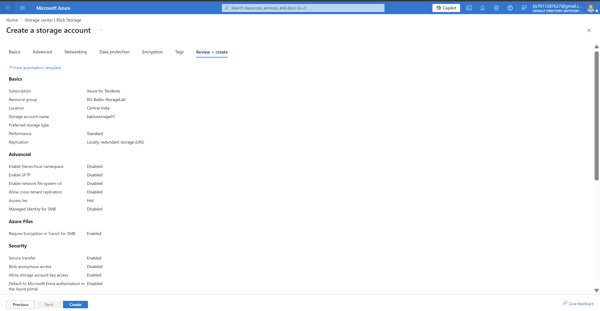

---

## 🔹 6.2 Create Container

📸
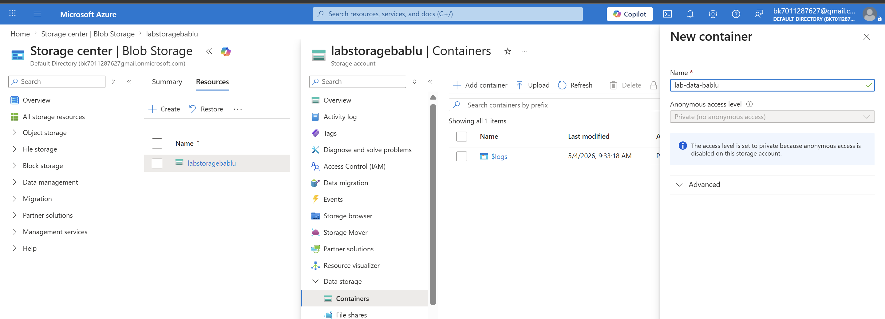

---

## 🔹 6.3 Enable Managed Identity on VM

### 👉 What I did:

Enabled system-assigned identity for VM

📸
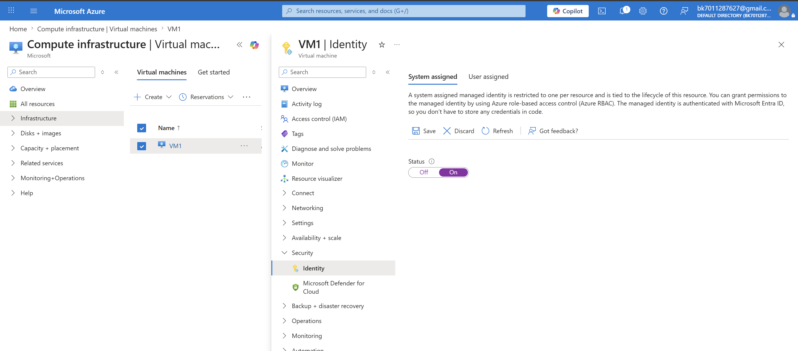

### 👉 Why:

* To allow VM to access Azure services securely

### 👉 What happens:

* Azure assigns an identity to VM
* VM can authenticate without username/password

---

## 🔹 6.4 Assign Role to VM

### 👉 What I did:

Assigned role:
👉 Storage Blob Data Contributor

📸
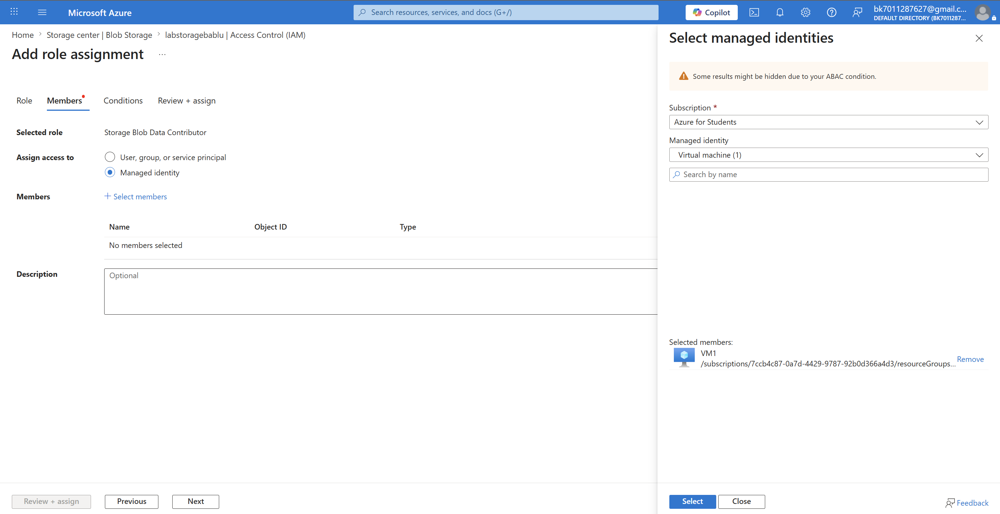

### 👉 What happens:

* VM now has permission to:

  * Read
  * Write
  * Delete blobs

---

## 🔹 6.5 Login from VM

```bash
az login --identity
```

### 👉 What happens:

* VM logs into Azure using its identity
* No credentials needed

---

## 🔹 6.6 Upload File from VM

```bash
az storage blob upload \
--account-name labstoragebablu \
--container-name lab-data-bablu \
--name testfile.txt \
--file testfile.txt \
--auth-mode login
```

📸
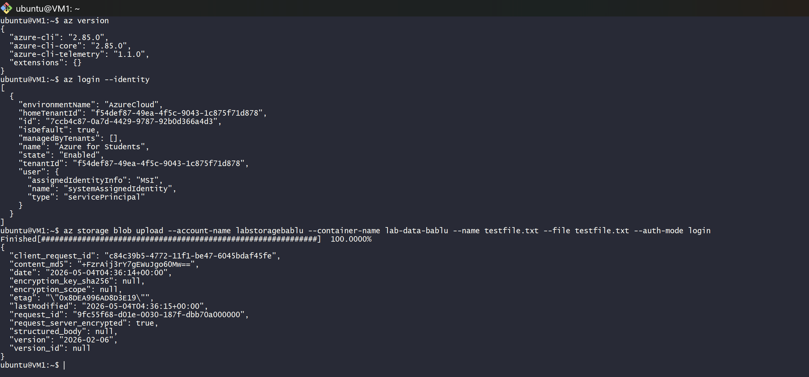

### 👉 What happens:

* File is uploaded securely using VM identity

---

## 🔹 6.7 Verify Upload

📸
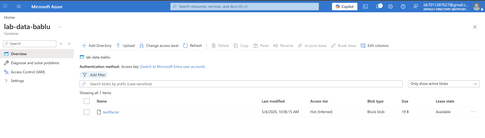

### 👉 Result:

* File successfully uploaded without using keys

---

