# 📘 Azure IAM + Data Layer (Hands-on)

## 🔐 Task 1: IAM – Identity, Access & Governance

### 🎯 Objective

* Create users & groups
* Assign RBAC roles
* Apply Azure Policy
* Verify access control

---

## 👤 Step 1: Create User

👉 Created a new user in Microsoft Entra ID

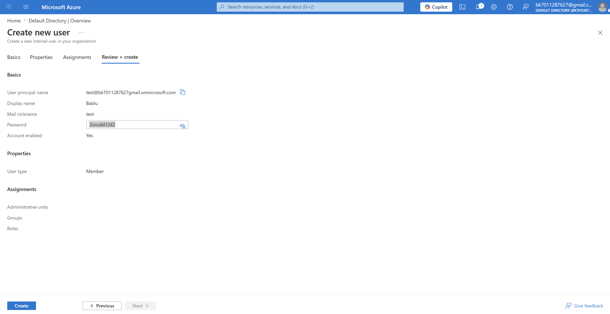

📌 What happens:

* A new identity is created
* This user can now log in to Azure

---

## 👥 Step 2: Create Group & Add User

👉 Created a group and added user

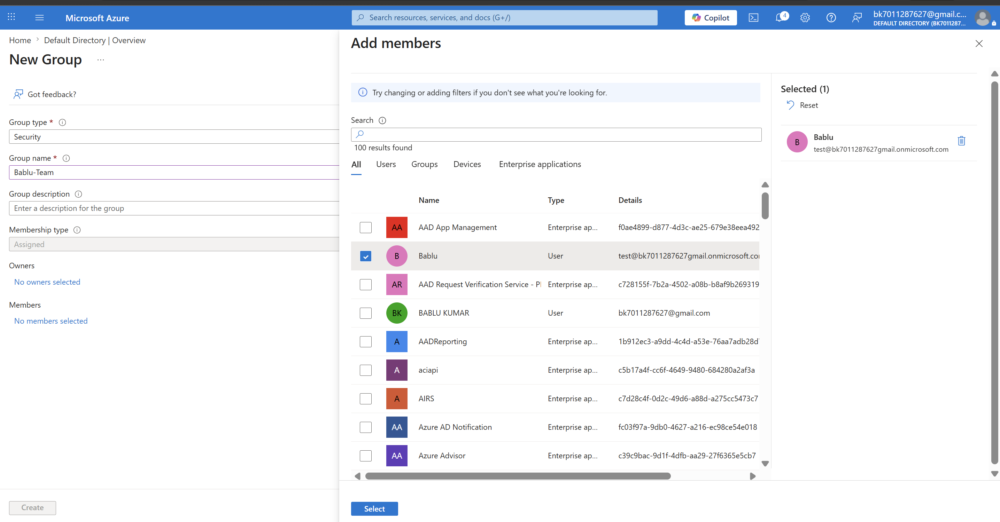
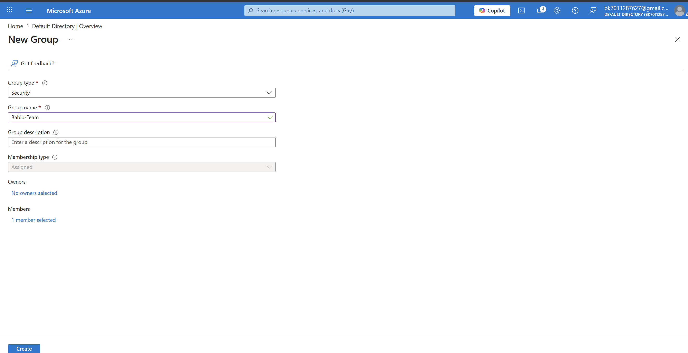

📌 What happens:

* Group helps manage permissions easily
* Instead of assigning role to user → assign to group

---

## 📦 Step 3: Create Resource Group

👉 Created resource group `bablu-rg`

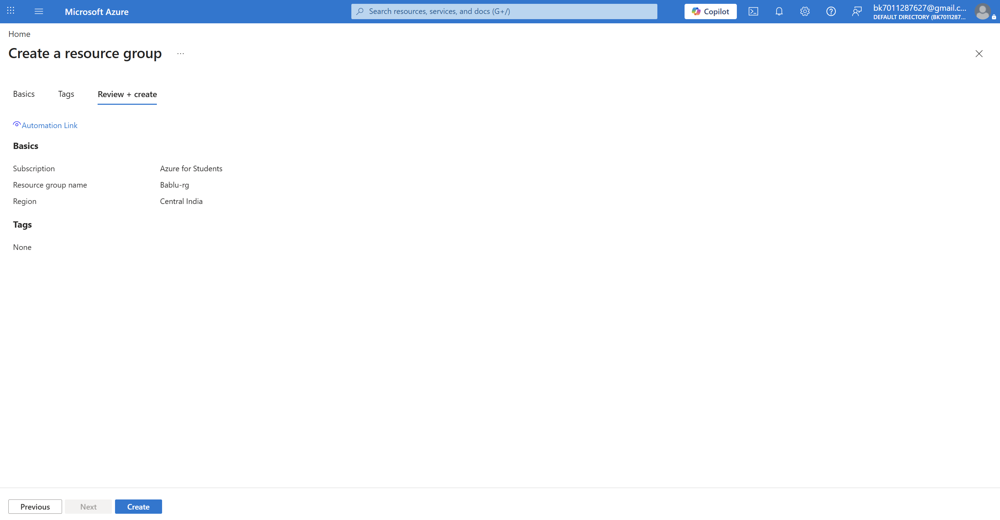

📌 What happens:

* Acts like a folder for resources
* All resources will be managed inside this

---

## 🔐 Step 4: Assign RBAC Role

👉 Assigned **Contributor role** to group

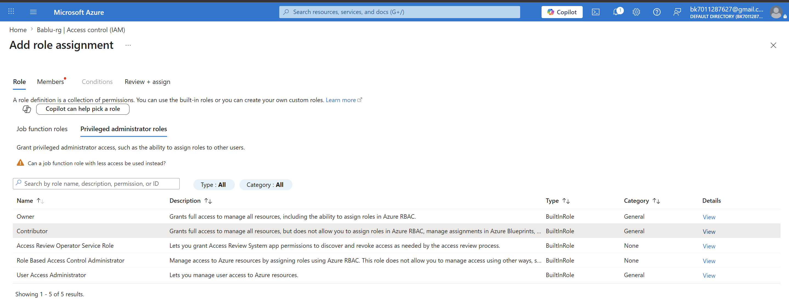
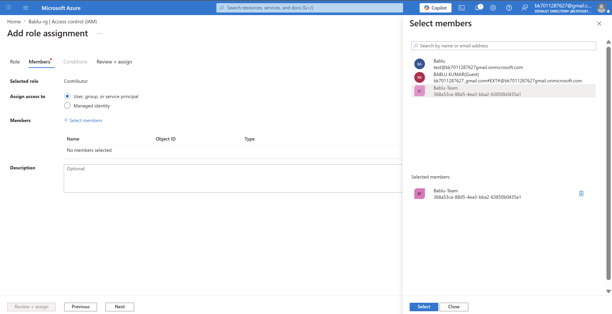
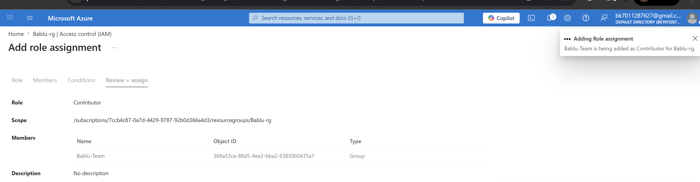

📌 What happens:

* Group can create & manage resources
* But cannot assign roles

---

## ✅ Step 5: Verify Role Assignment

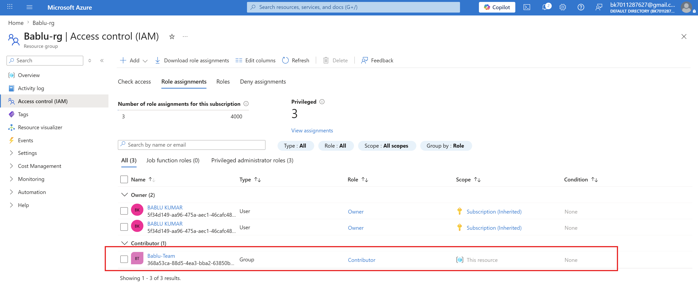

📌 What happens:

* Confirms RBAC is working
* Group now has access to resource group

---

## 📏 Step 6: Apply Azure Policy

👉 Applied policy: **Allowed region = Central India**

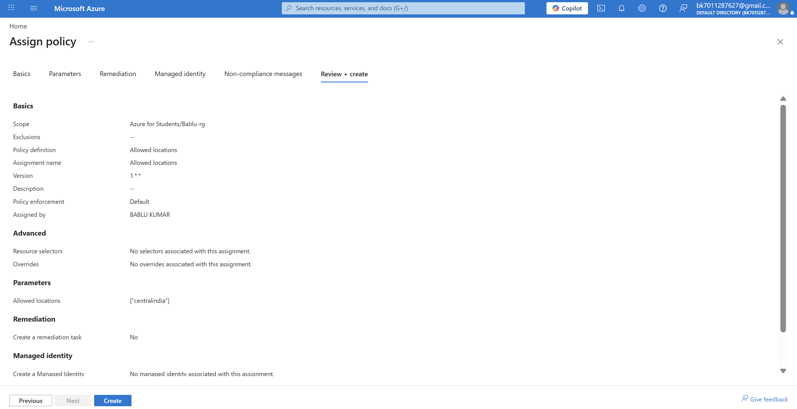

📌 What happens:

* Restricts resource creation only in Central India
* Enforces governance

---

## ❌ Step 7: Try Creating Resource in Different Region

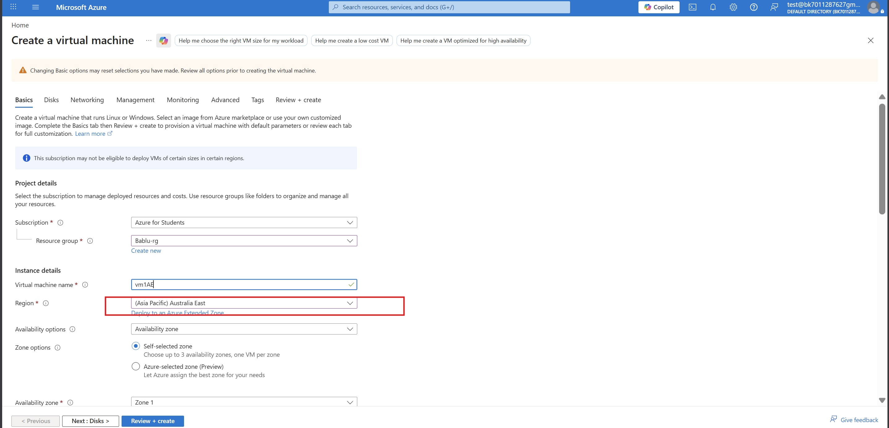
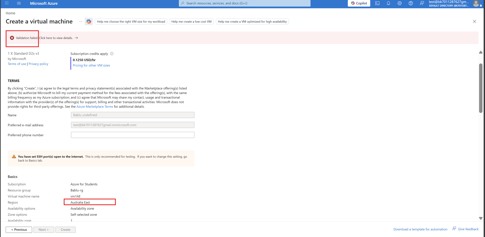

📌 Result:

* ❌ Creation failed
* Reason: Azure Policy blocked it

---

## ✅ Step 8: Create Resource in Allowed Region

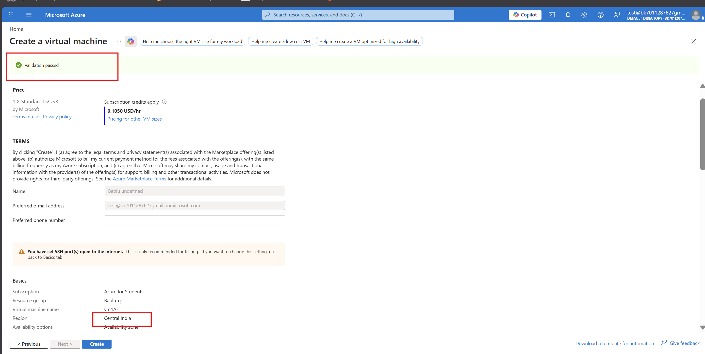

📌 Result:

* ✔️ Resource created successfully
* Policy allows Central India

---

## 🧠 Key Learning (IAM)

* Entra ID = Identity management
* Group = easy permission handling
* RBAC = who can do what
* Policy = what is allowed

👉 **Policy overrides RBAC**

---

# 🗄️ Task 2: DB – Data Layer (Private Database Architecture)

---

## 🎯 Objective

* Create private database
* Restrict public access
* Allow access only via VM

---

## 🌐 Step 1: Create Virtual Network

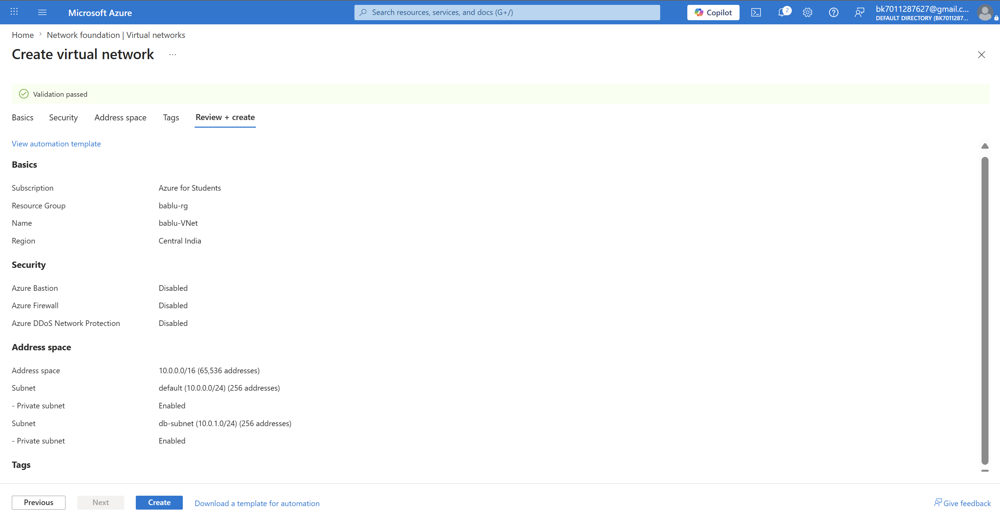

📌 What happens:

* Created private network
* Two subnets:

  * VM subnet
  * DB subnet

---

## 🛢 Step 2: Create Private Database

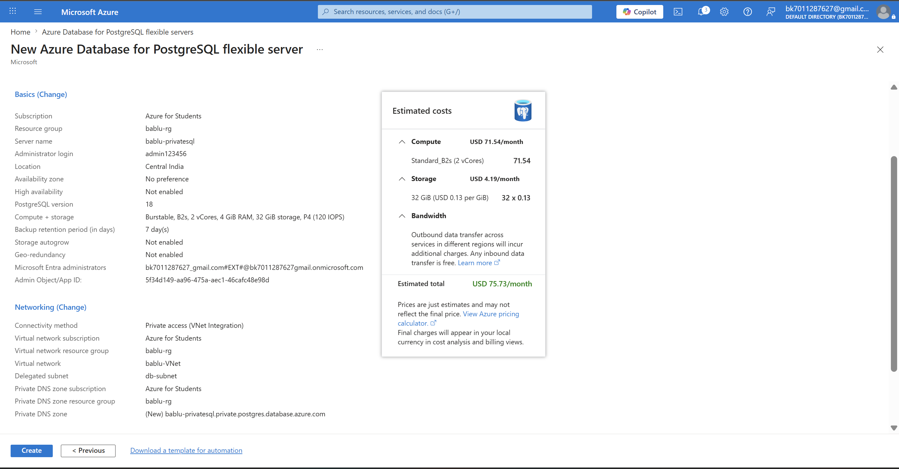

📌 What happens:

* PostgreSQL deployed
* Public access disabled
* Only accessible inside VNet

---

## 💻 Step 3: Create Virtual Machine

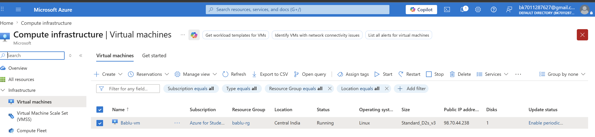

📌 What happens:

* VM acts as **jump server**
* Used to access database

---

## ❌ Step 4: Try Access from Local System

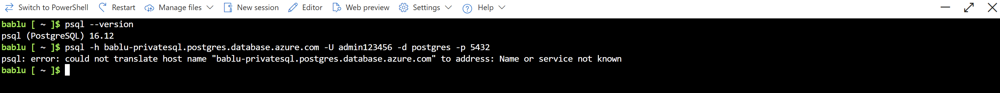

📌 Result:

* ❌ Connection failed
* Reason:

  * DB is private
  * Not accessible from internet

---

## ✅ Step 5: Access DB from VM

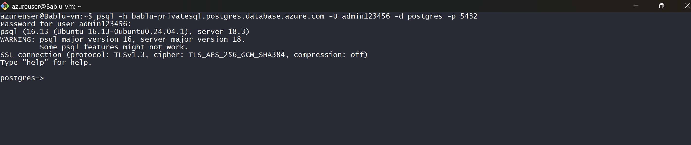

📌 Result:

* ✔️ Connected successfully
* Because VM is inside same network

---

