# Containers & Kubernetes on Azure using AKS, ACR, Docker and Kubernetes

## Project Overview

This hands-on project demonstrates how to deploy a containerized web application on Azure using:

- Azure Virtual Machine (VM)
- Docker
- Azure Container Registry (ACR)
- Azure Kubernetes Service (AKS)
- Kubernetes Deployment & Service

The project follows a real-world DevOps workflow where:
1. A Docker image is built on a VM
2. The image is pushed to Azure Container Registry
3. AKS pulls the image from ACR
4. Kubernetes deploys the application
5. Application is exposed publicly using LoadBalancer Service

---

# Architecture Used

```text
Local Laptop
     │
     ▼
Azure VM (Docker Build Server)
     │
     ▼
Azure Container Registry (ACR)
     │
     ▼
Azure Kubernetes Service (AKS)
     │
     ▼
Kubernetes LoadBalancer Service
     │
     ▼
Public Browser Access
```

---

# Technologies Used

- Microsoft Azure
- Docker
- Kubernetes
- Azure Kubernetes Service (AKS)
- Azure Container Registry (ACR)
- Azure CLI
- kubectl
- NGINX

---

# Step 1 - Create Resource Group

A Resource Group is a logical container that stores all Azure resources together.

Created:
- Resource Group Name: `bablu-rg-aks-lab`
- Region: `Central India`

This helps manage:
- VM
- VNet
- AKS
- ACR
inside one centralized group.

## Resource Group Created

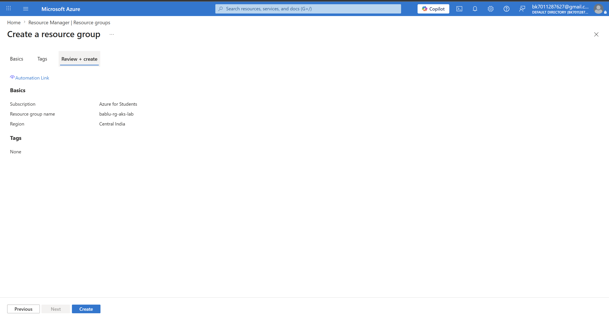

---

# Step 2 - Create Virtual Network (VNet)

A Virtual Network provides private communication between Azure resources.

Created:
- VNet Name: `bablu-vnet-aks`
- Address Space: `10.0.0.0/16`

Created Subnets:
- VM Subnet → `10.0.1.0/24`
- AKS Subnet → `10.0.2.0/24`

Why separate subnets?
- Better network isolation
- Better security
- Real-world production architecture

## Virtual Network Created

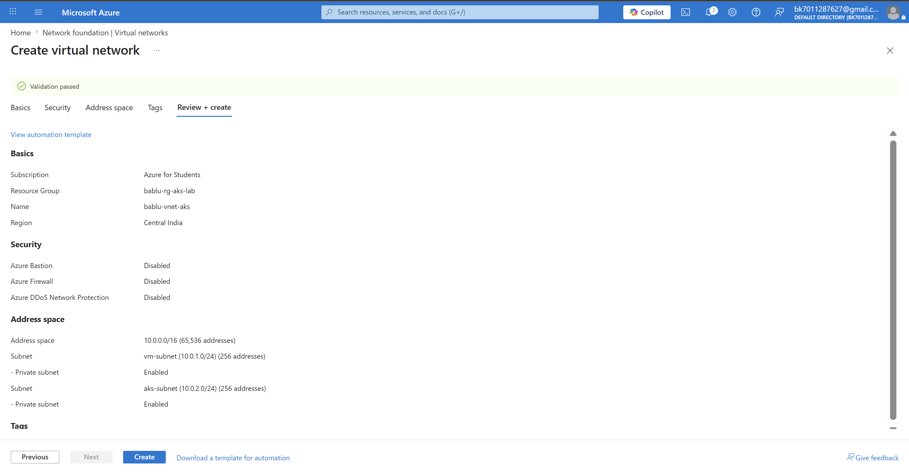

---

# Step 3 - Create Azure Virtual Machine

An Ubuntu VM was created to:
- Build Docker images
- Push images to ACR
- Manage AKS using kubectl

VM Configuration:
- Ubuntu Server 24.04 LTS
- Public IP Enabled
- Password Authentication
- Connected to VM subnet

## Virtual Machine Created

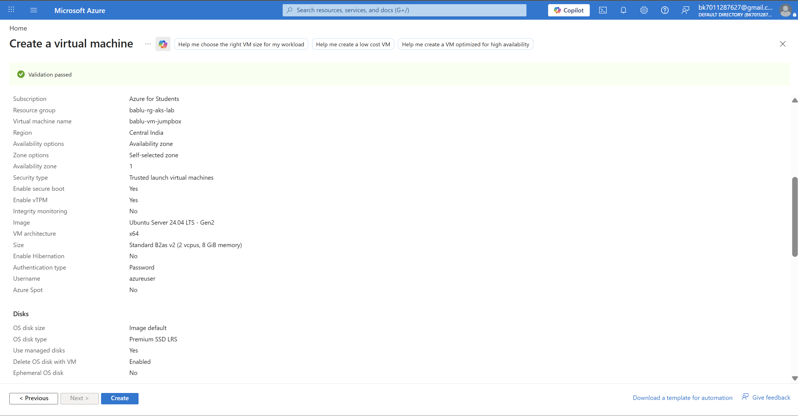

---

# Step 4 - Create Azure Container Registry (ACR)

Azure Container Registry stores Docker images securely inside Azure.

Created:
- Registry Name: `babluacr`
- SKU: `Standard`

Purpose:
- Store application Docker images
- AKS pulls images directly from ACR

## Azure Container Registry Created

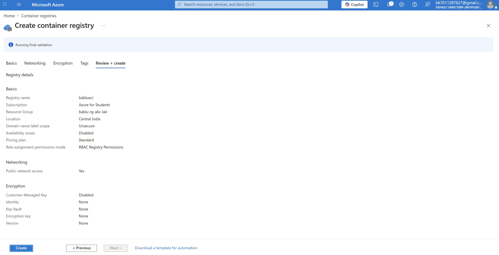

---

# Step 5 - Configure NSG (Network Security Group)

Configured inbound security rule for:
- SSH Port 22

Allowed access only from:
- My Public IP

Why?
- Secure remote VM access
- Prevent unauthorized login attempts

## NSG Configured

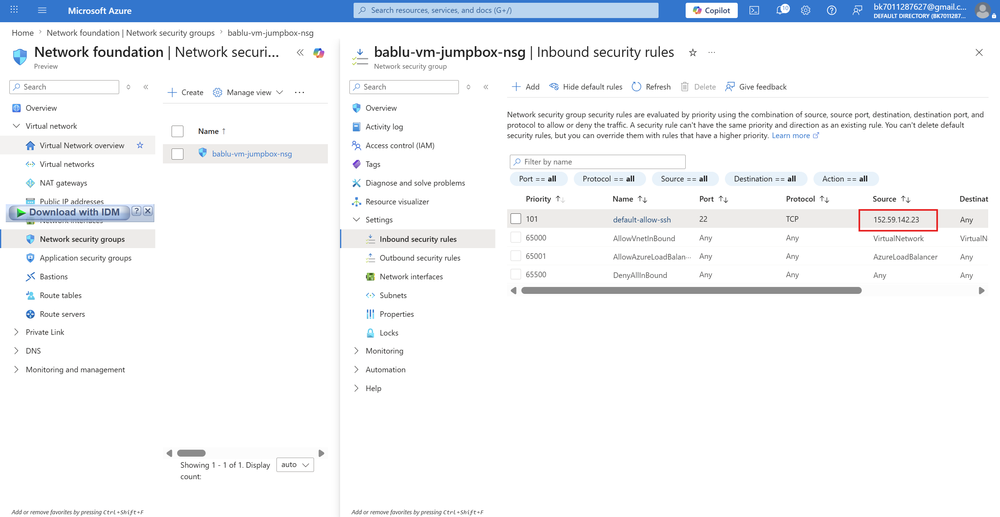

---

# Step 6 - Connect to Azure VM

Connected to the VM using SSH from local system.

```bash
ssh azureuser@<VM-PUBLIC-IP>
```

Inside VM:
- Installed Docker
- Installed Azure CLI
- Installed kubectl

Purpose:
- VM acts as Docker build server and AKS management node

## Connected to Virtual Machine

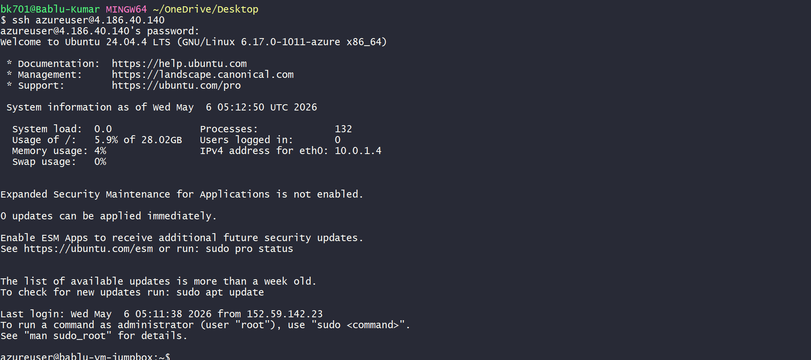

---

# Step 7 - Create Web Application and Dockerfile

Created:
- `index.html`
- `Dockerfile`

## index.html

This file contains the frontend webpage displayed in browser.

## Dockerfile

Dockerfile instructions:
- Pull nginx base image
- Copy HTML file
- Expose port 80

```dockerfile
FROM nginx:alpine
COPY index.html /usr/share/nginx/html/index.html
EXPOSE 80
```

Purpose:
- Build lightweight containerized web application

## Configure Docker and HTML Code

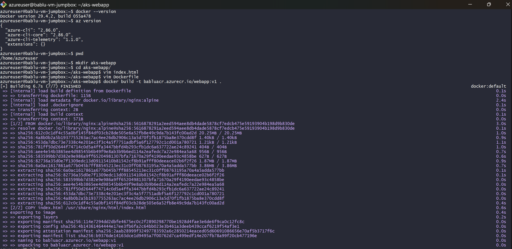

---

# Step 8 - Login to Azure and Connect ACR

Logged into Azure using Azure CLI:

```bash
az login
```

Connected Docker to ACR:

```bash
az acr login --name babluacr
```

Built Docker image:

```bash
docker build -t babluacr.azurecr.io/webapp:v1 .
```

Purpose:
- Create Docker image
- Prepare image for push to ACR

## Azure Login and ACR Connected

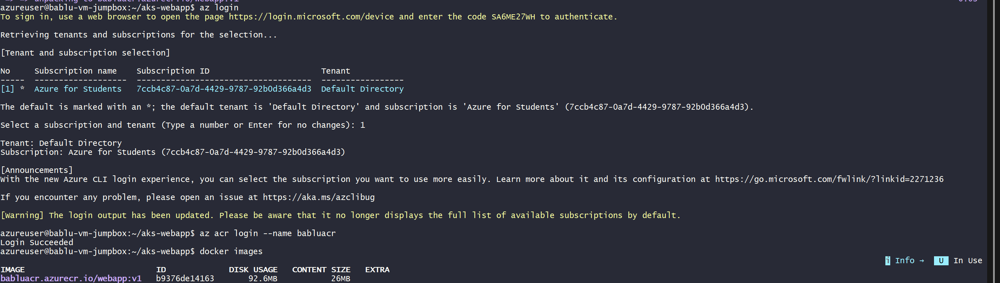

---

# Step 9 - Create AKS Cluster

Created AKS Cluster with:
- Azure CNI Overlay Networking
- Custom VNet Integration
- Managed Identity
- Public Access Enabled

Why AKS?
- Automates Kubernetes management
- Handles scaling and orchestration
- Provides self-healing infrastructure

## Kubernetes Cluster Created

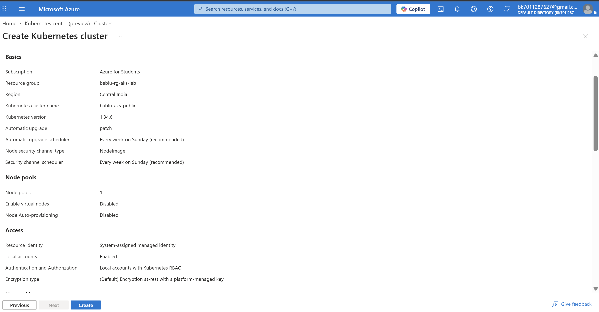

---

# Step 10 - Connect AKS and Deploy Application

Connected to AKS cluster:

```bash
az aks get-credentials \
--resource-group bablu-rg-aks-lab \
--name bablu-aks-public
```

Created `deployment.yaml` for:
- Deployment
- LoadBalancer Service

Applied deployment:

```bash
kubectl apply -f deployment.yaml
```

Verified:
- Nodes
- Pods
- Services

Purpose:
- Deploy containerized application to Kubernetes

## Kubernetes Deployment Version 1

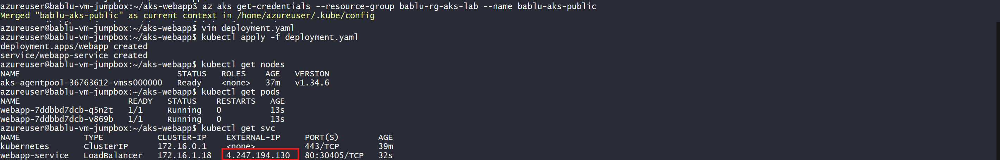

---

# Step 11 - Verify Web Application (Version 1)

Application successfully exposed using:
- Kubernetes LoadBalancer Service

Received Public IP from AKS service.

Verified webpage in browser:
- Welcome to AKS - Version 1

Purpose:
- Validate successful deployment

## Version 1 Output

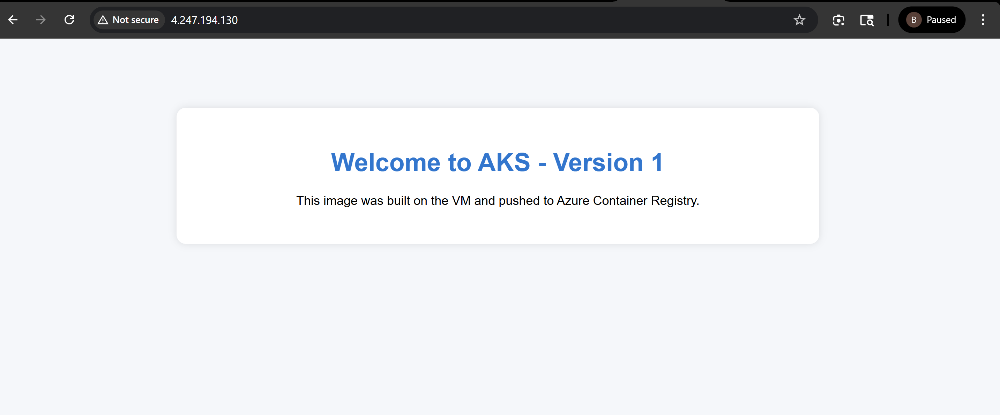

---

# Step 12 - Update Application to Version 2

Updated:
- `index.html`

Changed webpage text:
- Version 1 → Version 2

Built new Docker image:

```bash
docker build -t babluacr.azurecr.io/webapp:v2 .
```

Pushed new image:

```bash
docker push babluacr.azurecr.io/webapp:v2
```

Updated deployment.yaml image tag:
- v1 → v2

Applied deployment again:

```bash
kubectl apply -f deployment.yaml
```

Purpose:
- Demonstrate Kubernetes rolling updates

## Version 2 Deployment

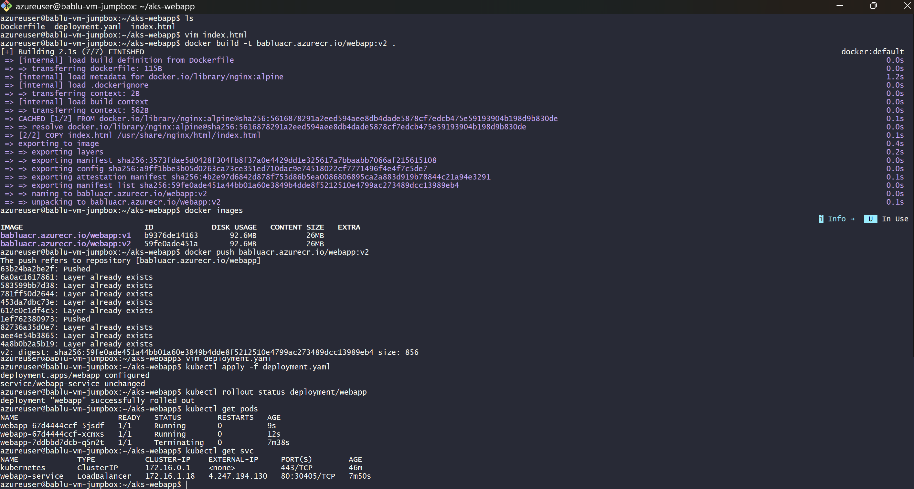

---

# Step 13 - Verify Web Application (Version 2)

Kubernetes successfully:
- Pulled new image
- Replaced old pods
- Completed rolling update

Verified browser output:
- Welcome to AKS - Version 2

This proves:
- Zero downtime deployment
- AKS rolling update working successfully

## Version 2 Output

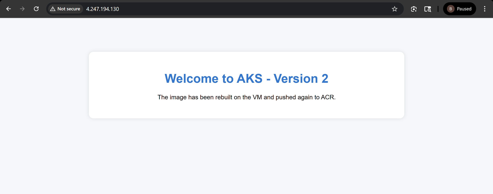

---

# Kubernetes Concepts Used

## Deployment

Deployment manages:
- Pod creation
- Scaling
- Rolling updates
- Self-healing

Used:
```yaml
kind: Deployment
```

---

## Service

LoadBalancer Service exposes application publicly.

Used:
```yaml
kind: Service
type: LoadBalancer
```

Azure automatically created:
- Public IP
- Azure Load Balancer

---

# Docker Workflow

```text
Dockerfile
    ↓
Docker Build
    ↓
Docker Image
    ↓
Push to ACR
    ↓
AKS Pulls Image
    ↓
Pods Created
```

---

