# Azure Private Endpoint + Private DNS Zone Lab

This Lab demonstrates how to securely access an Azure Storage Account using **Private Endpoint** and **Private DNS Zone** instead of exposing the service publicly over the internet.

The lab also covers:

* Virtual Network creation
* Private subnet usage
* Private DNS resolution
* Azure RBAC permissions
* Blob upload using Azure CLI

---

# Architecture Overview

In this setup:

* A Storage Account is created.
* A Private Endpoint is attached to the Storage Account.
* Azure automatically assigns a **private IP** from the VNet subnet.
* A **Private DNS Zone** maps the storage account FQDN to the private IP.
* VM inside the VNet resolves the Storage Account privately.
* Blob upload works securely without public exposure.

---

# Step 1 — Create Resource Group

A Resource Group is created to organize all Azure resources used in this lab.

### Resource Group Details

* Resource Group: `rg-private-endpoint-lab`
* Region: `Central India`

### Why Resource Group?

A Resource Group acts like a container that holds all related Azure resources together.

## Reference Image

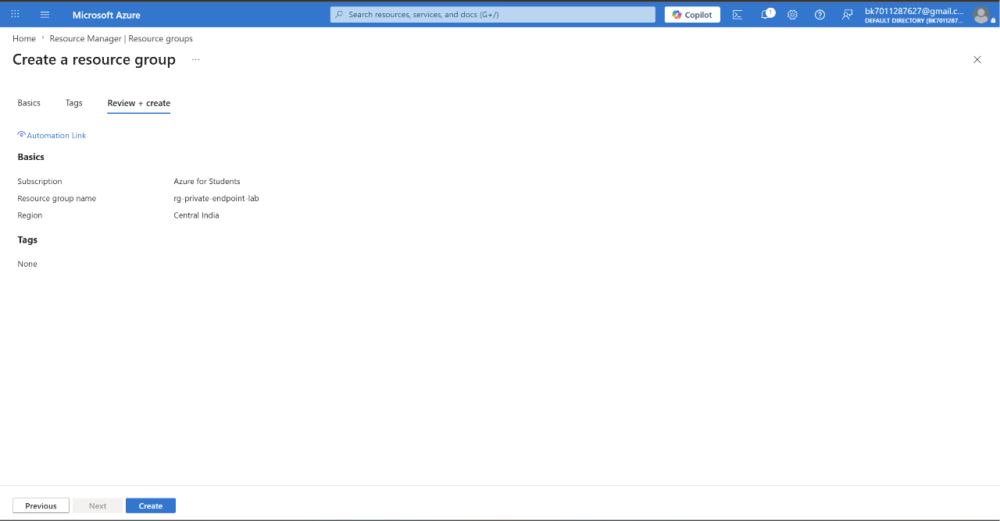

---

# Step 2 — Create Virtual Network (VNet)

A Virtual Network is created to provide private communication between Azure resources.

### VNet Configuration

| Component     | Value         |
| ------------- | ------------- |
| VNet Name     | `vnet-lab`    |
| Address Space | `10.0.0.0/16` |

### Subnets Created

| Subnet    | CIDR        |
| --------- | ----------- |
| subnet-vm | 10.0.1.0/24 |
| subnet-pe | 10.0.2.0/24 |

### Why Separate Subnets?

* `subnet-vm` → For virtual machines
* `subnet-pe` → For Private Endpoints

This separation improves:

* Security
* Isolation
* Network management

## Reference Image

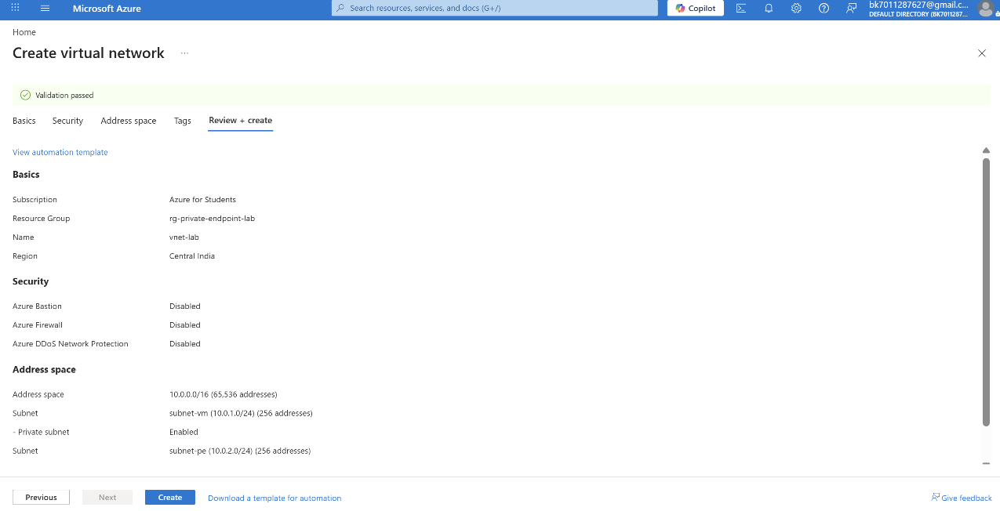

---

# Step 3 — Create Azure Storage Account

A Storage Account is created for storing blobs/files securely.

### Storage Account Details

| Setting              | Value     |
| -------------------- | --------- |
| Storage Account Name | `stlabpe` |
| Performance          | Standard  |
| Replication          | LRS       |

### Why Storage Account?

Azure Storage Account is used to:

* Store blobs/files
* Store backups
* Host static content
* Store logs and application data

## Reference Image

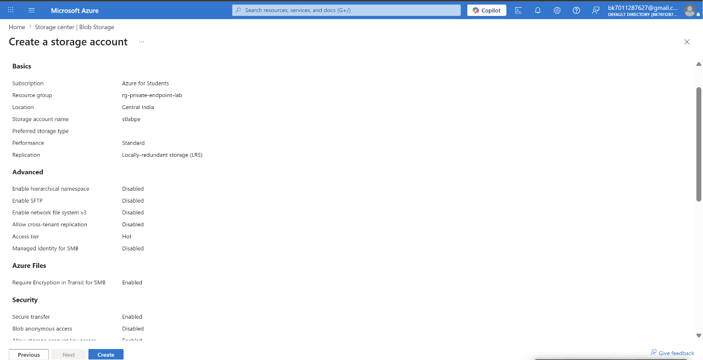

---

# Step 4 — Create Private Endpoint

A Private Endpoint is created for the Storage Account.

### Configuration

| Setting               | Value        |
| --------------------- | ------------ |
| Private Endpoint Name | `pe-storage` |
| Target Resource       | `stlabpe`    |
| Sub-resource          | `blob`       |
| Subnet                | `subnet-pe`  |

### What Happens Here?

Azure creates:

* A private NIC
* A private IP address
* A secure network path to the Storage Account

Now the Storage Account becomes reachable privately inside the VNet.

### Important Concept

Without Private Endpoint:

```text
VM → Internet → Storage Account
```

With Private Endpoint:

```text
VM → Private VNet → Storage Account
```

This improves:

* Security
* Zero Trust architecture
* Data privacy

## Reference Image

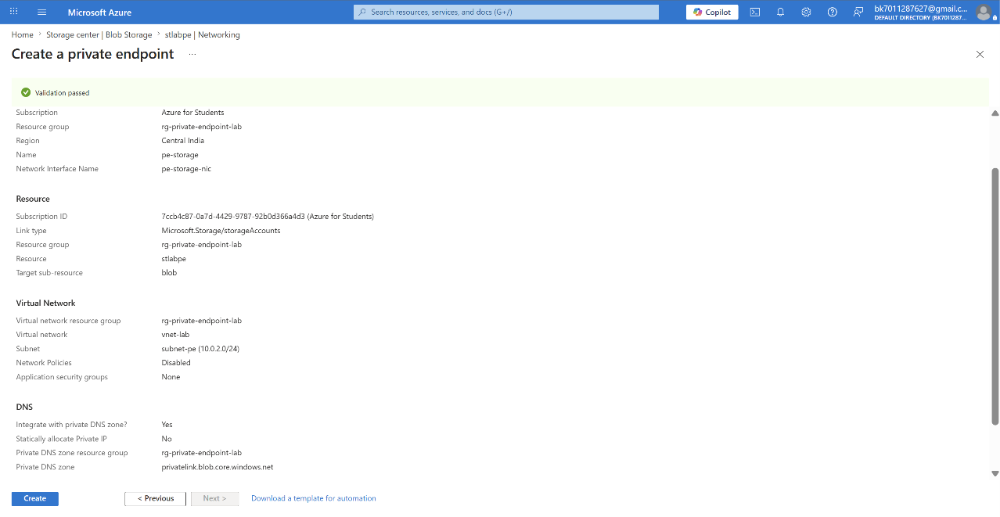

---

# Step 5 — Verify Private IP Address

Azure automatically assigns a private IP to the Private Endpoint.

### Assigned IP

```text
10.0.2.4
```

### Why This Matters?

Now the Storage Account is internally reachable using this private IP.

No public internet communication is required.

## Reference Image

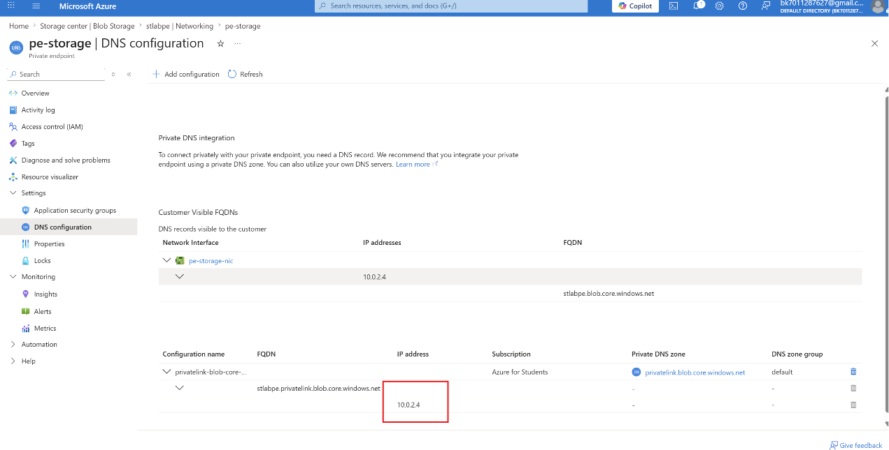

---

# Step 6 — Verify Virtual Network Link

Azure automatically links the VNet with the Private DNS Zone.

### DNS Zone

```text
privatelink.blob.core.windows.net
```

### Why VNet Link Is Important?

Without VNet Link:

* DNS resolution will fail.

With VNet Link:

* Azure VM can resolve Storage Account privately.

## Reference Image

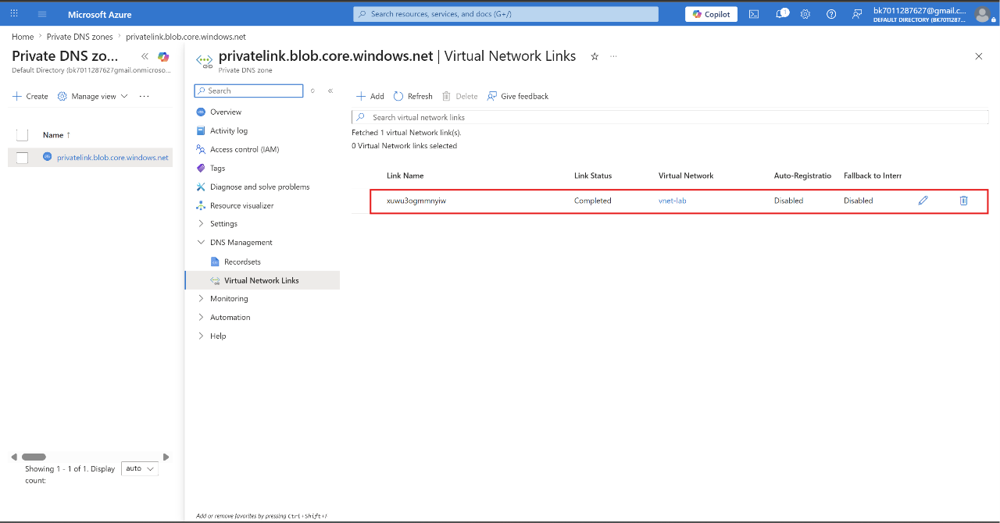

---

# Step 7 — Verify DNS Record

Azure automatically creates an A record inside the Private DNS Zone.

### DNS Record

| Name    | IP       |
| ------- | -------- |
| stlabpe | 10.0.2.4 |

### What This Means?

When VM tries to access:

```text
stlabpe.blob.core.windows.net
```

Azure DNS redirects it to:

```text
10.0.2.4
```

instead of public internet IP.

## Reference Image

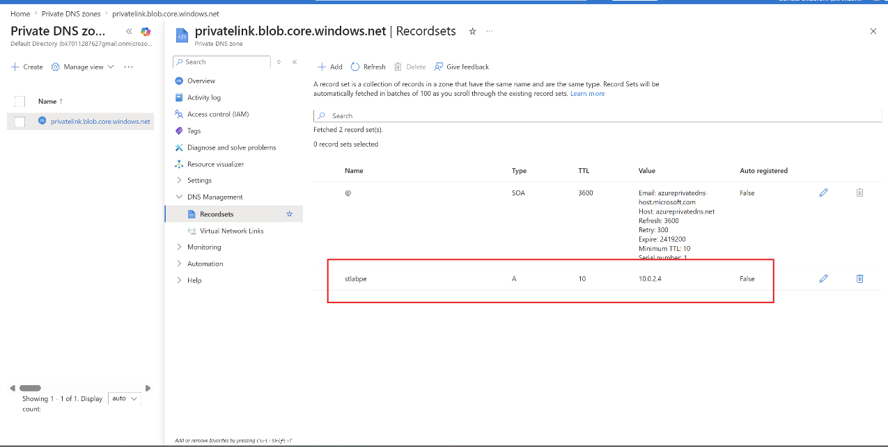

---

# Step 8 — Verify DNS Resolution from VM

Using `dig` command inside the VM:

```bash
dig stlabpe.blob.core.windows.net
```

### Result

Azure resolves:

```text
stlabpe.privatelink.blob.core.windows.net
```

to:

```text
10.0.2.4
```

### Why This Is Important?

This confirms:

* Private DNS Zone is working
* Private Endpoint is connected
* VM is accessing Storage privately

## Reference Image

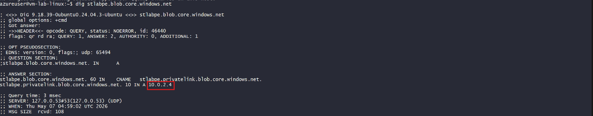

---

# Step 9 — Login to Azure and Create Blob Container

Azure CLI login is performed inside the VM.

### Commands Used

```bash
az login --use-device-code
```

Then create container:

```bash
az storage container create \
--name test-container \
--account-name stlabpe \
--auth-mode login
```

### Why `--auth-mode login`?

This uses Azure RBAC authentication instead of storage account keys.

## Reference Image

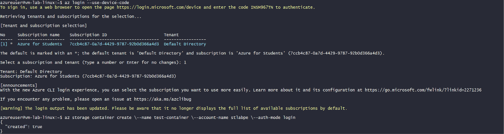

---

# Step 10 — Assign RBAC Role

Initially blob upload failed because correct permissions were not assigned.

### Problem

User had:

```text
Storage Queue Data Contributor
```

But blob upload requires:

```text
Storage Blob Data Contributor
```

### Correct Role Assigned

```text
Storage Blob Data Contributor
```

### Why This Happened?

Azure separates permissions by service:

* Blob
* Queue
* Table
* File Share

Each requires different RBAC roles.

## Reference Image

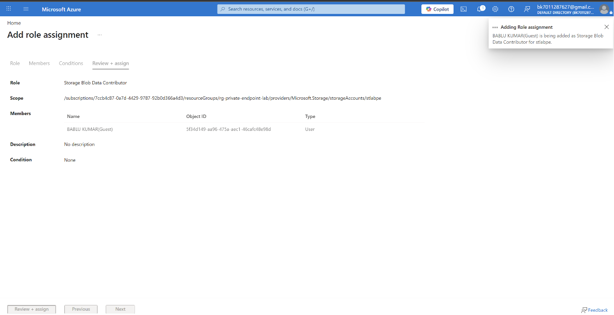

---

# Step 11 — Upload Blob Successfully

After assigning the correct role, blob upload succeeded.

### Command Used

```bash
az storage blob upload \
--account-name stlabpe \
--container-name test-container \
--name testfile.txt \
--file testfile.txt \
--auth-mode login
```

### What Happened Internally?

1. VM resolved Storage Account privately.
2. Traffic stayed inside Azure VNet.
3. RBAC authenticated the user.
4. Blob uploaded securely.

## Reference Image

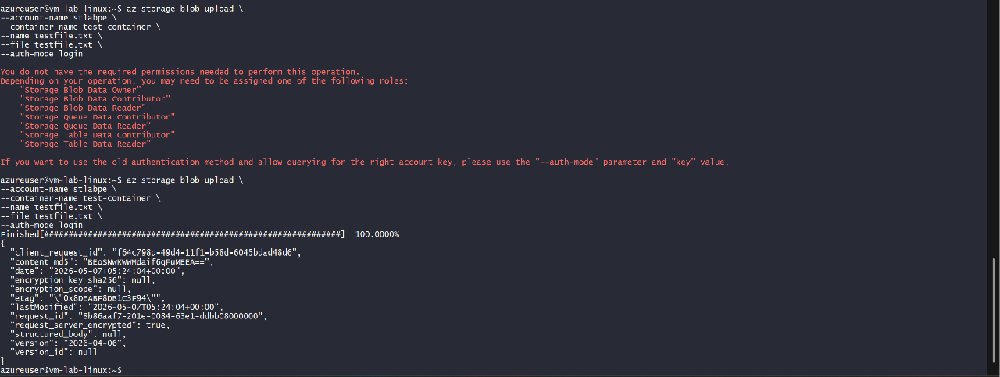

---

# Key Concepts Learned

## Private Endpoint

Private Endpoint gives Azure service:

* Private IP inside VNet
* Secure internal connectivity
* No public exposure

---

## Private DNS Zone

Private DNS Zone maps:

```text
Service Name → Private IP
```

Example:

```text
stlabpe.blob.core.windows.net
→ 10.0.2.4
```

---

