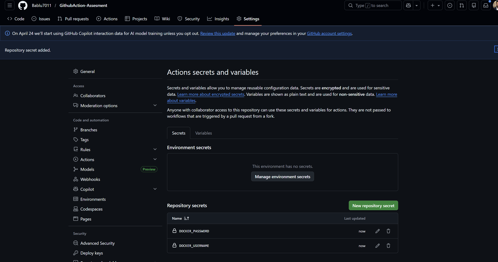
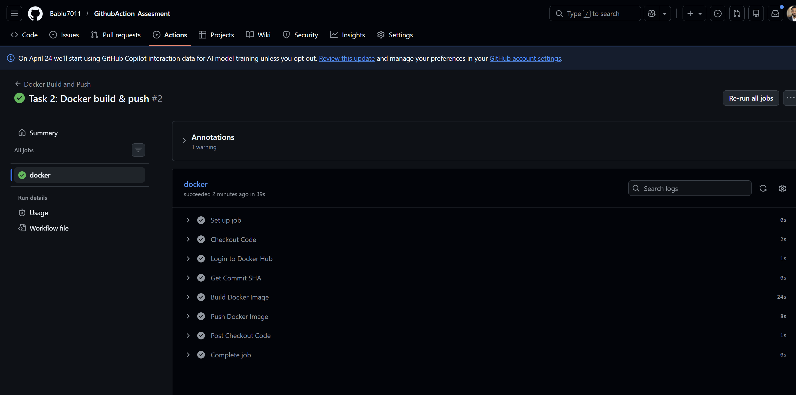
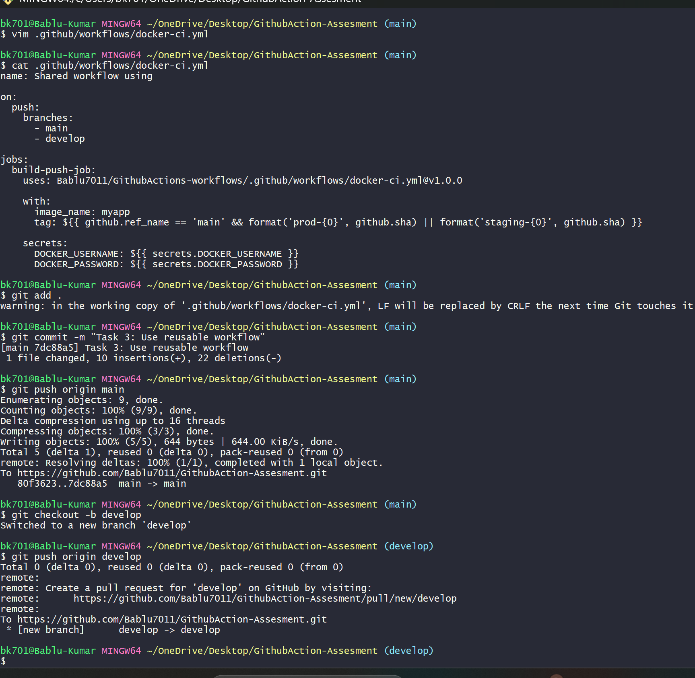
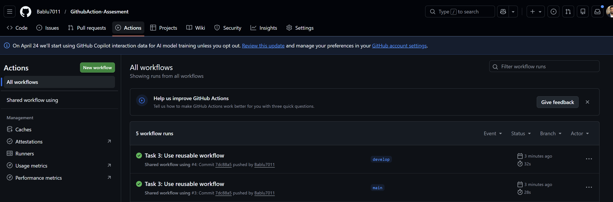
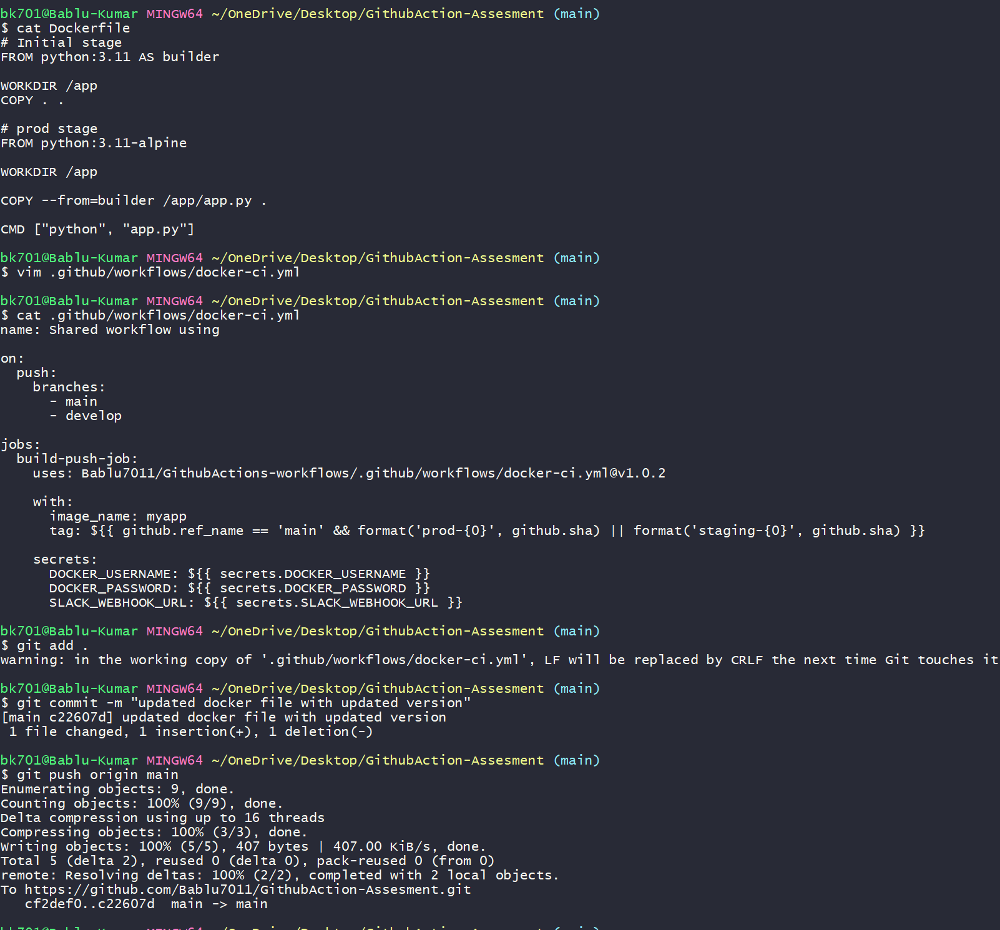
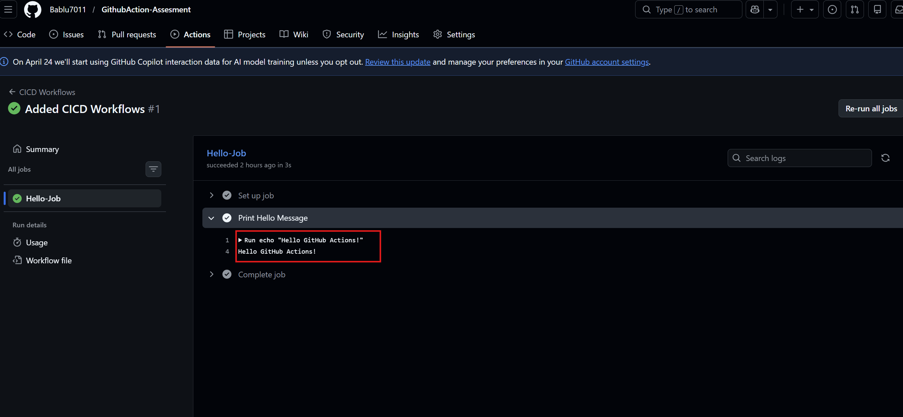
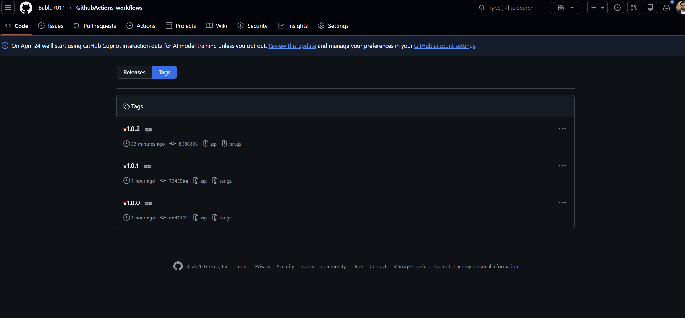
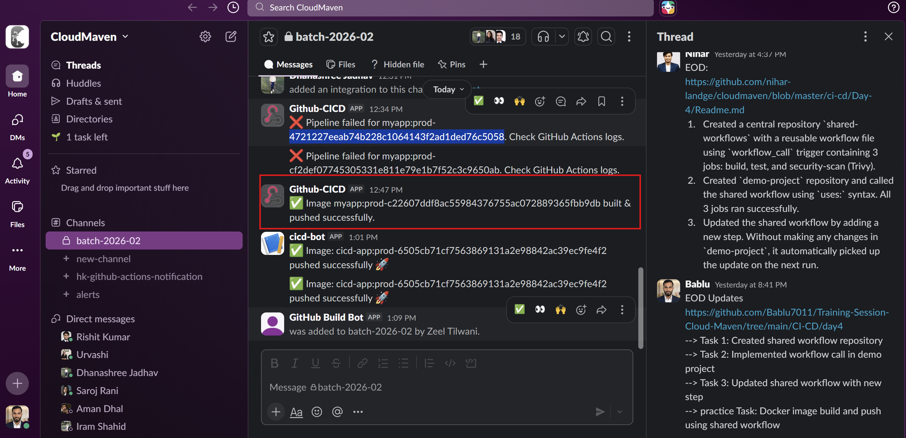

# 🚀 GitHub Actions CI/CD Lab – Internship Task

## 📌 Overview

This project demonstrates a complete CI/CD pipeline using **GitHub Actions**, **Docker**, **Reusable Workflows**, **Trivy Security Scanning**, and **Slack Notifications**.

> ⚠️ **Important Note for Instructor**
> This task is implemented across **two repositories**:

* 🔹 Reusable Workflows Repo
  👉 https://github.com/Bablu7011/GithubActions-workflows

* 🔹 Main Application Repo
  👉 https://github.com/Bablu7011/GithubAction-Assesment

👉 The complete implementation can be verified by checking both repositories together.

---

# 📂 Repository Structure

## 🔹 1. GithubActions-workflows

* Contains reusable CI workflow
* Uses `workflow_call`
* Handles:

  * Docker build
  * Trivy scan
  * Docker push
  * Slack notification

## 🔹 2. GithubAction-Assesment

* Main application repository
* Calls reusable workflow
* Contains:

  * Dockerfile
  * App code
  * Caller workflow

---

# ✅ Task 1 – Basic CI/CD Workflow

## 🎯 Objective

Understand how GitHub Actions works with a simple workflow.

## ⚙️ Steps

* Created workflow file:

  ```
  .github/workflows/cicd.yml
  ```
* Added simple job to print message

## 📷 Output


## ✅ Result

* Workflow triggered successfully on push
* Output visible in GitHub Actions logs

---

# ✅ Task 2 – Docker Build & Push

## 🎯 Objective

Automate Docker image build and push to Docker Hub.

## ⚙️ Steps

* Created multi-stage `Dockerfile`
* Added `.dockerignore`
* Workflow includes:

  * Checkout code
  * Docker login (using secrets)
  * Build image
  * Tagging:

    * `latest`
    * commit SHA
  * Push to Docker Hub

## 🔐 Secrets Used

* `DOCKER_USERNAME`
* `DOCKER_PASSWORD`

## 📷 Output






## ✅ Result

* Docker image successfully built and pushed
* Verified on Docker Hub

---

# ✅ Task 3 – Reusable Workflow

## 🎯 Objective

Create reusable workflow and use it in another repository.

## ⚙️ Steps

* Created reusable workflow using:

  ```
  workflow_call
  ```
* Inputs:

  * `image_name`
  * `tag`
* Versioned workflow (`v1.0.x`)

### 🔁 Caller Workflow

* Used:

  ```
  uses: <repo>@version
  ```
* Branch-based tagging:

  * `main` → `prod-<sha>`
  * `develop` → `staging-<sha>`

## 📷 Output






## ✅ Result

* Reusable workflow executed successfully
* Dynamic tagging implemented

---

# ✅ Task 4 – Security Scan & Slack Notification

## 🎯 Objective

Enhance CI/CD pipeline with security and notifications.

## ⚙️ Steps

### 🔍 Trivy Security Scan

* Integrated:

  ```
  aquasecurity/trivy-action
  ```
* Configured to fail only on:

  ```
  CRITICAL vulnerabilities
  ```

### 📢 Slack Notification

* Added webhook integration
* Notifications:

  * ✅ Success
  * ❌ Failure

## 🔐 Secrets Used

* `SLACK_WEBHOOK_URL`

## 📷 Output





---

# 📊 Workflow Logs







---

