# 🚀 Day 2 - GitHub Actions Workflow (Simple Learning)

In this day, I learned how GitHub Actions works step by step.  
I created workflows and tested them using different tasks.

---

# ✅ Task 1: Trigger Workflow (PR + Manual)

### 🧠 What I learned:
- Workflow can run when Pull Request is created
- Workflow can also run manually using button

### 📌 What I did:
- Created a workflow file
- Added `pull_request` and `workflow_dispatch`

### 🖼️ Output:

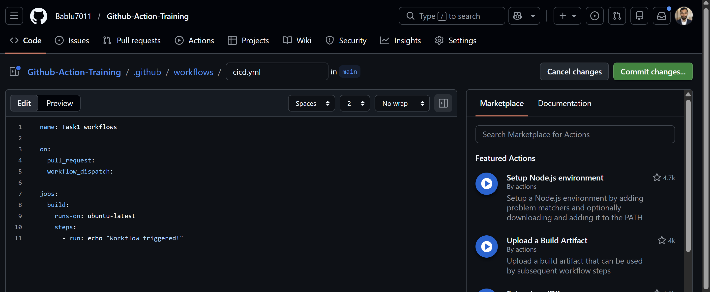  
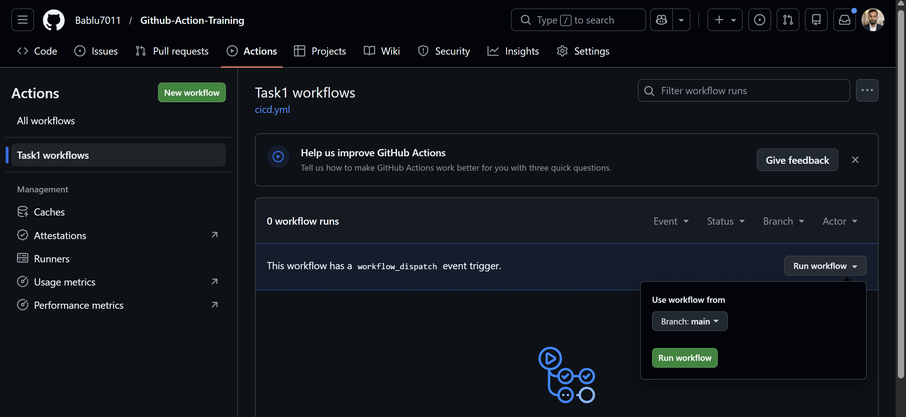  
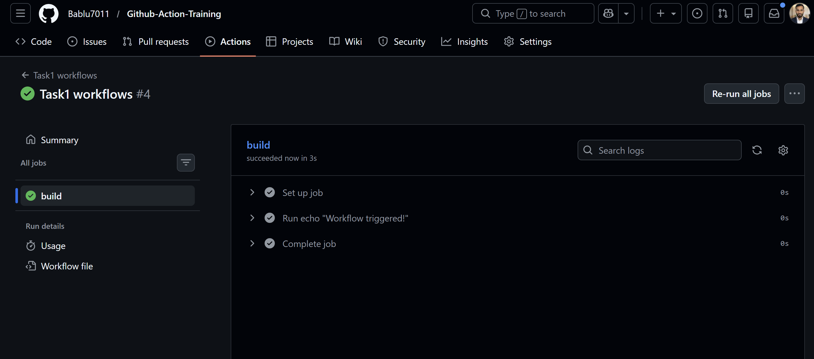  
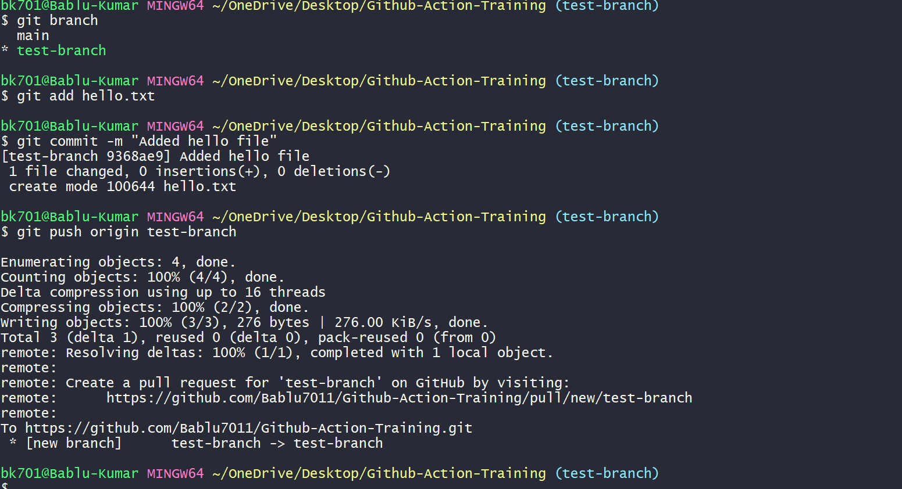  

---

# ✅ Task 2: Job Dependency (Build → Test)

### 🧠 What I learned:
- Jobs run parallel by default  
- Using `needs` we can run jobs in order  

### 📌 What I did:
- Created 2 jobs → build and test  
- Made test depend on build  

### 🖼️ Output:

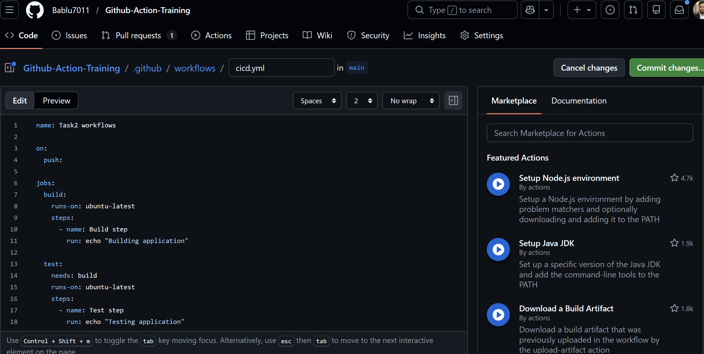  
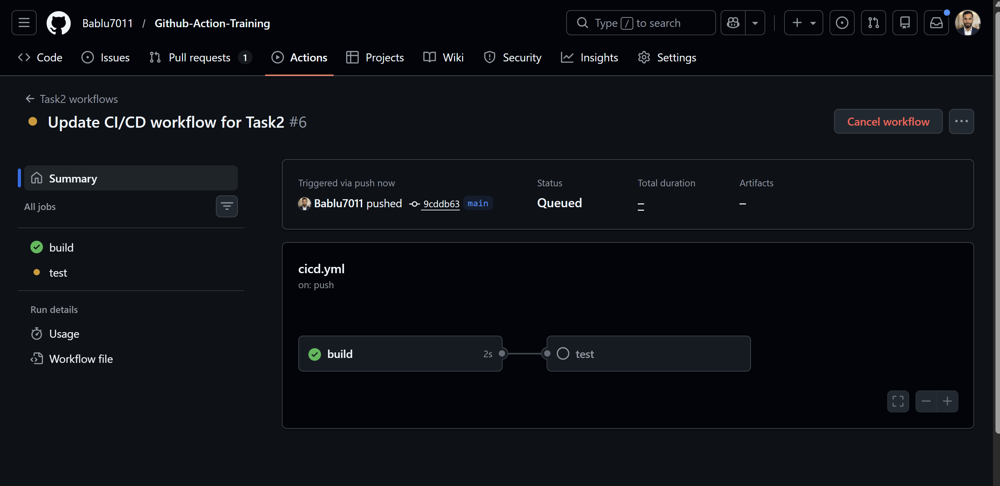  

---

# ✅ Task 3: GitHub Context Variables

### 🧠 What I learned:
- GitHub gives automatic variables  
- Example: branch name, commit id  

### 📌 What I did:
- Printed branch name using `${{ github.ref }}`
- Printed commit id using `${{ github.sha }}`  

### 🖼️ Output:

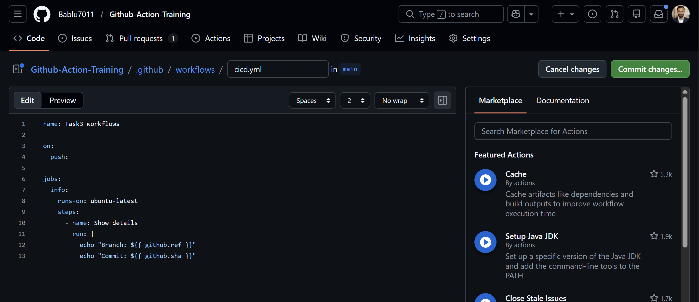  
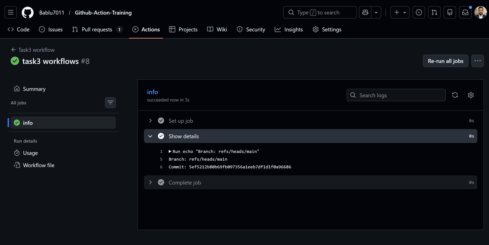  

---

# ✅ Task 4: Pull Request Workflow

### 🧠 What I learned:
- Workflow runs automatically on PR  
- Can use build and test together  

### 📌 What I did:
- Created PR workflow  
- Added build and test jobs  
- Used `needs` for dependency  

### 🖼️ Output:

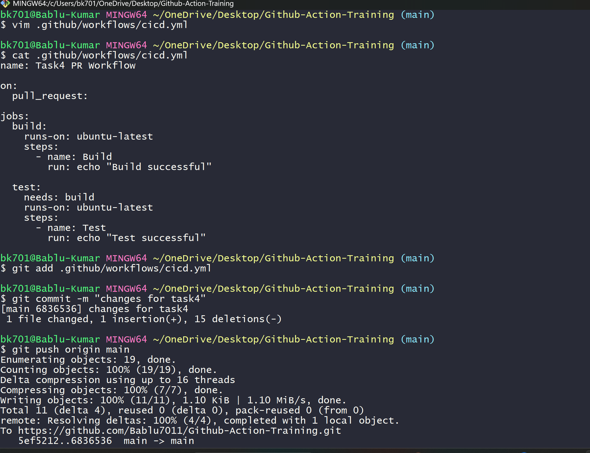  
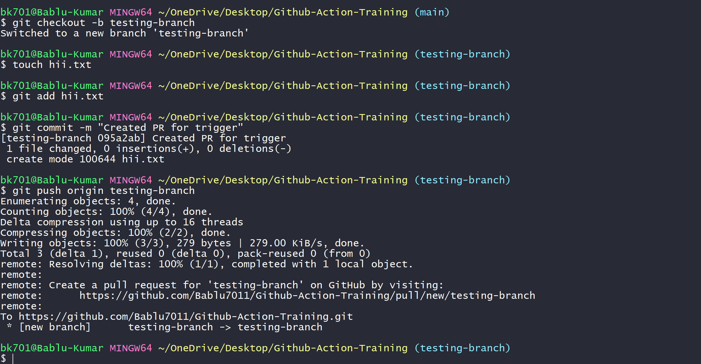  
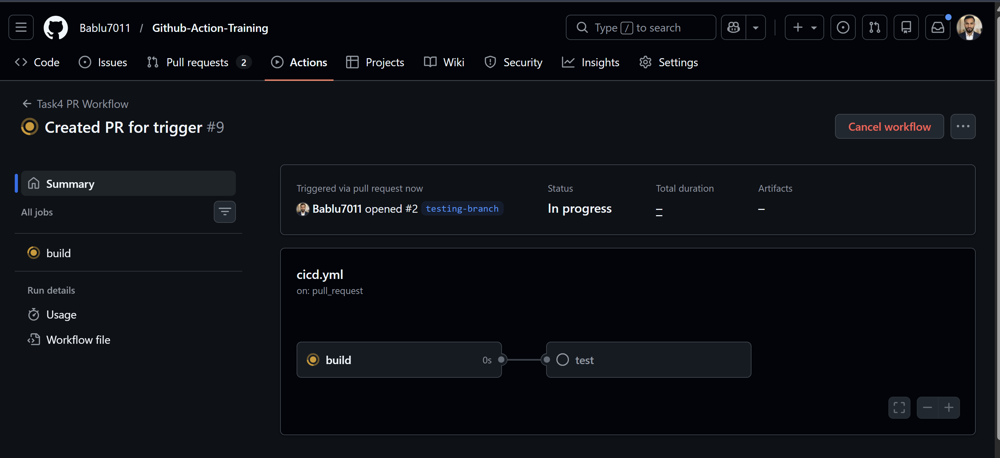  

---

# ✅ Task 5: Docker Build & Push

### 🧠 What I learned:
- How to build Docker image in GitHub Actions  
- How to push image to DockerHub  
- How to use secrets securely  

### 📌 What I did:
- Logged in using DockerHub secrets  
- Built Docker image  
- Tagged image with username  
- Pushed image  
- Removed local image  

### 🖼️ Output:

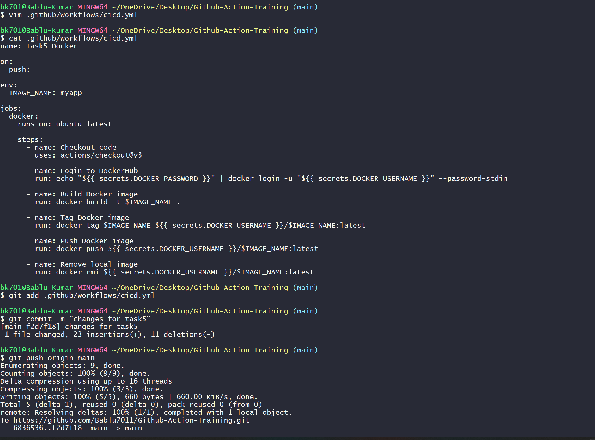  
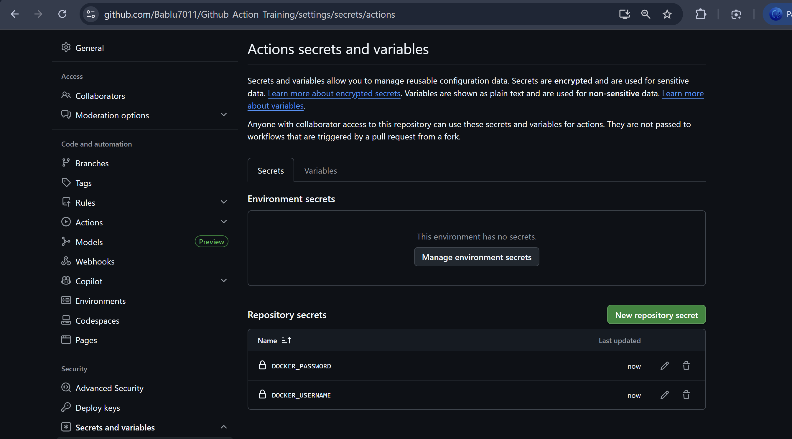  
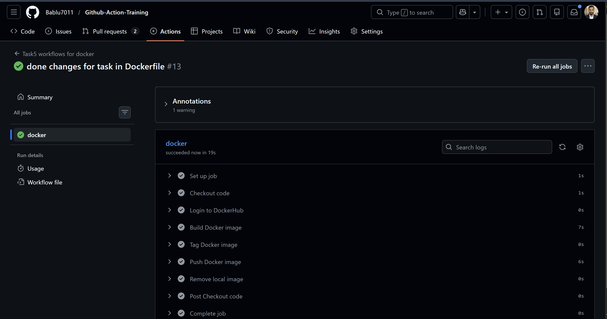  

---

