# 🚀 Shared Workflow CI/CD 

This project demonstrates how to:
- Create a shared GitHub Actions workflow
- Call it from another repository
- Build a Docker image
- Push the image to Docker Hub

---

# 📌 Task 1: Create Shared Workflow Repository

### 🔹 Steps:
- Created a repository: `shared-workflows`
- Added reusable workflow using `workflow_call`
- Simple job to print message

### 📂 Workflow File:
`.github/workflows/shared-ci.yml`

### 📷 Output:

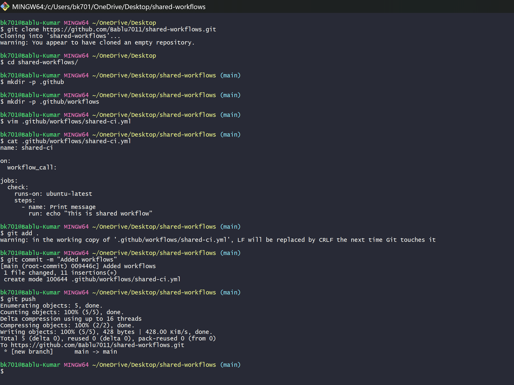
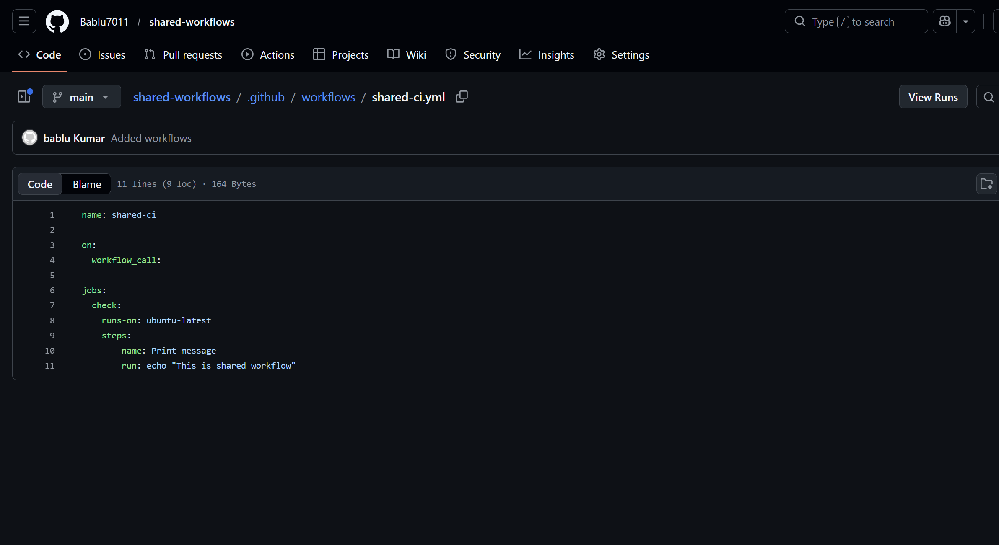  

---

# 📌 Task 2: Use Shared Workflow in Another Repo

### 🔹 Steps:
- Created new repo: `demo-project`
- Called shared workflow using:

```yaml
uses: Bablu7011/shared-workflows/.github/workflows/shared-ci.yml@main
````

* Triggered workflow using `push`

### 📷 Output:

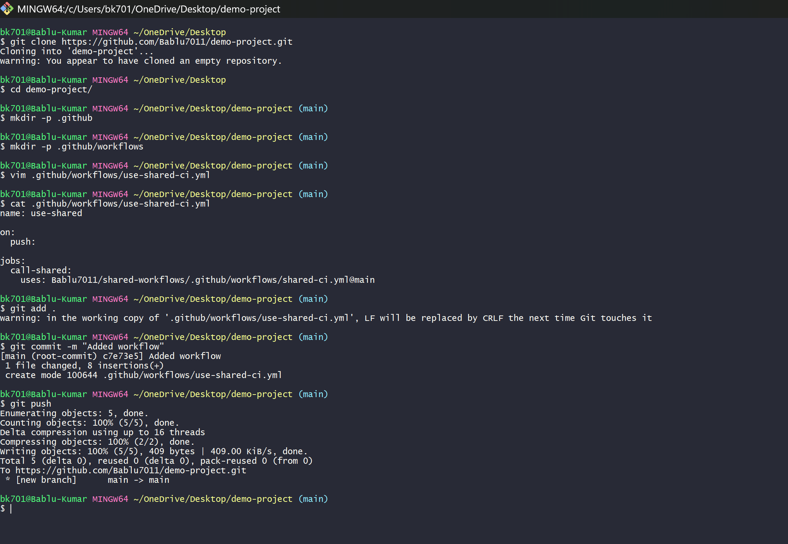
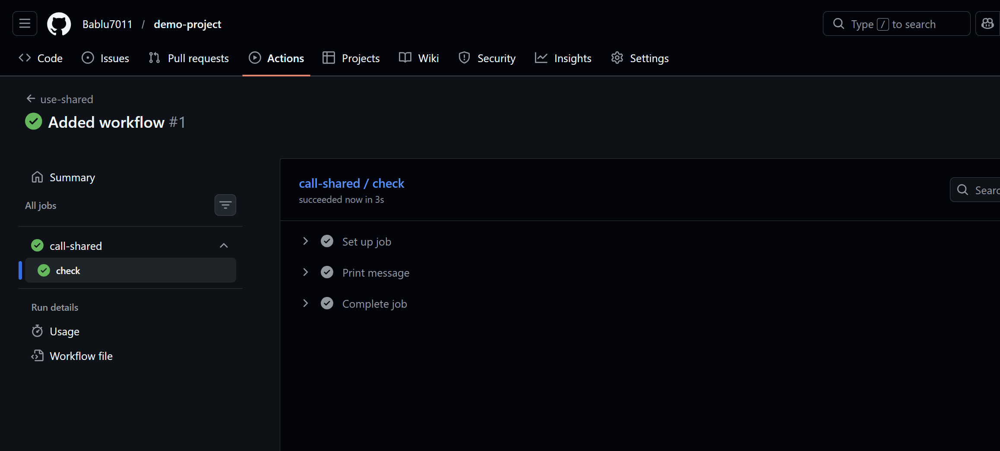

---

# 📌 Task 3: Update Shared Workflow

### 🔹 Steps:

* Modified shared workflow
* Added new step:

```yaml
- name: New update
  run: echo "Workflow updated!"
```

* Changes reflected automatically in caller repo

### 📷 Output:

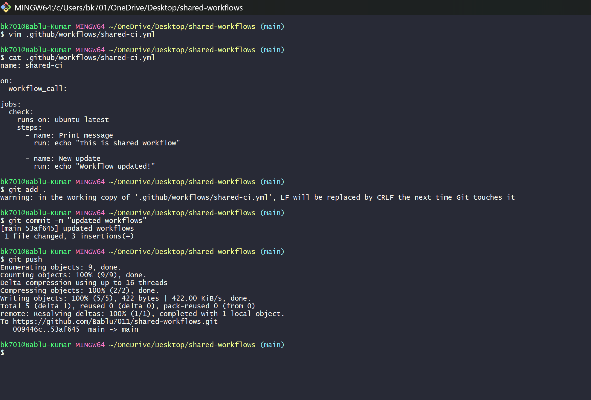
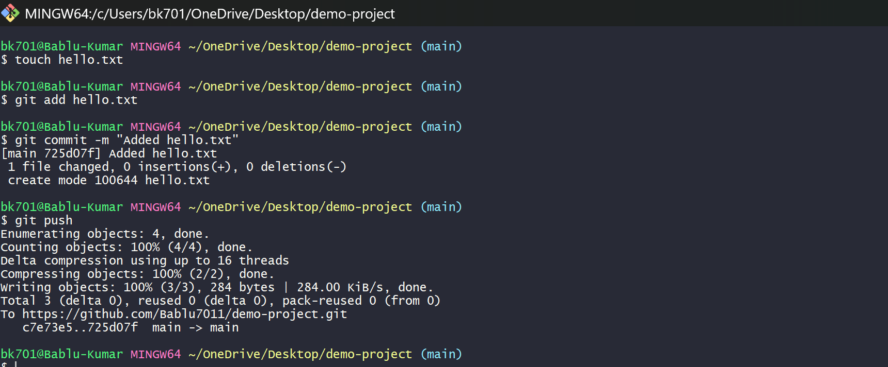
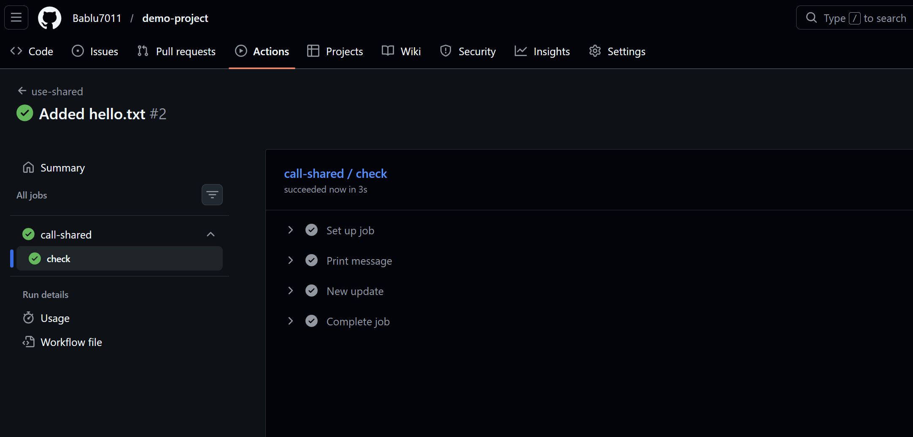

---

# 📌 Pracice Task: Docker Build & Push using Shared Workflow

### 🔹 Steps:

* Created new repo: `python-project`
* Added:

  * `app.py` (Flask app)
  * `requirements.txt`
  * `Dockerfile`
* Used shared workflow from:

```yaml
uses: clouddrove/github-shared-workflows/.github/workflows/docker-build-push.yml@master
```

* Passed inputs:

```yaml
provider: DOCKERHUB
images: babludevops701/myapp
IMAGE_TAG: latest
```

* Added GitHub Secrets:

  * `DOCKERHUB_USERNAME`
  * `DOCKERHUB_PASSWORD`

### 📷 Output:

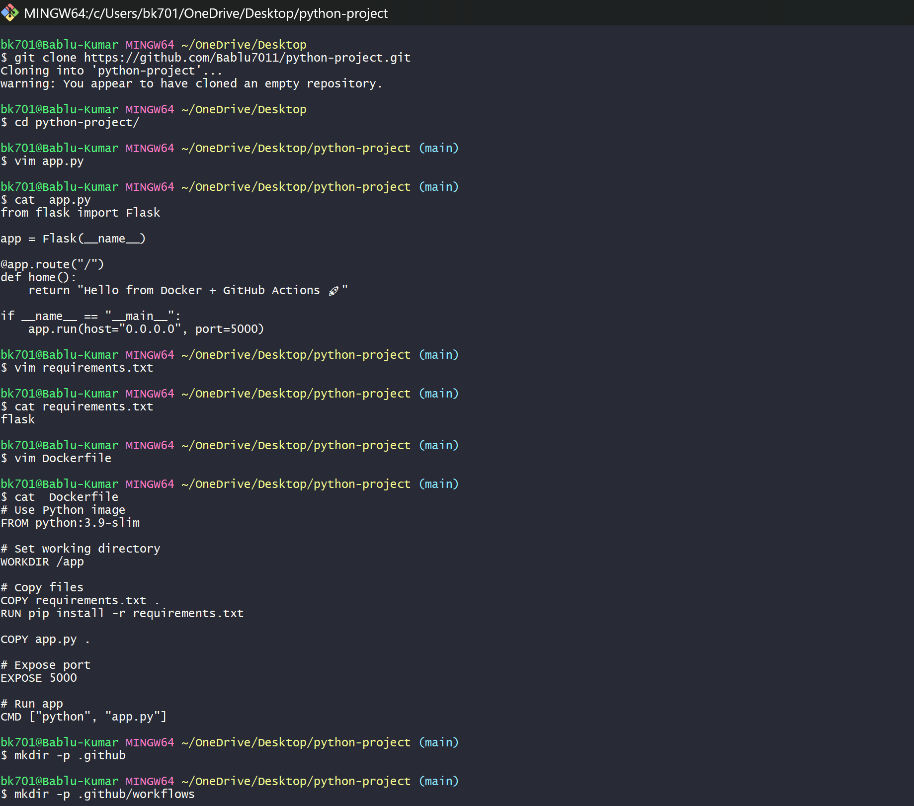
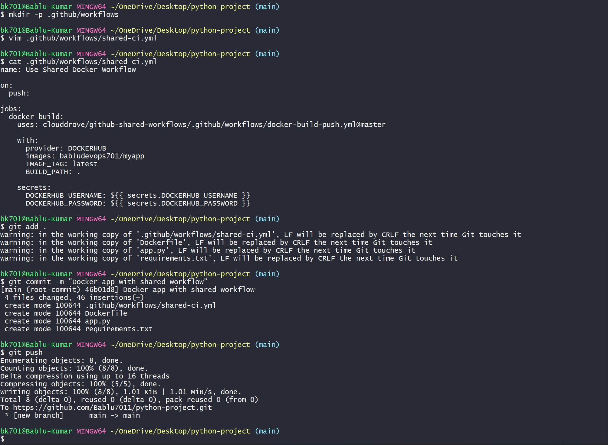
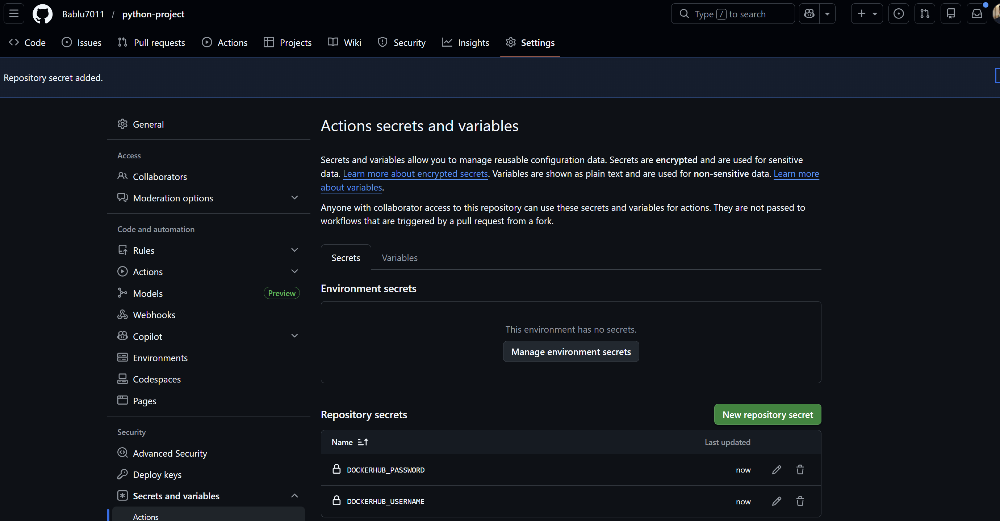
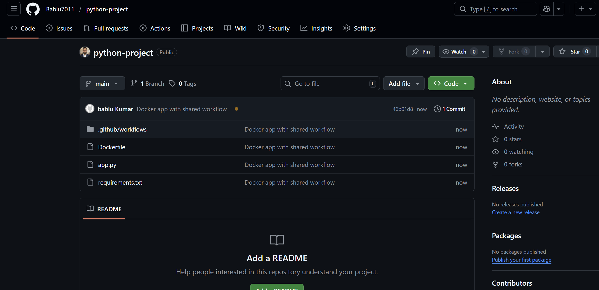
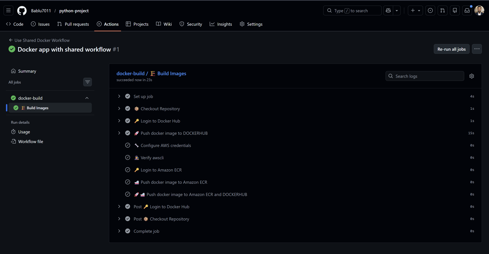
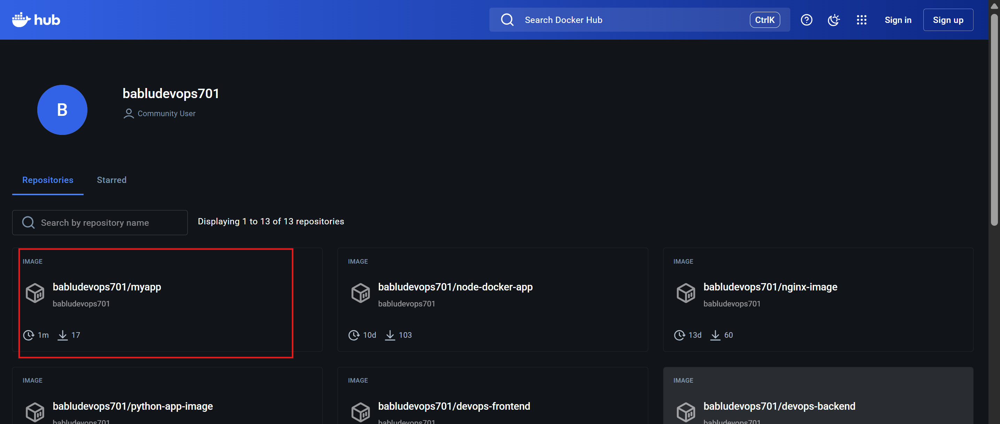

---

# 🐳 Docker Image

Successfully pushed image to Docker Hub:

```
babludevops701/myapp:latest
```


