# 🚀 Docker Labs – Library Management System

This project demonstrates a complete **Docker-based deployment** of a Flask application with MySQL and Nginx, covering:

- Docker Basics
- Custom Docker Image (Multi-stage build)
- Container Networking
- Security & Resource Management
- Docker Compose (3-tier architecture)

---

# 📌 Architecture

```

Browser → Nginx → Flask App → MySQL

````

---

# ⚙️ Tech Stack

- Python (Flask)
- MySQL
- Nginx
- Docker
- Docker Compose

---

# 🐳 1. Docker Basics & Setup

## ✅ Verify Docker Installation

```bash
docker --version
````


---

## ✅ Run Flask App using Docker

```bash
docker run -d -p 5000:5000 python:3.9-slim
```


---

## ✅ Container Operations

* List containers:

```bash
docker ps
```

* Stop container:

```bash
docker stop <container_id>
```

* Start container:

```bash
docker start <container_id>
```

* Remove container:

```bash
docker rm <container_id>
```

---

## ✅ Inspect & Logs

```bash
docker logs <container_id>
docker inspect <container_id>
```
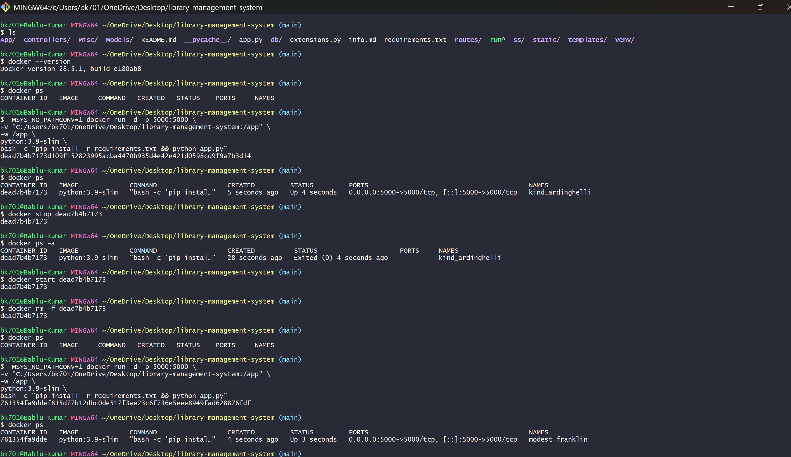
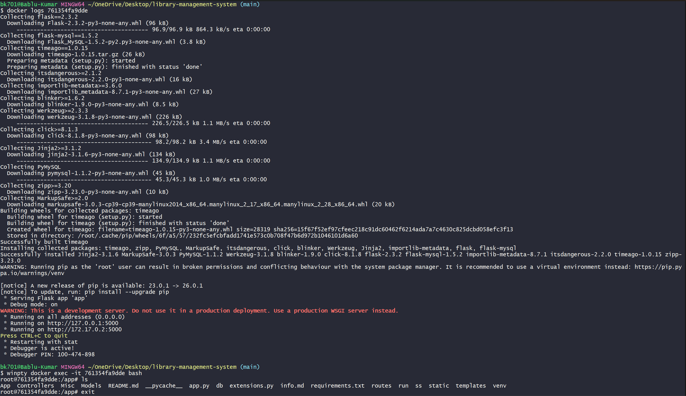
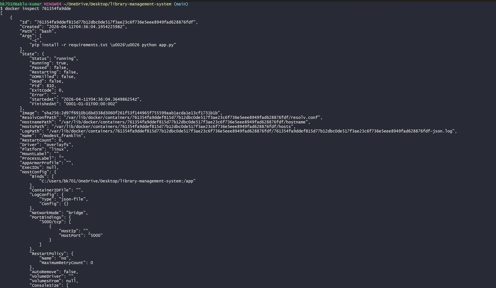


---

# 📂 2. Volume Mounting

## 🔹 Bind Mount

```bash
docker run -d -p 5000:5000 \
-v <local_path>:/app \
python:3.9-slim
```

---

## 🔹 Named Volume

```bash
docker volume create mysql_data
docker volume ls
```
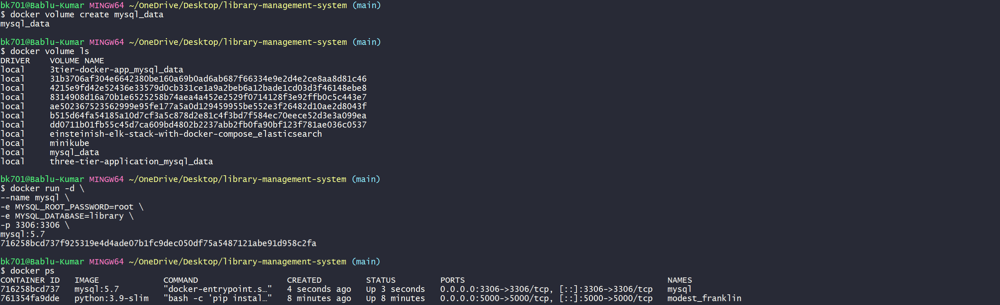


---

# 🐳 3. Custom Docker Image

## 🔹 Multi-stage Dockerfile

```dockerfile
FROM python:3.9-slim AS builder
WORKDIR /app
COPY requirements.txt .
RUN pip install --no-cache-dir -r requirements.txt

FROM python:3.9-slim
WORKDIR /app
COPY --from=builder /usr/local/lib/python3.9 /usr/local/lib/python3.9
COPY . .
RUN useradd -m appuser
USER appuser
EXPOSE 5000
CMD ["python", "app.py"]
```

---

## 🔹 Build Image

```bash
docker build -t library-app:v4 .
```

---

## 🔹 Run Image

```bash
docker run -d -p 5000:5000 library-app:v4
```
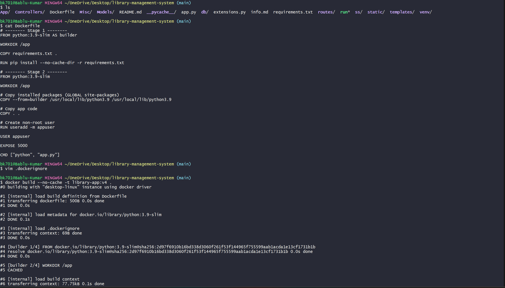
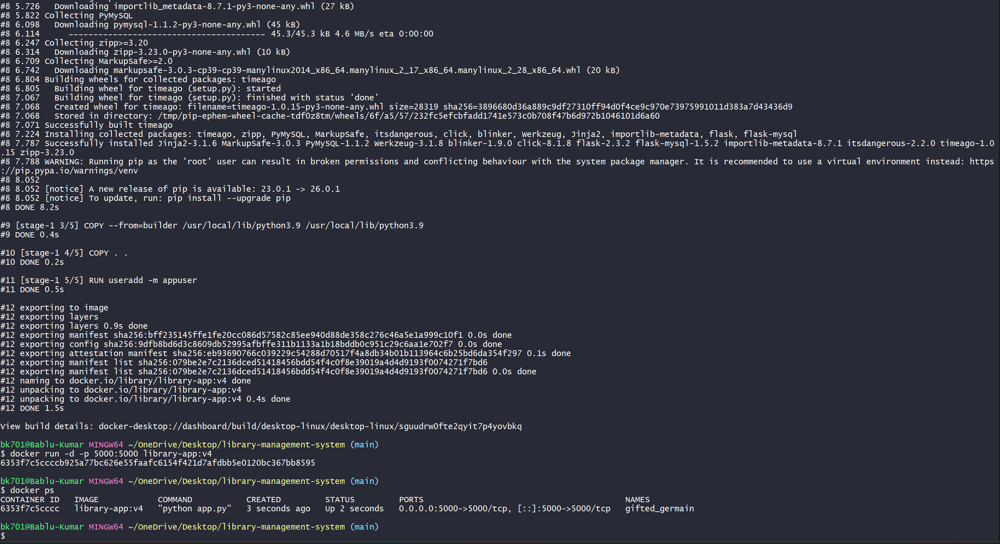


---

## 🔹 Application Running
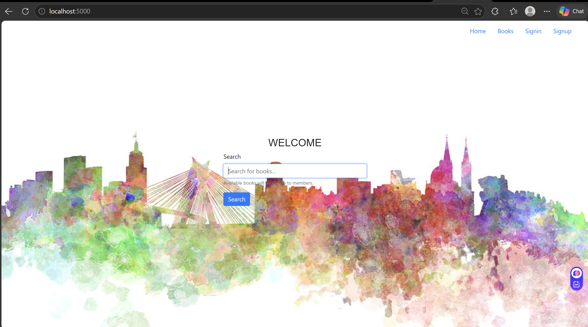

## Push To DockerHub
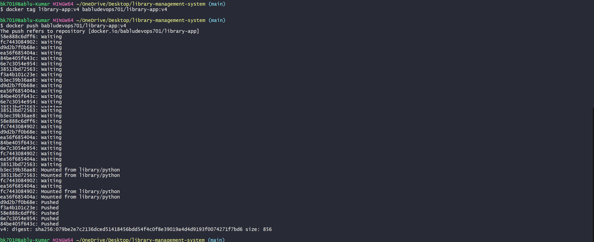

---

# 🌐 4. Docker Networking

## 🔹 Create Network

```bash
docker network create mynetwork
docker network ls
```


---

## 🔹 Run MySQL Container

```bash
docker run -d \
--name mysql \
--network mynetwork \
-e MYSQL_ROOT_PASSWORD=root \
-e MYSQL_DATABASE=library \
mysql:5.7
```

---

## 🔹 Run Flask App

```bash
docker run -d \
--name app \
--network mynetwork \
-p 5000:5000 \
library-app:v4
```

---

## 🔹 Test Connectivity

```bash
docker exec -it app python -c "import socket; print(socket.gethostbyname('mysql'))"
```
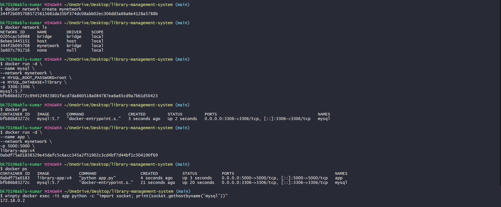


---

## 🔹 Network Modes

### Host Mode

```bash
docker run --network host nginx
```

### None Mode

```bash
docker run --network none nginx
```
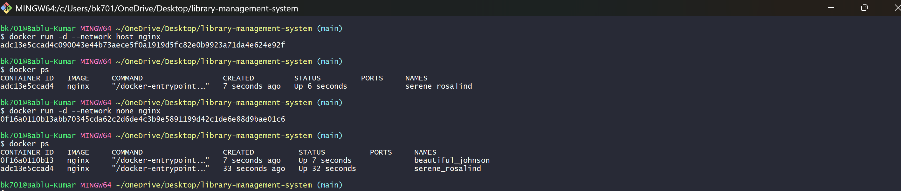
---

# 🔐 5. Security & Resource Management

## 🔹 CPU & Memory Limits

```bash
docker run -d --memory="256m" --cpus="0.5" library-app:v4
```


---

## 🔹 Read-only Container

```bash
docker run -d --read-only library-app:v4
```
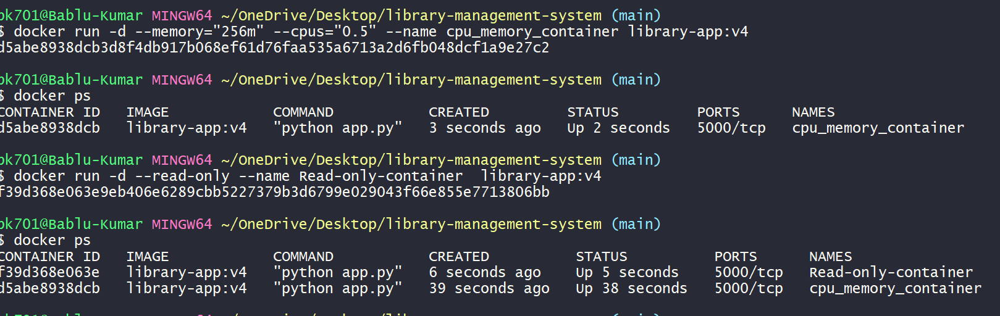

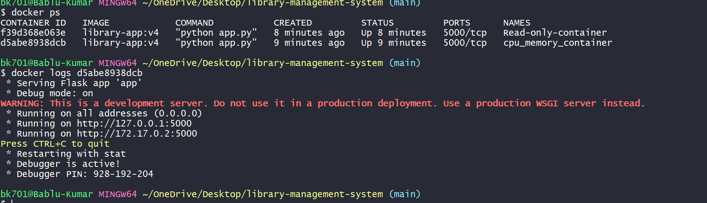

---

## 🔹 Security Scan (Grype)

```bash
./bin/grype.exe library-app:v4
```

---

# 🧩 6. Docker Compose (3-Tier Setup)

## 🔹 docker-compose.yml

```yaml
services:
  app:
    image: library-app:v4
    container_name: app
    restart: always
    depends_on:
      - mysql
    networks:
      - mynetwork

  mysql:
    image: mysql:5.7
    container_name: mysql
    restart: always
    env_file:
      - .env
    volumes:
      - mysql_data:/var/lib/mysql
    networks:
      - mynetwork

  nginx:
    image: nginx
    container_name: nginx
    restart: always
    ports:
      - "8080:80"
    depends_on:
      - app
    volumes:
      - ./nginx.conf:/etc/nginx/nginx.conf:ro
    networks:
      - mynetwork

networks:
  mynetwork:

volumes:
  mysql_data:
```

---

## 🔹 Run Compose

```bash
docker compose up -d
```

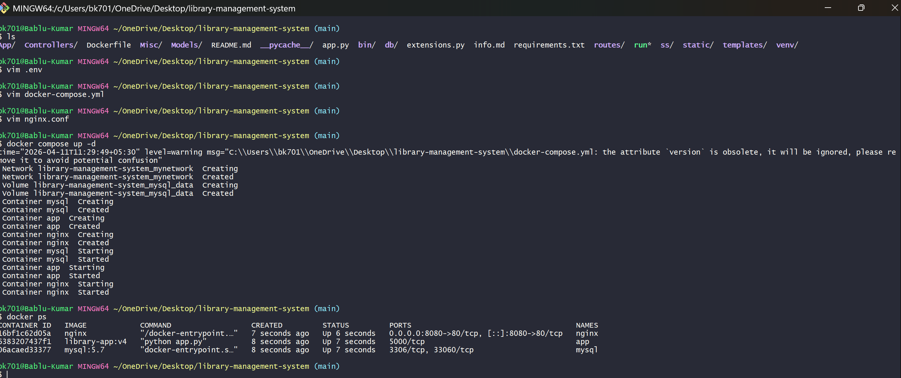

---

## 🔹 Verify Containers

```bash
docker ps
```

---

## 🔹 Access Application

```
http://localhost:8080
```

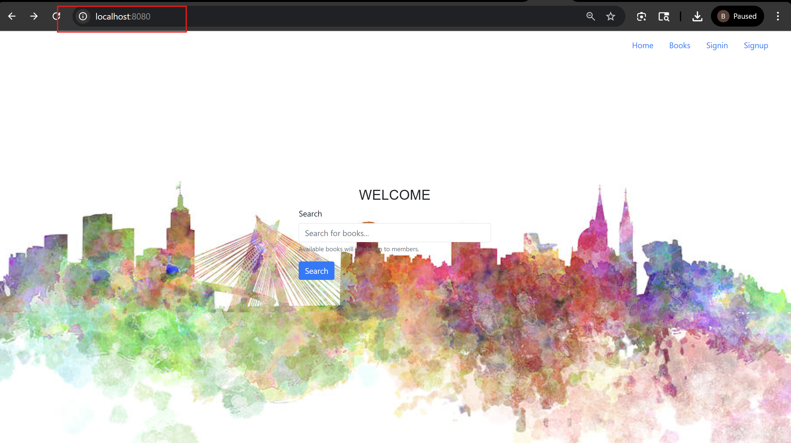

---

## 🔹 Logs Verification

```bash
docker logs app
```

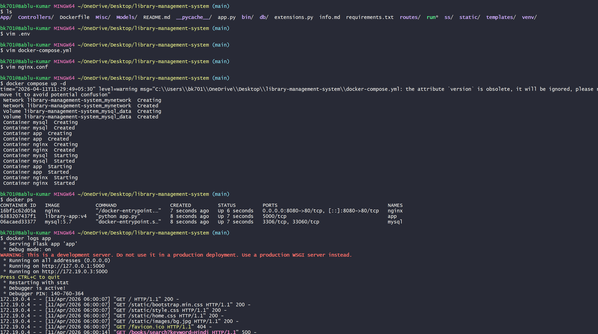

---

# 📘 Key Concepts

### 🔹 Image vs Container vs Volume vs Network

* **Image** → Blueprint of application
* **Container** → Running instance
* **Volume** → Persistent storage
* **Network** → Communication layer

---

# 🧹 Cleanup

```bash
docker system prune -a
```

---

# 🔒 Best Practices

* Use multi-stage builds
* Avoid root user
* Use `.dockerignore`
* Use environment variables
* Keep images small and secure

---

# 🎯 Conclusion

This project demonstrates a **complete Docker-based deployment pipeline**, including:

* Containerization of Flask application
* Database integration using MySQL
* Reverse proxy using Nginx
* Secure and optimized Docker practices
* Multi-container orchestration using Docker Compose

