# Docker Training Project – Multi Task Implementation

This repository contains multiple Docker tasks completed as part of a **DevOps training assignment**.
The project demonstrates how to build Docker images, run containers, and create a **complete 3-tier application using Docker Compose**.

---

# Project Overview

This repository includes the following tasks:

| Task   | Description                                                  |
| ------ | ------------------------------------------------------------ |
| Task 1 | Build and run a simple Nginx container                       |
| Task 2 | Build and run a Dockerized Python Flask application          |
| Task 3 | Build a complete **3-Tier Application** using Docker Compose |

Technologies used:

* Docker
* Docker Compose
* Nginx
* Node.js
* MySQL
* Python (Flask)

---

# Task 1 – Dockerize a Simple Nginx Web Server

## Objective

Create a custom Docker image using **Nginx** that serves a simple HTML page.

---

## Step 1 – Create Dockerfile

```Dockerfile
FROM nginx:stable-alpine

COPY index.html /usr/share/nginx/html/index.html

EXPOSE 80
```

This Dockerfile:

* Uses the official **Nginx Alpine image**
* Copies a custom HTML file
* Exposes port **80**

---

## Step 2 – Create HTML File

```html
<!DOCTYPE html>
<html>
<head>
<title>Welcome to my Docker Project!</title>
</head>

<body>
<h1>Hello, Nginx is running in a Docker container!</h1>
</body>

</html>
```

---

## Step 3 – Build the Image

```bash
docker build -t nginx-image:1.0 .
```

---

## Step 4 – Verify Image

```bash
docker images
```

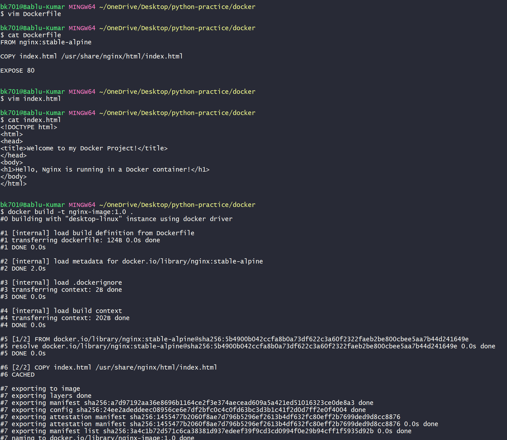

---

## Step 5 – Run Container

```bash
docker run -d -p 8081:80 --name nginx-container nginx-image:1.0
```

---

## Step 6 – Check Running Containers

```bash
docker ps
```

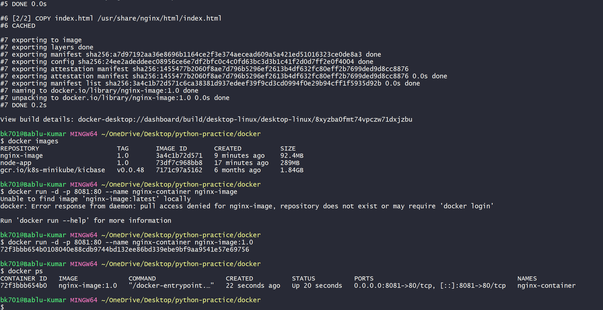

---

## Step 7 – Access in Browser

Open:

```
http://localhost:8081
```

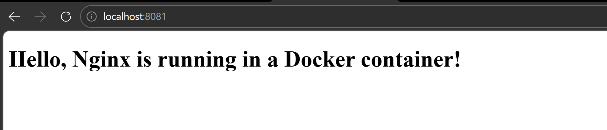

---

# Task 2 – Dockerize a Python Flask Application

## Objective

Create a **Python Flask application**, containerize it with Docker, and run it.

---

## Step 1 – Python Application (`app.py`)

```python
from flask import Flask, jsonify

app = Flask(__name__)

@app.route("/")
def home():
    return jsonify(message="Hello from Dockerized Python App!")

@app.route("/status")
def status():
    return jsonify(status="running", version="1.0")

if __name__ == "__main__":
    app.run(host="0.0.0.0", port=5000)
```

---

## Step 2 – Requirements File

`requirements.txt`

```
flask==3.0.2
```

---

## Step 3 – Dockerfile

```Dockerfile
FROM python:3.12-slim

WORKDIR /app

COPY requirements.txt .

RUN pip install -r requirements.txt

COPY . .

EXPOSE 5000

CMD ["python", "app.py"]
```

---

## Step 4 – Build Docker Image

```bash
docker build -t python-app-image:1.0 .
```

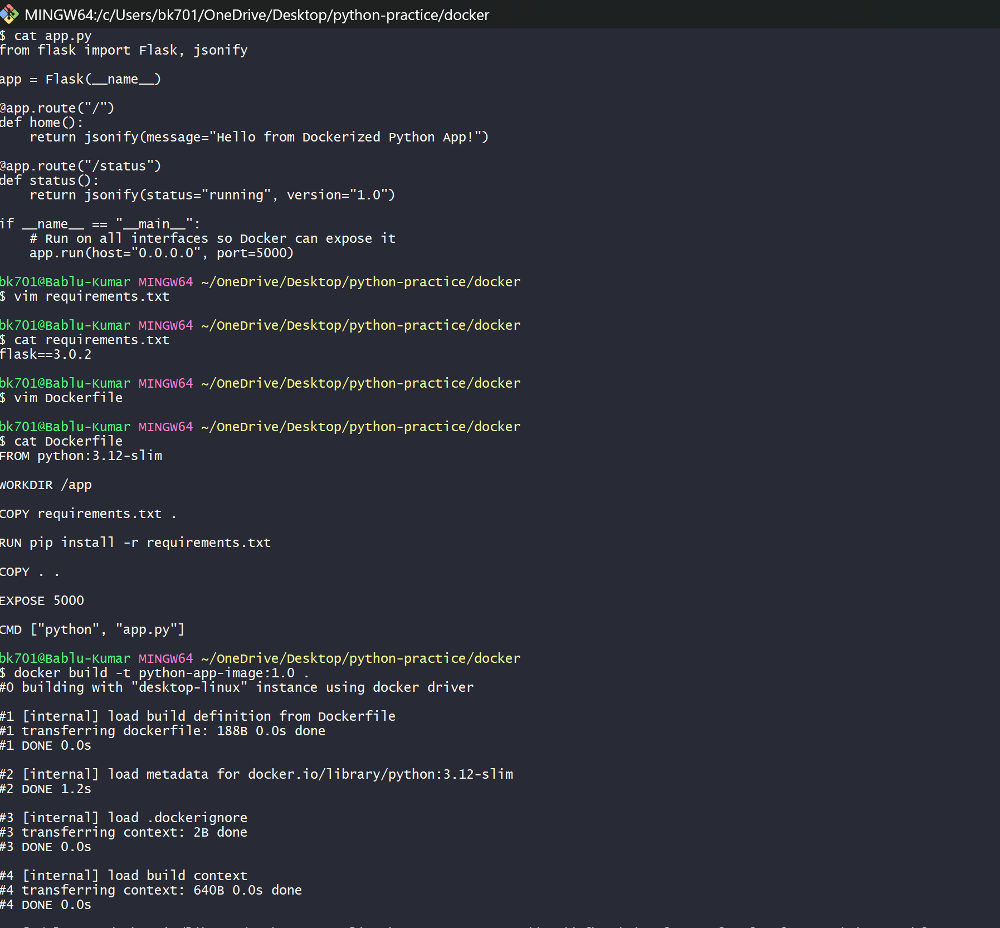

---

## Step 5 – Run Container

```bash
docker run -d -p 5000:5000 --name python-app-container python-app-image:1.0
```

---

## Step 6 – Check Running Containers

```bash
docker ps
```

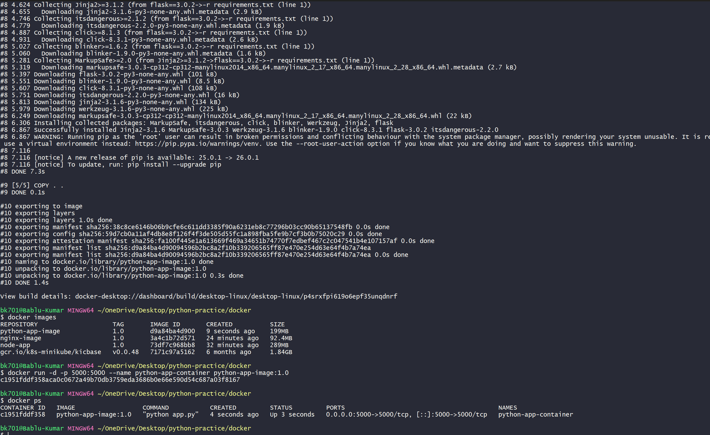

---

## Step 7 – Access Application

Open:

```
http://localhost:5000
```

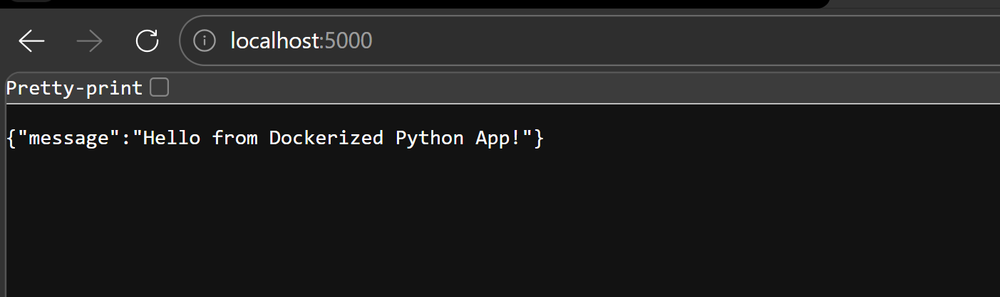

---

# Task 3 – Build a 3-Tier Application with Docker Compose

## Objective

Create a full **3-tier architecture**:

| Layer    | Technology |
| -------- | ---------- |
| Frontend | Nginx      |
| Backend  | Node.js    |
| Database | MySQL      |

---

# Architecture

```
Browser
   │
   ▼
Frontend (Nginx)
   │
   ▼
Backend (Node.js API)
   │
   ▼
Database (MySQL)
```

---

# Project Structure

```
3tier-docker-app
│
├── docker-compose.yml
│
├── backend
│   ├── Dockerfile
│   ├── package.json
│   └── server.js
│
├── frontend
│   ├── Dockerfile
│   └── index.html
│
└── mysql
    └── init.sql
```

---

# Backend – Node.js API

The backend provides APIs to:

* Add user
* Fetch users
* Delete user

Example routes:

```
POST   /add
GET    /users
DELETE /delete/:id
```

---

# Database – MySQL

The database contains a table:

```
users
```

Schema:

```sql
CREATE TABLE users (
id INT AUTO_INCREMENT PRIMARY KEY,
name VARCHAR(100)
);
```

---

# Docker Compose

`docker-compose.yml`

Services included:

* mysql
* node-backend
* nginx-frontend

Also uses:

* **Custom Bridge Network**
* **Named Volume for MySQL data**

---

# Run the 3-Tier Application

## Step 1 – Clone Repository

```bash
git clone https://github.com/your-username/your-repo-name.git
```

---

## Step 2 – Navigate to Project Folder

```bash
cd 3tier-docker-app
```

---

## Step 3 – Start Application

```bash
docker compose up -d --build
```

This will:

* Build frontend image
* Build backend image
* Start MySQL
* Create network
* Create named volume

---

## Step 4 – Verify Containers

```bash
docker ps
```

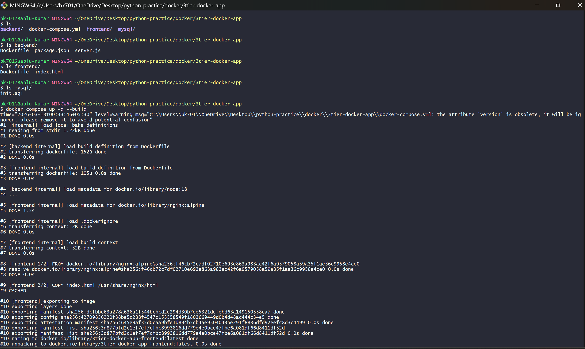
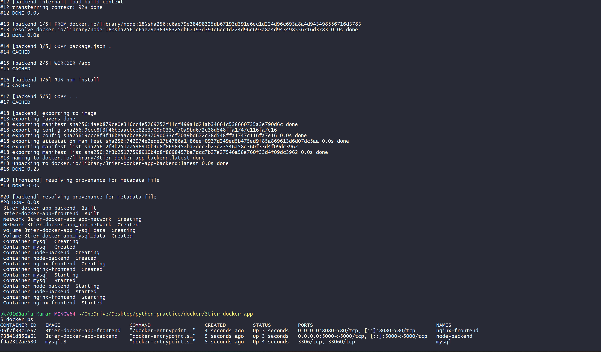

---

## Step 5 – Open Application

```
http://localhost:8080
```

User manager UI will appear.

---

## Step 6 – Add Users

Users can be added from the frontend.


---

## Step 7 – Verify Database

Enter MySQL container:

```bash
winpty docker exec -it mysql bash
```

Login:

```bash
mysql -u root -p
```

Check database:

```sql
USE appdb;
SELECT * FROM users;
```

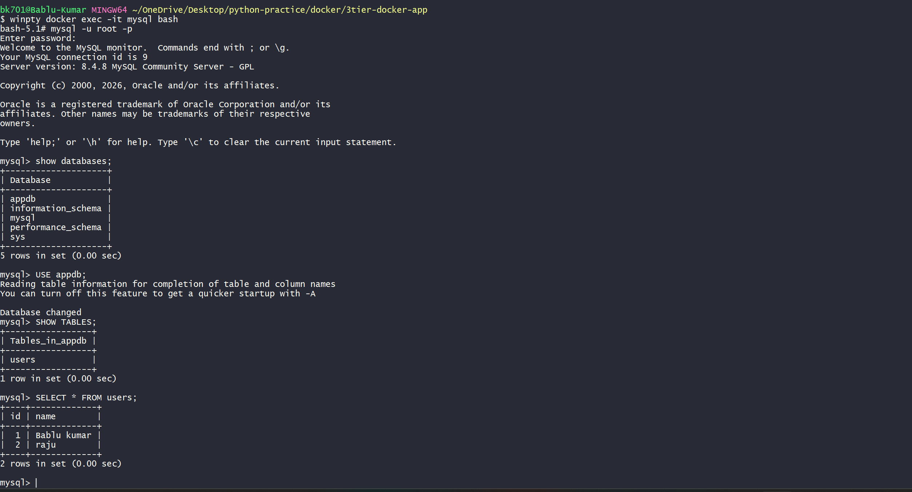

---

## Step 8 – Frontend Display

Inserted users will appear on the frontend.

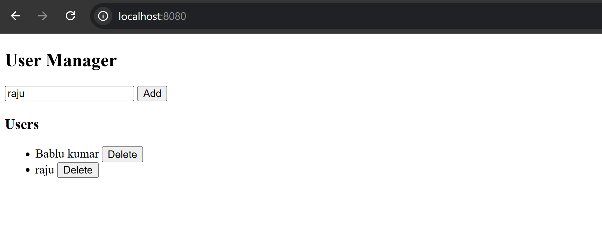


---


# - #############################################################################################


# – Pushing Docker Images to Docker Hub and GitHub Packages

After completing Task 1, Task 2, and Task 3, I also learned how to **push Docker images to Docker Hub and GitHub Container Registry**.

In this task I practiced how developers store Docker images online so that other people or servers can download and run them.

---

# What I Learned in This Task

In this task I learned:

* How to login to Docker Hub from terminal
* How to tag Docker images
* How to push images to Docker Hub
* How to login to GitHub Container Registry
* How to push Docker images to GitHub packages

This is useful because in real DevOps work we **store images in a registry and then deploy them to servers or Kubernetes**.

---

# Step 1 – Login to Docker Hub

First I logged in to Docker Hub from the terminal.

```bash
winpty docker login -u babludevops701
```

After entering my password the login was successful.

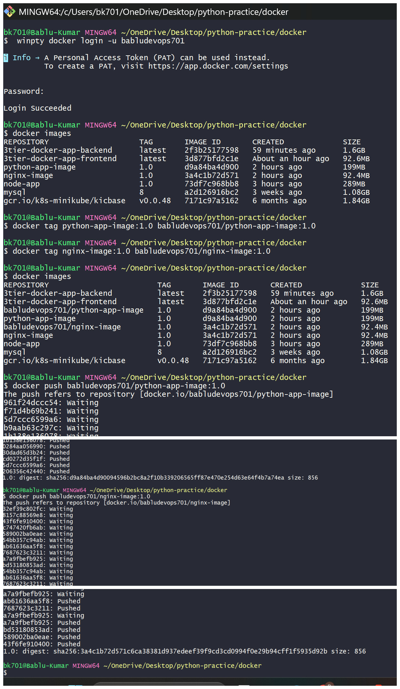

---

# Step 2 – Check Local Docker Images

Then I checked my images.

```bash
docker images
```

I saw my images like:

* nginx-image
* python-app-image
* 3tier-docker-app-backend
* 3tier-docker-app-frontend

---

# Step 3 – Tag Images for Docker Hub

Before pushing an image we must **tag it with our Docker Hub username**.

Example:

```bash
docker tag python-app-image:1.0 babludevops701/python-app-image:1.0
```

```bash
docker tag nginx-image:1.0 babludevops701/nginx-image:1.0
```

This tells Docker that the image belongs to my Docker Hub account.

---

# Step 4 – Push Images to Docker Hub

After tagging the images I pushed them to Docker Hub.

Example:

```bash
docker push babludevops701/python-app-image:1.0
```

```bash
docker push babludevops701/nginx-image:1.0
```

The terminal showed layers being uploaded.

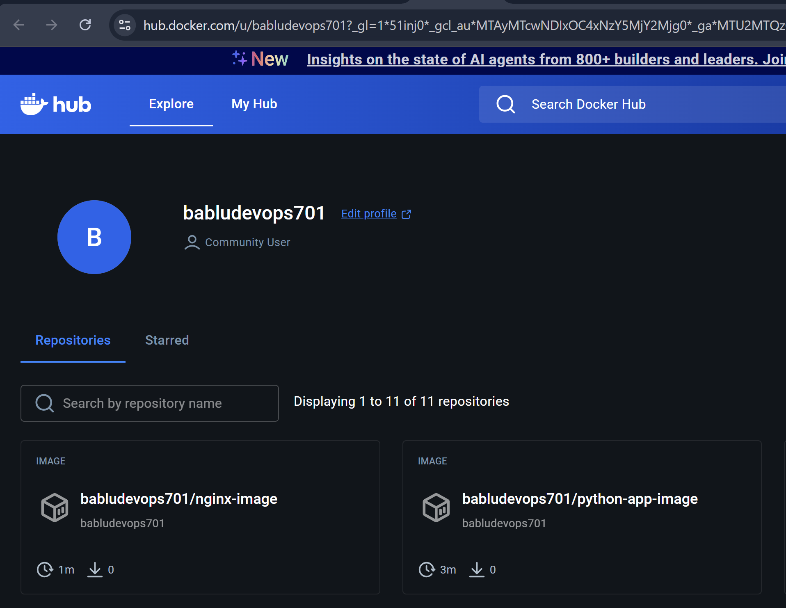

Then I checked Docker Hub and I could see my images there.

---

# Step 5 – Login to GitHub Container Registry

Next I also tried pushing images to GitHub Packages.

For this I logged in using GitHub credentials.

```bash
winpty docker login ghcr.io
```

Then I entered my GitHub username and token.

Login was successful.

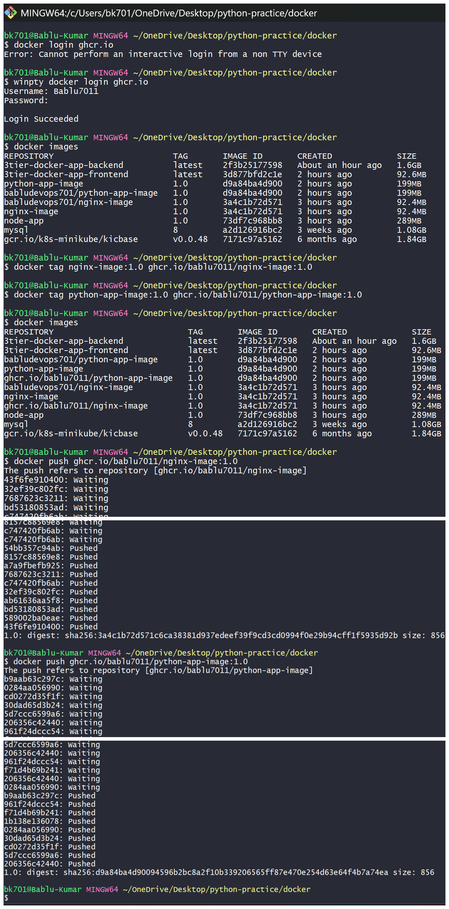

---

# Step 6 – Tag Images for GitHub Registry

GitHub registry uses this format:

```
ghcr.io/username/image-name
```

Example:

```bash
docker tag nginx-image:1.0 ghcr.io/bablu7011/nginx-image:1.0
```

```bash
docker tag python-app-image:1.0 ghcr.io/bablu7011/python-app-image:1.0
```

---

# Step 7 – Push Images to GitHub Packages

Then I pushed the images.

```bash
docker push ghcr.io/bablu7011/nginx-image:1.0
```

```bash
docker push ghcr.io/bablu7011/python-app-image:1.0
```

After pushing I checked GitHub Packages and I could see the images there.

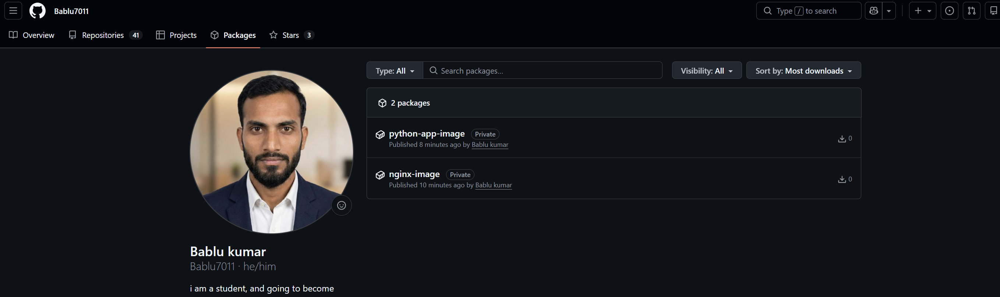

---

# Note About Task 3 Images

For **Task 3**, the backend and frontend images are quite large.

So I did **not push those images to Docker Hub or GitHub right now**.

The reason is:

* I am still learning Docker
* The backend image size is large
* Uploading big images takes time

In the future I plan to use **multi-stage builds** to reduce the image size.

After optimizing the images I will push:

* 3tier-backend
* 3tier-frontend

to Docker Hub and GitHub.

---


# - ############################################################################################

# What I Learned From These Tasks

While doing these tasks I learned many new things about Docker.
This was my first time working with Docker in a practical way.

First I learned **how to write a basic Dockerfile**.
I understood that a Dockerfile tells Docker **how to build an image step by step**.

For example:

* `FROM` tells Docker which base image to start from
* `COPY` copies our application code into the container
* `WORKDIR` sets the working directory
* `RUN` runs commands while building the image
* `EXPOSE` tells which port the app will run on
* `CMD` tells Docker how to start the application

I also learned **where the application code comes from**.
Docker takes the code from the **current folder where the Dockerfile is located**, and then copies it into the container while building the image.

After building the Dockerfile I learned **how Docker creates images**.

Images are like **a blueprint or template** for our application.

From that image we can create **containers**, which are running instances of the application.

Then I learned how to run containers using commands like:

```bash id="r9f3yq"
docker run
```

After running the container I could open the browser and see the application running using:

```id="m7q1tt"
http://localhost:PORT
```

This helped me understand **how applications run inside containers**.

---

# What I Learned in Task 3

In Task 3 I worked on a **3-tier application**.

The architecture was:

Frontend → Backend → Database

In this task I also learned about:

### Docker Networking

Containers can talk to each other using a **Docker network**.

For example:

* frontend container talks to backend
* backend container talks to mysql

Docker automatically creates a network so containers can communicate.

I am still learning more about networking and exploring how it works.

---

### Docker Volumes

I also learned about **Docker volumes**.

Volumes are used to store data **outside the container**.

This is useful because if the container stops or gets deleted, the data **will not be lost**.

In this project MySQL data is stored in a Docker volume.

I am still exploring more about volumes and trying to understand them better.

---

# My Docker Hub Images

I also learned how to **push Docker images to Docker Hub**.

Anyone can see my images here:

https://hub.docker.com/u/babludevops701

The images I pushed are:

* nginx-image
* python-app-image

Other people can download these images and run them on their own system.

---

# How Anyone Can Run My Images

If someone wants to run my images they can follow these steps.

### Step 1 – Pull the Image

Example for Nginx app:

```bash id="9z0hcd"
docker pull babludevops701/nginx-image:1.0
```

Example for Python app:

```bash id="2i5y7v"
docker pull babludevops701/python-app-image:1.0
```

---

### Step 2 – Run the Container

Run Nginx container:

```bash id="e71o7r"
docker run -d -p 8081:80 babludevops701/nginx-image:1.0
```

Run Python container:

```bash id="e2u5h6"
docker run -d -p 5000:5000 babludevops701/python-app-image:1.0
```

---

### Step 3 – Open in Browser

For Nginx app:

```id="z8b65h"
http://localhost:8081
```

For Python app:

```id="i4tw3x"
http://localhost:5000
```

Now the application should be visible in the browser.

---

# Final Note

These tasks helped me understand the **basic workflow of Docker**:

1. Write Dockerfile
2. Build image
3. Run container
4. Access application
5. Push image to registry

I am still learning Docker and exploring more features like:

* multi-stage builds
* image optimization
* container orchestration

But these tasks helped me build a strong foundation.
