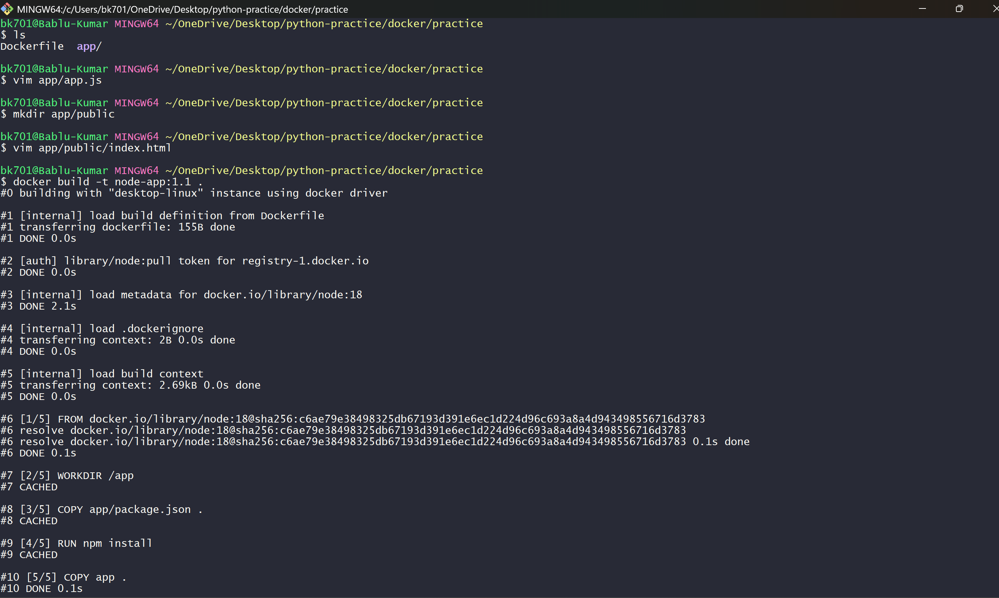
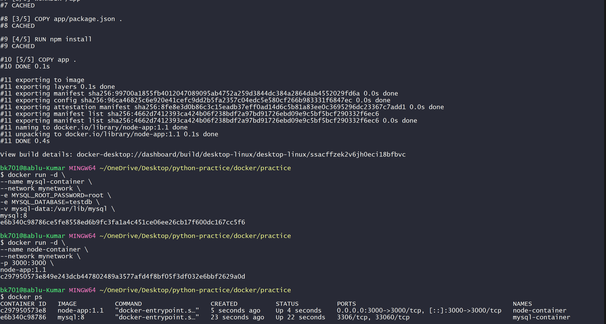
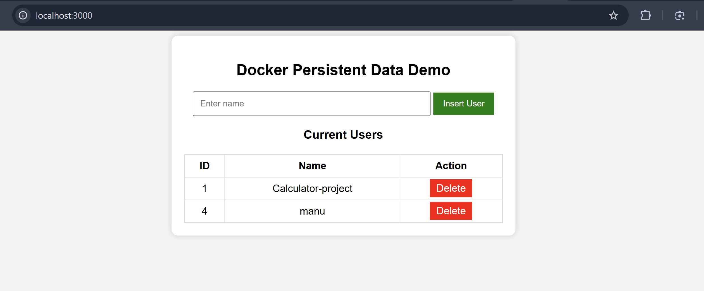
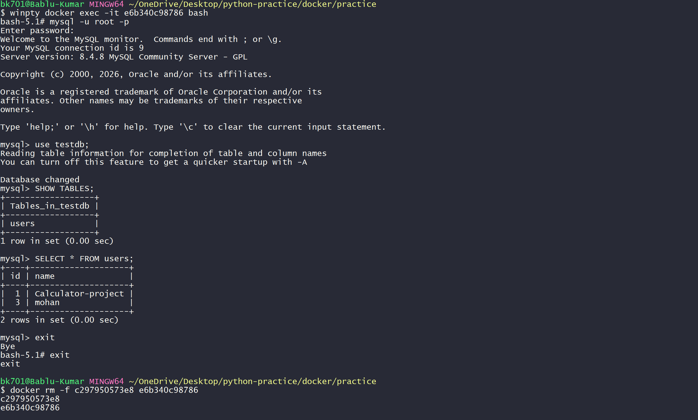
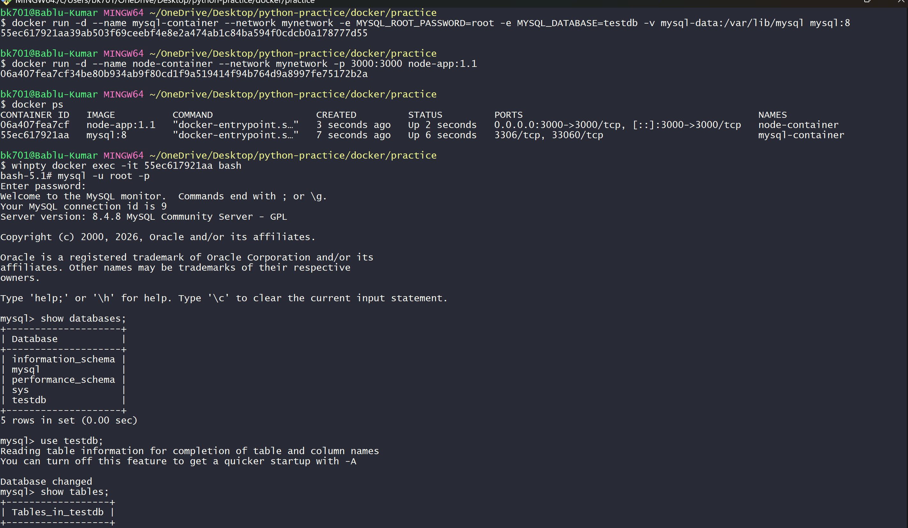
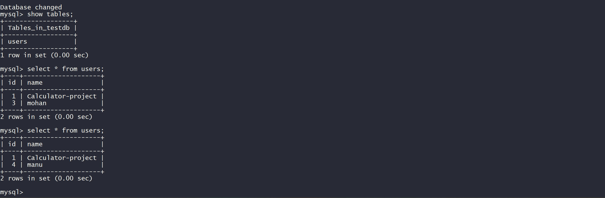
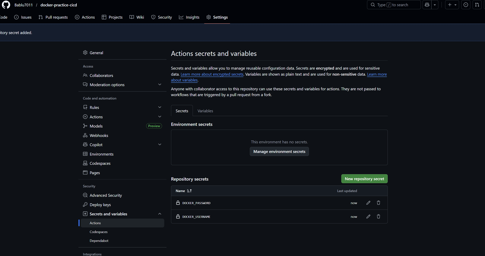
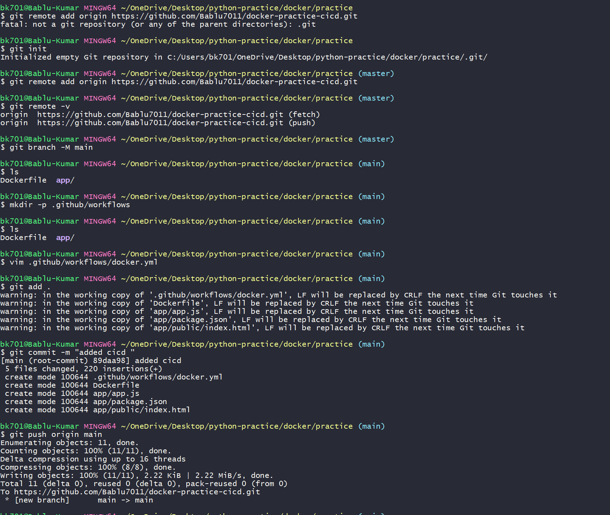
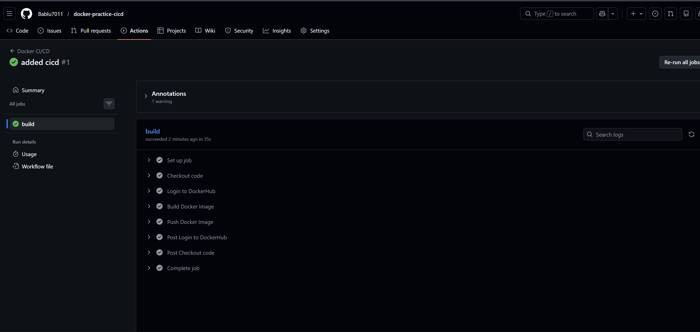
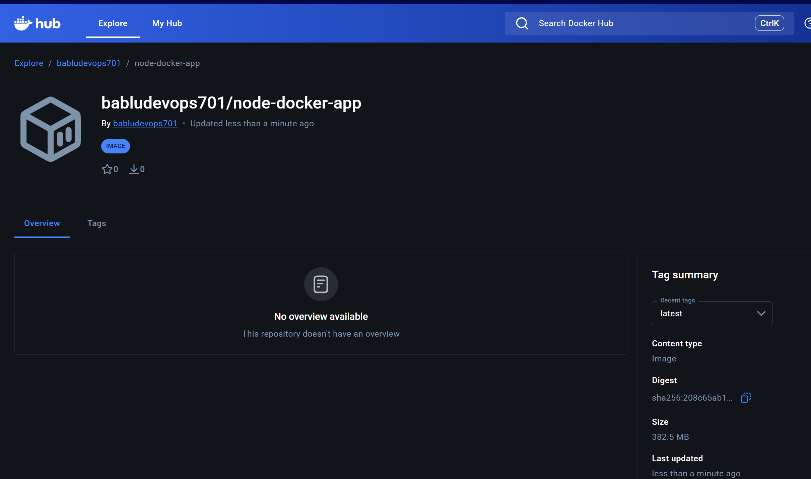

# Docker Networking, Volume & CI/CD Practice Project

This project is a **simple full-stack practice project** to understand how Docker works in real-world DevOps environments.

In this project we built:

- A **Node.js Web Application**
- A **MySQL Database**
- Docker **custom network**
- Docker **volume for persistent storage**
- **GitHub Actions CI/CD pipeline**
- Automatic **Docker image push to Docker Hub**

The application allows a user to:

- Insert a user
- Delete a user
- View users stored in MySQL database

---

# Project Architecture

```

User Browser
↓
Node.js Container
↓
Docker Network (mynetwork)
↓
MySQL Container
↓
Docker Volume (mysql-data)

````

This architecture demonstrates how **containers communicate and store persistent data**.

---

# Step 1 — Project Folder Setup

First we created a project folder.

```bash
mkdir docker-practice
cd docker-practice
````

Then we created the application folder.

```bash
mkdir app
```

Project structure:

```

docker-practice
│
├── app
│   ├── app.js
│   ├── package.json
│   └── public
│       └── index.html
│
├── Dockerfile
│
└── .github
└── workflows
└── docker.yml

```

---

# Step 2 — Node.js Application

We created a simple Node.js web server using **Express**.

File:

```

app/app.js

```

Main features of this application:

* Connects to MySQL
* Insert user
* Delete user
* Fetch users
* Serve frontend UI

Example code:

```javascript
const express = require("express");
const mysql = require("mysql2");
const path = require("path");

const app = express();

app.use(express.json());
app.use(express.urlencoded({ extended: true }));
app.use(express.static(path.join(__dirname, "public")));

const db = mysql.createConnection({
  host: "mysql-container",
  user: "root",
  password: "root",
  database: "testdb"
});

db.connect(err => {
  if (err) {
    console.log("Database connection failed", err);
  } else {
    console.log("Connected to MySQL");
  }
});

app.get("/users", (req,res)=>{
  db.query("SELECT * FROM users",(err,result)=>{
    res.json(result)
  })
})

app.post("/insert",(req,res)=>{
  const name = req.body.name
  db.query("INSERT INTO users(name) VALUES(?)",[name])
  res.redirect("/")
})

app.get("/delete/:id",(req,res)=>{
  const id = req.params.id
  db.query("DELETE FROM users WHERE id=?",[id])
  res.redirect("/")
})

app.listen(3000,()=>{
  console.log("Server running on port 3000")
})
```

---

# Step 3 — Web User Interface

We created a simple HTML page to:

* Insert user
* Display users
* Delete users

File:

```

app/public/index.html

```

Screenshot of UI:


The UI fetches data using:

```

/users

```

and dynamically displays data in a table.

---

# Step 4 — Dockerfile

We created a Dockerfile to containerize the Node.js application.

File:

```

Dockerfile

```

```dockerfile
FROM node:18

WORKDIR /app

COPY app/package.json .

RUN npm install

COPY app .

EXPOSE 3000

CMD ["node","app.js"]
```

This Dockerfile:

1. Pulls **Node.js image**
2. Sets working directory
3. Installs dependencies
4. Copies application code
5. Starts the Node server

Build process:



---

# Step 5 — Build Docker Image

We built the Docker image using:

```bash
docker build -t node-app:1.1 .
```

This created a Docker image for our application.

---

# Step 6 — Docker Network

We created a **custom Docker network** so containers can communicate.

```bash
docker network create mynetwork
```

Containers inside this network can talk to each other using **container names**.

Example:

```

node-container → mysql-container

```

---

# Step 7 — Docker Volume

We created a volume to store MySQL data.

```bash
docker volume create mysql-data
```

This volume stores database files **outside the container**.

Even if the container is deleted, **data remains safe**.

---

# Step 8 — Run MySQL Container

We started MySQL container with volume and network.

```bash
docker run -d \
--name mysql-container \
--network mynetwork \
-e MYSQL_ROOT_PASSWORD=root \
-e MYSQL_DATABASE=testdb \
-v mysql-data:/var/lib/mysql \
mysql:8
```

Screenshot:


---

# Step 9 — Run Node Container

Then we started the Node application container.

```bash
docker run -d \
--name node-container \
--network mynetwork \
-p 3000:3000 \
node-app:1.1
```

Screenshot:



Now we can open:

http://localhost:3000





---

# Step 10 — Check MySQL Data Inside Container

To verify database data we entered the container.

```bash
docker exec -it mysql-container bash
```

Then opened MySQL CLI:

```bash
mysql -u root -p
```

Commands used:

```sql
SHOW DATABASES;
USE testdb;
SHOW TABLES;
SELECT * FROM users;
```

Screenshot:



---

# Step 11 — Persistent Volume Test

We tested Docker volume persistence.

Steps:

Stop containers

```
docker rm -f node-container mysql-container
```

Start again using same volume.

Result:

The data **still existed**.

Screenshot:





This proves Docker volumes store **persistent data outside container lifecycle**.

---

# Step 12 — GitHub Repository Setup

We initialized git repository.

```bash
git init
git remote add origin https://github.com/Bablu7011/docker-practice-cicd.git
git branch -M main
```

Then pushed code.

```bash
git add .
git commit -m "added cicd"
git push origin main
```

Screenshot:


---

# Step 13 — GitHub Secrets

We added Docker Hub credentials in GitHub repository secrets.

```

DOCKER_USERNAME
DOCKER_PASSWORD

```

Screenshot:




---

# Step 14 — GitHub Actions CI/CD

Workflow file:

```

.github/workflows/docker.yml

```

Pipeline automatically runs when code is pushed.

```yaml
name: Docker CI/CD

on:
  push:
    branches:
      - main

jobs:

  build:

    runs-on: ubuntu-latest

    steps:

    - uses: actions/checkout@v3

    - name: Login to DockerHub
      uses: docker/login-action@v2
      with:
        username: ${{ secrets.DOCKER_USERNAME }}
        password: ${{ secrets.DOCKER_PASSWORD }}

    - name: Build Image
      run: docker build -t ${{ secrets.DOCKER_USERNAME }}/node-docker-app:latest .

    - name: Push Image
      run: docker push ${{ secrets.DOCKER_USERNAME }}/node-docker-app:latest
```

---

# Step 15 — GitHub Actions Pipeline

After pushing code, GitHub automatically triggered CI/CD pipeline.

Pipeline steps:

1. Checkout Code
2. Login to DockerHub
3. Build Docker Image
4. Push Docker Image

Screenshot:



---

# Step 16 — Docker Hub Image

After pipeline completed, image was pushed to Docker Hub.

Repository:

```

babludevops701/node-docker-app

```

Screenshot:



---

# What I Learned

### Docker Networking

* Containers inside same network can communicate
* They use **container name as hostname**
* Example

```

node-container → mysql-container

```

Docker automatically provides **DNS resolution**.

---

### Docker Volumes

Docker volumes store data **outside container filesystem**.

Binding example:

```

mysql-data → /var/lib/mysql

```

Benefits:

* Data persists after container deletion
* Safe database storage
* Used in production environments

---

### GitHub Actions CI/CD

I learned how to create a **CI/CD pipeline using GitHub Actions**.

Pipeline flow:

```

Developer pushes code
↓
GitHub Repository
↓
GitHub Actions Pipeline
↓
Build Docker Image
↓
Push Image to Docker Hub

```

Now whenever code is pushed:

* New Docker image is automatically built
* Latest image is pushed to Docker Hub


---

# Conclusion

This project helped understand core DevOps concepts:

* Containerization
* Docker networking
* Persistent storage with volumes
* Container communication
* CI/CD automation using GitHub Actions
* Docker image registry (Docker Hub)


