# 🐳 Docker Networking & 3-Tier Application Practice

This repository contains my **Docker learning practice**, including:

* Docker Networking concepts (bridge, host, none, custom network)
* Running multiple containers and testing communication
* Building a **3-tier MERN application using Docker**
* Writing Dockerfiles manually after understanding a real project

---

# 📌 Task 1: Docker Networking

## 🔹 Default Bridge Network

* Containers run on the default bridge network
* Communication using container names **does NOT work by default**

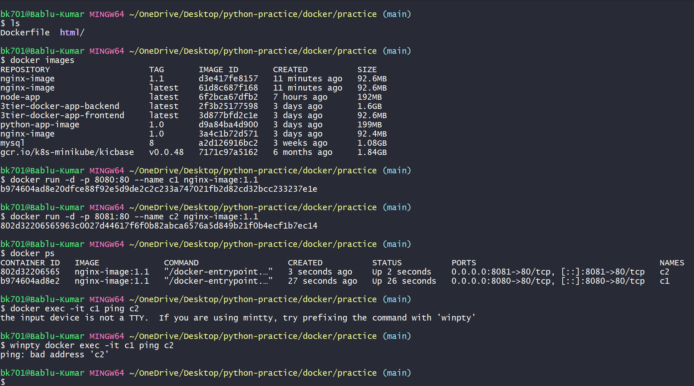

---

## 🔹 Custom Bridge Network

* Created a custom network:

```bash
docker network create network1
```

* Containers can communicate using **container names**

Example:

```bash
docker exec -it c1 ping c2
```

✅ Successful communication between containers

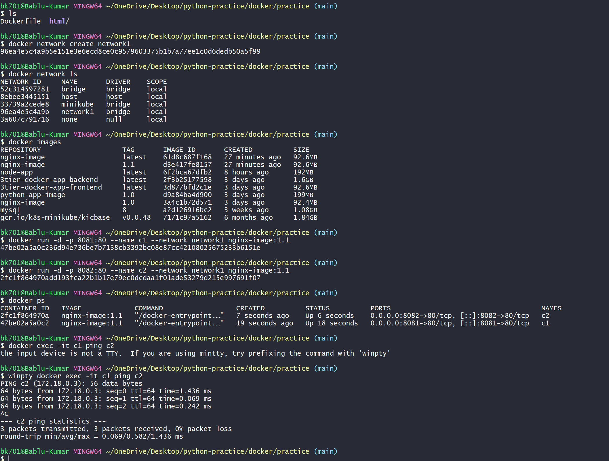

---

## 🔹 Host Network

* Container shares host network
* No port mapping required

```bash
docker run -d --network host nginx-image
```

* Access directly:

```bash
curl http://localhost
```

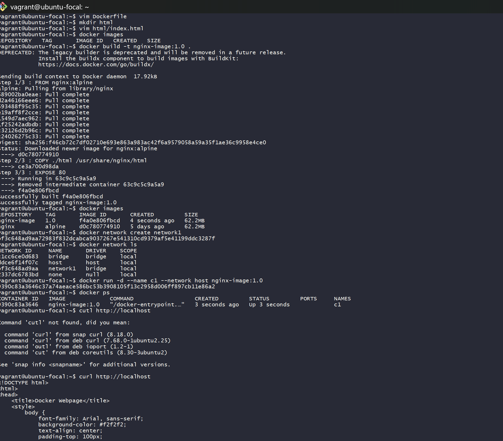

---

## 🔹 None Network

* Container has no network access
* Only loopback interface available

```bash
docker run -d --network none nginx-image
```

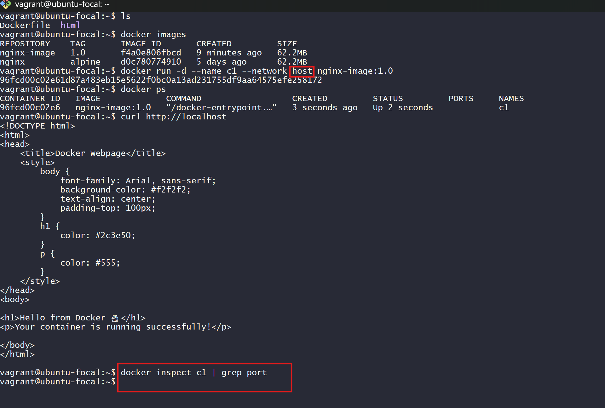

---

# 📌 Task 2: 3-Tier Application (MERN Stack)

## 🔹 Project Overview

* Forked a GitHub project (Food Delivery App)
* Understood:

  * Project README
  * Backend & frontend `package.json`
* Wrote **Dockerfiles manually**

---

## 🔹 Application Architecture

```text
Frontend (React)
        ↓
Backend (Node.js API)
        ↓
Database (MongoDB)
```

---

## 🔹 Changes Made

Updated frontend API URL:

```javascript
frontend/src/context/StoreContext.jsx

const url = "http://backend-app:4000";
```

This allows frontend container to communicate with backend container using Docker network.

---

## 🔹 Containers Setup

### 1️⃣ MongoDB

```bash
docker run -d \
--name mongo-container \
--network food-network \
-p 27017:27017 \
mongo
```

---

### 2️⃣ Backend

```bash
docker run -d \
--name backend-app \
--network food-network \
-p 4000:4000 \
-e MONGO_URL=mongodb://mongo-container:27017/food \
backend-food
```

---

### 3️⃣ Frontend

```bash
docker run -d \
--name frontend-app \
--network food-network \
-p 5173:5173 \
frontend-food
```

---

## 🔹 Application Output

### Frontend Running

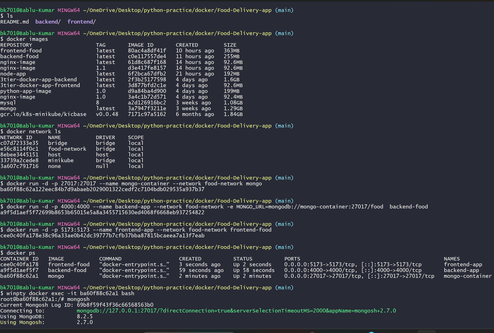

---

### Backend API Working

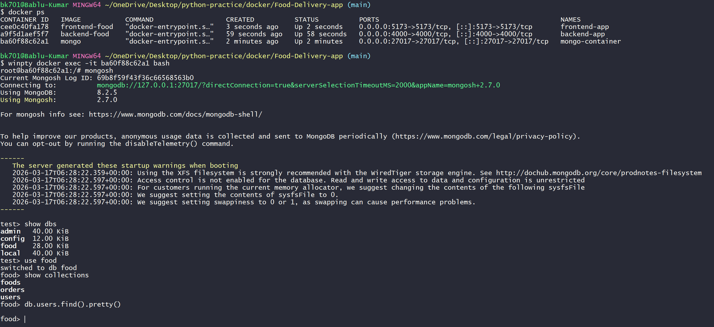

---

### MongoDB Setup & Connection

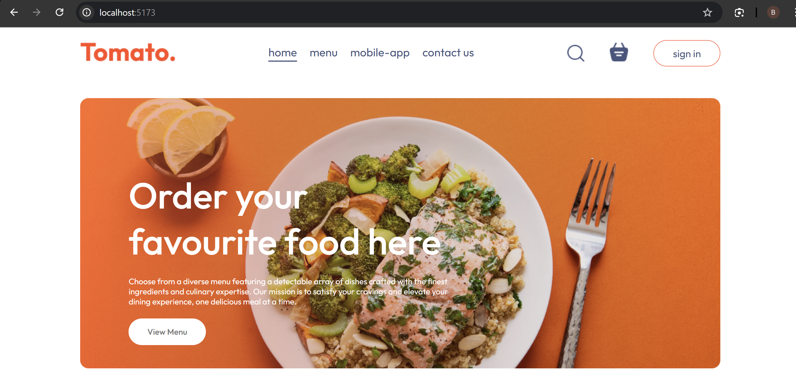

---

### Docker Containers Running

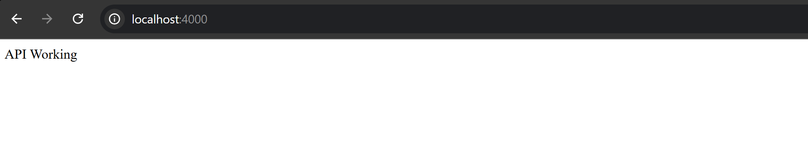

---

# ⚠️ Current Issue

* Signup data is getting stored in MongoDB ✅
* But **login is not working properly**
* Issue likely due to:

  * API communication mismatch
  * Authentication flow (JWT)

🔧 Currently working on fixing this issue

=======
# 🐳 Docker Practice Manual (Volumes & Networking)

This is my Docker practice.  
I learned how data is saved and how containers talk to each other.

---

# 🧪 Practice 1: Volume (Data Save)

## Step 1: Create Volume
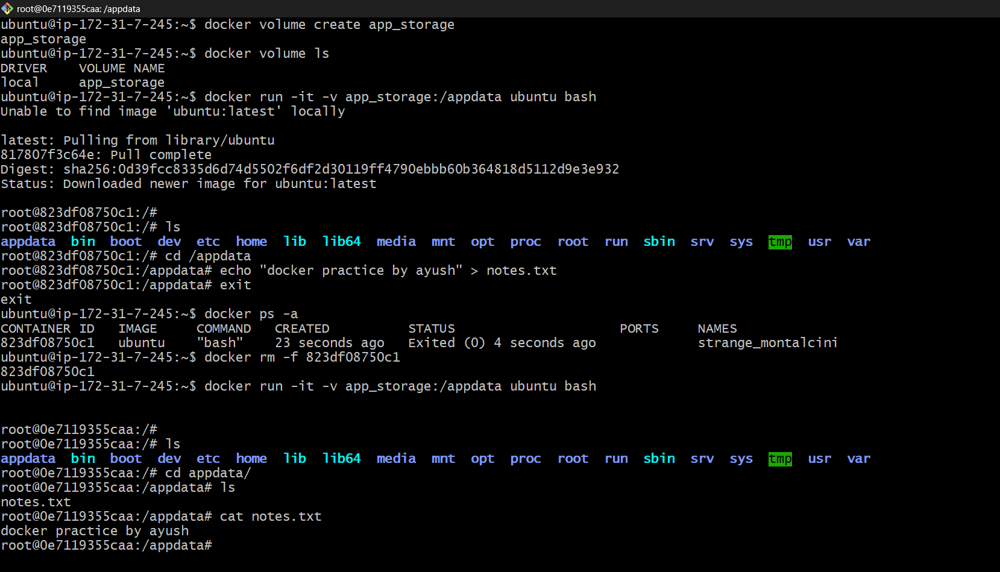

👉 I created a volume named `app_storage`

## Step 2: Use Volume in Container
👉 I ran ubuntu container and attached volume

## Step 3: Add Data
👉 I created a file `notes.txt`

## Step 4: Check Data Again
👉 After deleting container, data was still there ✅

### 🧠 Understanding (Simple)
Container is temporary ❌  
Volume is permanent ✅  
So data is safe in volume

---

# 🧪 Practice 2: Bind Mount (Live Sync)

## Step 1: Create HTML File
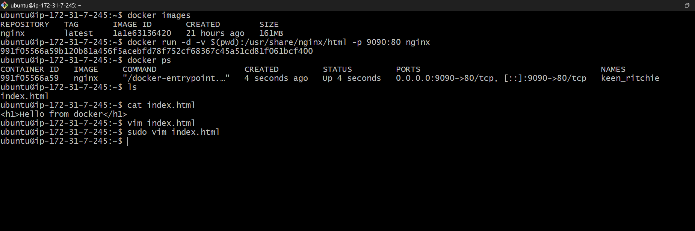

👉 I created `index.html`

## Step 2: Run Nginx with Bind Mount
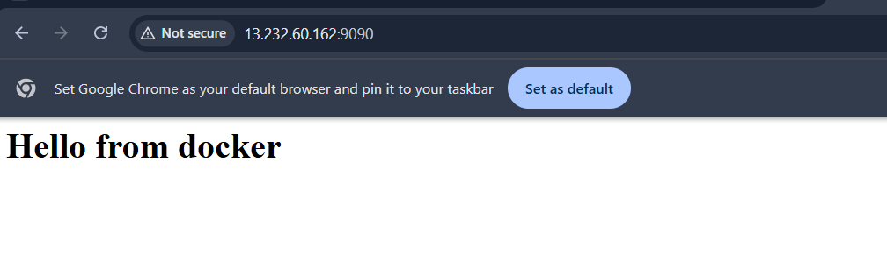

👉 Connected my folder with container

## Step 3: Open in Browser
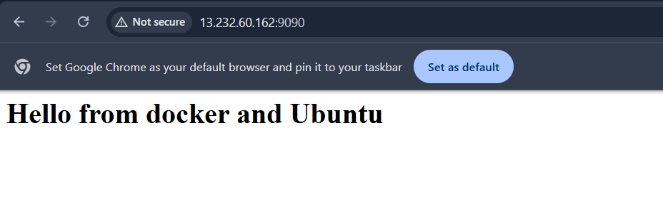

👉 Website is running on port 9090

## Step 4: Update File
👉 When I changed HTML → website updated instantly ✅

### 🧠 Understanding
Host folder ↔ Container folder  
Both are connected like mirror 🪞

---

# 🧪 Practice 3: MySQL + Volume (Database Save)

## Step 1: Run MySQL Container
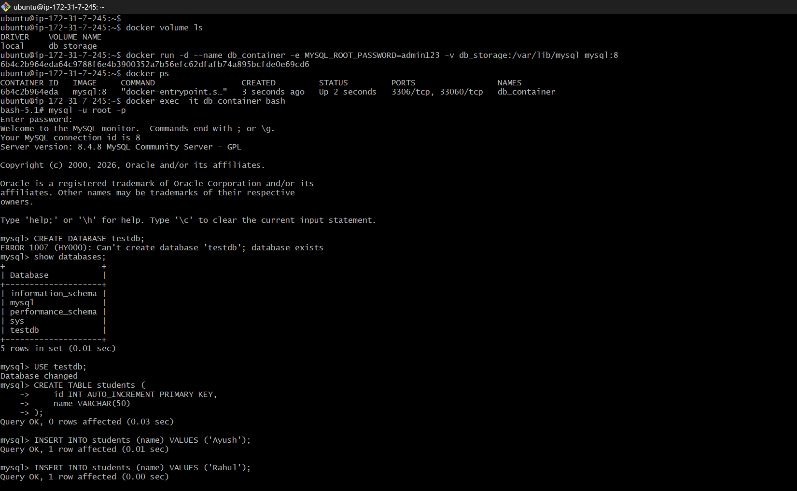

👉 Used volume `db_storage`

## Step 2: Add Data in MySQL
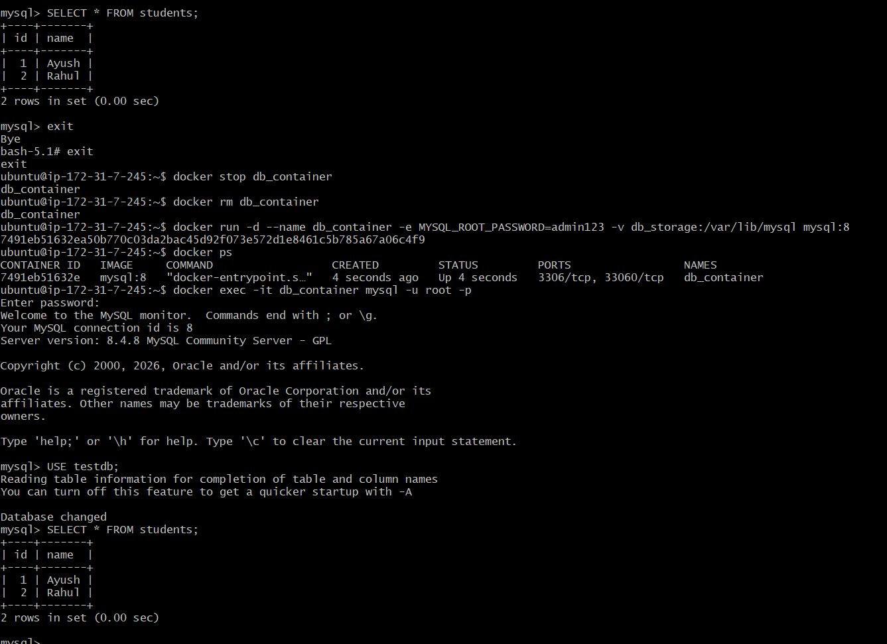

👉 Created database, table, and inserted data

## Step 3: Delete & Run Again
👉 Container removed and started again

## Step 4: Check Data
👉 Data still exists ✅

### 🧠 Understanding
Database data stored in volume  
So container delete ≠ data delete

---

# 🧪 Practice 4: Docker Networking

## Step 1: Create Network
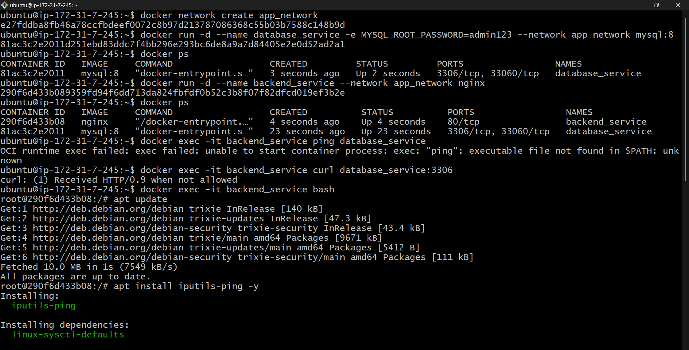

👉 Created `app_network`

## Step 2: Run Containers in Same Network
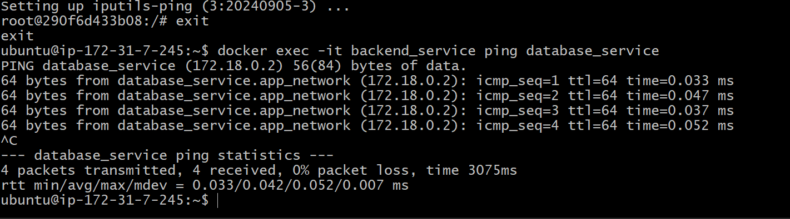

👉 MySQL + Nginx running

## Step 3: Test Connection
👉 Ping worked between containers ✅

### 🧠 Understanding
Containers talk using names  
No need of IP address


