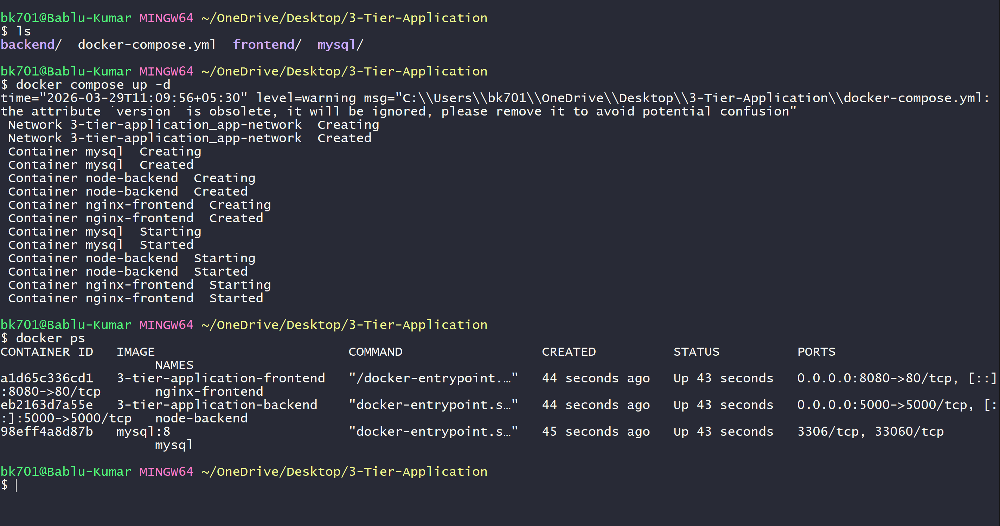
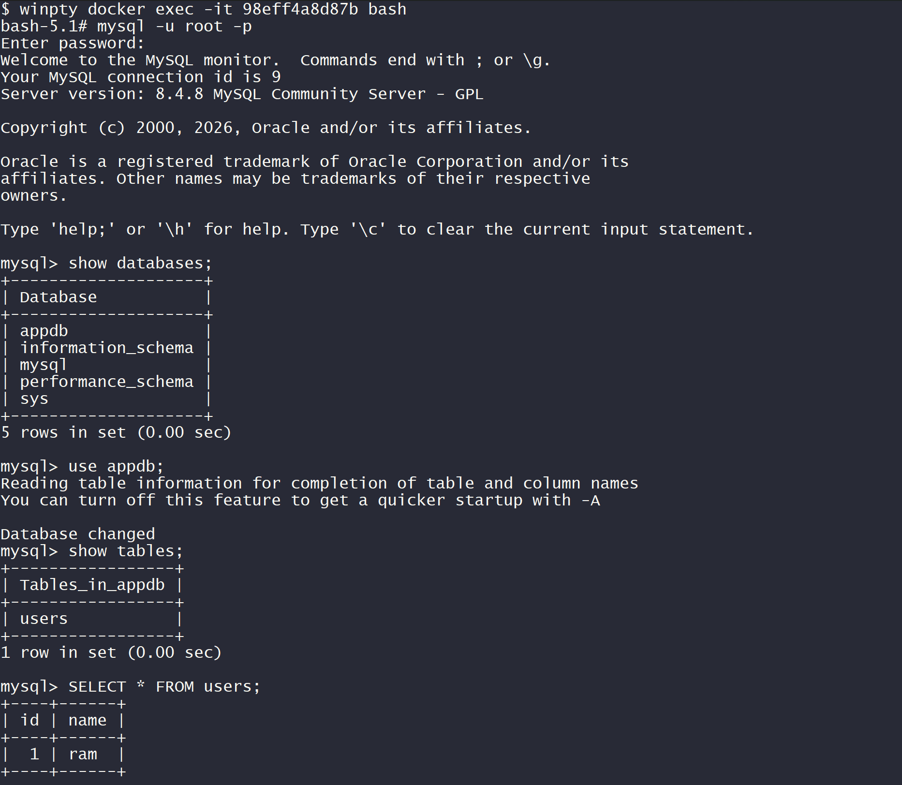
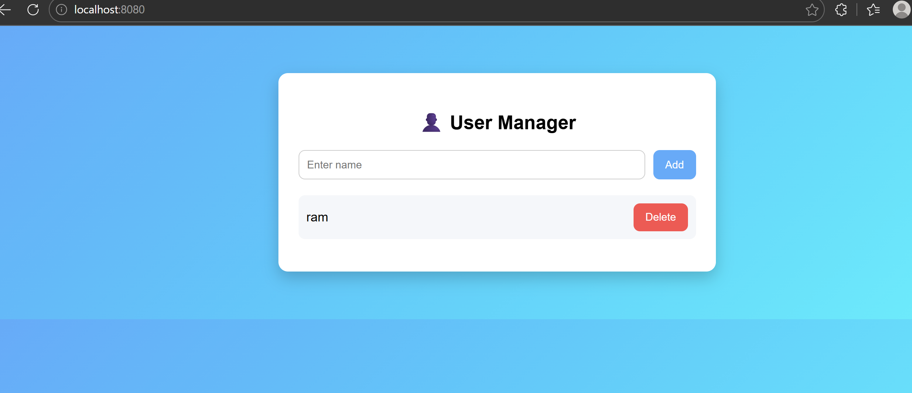

# 🚀 3-Tier Application using Docker

This project demonstrates a **3-Tier Architecture** application using **Docker Compose**, consisting of:

- 🌐 Frontend (Nginx + HTML/CSS/JS)
- ⚙️ Backend (Node.js)
- 🗄️ Database (MySQL)

---

## 🏗️ Architecture

```

User → Frontend (Nginx) → Backend (Node.js API) → MySQL Database

```

---

## 📂 Project Structure

```

3-Tier-Application/
│── backend/
│── frontend/
│── mysql/
│── docker-compose.yml

````

---

## ⚙️ Technologies Used

- Docker & Docker Compose
- Node.js (Express)
- MySQL
- Nginx
- HTML, CSS, JavaScript

---

## 🚀 How to Run the Project

### 🔹 Step 1: Clone the repository

```bash
git clone <your-repo-link>
cd 3-Tier-Application
````

---

### 🔹 Step 2: Start containers

```bash
docker compose up -d --build
```

📸 Output:


---

### 🔹 Step 3: Verify running containers

```bash
docker ps
```

📸 Output:


---

### 🔹 Step 4: Access Application

Open browser:

```
http://localhost:8080
```

📸 UI Output:


---

## 🧪 Database Verification

### 🔹 Access MySQL container

```bash
docker exec -it mysql bash
mysql -u root -p
```

### 🔹 Run queries

```sql
show databases;
use appdb;
show tables;
select * from users;
```

📸 Output:


---

## 🔄 Features

* ➕ Add User
* ❌ Delete User
* 📄 Fetch Users
* 💾 Data stored in MySQL volume

---

## 📦 Docker Services

### 1️⃣ MySQL

* Stores application data
* Uses volume: `mysql_data`

### 2️⃣ Backend

* Node.js API
* Runs on port `5000`

### 3️⃣ Frontend

* Nginx serving static UI
* Runs on port `8080`

---

## 🔐 Volumes & Network

* Volume: `mysql_data` (for persistent DB storage)
* Network: `app-network` (for container communication)

---

## 🧹 Stop & Clean Project

```bash
docker compose down -v
```

---

