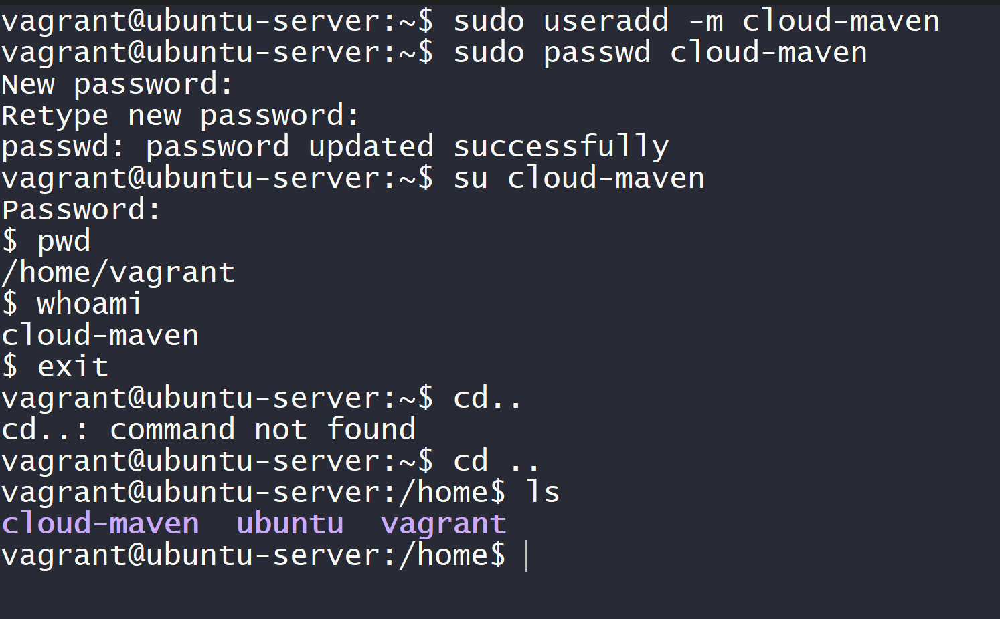

# Training Session - Cloud Maven (Linux Day 1)

This repository contains hands-on practice of Linux fundamentals including:

- User Management

- File Permissions

- Process Management

- Vim Editor Practice

# Environment Setup (Vagrant + VirtualBox)

---> Command Used:

-->vagrant up

👉 Starts the virtual machine using VirtualBox.

-->vagrant ssh

👉 Connects to the Ubuntu VM using SSH.

Lab 1 – User Management

--> Create a User

sudo useradd -m cloud-maven

-> useradd → Creates a new user

-> -m → Creates home directory /home/cloud-maven

--> Set Password

sudo passwd cloud-maven

Sets password for the new user

--> Switch User

su - cloud-maven

Switches to the new user

- loads full environment

--> Verify

whoami

pwd

->whoami → Shows current logged-in user

->pwd → Shows current directory

Lab 1 Screenshots

Lab 2 – File Permissions \& Ownership

--> Create File

touch test.txt

Creates an empty file.

--> Check Permissions

->ls -l

Shows file permissions in long format.

--> Change Permission

chmod 400 test.txt

Permission Breakdown:

4 → Read

0 → No permission

0 → No permission

Meaning:

Only owner can read the file.

--> Change Ownership

sudo chown cloud-maven test.txt

Changes file owner to cloud-maven.

--> Test Access

cat test.txt

Shows permission denied if not owner.

-->Lab 2 Screenshots

Lab 3 – Process Management

--> Run Process in Background

sleep 100 &

sleep 100 → Runs for 100 seconds

-> & → Runs in background

--> Check Running Processes

ps

Shows active processes and PID.

--> Kill Process

kill <PID>

Stops the process using Process ID.

Lab 3 Screenshot

Lab 4 – Vim Editor Practice

--> Create & Open File

vim hello.txt

--> Insert Mode

Press:

i

Start typing text.

--> Save & Exit

:wq

-> :w → Save

-> :q → Quit

--> Verify Content

cat hello.txt

Displays file content.

Lab 4 Screenshots

