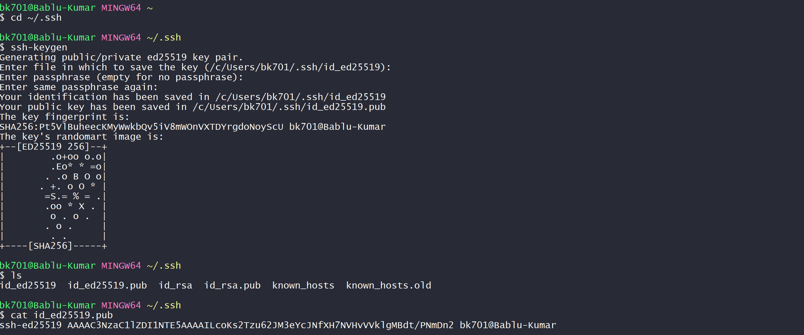
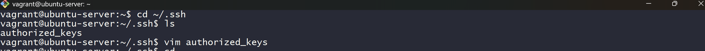
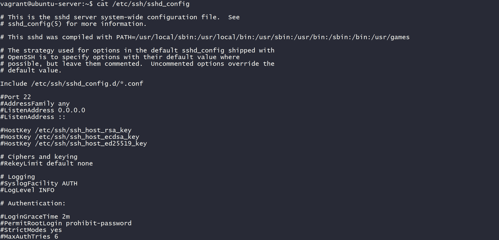
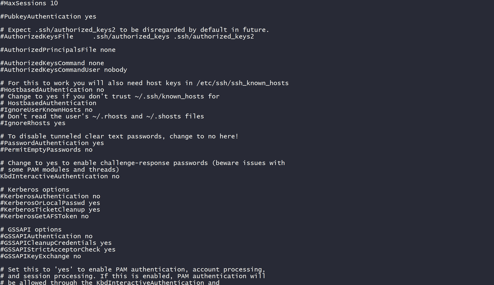
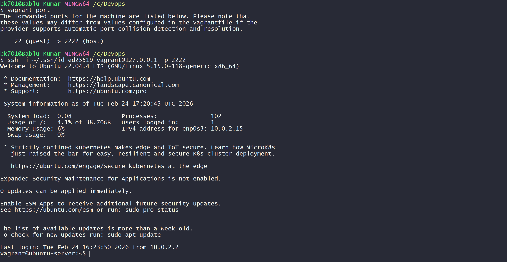
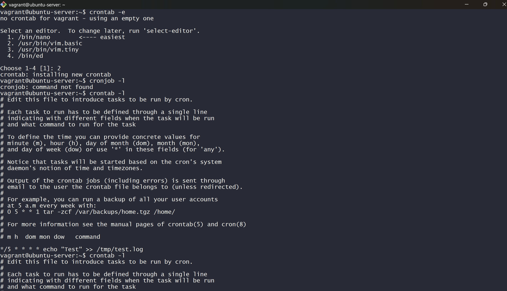
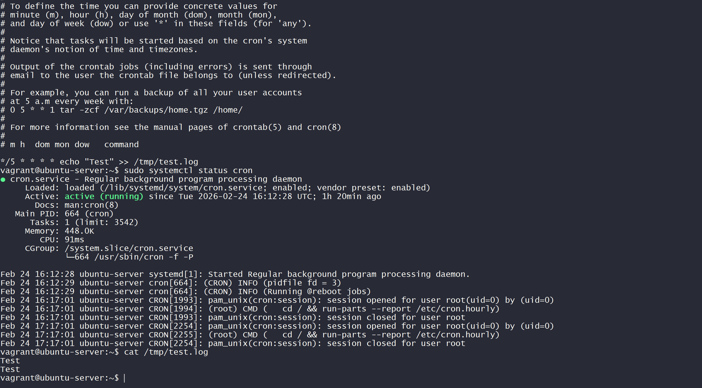
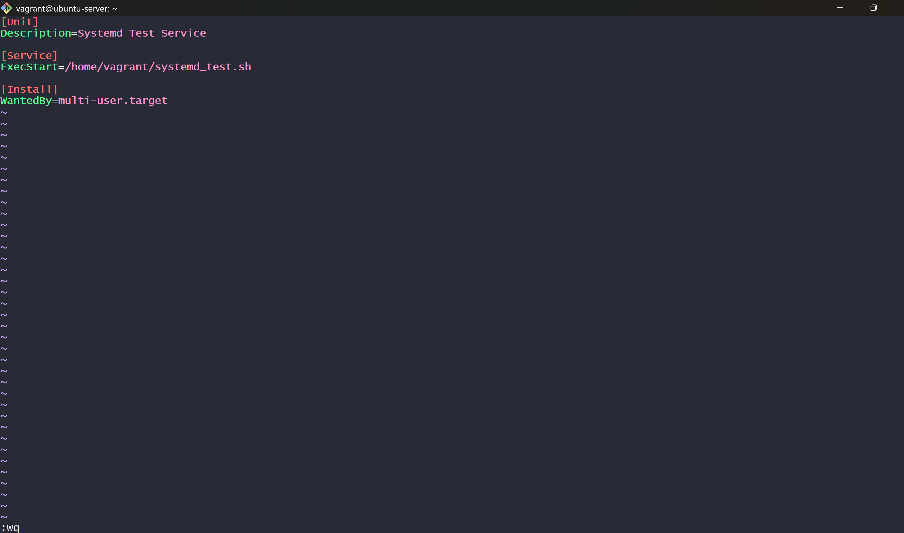
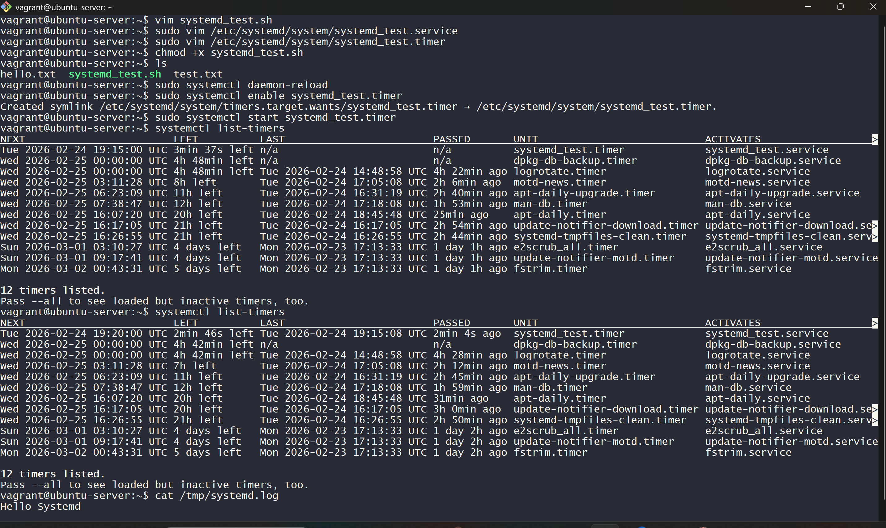
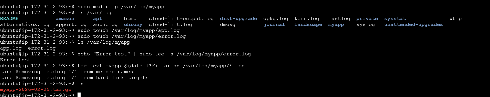

-->Lab 1 – SSH Key-Based Authentication
Step 1 – Generate SSH Key
    cd ~/.ssh
    ssh-keygen

This generates:

    ->Private key → id_ed25519

    ->Public key → id_ed25519.pub

Step 2 – Verify Generated Keys
    ls
    cat id_ed25519.pub

    ->ls → shows generated keys

    ->cat → displays public key content

    

    

Step 3 – Add Public Key to Server
    cd ~/.ssh
    vim authorized_keys

    ->Public key is added to authorized_keys

    ->This allows passwordless login

    

Step 4 – Verify SSH Configuration
    cat /etc/ssh/sshd_config

    ->Checked SSH server configuration

    ->Verified authentication settings

Step 5 – Confirm Password Authentication Disabled
    sudo sshd -T | grep passwordauthentication

    ->Confirmed passwordauthentication no

    ->Ensures secure key-based login only
    

    

Lab 2 – Cron Job Scheduling
Step 1 – Open Crontab Editor
    crontab -e

    ->Creates user cron job file.

Step 2 – Add Cron Job
    */5 * * * * echo "Test" >> /tmp/test.log

Explanation:

    ->*/5 → every 5 minutes

    ->* * * * → every hour, day, month

    ->Appends "Test" into /tmp/test.log
    

Step 3 – Verify Cron Service
    sudo systemctl status cron

    ->Confirmed cron service is active and running

Step 4 – Check Log File
    cat /tmp/test.log

    ->Verified cron executed successfully

Lab 3 – systemd Service & Timer
Step 1 – Create Script
    vim systemd_test.sh

    ->Script content:

    #!/bin/bash
    echo "Hello Systemd" >> /tmp/systemd.log

    ->Makes the script write to a log file.

    

Step 2 – Make Script Executable
    chmod +x systemd_test.sh

    ->Gives execution permission.

Step 3 – Create systemd Service File
    sudo vim /etc/systemd/system/systemd_test.service

    ->Content:

    [Unit]
    Description=Systemd Test Service

    [Service]
    ExecStart=/home/vagrant/systemd_test.sh

    [Install]
    WantedBy=multi-user.target

    ->Defines WHAT to run.

Step 4 – Create systemd Timer File
    sudo vim /etc/systemd/system/systemd_test.timer

->Content:

    [Unit]
    Description=Run Systemd Test Every 5 Minutes

    [Timer]
    OnCalendar=*:0/5

    [Install]
    WantedBy=timers.target

    ->Defines WHEN to run (every 5 minutes).

Step 5 – Reload systemd
    sudo systemctl daemon-reload

    ->Reloads new service and timer files.

Step 6 – Enable and Start Timer
    sudo systemctl enable systemd_test.timer
    sudo systemctl start systemd_test.timer

    ->Enables timer at boot

    ->Starts timer immediately

Step 7 – Verify Timer
    systemctl list-timers

    ->Shows next scheduled execution time.

Step 8 – Check Output Log
    cat /tmp/systemd.log

Confirms systemd timer executed successfully.

HomeWork:-
Write a bash one-liner to:-
