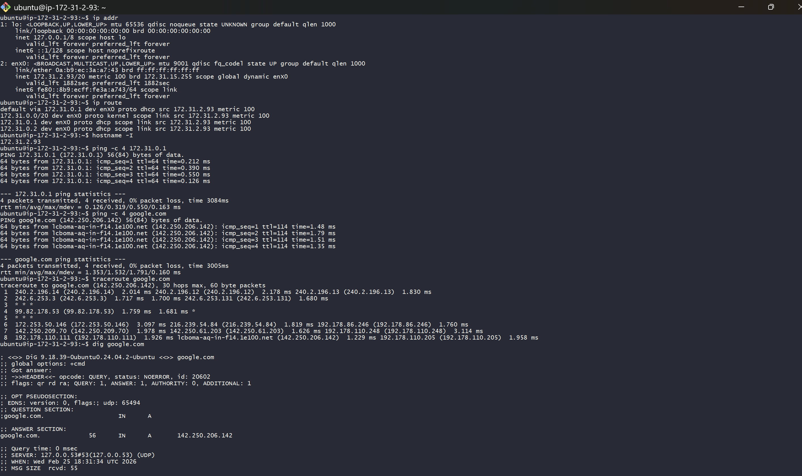
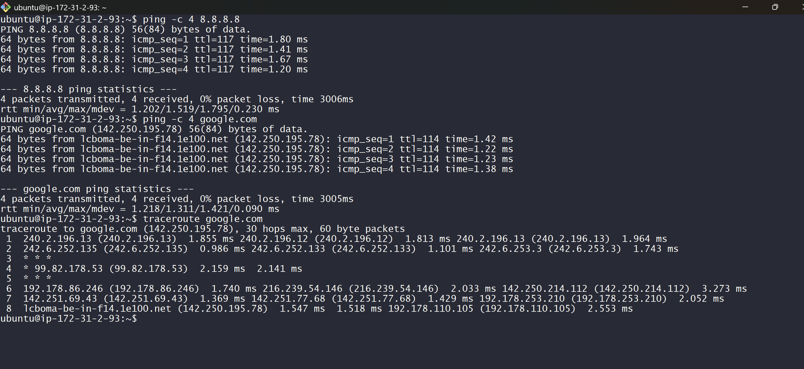
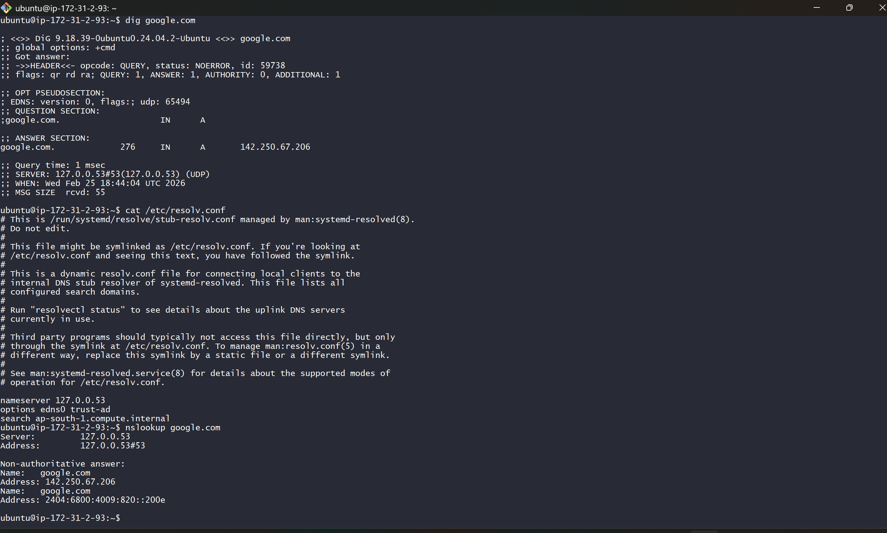
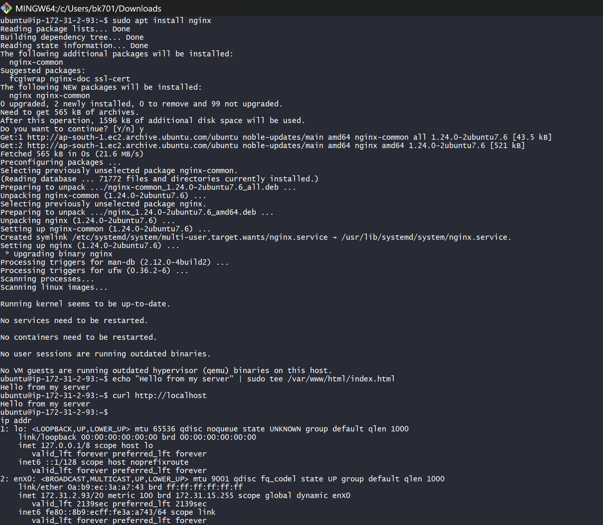
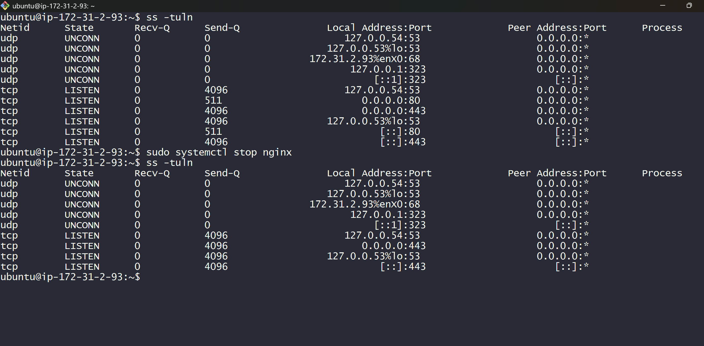
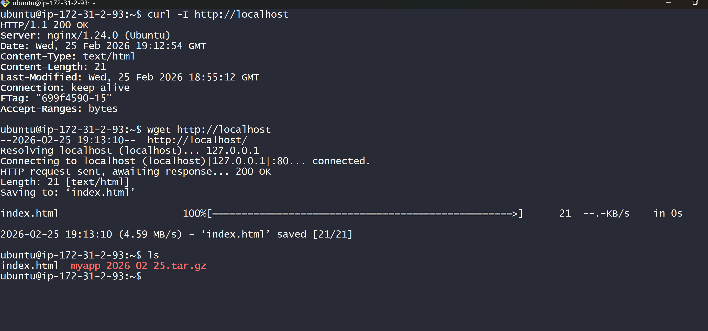
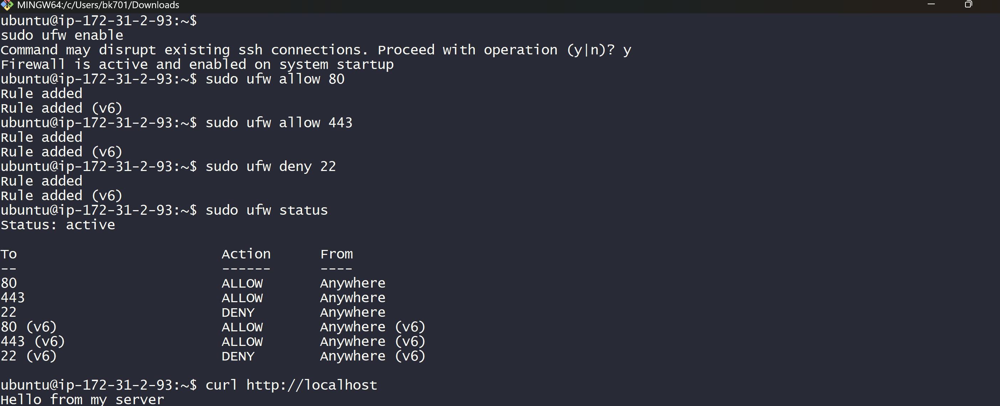
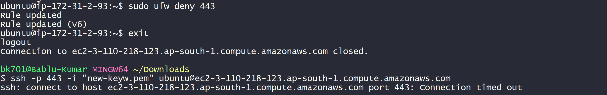
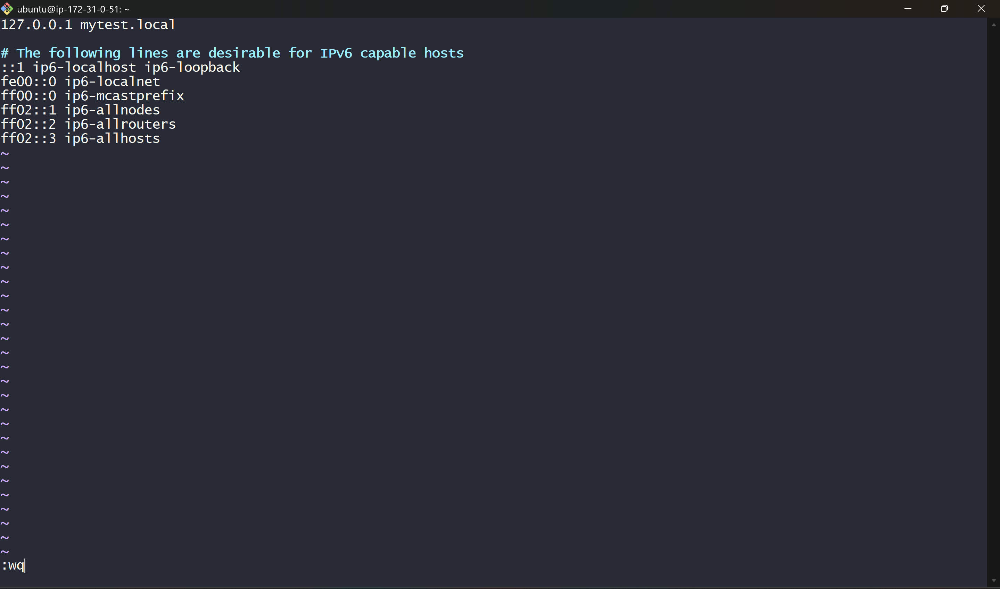
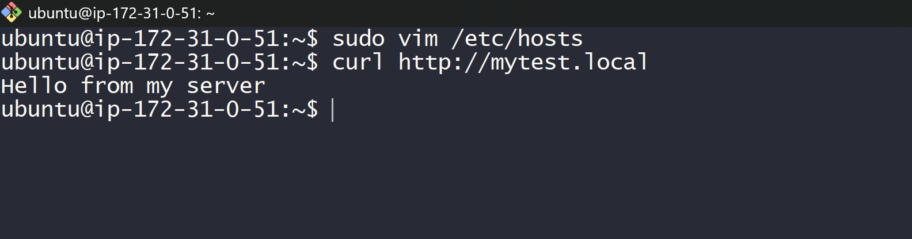

#  Day 3 – Linux Networking & Web Server Lab

This lab covers:

* Network Identity
* Routing
* Internet Connectivity
* DNS Analysis
* Hosting a Web Server
* Firewall Testing
* Local Domain Resolution

---

#  Task 1 – Verify Network Identity

##  Command Used

```bash
ip addr
```

###  Explanation

This command shows:

* Network interfaces
* IP address
* Subnet mask
* Interface status (UP/DOWN)

It helps us identify:

* Our private IP
* Network interface name

---

```bash
ip route
```

###  Explanation

Shows routing table:

* Default gateway
* Network routes
* Source IP used for outgoing traffic

---

```bash
hostname -I
```

###  Explanation

Displays the system IP address in clean format.

---

```bash
ping -c 4 172.31.0.1
```

###  Explanation

Tests connectivity to the default gateway.

---

###  Output Screenshot



---

#  Task 2 – Test Internet Connectivity

## 🔹 Test Internet by IP

```bash
ping -c 4 8.8.8.8
```

###  Explanation

Tests raw internet connectivity.
If this works → routing & gateway are correct.

---

##  Test Internet by Domain

```bash
ping -c 4 google.com
```

###  Explanation

Tests:

* DNS resolution
* Internet connectivity

---

##  Trace Route

```bash
traceroute google.com
```

###  Explanation

Shows path packets travel from EC2 to Google.

---

###  Output Screenshot



---

#  Task 3 – DNS Analysis

## 🔹 Check DNS Resolution

```bash
dig google.com
```

###  Explanation

Displays:

* DNS server used
* Resolved IP
* Query time
* TTL

---

##  Check /etc/resolv.conf

```bash
cat /etc/resolv.conf
```

###  Explanation

Shows which DNS server system is using.
In this case:

```
nameserver 127.0.0.53
```

Which means systemd-resolved stub resolver.

---

##  Use nslookup

```bash
nslookup google.com
```

###  Explanation

Another method to test DNS resolution.

---

###  Output Screenshot



---

#  Task 4 – Install and Configure Nginx

##  Install Nginx

```bash
sudo apt install nginx -y
```

###  Explanation

Installs nginx web server and enables the service.

---

##  Create Simple Web Page

```bash
echo "Hello from my server" | sudo tee /var/www/html/index.html
```

###  Explanation

Creates/overwrites default nginx page.

---

##  Test Locally

```bash
curl http://localhost
```

###  Explanation

Tests if nginx is working internally.

---

###  Output Screenshot



---

##  Check Service Status

```bash
sudo systemctl status nginx
```

###  Explanation

Verifies nginx service is active and running.

---

###  Output Screenshot


---

#  Task 5 – Check Listening Ports

```bash
ss -tuln
```

###  Explanation

Shows open ports:

* Port 80 → HTTP
* Port 443 → HTTPS
* Port 53 → DNS

---

###  Output Screenshot



---

#  Task 6 – Task 6 — Test Application Connectivity

```bash
curl -I http://localhost
```

###  Explanation

curl → Client tool to send HTTP request

-I → Fetch only HTTP headers 

http://localhost → Sends request to local web server

---

```bash
wget http://localhost
```

###  Explanation

wget → Downloads content from a URL

http://localhost → Fetches homepage from local Nginx server

---

###  Output Screenshot



---

#  Task 7 – Firewall Configuration (UFW)

##  Enable Firewall

```bash
sudo ufw enable
```

###  Explanation

Activates firewall protection.

---

##  Allow Web Traffic

```bash
sudo ufw allow 80
sudo ufw allow 443
```

###  Explanation

Allows HTTP & HTTPS traffic.

---

##  Deny SSH

```bash
sudo ufw deny 22
```

###  Explanation

Blocks SSH access (port 22).
And i have connected(ssh) with port 443 so then i have deny and checked that working or not.
Because my college wifi blocked port 22 to connect so in /etc/ssh/sshd_config i have done changes.

---

##  Check Status

```bash
sudo ufw status
```

###  Explanation

Displays firewall rules.

---

###  Output Screenshot



---

###  SSH Block Screenshot



---

#  Task 8 – Local Domain using /etc/hosts

##  Edit Hosts File

```bash
sudo vim /etc/hosts
```

Add:

```
127.0.0.1 mytest.local
```

###  Explanation

This overrides DNS and maps domain to localhost.

---

##  Test Custom Domain

```bash
curl http://mytest.local
```

###  Explanation

Verifies local domain resolution without DNS server.

---

###  Hosts File Screenshot



---

### 📷 Domain Test Screenshot



---
