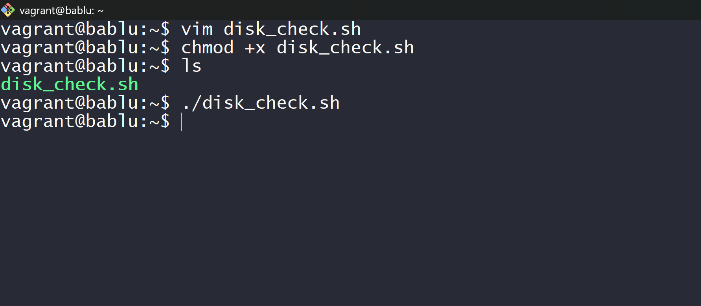
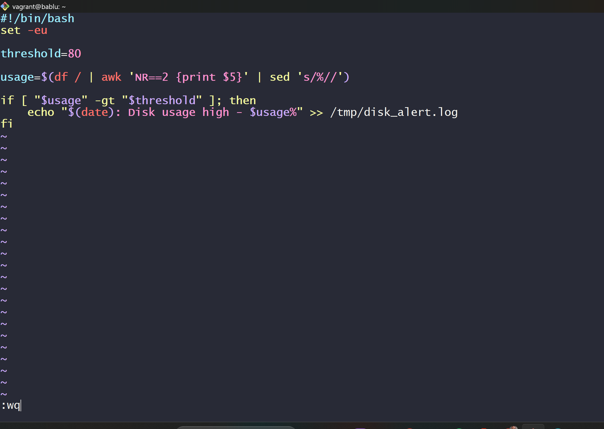
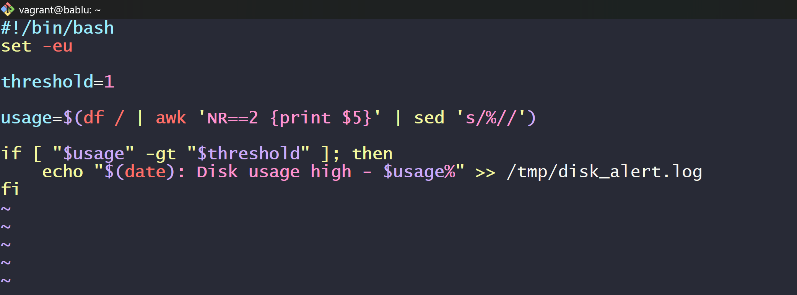
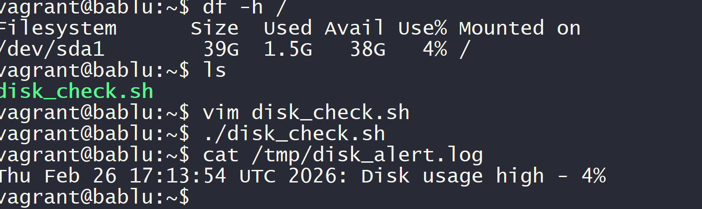
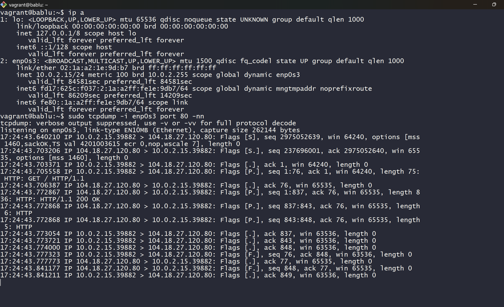
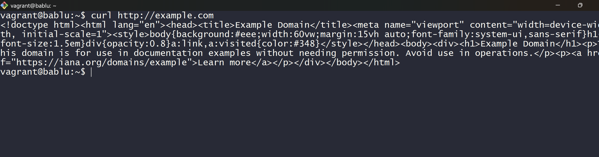
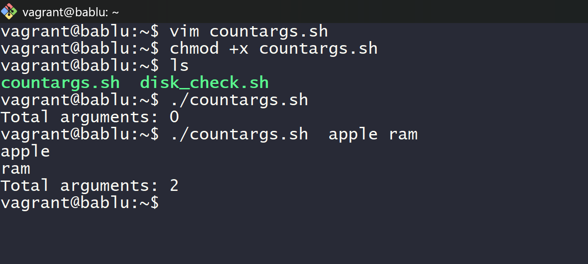
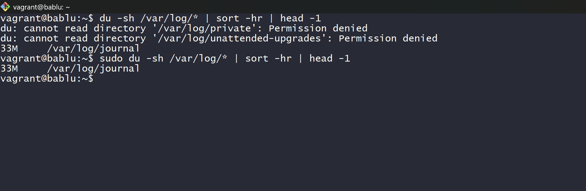
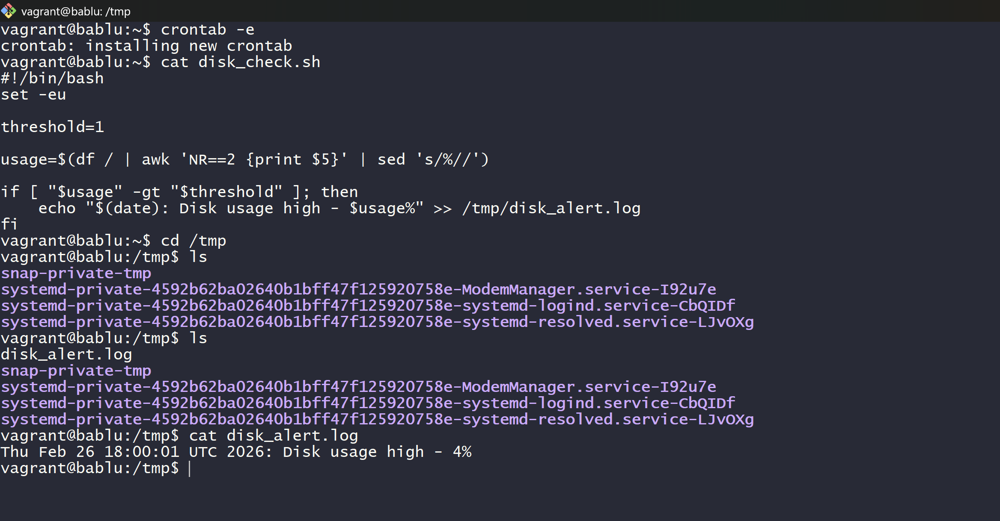
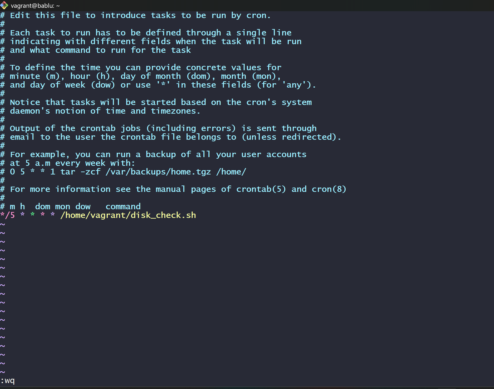

---

# 📘 Linux Day 4 – Labs & Homework

This document contains all Labs and Homework completed for Day 4 (Linux – Monitoring, Logging, Networking, and Automation).

---

# 🧪 LAB 1 – Disk Usage Monitoring Script

## 🎯 Objective

Create a script that checks disk usage and logs an alert if usage exceeds a threshold.

---

## 🔹 Step 1 – Create Script

```bash
vim disk_check.sh
```



---

## 🔹 Step 2 – Script Content

```bash
#!/bin/bash
set -eu

threshold=1   # Changed from 80 to 1 for trigger purpose

usage=$(df / | awk 'NR==2 {print $5}' | sed 's/%//')

if [ "$usage" -gt "$threshold" ]; then
  echo "$(date): Disk usage high - $usage%" >> /tmp/disk_alert.log
fi
```

### ✅ Change Done:

* Threshold changed from **80% to 1%**
* This was done intentionally to trigger the alert for testing.



---

## 🔹 Step 3 – Make Script Executable

```bash
chmod +x disk_check.sh
```



---

## 🔹 Step 4 – Execute Script

```bash
./disk_check.sh
```

Check log file:

```bash
cat /tmp/disk_alert.log
```



---

# 🌐 LAB 2 – Network Monitoring

## 🎯 Objective

Capture network traffic using tcpdump.

---

## 🔹 Step 1 – Check Network Interface

```bash
ip a
```

### ✅ Change Done:

* Network interface changed based on system output.
* Used `enp0s3` as shown in lab screenshot.



---

## 🔹 Step 2 – Capture HTTP Traffic

```bash
sudo tcpdump -i enp0s3 port 80 -nn
```

This captures HTTP traffic on port 80.



---

# 📚 HOMEWORK

---

# 📝 Homework 1 – countargs.sh

## 🎯 Objective

Print arguments passed to script and total count.

---

## 🔹 Script

```bash
#!/bin/bash

for arg in "$@"
do
  echo "$arg"
done

echo "Total arguments: $#"
```

### ✅ Change Done:

* Passed arguments manually to test functionality.

```bash
./countargs.sh apple ram
```



---

# 📝 Homework 2 – Highest Memory Process

## 🎯 Objective

Find process using highest memory.

Original command:

```bash
ps aux --sort=-%mem | head -1
```

### ✅ Change Done:

Used:

```bash
ps aux --sort=-%mem | head -2
```

### Reason:

* First line = Header
* Second line = Highest memory process


---

# 📝 Homework 3 – Largest Directory in /var/log

```bash
sudo du -sh /var/log/* | sort -hr | head -1
```

Explanation:

* `du -sh` → Get directory size
* `sort -hr` → Sort highest first
* `head -1` → Show largest directory



---

# 📝 Homework 4 – SSH Logs

```bash
sudo journalctl -u ssh -n 20
```

Explanation:

* Shows last 20 SSH service logs
* Useful for monitoring login attempts


---

# 📝 Homework 5 – Cron Job Automation

## 🎯 Objective

Schedule disk check script to run every 5 minutes.

---

## 🔹 Edit Crontab

```bash
crontab -e
```

Added:

```
*/5 * * * * /home/vagrant/disk_check.sh
```


---

## 🔹 Result After 5 Minutes

Script triggered automatically.

Check log:

```bash
cat /tmp/disk_alert.log
```



---

## ✅ Change Done:

* Threshold changed to 1% to trigger alert.
* After 5 minutes, cron executed automatically and log entry was created.


