# 🚀 Centralized Logging Setup using ELK Stack

---

## 📌 Project Overview

This project demonstrates a **centralized logging system** using the ELK Stack:

* **Elasticsearch** → Stores logs
* **Logstash** → Processes and enriches logs
* **Filebeat** → Collects logs from application
* **Kibana** → Visualizes logs

---

## 🧠 Architecture

```
Application → Filebeat → Logstash → Elasticsearch → Kibana
```

---

## ⚙️ Setup Instructions

### 🔹 Step 1: ELK Stack Setup

We used **Docker Compose** to run the entire ELK stack.

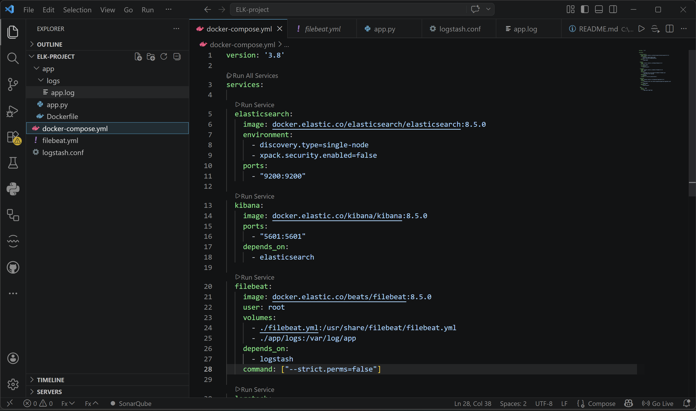

---

### 🔹 Step 2: Run All Services

Start all services using a single command:

```bash
docker-compose up -d --build
```

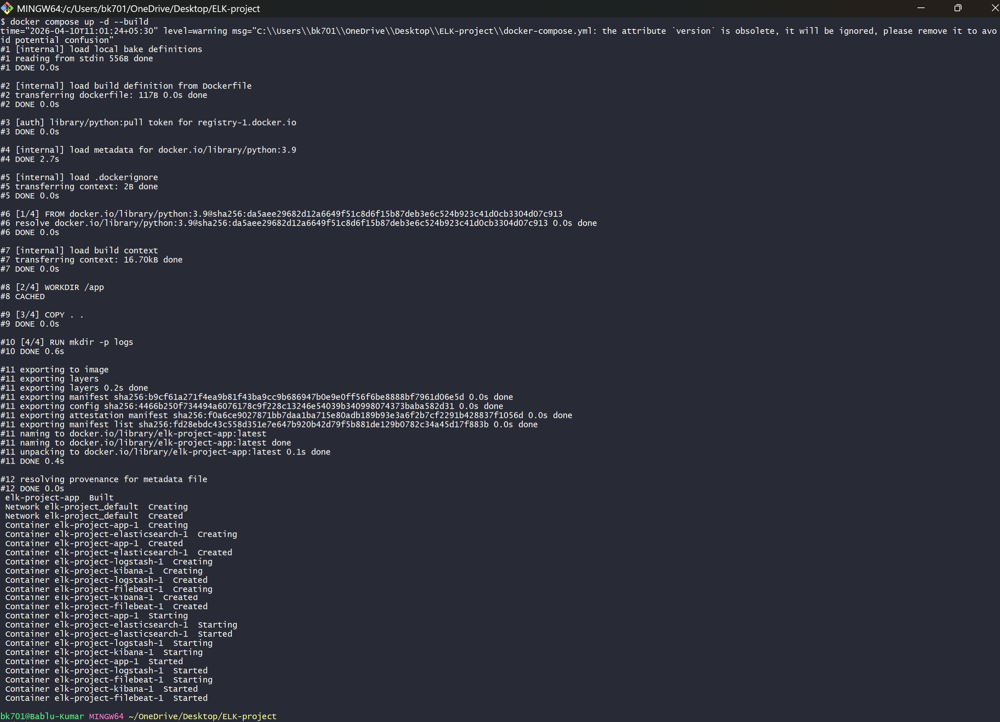

---

### 🔹 Step 3: Verify Running Containers

Check all containers:

```bash
docker ps
```

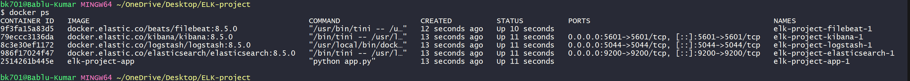

---

## 🧪 Sample Application

A Python application is created to generate logs continuously.

* Generates logs with levels:

  * INFO
  * WARNING
  * ERROR

Logs are written to:

```
app/logs/app.log
```

---

### 🔹 Step 4: Verify Live Logs

```bash
docker exec -it elk-project-app-1 sh
cd logs
tail -f app.log
```

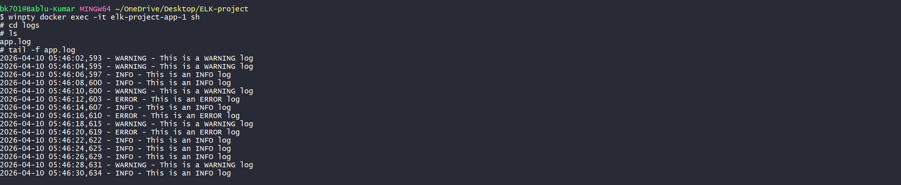

---

## 📥 Log Ingestion

### 🔹 Filebeat Configuration

* Reads logs from:

  ```
  /var/log/app/*.log
  ```
* Sends logs to Logstash

---

## ⚙️ Log Processing (Logstash)

Logstash is used to:

* Parse logs using **Grok filter**
* Extract fields:

  * timestamp
  * severity
  * message
* Add custom fields:

  * service name (`python-app`)
* Normalize severity levels

---

## 🌐 Kibana Setup

### 🔹 Step 5: Open Kibana

```
http://localhost:5601
```

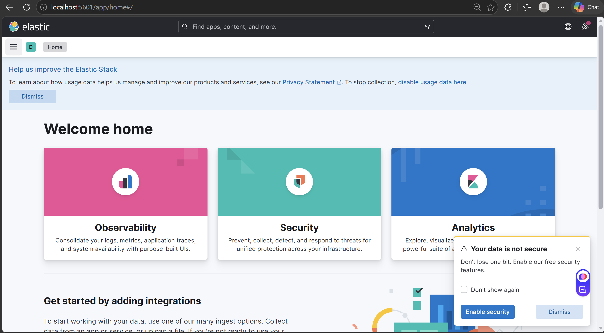

---

### 🔹 Step 6: Create Data View

* Index pattern:

  ```
  app-logs-*
  ```
* Timestamp field:

  ```
  @timestamp
  ```

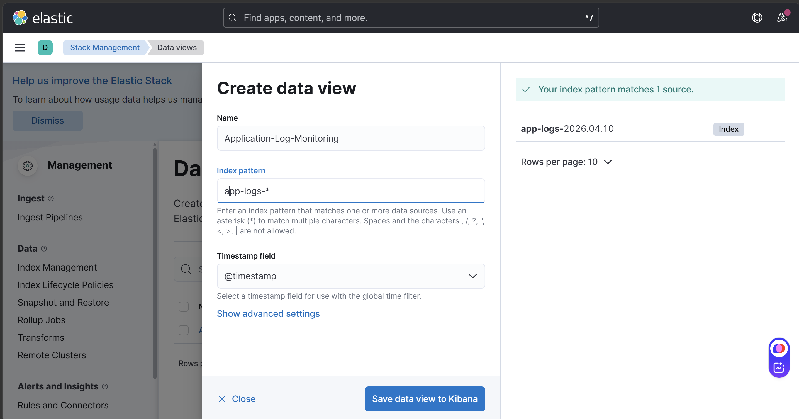

---

### 🔹 Step 7: Data View Created

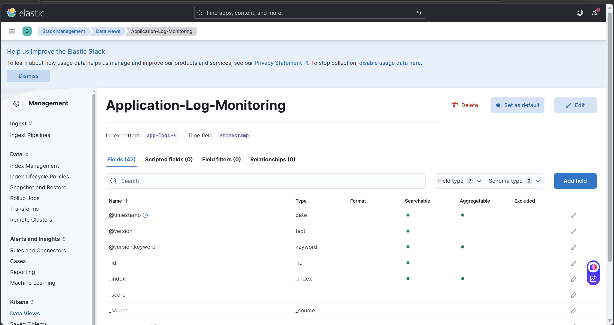

---

## 🔍 Log Exploration

### 🔹 Step 8: Discover Logs

* View all logs in **Discover tab**

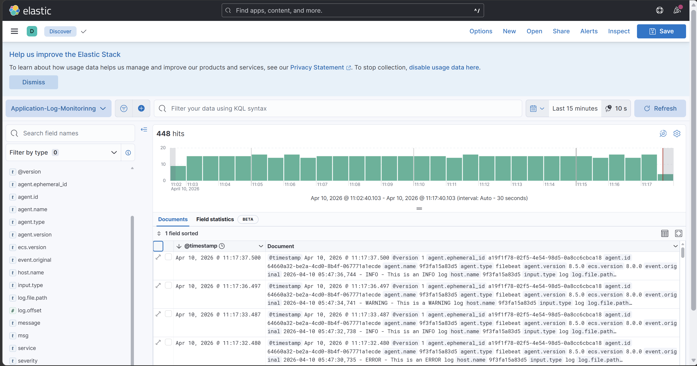

---

### 🔹 Step 9: Filter Logs

Example filter:

```
severity: "ERROR"
```

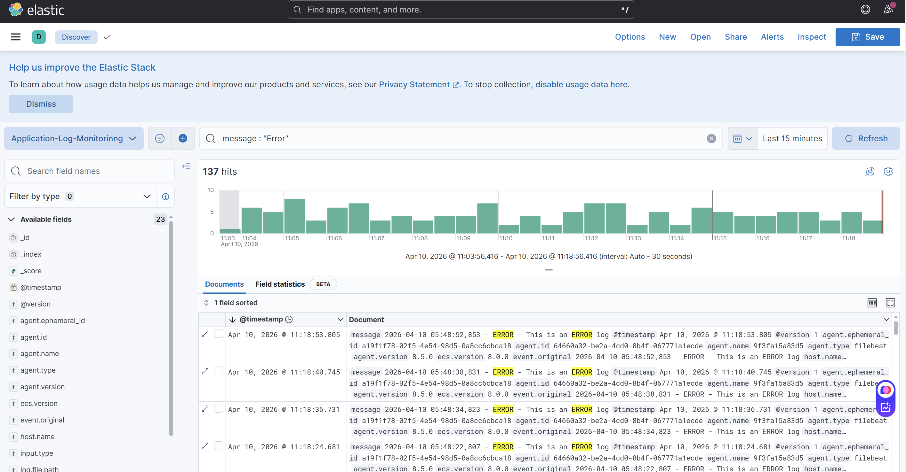

---

## 📊 Dashboard Creation

Dashboard includes:

* Logs over time
* Error count
* Log distribution

---

### 🔹 Step 10: Logs Over Time

* Line chart
* X-axis → @timestamp
* Y-axis → Count

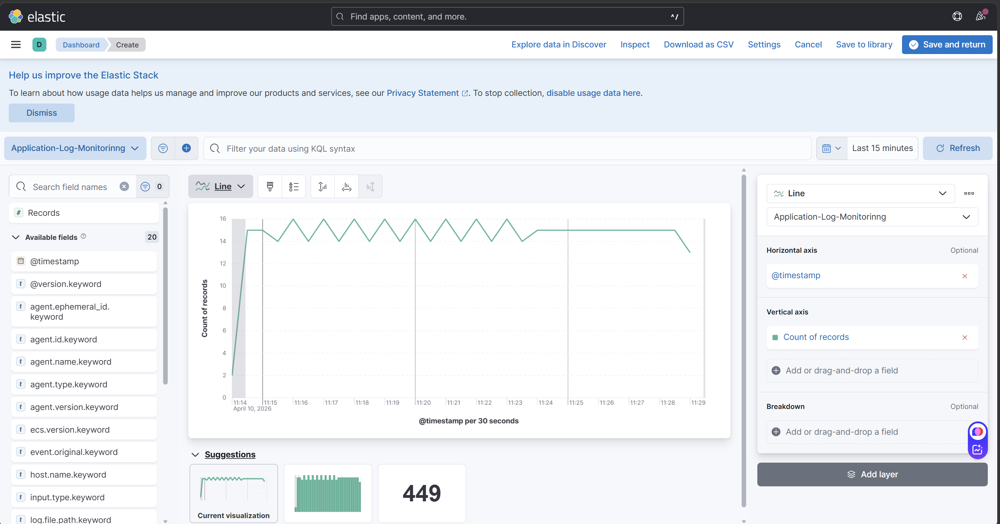

---

### 🔹 Step 11: Error Count

* Metric visualization
* Filter:

  ```
  severity: "ERROR"
  ```

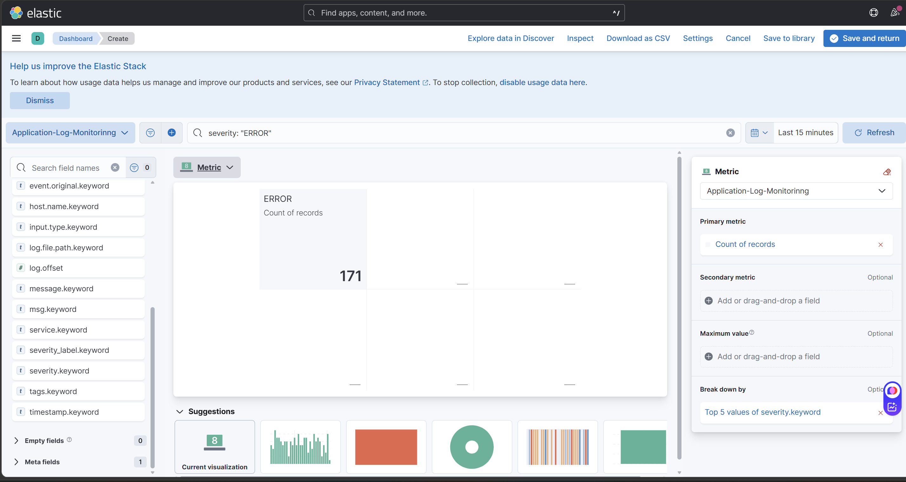

---

### 🔹 Step 12: Log Distribution

* Pie/Donut chart
* Based on severity

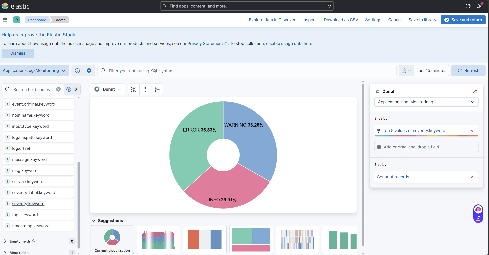

---

### 🔹 Step 13: Final Dashboard

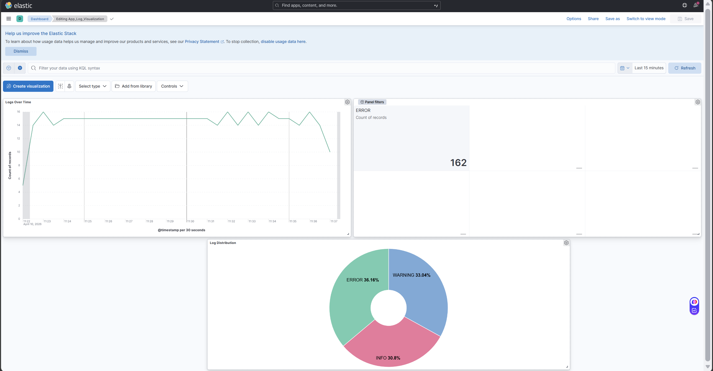

---

## 🧠 Key Decisions

### ✔ Why Filebeat?

* Lightweight log shipper
* Efficient for collecting logs

### ✔ Why Logstash?

* Used for parsing logs
* Adds custom fields
* Enables log enrichment

---

## 🔍 Usage

### View Logs:

* Go to Kibana → Discover

### Apply Filters:

```
severity: "ERROR"
```

### Monitor:

* Use Dashboard for insights

---


## 🚀 Conclusion

This project successfully implements a **centralized logging system** using ELK Stack, enabling:

* Efficient log collection
* Easy debugging
* Real-time monitoring

---


