# 🚀 ELK Stack Logging Project (Filebeat + Logstash + Elasticsearch + Kibana)

This project demonstrates a complete **centralized logging system** using the ELK Stack with Filebeat.

---

# 📌 Architecture Overview

```

Application → Filebeat → Logstash → Elasticsearch → Kibana

````

---

## 🔍 How Logging Works (Step-by-Step)

1. **Application**
   - Generates logs (e.g., `app.log`)
   - Logs stored inside `app/logs/`

2. **Filebeat (Log Collector Agent)**
   - Reads logs from application
   - Path: `/var/log/app/*.log`
   - Sends logs to Logstash

3. **Logstash (Processing Engine)**
   - Receives logs from Filebeat
   - Parses / processes logs
   - Sends logs to Elasticsearch

4. **Elasticsearch (Storage)**
   - Stores logs in indices:
     ```
     logs-YYYY.MM.DD
     ```

5. **Kibana (Visualization)**
   - Reads logs from Elasticsearch
   - Used to create dashboards & visualizations

---

# 🧩 Tech Stack

- Elasticsearch 8.5.0
- Logstash 8.5.0
- Kibana 8.5.0
- Filebeat 8.5.0
- Docker & Docker Compose
- Python Logging App

---

# ⚙️ Setup & Run Project

## 1️⃣ Start ELK Stack

```bash
docker-compose up -d --build
````

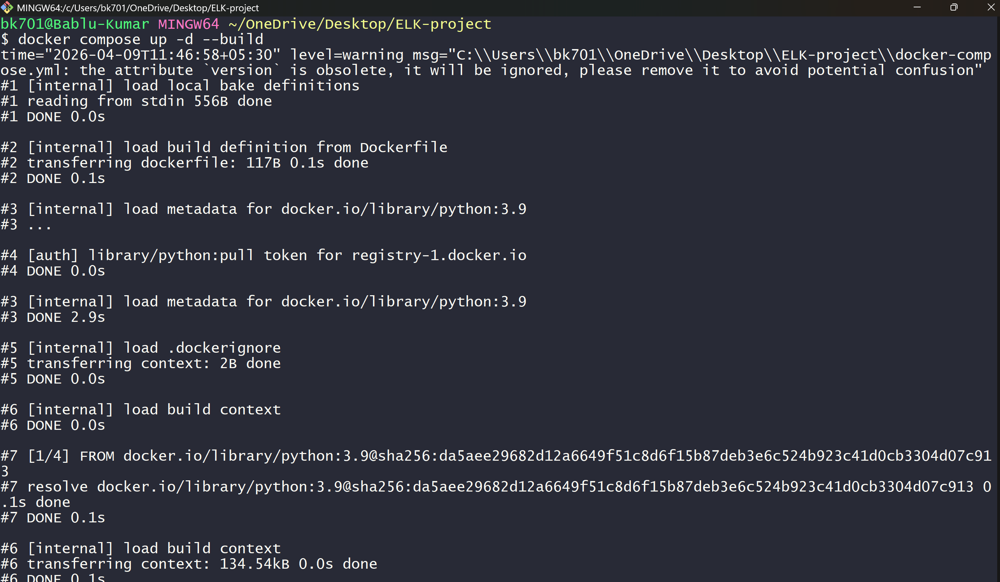
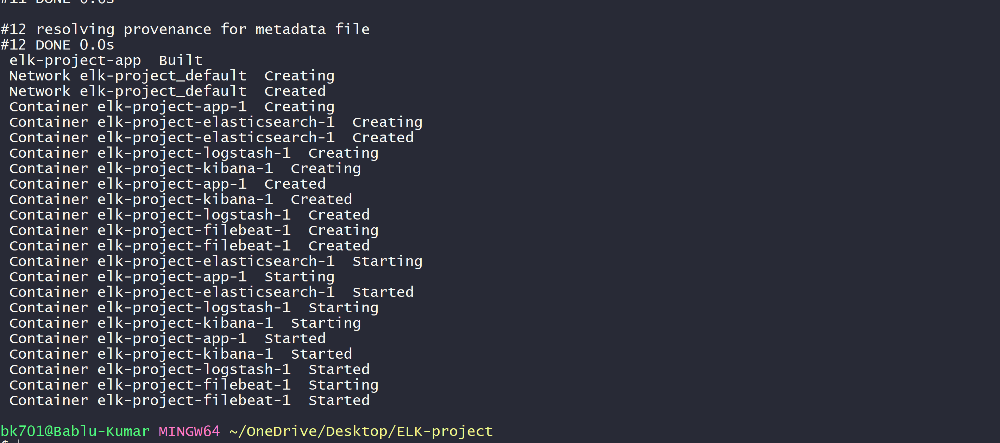

---

## 2️⃣ Verify Running Containers

```bash
docker ps
```

Ensure all services are running:

* elasticsearch
* logstash
* kibana
* filebeat
* app

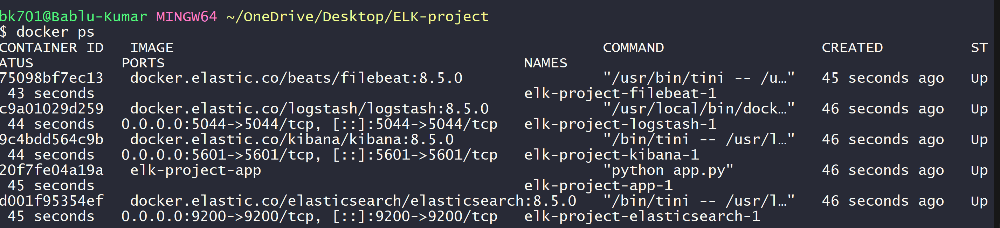

---

## 3️⃣ Verify Elasticsearch

  Open in browser:

```
 http://localhost:9200
```

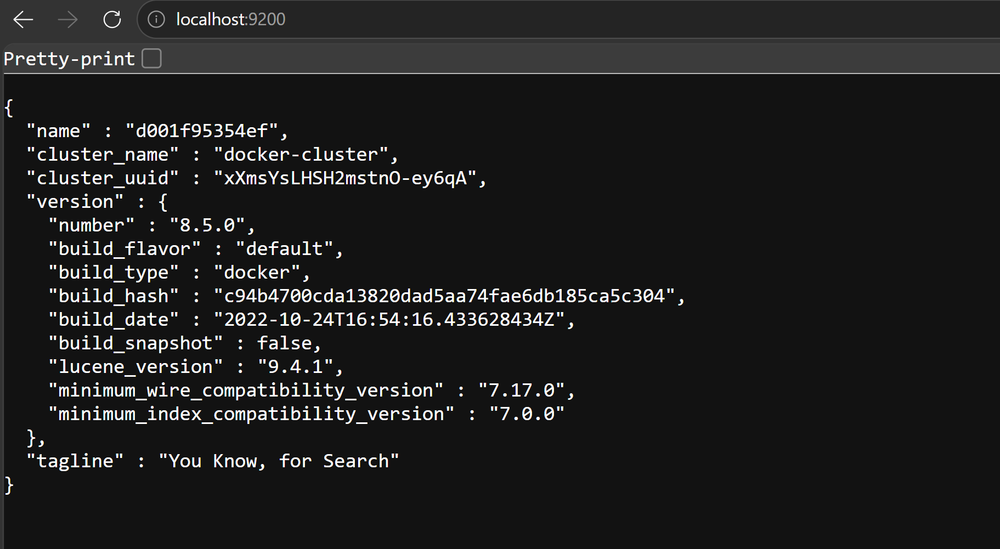

  # Generate Logs

```bash
echo "ERROR Test log" >> app/logs/app.log
```

---

 # Check Elasticsearch

```bash
http://localhost:9200/_cat/indices?v
```

Expected:

```
logs-2026.xx.xx
```
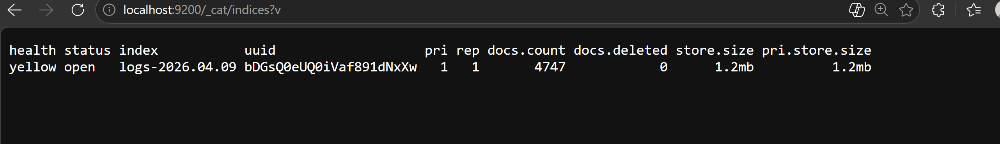
---

---

## 4️⃣ Open Kibana

Go to:

```
http://localhost:5601
```

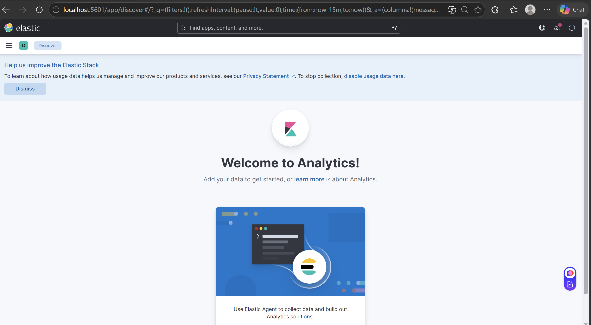

---

## 5️⃣ Create Data View

* Name: `Application-monitoring`
* Index pattern: `logs-*`
* Timestamp field: `@timestamp`

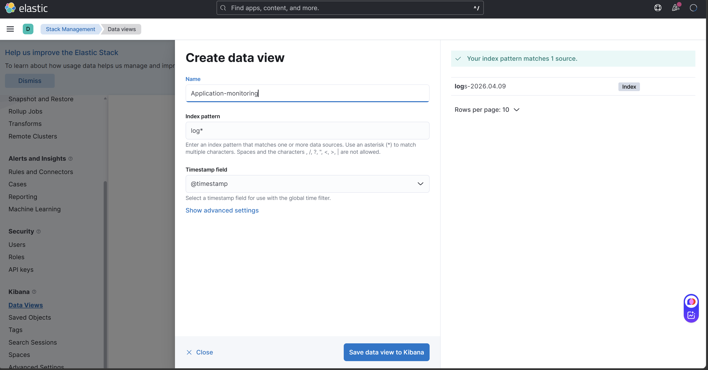
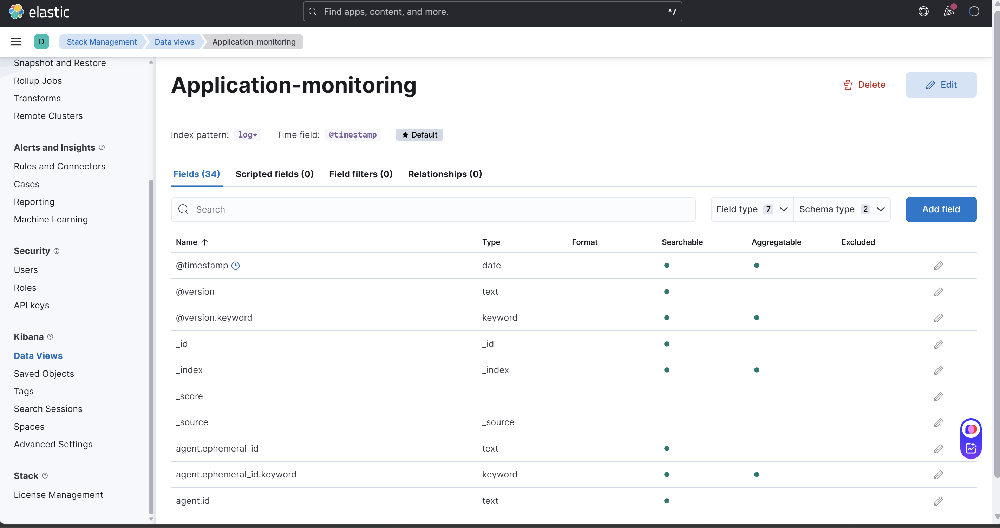

---

# 📊 Dashboard Creation (Step-by-Step)

---

## 📈 Step 6: Logs Over Time (Line Chart)

* X-axis → `@timestamp`
* Y-axis → Count of records

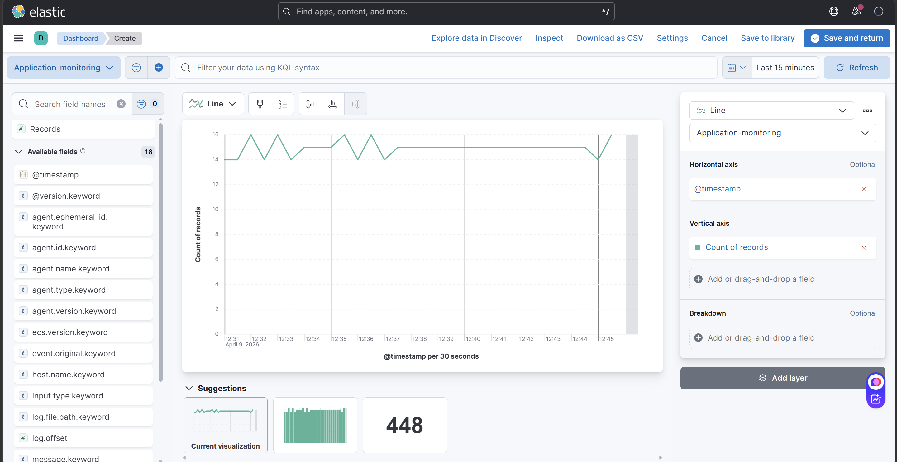

---

## 🚨 Step 7: Error Logs Filter

Apply filter:

```
message : "ERROR"
```

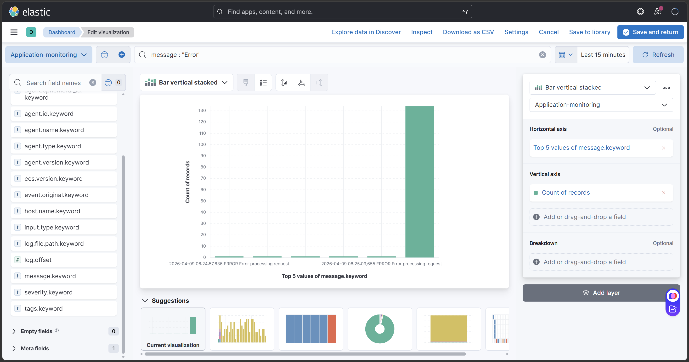

---

## 📋 Step 8: Logs Table View

Display logs in tabular format with:

* message
* severity
* timestamp

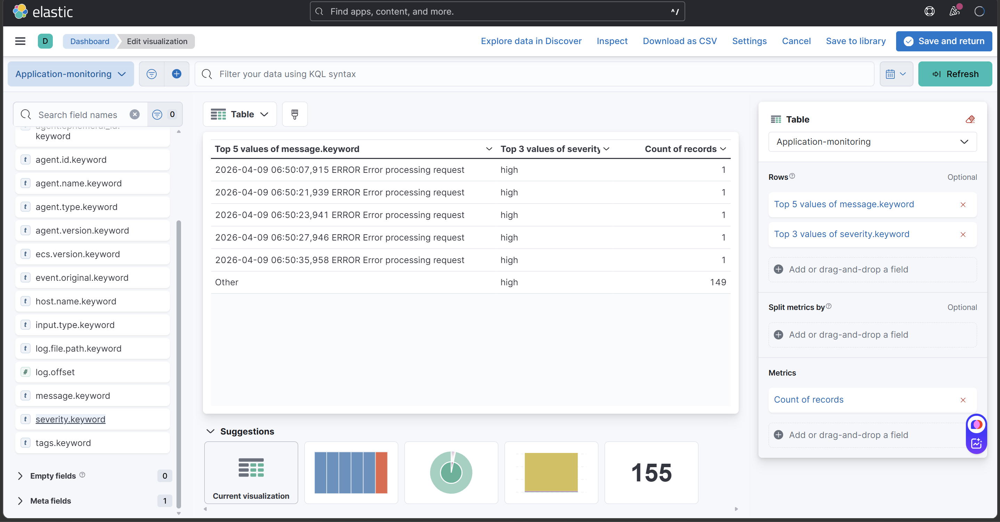

---

## 📊 Step 9: Combine Visualizations into Dashboard

* Add all created visualizations
* Arrange layout properly

---

## 🎯 Step 10: Final Dashboard View

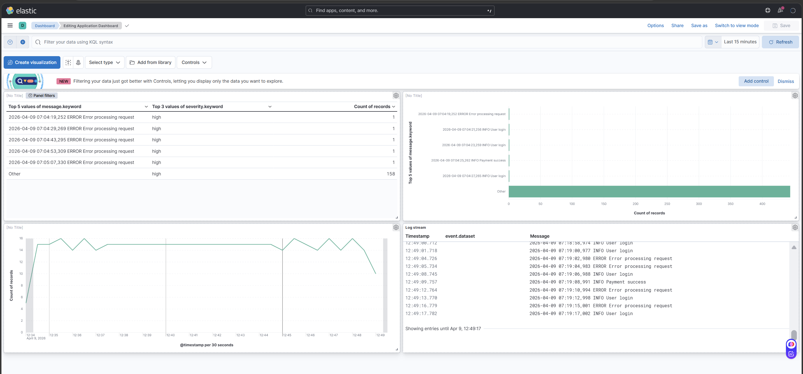

```
✔ Logs table
✔ Error tracking
✔ Time-based graph
✔ Monitoring dashboard
```
---

# 🔥 Features

* Real-time log monitoring
* Centralized logging system
* Error tracking & filtering
* Interactive dashboards
* Scalable architecture

---

# 🧹 Cleanup

## Remove project containers

```bash
docker-compose down -v
```

## Full Docker cleanup

```bash
docker system prune -a --volumes -f
```

---

# 💡 Key Learnings

* End-to-end logging pipeline
* Filebeat as log shipper
* Logstash for processing logs
* Elasticsearch indexing
* Kibana visualization
* Dashboard creation

