# 📊 Monitoring Implementation for Three-Tier Application

## 📌 Overview

This project shows how to monitor a **three-tier application** using:

* Docker Compose
* Prometheus (for collecting metrics)
* Grafana (for visualization)
* Node Exporter (for system metrics)

This setup helps us see:

* Application requests
* System performance
* Real-time dashboards

---

# 🧱 Project Structure

```
Three-Tier-Application/
│── backend/
│── frontend/
│── mysql/
│── docker-compose.yml
│── prometheus.yml
```

---

# 🔹 Task 1: Environment Setup

* Created project folders (backend, frontend, mysql)
* Added `docker-compose.yml` and `prometheus.yml`
* Connected all services using Docker network

---

## 🔥 Metrics Setup (Important)

To monitor the application, I added Prometheus metrics in backend.

### ✅ Added Dependency

In `package.json`:

```json
"prom-client": "^14.0.0"
```

---

### ✅ Backend Changes (server.js)

Added metrics using **prom-client**:

```javascript
const client = require("prom-client");

/* Default metrics */
const collectDefaultMetrics = client.collectDefaultMetrics;
collectDefaultMetrics();

/* Custom counter */
const httpRequestCounter = new client.Counter({
  name: "http_requests_total",
  help: "Total number of HTTP requests",
  labelNames: ["method", "route", "status"]
});

/* Middleware */
app.use((req, res, next) => {
  res.on("finish", () => {
    httpRequestCounter.inc({
      method: req.method,
      route: req.route?.path || req.path,
      status: res.statusCode
    });
  });
  next();
});

/* Metrics endpoint */
app.get("/metrics", async (req, res) => {
  res.set("Content-Type", client.register.contentType);
  res.end(await client.register.metrics());
});
```

📌 This step is very important because:

* Prometheus collects data from `/metrics`
* Without this, application metrics will not work

📸 Screenshot:
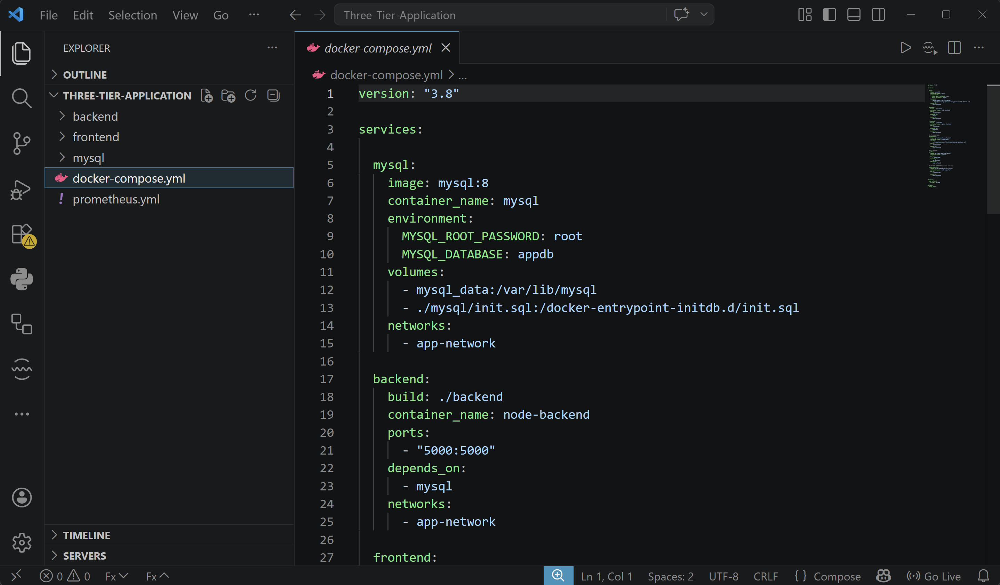

---

# 🔹 Task 2: Application Deployment

* Deployed backend, frontend, and MySQL using Docker
* Checked if backend is running
* Verified `/metrics` endpoint

📸 Screenshots:

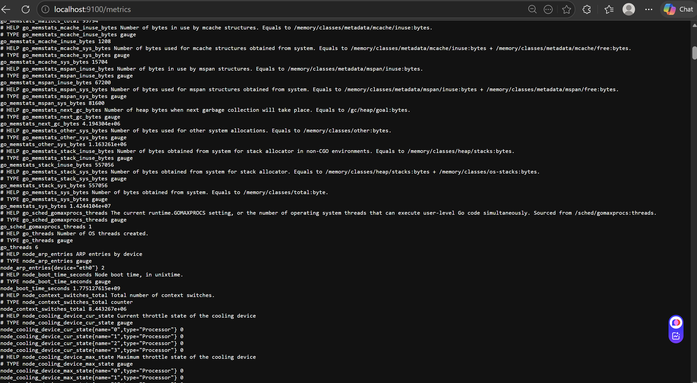
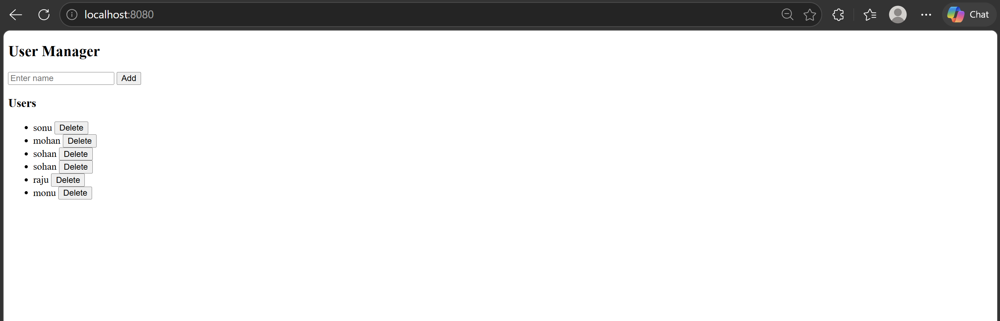

---

# 🔹 Task 3: Prometheus Integration

Configured `prometheus.yml` to scrape:

* Backend → `node-backend:5000/metrics`
* Node Exporter → `node-exporter:9100`

Checked targets in Prometheus UI.

📸 Screenshot:
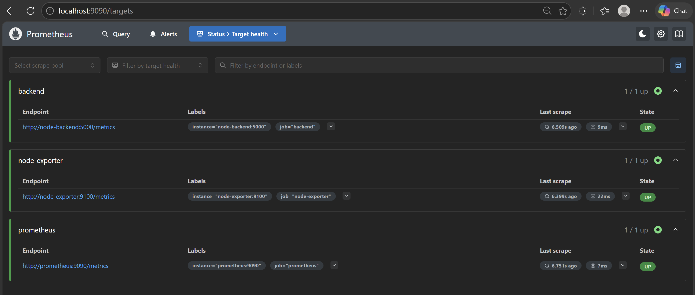

---

# 🔹 Task 4: Monitoring Stack Execution

Started all services:

```bash
docker-compose up -d
```

Checked running containers.

📸 Screenshot:
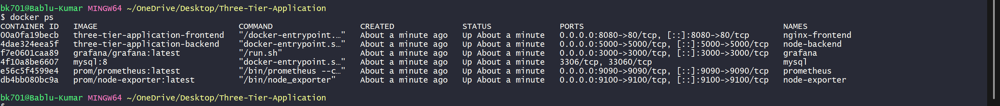

---

# 🔹 Task 5: Grafana Configuration

* Opened Grafana (`localhost:3000`)
* Added Prometheus as data source
* Verified connection

📸 Screenshot:
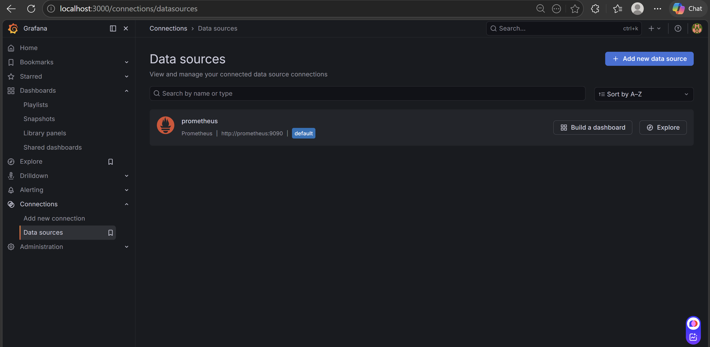

---

# 🔹 Task 6: Dashboard Design

## 📊 Dashboard 1: Infrastructure Monitoring

Created custom panels:

* CPU Usage
* Memory Usage
* Disk Usage

📸 Screenshot:
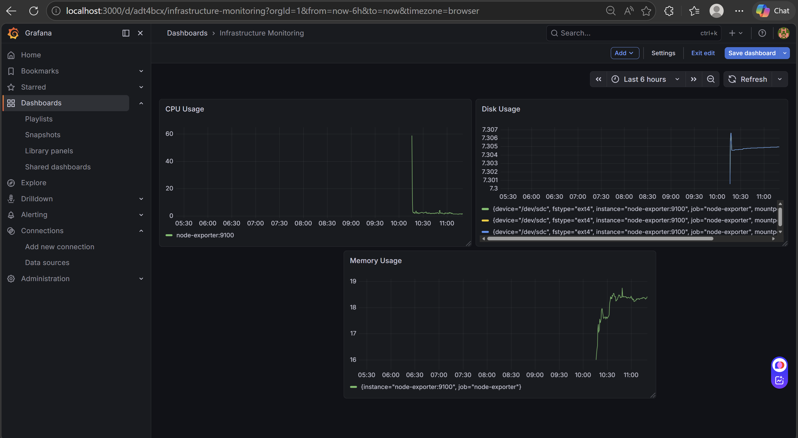

---

## 📈 Dashboard 2: Application Monitoring

### 🔹 Total Requests

```promql
sum(http_requests_total{route!="/metrics"})
```

### 🔹 Requests Per Second

```promql
sum(rate(http_requests_total{route!="/metrics"}[1m]))
```

### 🔹 Traffic Trend

```promql
sum(rate(http_requests_total{route!="/metrics"}[1m]))
```

📌 Panels used:

* Stat 
* Time Series 

📸 Screenshot:
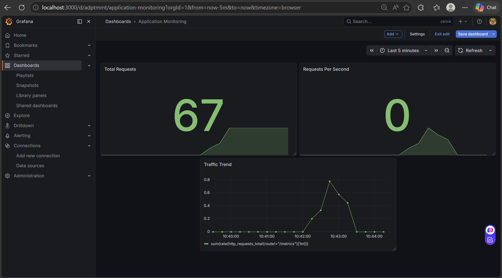

---

# 🔹 Task 7: Traffic Simulation

Generated traffic using:

```bash
for i in {1..100}; do curl http://localhost:5000/users; done
```

Observed changes in Grafana dashboard.

### Before Traffic

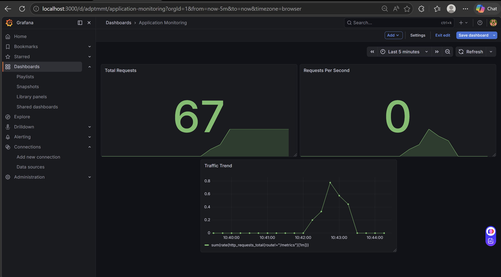

### After Traffic

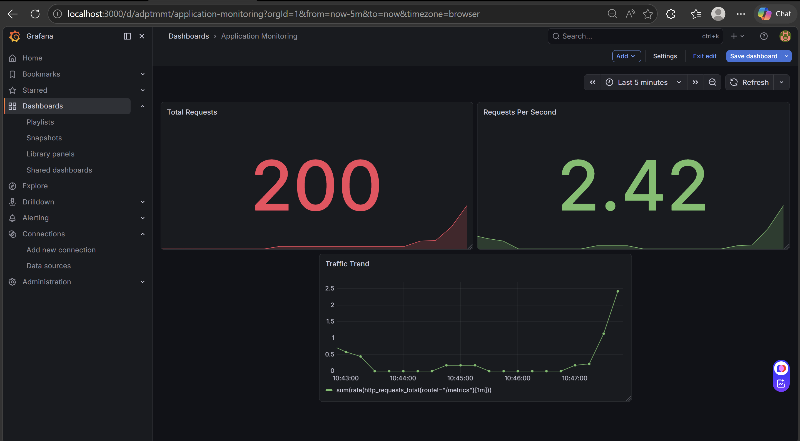

---

# 🔍 Observability Analysis

### 1. Difference between Infrastructure and Application Metrics

--> Infrastructure metrics show system details like CPU, memory, and disk usage.
--> Application metrics show how the app behaves, like requests and errors.

So, 
* infrastructure metrics = system health
* Application metrics = app performance

---

### 2. Why Counters need rate/increase

Counters only increase and never decrease. If we use them directly, we only see total count.

Using `rate()` or `increase()` helps us see how fast values are changing (like requests per second).

---

### 3. How Monitoring helps in Troubleshooting

Monitoring helps us detect problems quickly.
We can see where the issue is (system or application).
It helps in finding errors faster and fixing them easily.

---

# 🔥 Bonus: Custom Metric & Error Monitoring

I used the `prom-client` library in the backend and created a counter metric named:


```
http_requests_total
```

This tracks:

* Method
* Route
* Status

---

### 🔹 Error Rate Query

```promql
sum(rate(http_requests_total{status=~"4..|5.."}[1m]))
```

This shows how many errors (4xx, 5xx) are happening per second.

---

### 📊 Grafana Panel

* Panel Name: **Error Rate**
* Visualization: Time Series
* Unit: req/sec

📸 Screenshot:
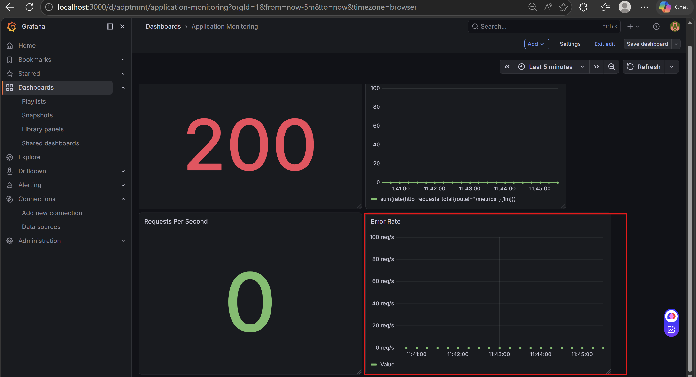

---

