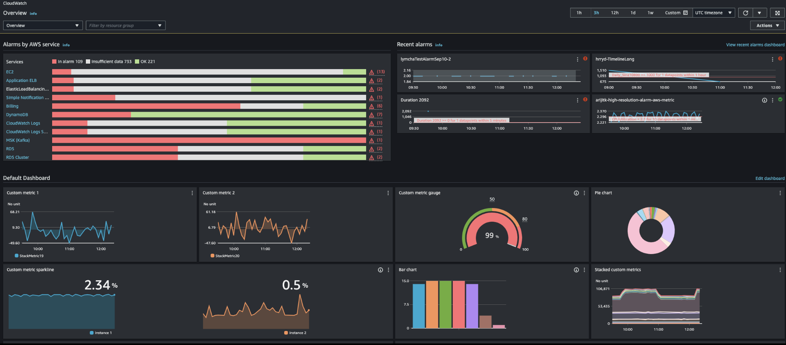
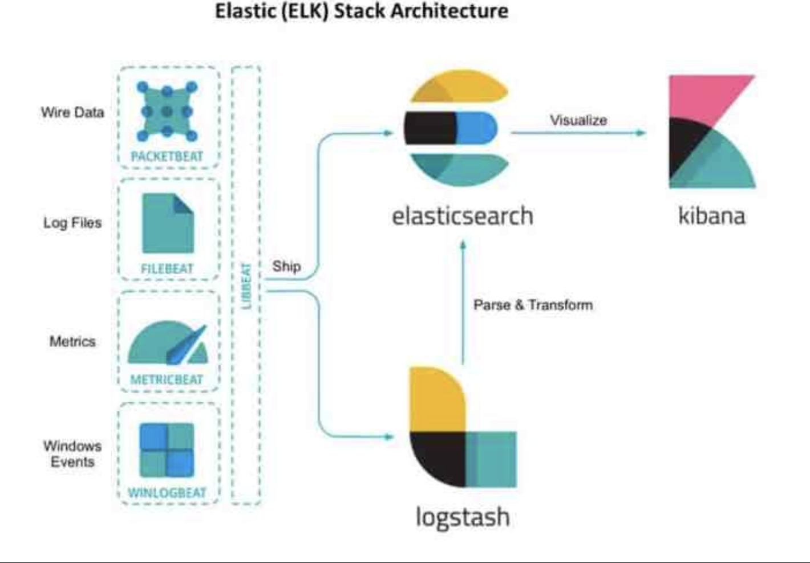
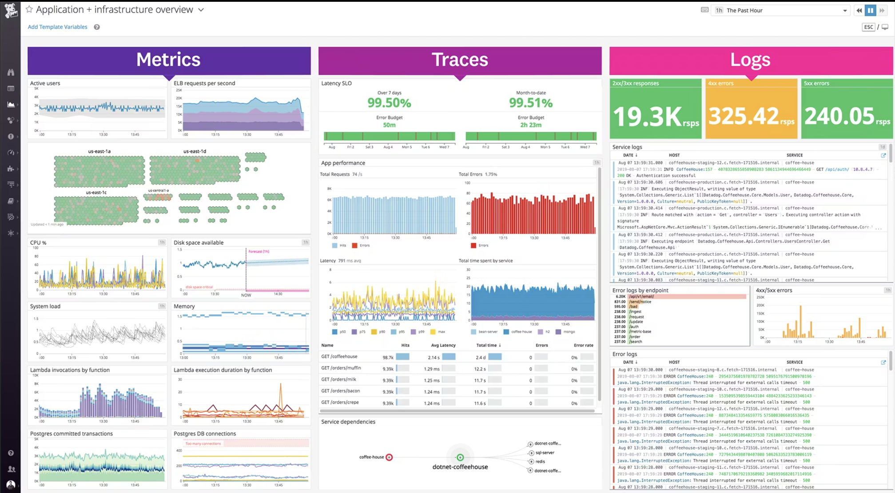
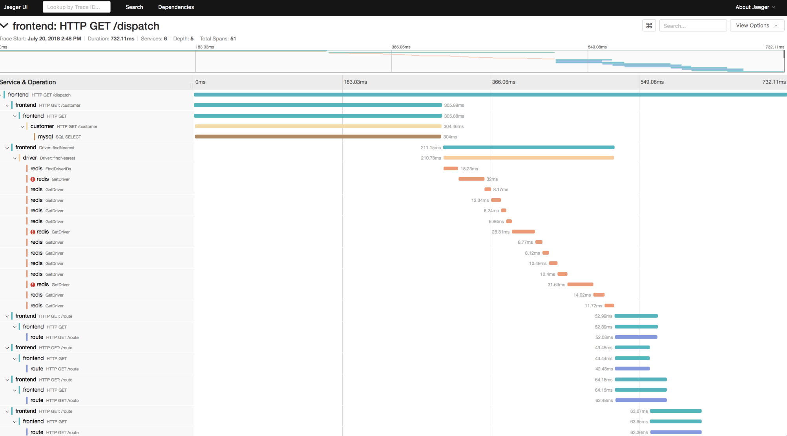
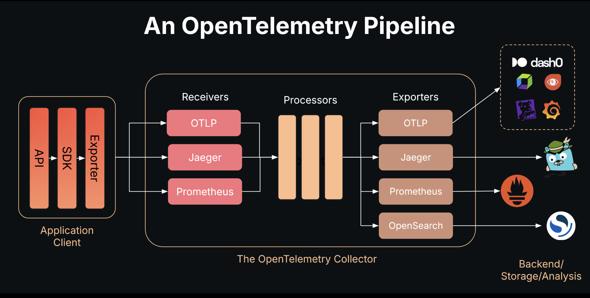
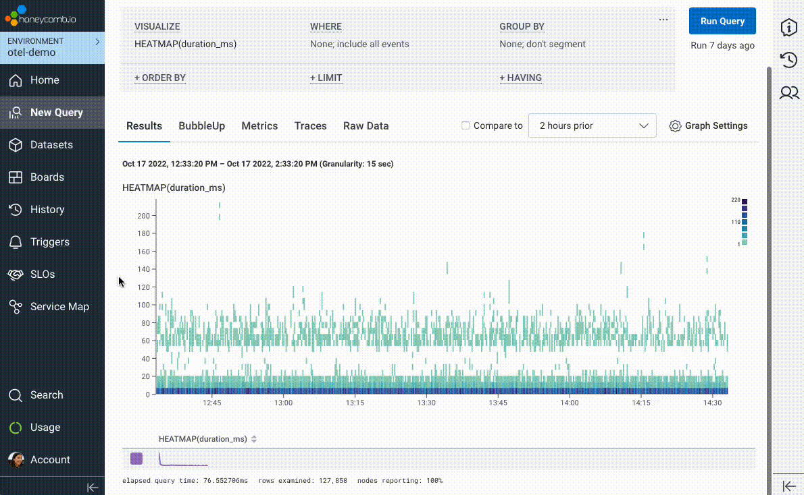
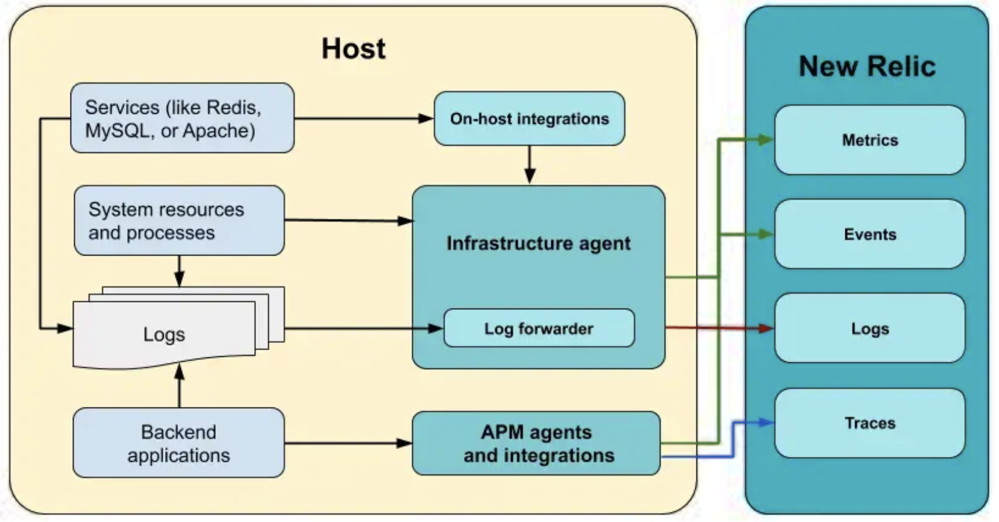
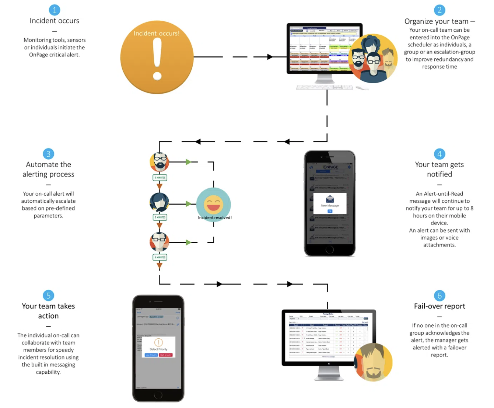
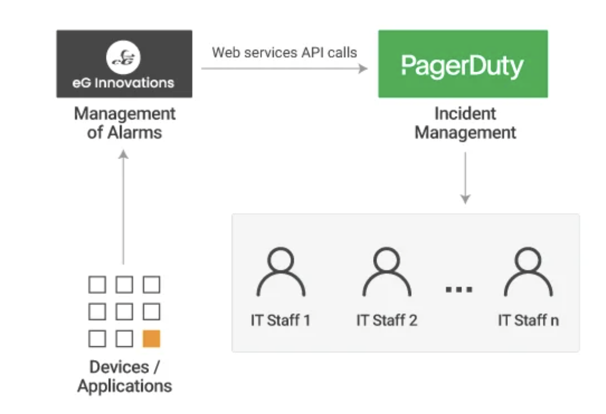
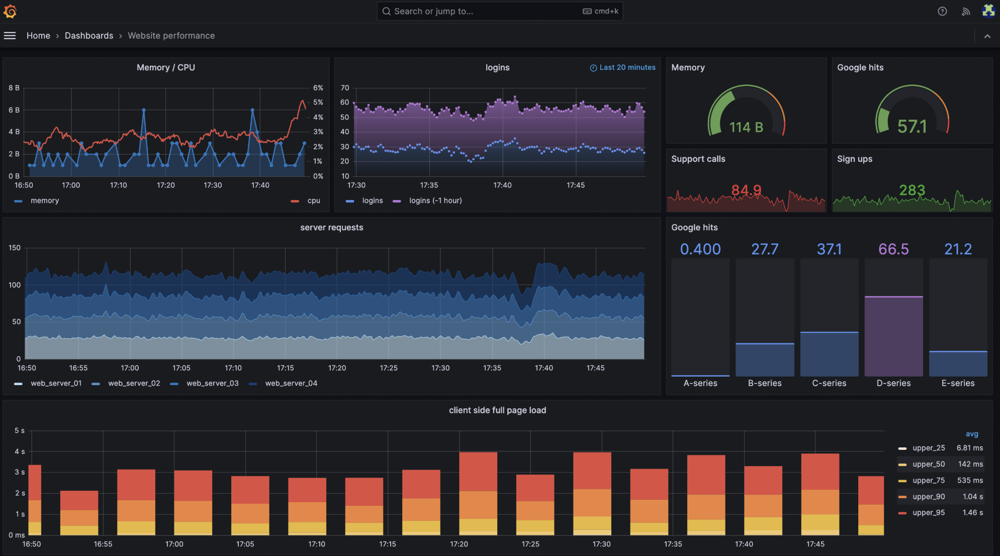

# 📊 Monitoring, Logging & Tracing 

## 🚀 Introduction

In DevOps, we need to continuously check if our system is working properly or not.
This is done using **Monitoring, Logging, and Tracing**.

👉 Simple Flow

* Monitoring tells **what is happening**
* Logging tells **why it happened**
* Tracing shows **how it happened** 

---

# 🧠 1. Monitoring

## 📌 Definition (Simple)

Monitoring is the process of **continuously observing system performance and health**.
It Means:- Monitoring tools collect metrics (CPU, memory, requests) and help track system behavior over time.

---

## 💡 What Monitoring Answers

* Is system running?
* Is it slow?
* Are users facing issues?
* Is something about to fail?


---

## ⚙️ How Monitoring Works (Flow)

```text
Application → Metrics Collection → Storage → Dashboard → Alerts
```

---

## 🏗️ Architecture

```text
[Application/Server]
        ↓
   [Metrics Collector] (Prometheus / CloudWatch)
        ↓
   [Storage]
        ↓
   [Visualization] (Grafana)
        ↓
   [Alerting] (PagerDuty / Alertmanager)
```

---

## 📸 Example (Cloud Monitoring Dashboard)



👉 This shows:

* System health
* Alerts
* Metrics in real-time

---

## 🛠️ Tools

* AWS CloudWatch
* Prometheus
* Grafana
* Datadog

---

# 📜 2. Logging

## 📌 Definition (Simple)

Logging is the process of **recording events happening inside the system with timestamps**. It Means:- Logs are immutable, timestamped records of system events.

---

## 💡 What Logging Answers

* What happened?
* When did it happen?
* Which component failed?
* What error occurred?


---

## ⚙️ How Logging Works (Flow)

```text
Application → Log Collector → Processing → Storage → Visualization
```

---

## 🏗️ Architecture (ELK Stack)

```text
Application Logs
      ↓
   Logstash (collect & process)
      ↓
Elasticsearch (store & search)
      ↓
   Kibana (visualize logs)
```

---

## 📸 Example (ELK Architecture)



---

## 📸 Example (Logs Dashboard)



👉 This shows:

* Errors
* Service logs
* Log search

---

## 🛠️ Tools

* ELK Stack (Elasticsearch, Logstash, Kibana)
* Loki
* Splunk

---

# 🔗 3. Tracing

## 📌 Definition (Simple)

Tracing is used to **track the journey of a request across multiple services**. It Means:- Tracing shows how requests flow through distributed systems.

---

## 💡 What Tracing Answers

* Where is delay happening?
* Which service is slow?
* How request flows?


---

## ⚙️ How Tracing Works (Flow)

```text
User Request → Service A → Service B → Database → Response
```

---

## 🏗️ Architecture

```text
Application
   ↓
Tracing SDK (OpenTelemetry)
   ↓
Collector
   ↓
Tracing Backend (Jaeger / Honeycomb)
   ↓
Visualization UI
```

---

## 📸 Example (Jaeger Trace)



👉 This shows:

* Request flow
* Time taken by each service

---

## 🛠️ Tools

* Jaeger
* Zipkin
* Honeycomb

---

# 🌐 4. OpenTelemetry 

## 📌 Definition

> OpenTelemetry is an open-source observability framework used to collect metrics, logs, and traces.

---

## ⚙️ Flow

```text
Application → OpenTelemetry SDK → Collector → Backend (Jaeger / Prometheus / ELK)
```

---

## 📸 Example



👉 It connects all observability data

---

# 🍯 5. Honeycomb

## 📌 Definition

> Honeycomb is an observability platform for exploring high-cardinality data and debugging complex systems.

---

## ⚙️ Flow

```text
Application → OpenTelemetry → Honeycomb → Debugging UI
```

---

## 📸 Example



👉 Used for deep debugging (who, where, why)

---

# 📊 6. New Relic (All-in-One Tool)

## 📌 Definition

> New Relic is an observability platform that provides metrics, logs, traces, and application monitoring in one place.

---

## ⚙️ Flow

```text
Application → Agent → New Relic → Dashboard
```

---

## 📸 Example



👉 Shows:

* Metrics
* Logs
* Traces

---

# 🚨 7. Alerting

## 📌 Definition

Alerting notifies engineers when something goes wrong.

---

## ⚙️ Flow

```text
Monitoring → Condition → Alert → Notification → Action
```

---

## 📸 Example



---

## 📸 PagerDuty Example



---

# 📊 8. Grafana (Visualization)

## 📌 Definition

> Grafana is an open-source tool used to visualize metrics using dashboards.

---

## 📸 Example



---

# 🧠 Final Summary (IMPORTANT)

| Concept    | Meaning           |
| ---------- | ----------------- |
| Monitoring | What is happening |
| Logging    | Why it happened   |
| Tracing    | How it happened   |

---


#################################################################################################

---

# 🖥️ Linux Commands for System Monitoring

In real DevOps work, before using tools like Prometheus or ELK, engineers first check issues using basic Linux commands.

---

## ⚙️ 1. CPU & Memory Monitoring

### 🔹 Check CPU usage

```bash
top
```

👉 Shows real-time CPU, memory, and running processes

---

### 🔹 Better version of top

```bash
htop
```

👉 Interactive and easier to read

---

### 🔹 Check memory usage

```bash
free -h
```

👉 Shows total, used, and free RAM in human-readable format

---

### 🔹 Check system load

```bash
uptime
```

👉 Shows load average (system pressure)

---

## 🔄 2. Process Monitoring

### 🔹 List all processes

```bash
ps aux
```

---

### 🔹 Search for a process

```bash
ps aux | grep <process_name>
```

---

### 🔹 Kill a process

```bash
kill -9 <PID>
```

---

## 💾 3. Disk Monitoring

### 🔹 Check disk usage

```bash
df -h
```

👉 Shows disk space usage

---

### 🔹 Check folder size

```bash
du -sh *
```

---

### 🔹 View file sizes

```bash
ls -lh
```

---

## 🌐 4. Network Monitoring

### 🔹 Check connectivity

```bash
ping google.com
```

---

### 🔹 Test API / service

```bash
curl http://localhost:5000
```

---

### 🔹 Check open ports

```bash
ss -tuln
```

---

### 🔹 Check IP address

```bash
ip a
```

---

### 🔹 Trace network path

```bash
traceroute google.com
```

---

## 📜 5. Log Monitoring

### 🔹 View live logs

```bash
tail -f /var/log/syslog
```

---

### 🔹 Search logs

```bash
grep "ERROR" app.log
```

---

### 🔹 View logs page-wise

```bash
less /var/log/syslog
```

---

### 🔹 Service logs

```bash
journalctl -u nginx
```

---

## 🔧 6. Service Monitoring

### 🔹 Check service status

```bash
systemctl status nginx
```

---

### 🔹 Restart service

```bash
systemctl restart nginx
```

---

# 📜 Best Practices for Logging

To make logging useful and easy to debug, follow these best practices:

---

## ✅ 1. Use Structured Logging

👉 Always use JSON format

```json
{
  "timestamp": "2025-03-31T10:00:00Z",
  "level": "error",
  "message": "Database connection failed",
  "service": "user-service"
}
```

👉 Makes searching and filtering easier

---

## ✅ 2. Add Proper Log Levels

* INFO → normal operations
* WARN → something unusual
* ERROR → failure
* DEBUG → detailed info

---

## ✅ 3. Include Important Details

👉 Always include:

* Timestamp
* Service name
* User ID / Request ID
* Error message

---

## ✅ 4. Avoid Too Much Logging

👉 Don’t log everything
👉 Focus on useful information

---

## ✅ 5. Centralize Logs

👉 Store logs in one place (ELK, Loki)

---

## ✅ 6. Enable Log Rotation

👉 Prevent logs from filling disk

```bash
logrotate
```

---

## ✅ 7. Secure Sensitive Data

👉 Never log:

* Passwords
* Tokens
* Personal data

---

## ✅ 8. Use Tags & Metadata

👉 Add fields like:

* environment (prod/dev)
* service name

---

## ✅ 9. Set Alerts on Logs

👉 Example:

* Error rate > threshold → alert

---

## ✅ 10. Keep Logs Readable

👉 Clear messages:

```text
❌ Bad: Error occurred  
✅ Good: DB connection failed at auth-service
```

---


👉 In real-world debugging:

```text
System → Process → Disk → Network → Logs
```


#################################################################################################


---

# 🏗️ Final Observability Architecture

## 🔄 End-to-End Flow

```text
Users
  ↓
Application (Frontend / Backend / Microservices)
  ↓
---------------------------------------------------
|                OpenTelemetry Layer              |
|  (SDKs + Agents + Instrumentation)              |
---------------------------------------------------
  ↓
OpenTelemetry Collector (Receives, Processes, Routes Data)
  ↓
---------------------------------------------------
|                  Data Types                     |
|  Metrics        Logs           Traces           |
---------------------------------------------------
  ↓                ↓               ↓
Prometheus      ELK Stack       Jaeger / Honeycomb
(Metrics DB)   (Logs System)    (Tracing System)
  ↓                ↓               ↓
                Storage & Processing Layer
                        ↓
---------------------------------------------------
|                Visualization Layer              |
|         Grafana / Kibana / New Relic           |
---------------------------------------------------
                        ↓
---------------------------------------------------
|                   Alerting Layer                |
|     Alertmanager / PagerDuty / Opsgenie        |
---------------------------------------------------
                        ↓
                 DevOps Engineer
                        ↓
                 Fix & Optimize System
```

