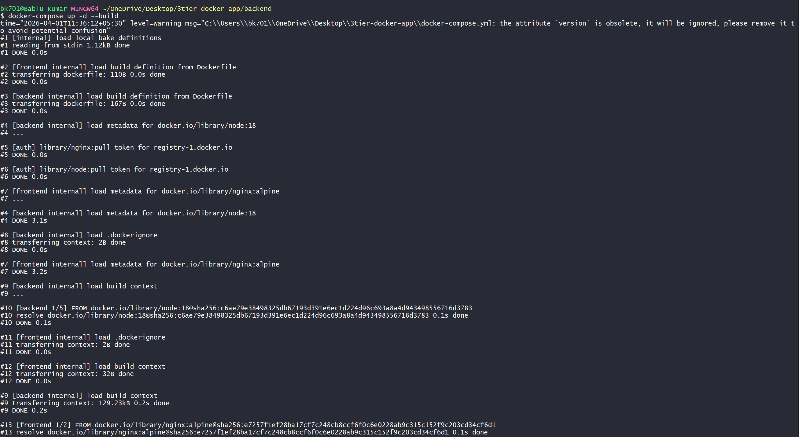
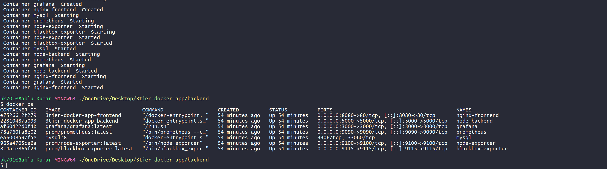
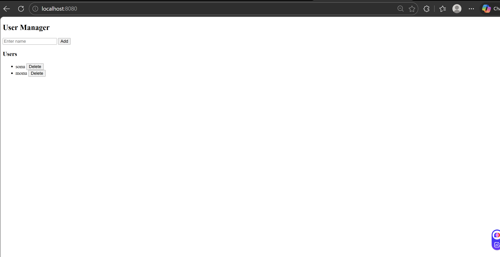
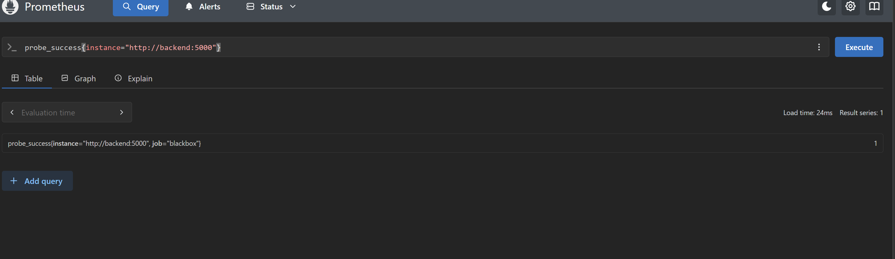
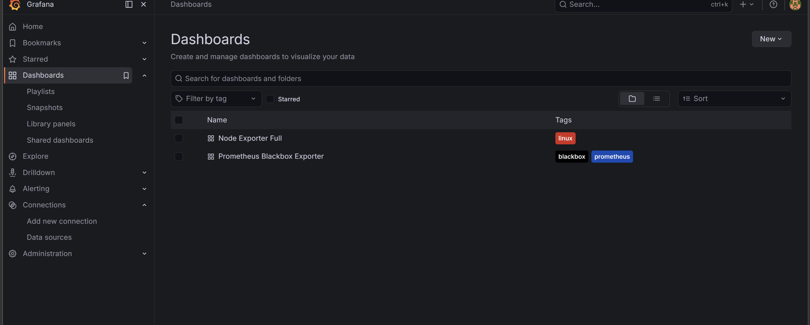
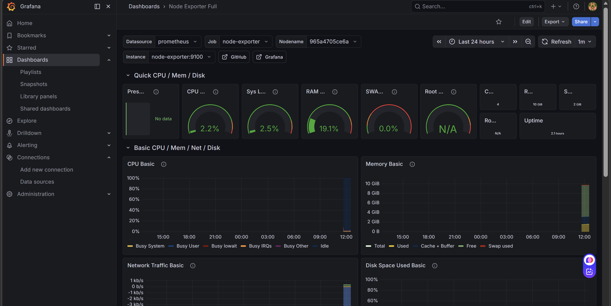

# 🚀 3-Tier Application with Monitoring (Prometheus + Grafana)

This project demonstrates a **3-tier application** (Frontend + Backend + MySQL) integrated with **monitoring using Prometheus, Grafana, Node Exporter, and Blackbox Exporter**.

---

# 🧩 Architecture

```

Frontend (Nginx)
↓
Backend (Node.js + Express)
↓
MySQL Database

Monitoring Stack:
Prometheus → Collect Metrics
Grafana → Visualize Metrics
Node Exporter → System Metrics
Blackbox Exporter → Endpoint Monitoring

```

---

# 📁 Project Structure

```

3tier-docker-app/
│
├── backend/
├── frontend/
├── mysql/
├── docker-compose.yml
├── prometheus.yml
├── blackbox.yml

````

---

# ⚙️ Step-by-Step Setup

---

## 🔹 Step 1: Clone the Repository

```bash
git clone <your-repo-url>
cd 3tier-docker-app
````

---

## 🔹 Step 2: Start All Services

```bash
docker-compose up -d --build
```



---

## 🔹 Step 3: Verify Running Containers

```bash
docker ps
```



---

## 🔹 Step 4: Access Application

* Frontend → [http://localhost:8080](http://localhost:8080)
* Backend → [http://localhost:5000](http://localhost:5000)
* Prometheus → [http://localhost:9090](http://localhost:9090)
* Grafana → [http://localhost:3000](http://localhost:3000)
* Node Exporter → [http://localhost:9100/metrics](http://localhost:9100/metrics)
* Blackbox Exporter → [http://localhost:9115](http://localhost:9115)



---

# 📊 Monitoring Setup

---

## 🔹 Step 5: Prometheus Configuration

* Configured in `prometheus.yml`
* Scrapes:

  * Backend metrics (`/metrics`)
  * Node Exporter
  * Blackbox Exporter



---

## 🔹 Step 6: Backend Metrics (Node.js)

Added `prom-client` in backend:

```js
const client = require('prom-client');

client.collectDefaultMetrics();

app.get('/metrics', async (req, res) => {
  res.set('Content-Type', client.register.contentType);
  res.end(await client.register.metrics());
});
```

👉 Now Prometheus can scrape backend metrics.

---

## 🔹 Step 7: Grafana Setup

1. Login to Grafana

   * URL: [http://localhost:3000](http://localhost:3000)
   * Username: `admin`
   * Password: `admin`

2. Add Prometheus Data Source

   * URL: `http://prometheus:9090`



---

## 🔹 Step 8: Import Dashboard

* Imported **Node Exporter Dashboard**
* Metrics visible:

  * CPU Usage
  * Memory Usage
  * Disk Usage



---

# 📡 Blackbox Exporter (In Progress ⚠️)

* Blackbox exporter is configured to monitor:

  * Frontend (`http://frontend:80`)
  * Backend (`http://backend:5000`)

* Prometheus targets are **UP**

* Metrics like `probe_success` are working

```promql
probe_success
```

👉 However:

❗ Grafana dashboard for Blackbox Exporter is **not working properly due to datasource and query mismatch issues**

👉 This part is **under progress**

---

# 🧪 Testing Monitoring

### Check Prometheus Metrics

```promql
probe_success
```

```promql
node_cpu_seconds_total
```

---

### Stop a Service to Test

```bash
docker stop nginx-frontend
```

👉 Observe:

* `probe_success = 0`
* Grafana reflects downtime

---

# 🧠 Key Learnings

* Prometheus uses **pull-based monitoring**
* Exporters expose `/metrics`
* Grafana visualizes metrics using PromQL
* Labels are crucial for filtering data
* Dashboard issues are often due to:

  * Wrong datasource
  * Incorrect queries
  * Variable mismatch

---

# 🚀 Future Improvements

* Fix Blackbox Grafana dashboard
* Add Alertmanager (email alerts)
* Monitor MySQL metrics
* Create custom dashboards


