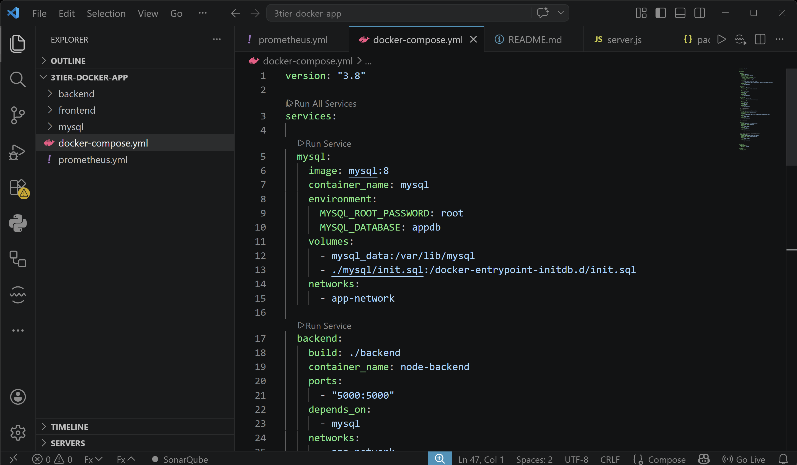
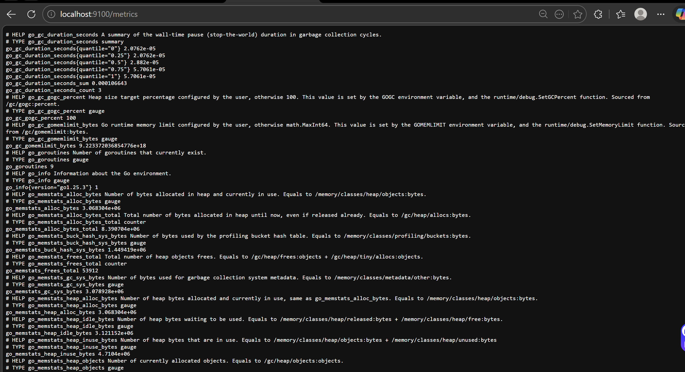
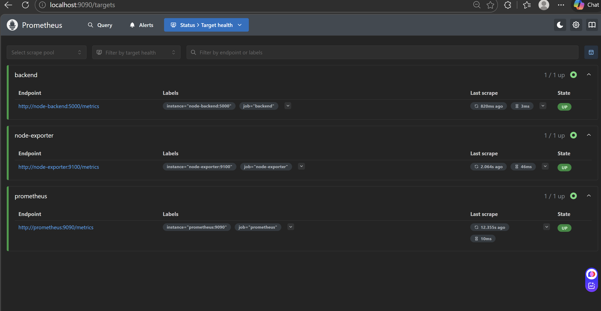
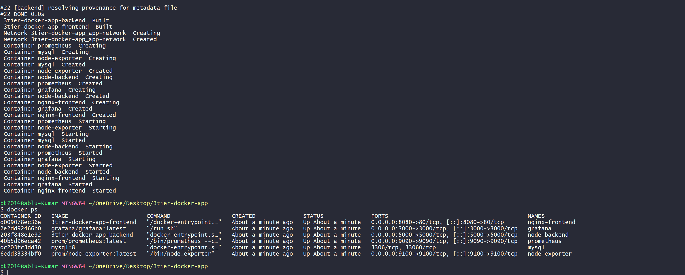
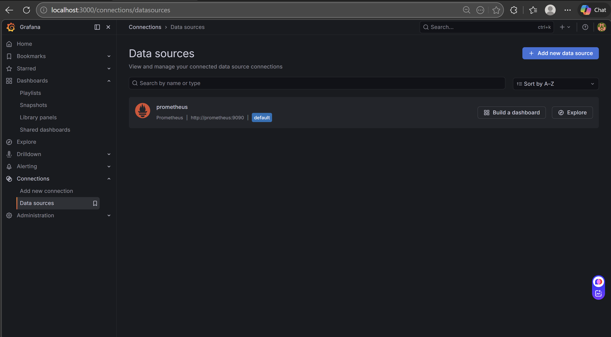
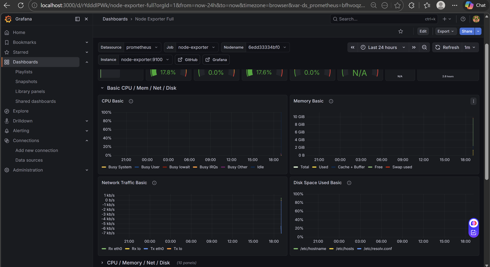
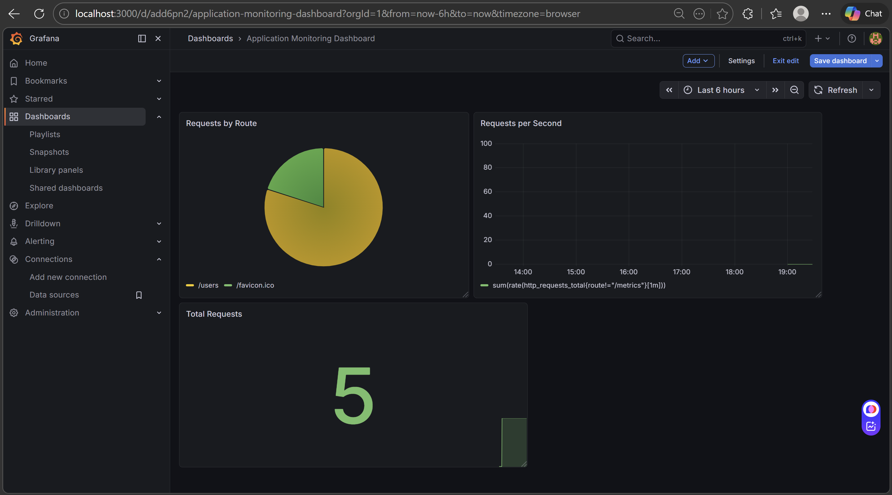
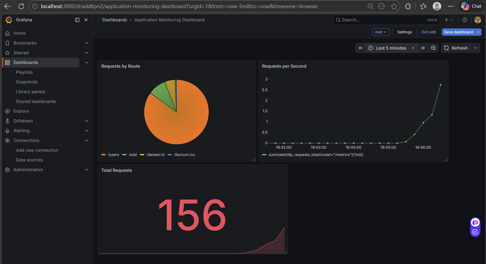

# 🚀 3-Tier Application Monitoring using Prometheus & Grafana

This project demonstrates monitoring of a **3-tier Dockerized application** (Frontend, Backend, Database) using **Prometheus and Grafana**.

---

## 📌 Project Overview

The setup includes:

- **Frontend** → Nginx
- **Backend** → Node.js (with custom metrics)
- **Database** → MySQL
- **Monitoring Stack**
  - Prometheus (metrics collection)
  - Grafana (visualization)
  - Node Exporter (system metrics)

---

## 🏗️ Architecture

- Docker Compose used to run all services
- Prometheus scrapes:
  - Node Exporter (system metrics)
  - Backend (`/metrics`)
- Grafana visualizes:
  - Infrastructure metrics
  - Application metrics

---

## ⚙️ Task 1: Project Setup

- Created 3-tier app structure
- Configured Docker Compose
- Added backend metrics endpoint



---

## 🐳 Task 2: Deploy Application

Run all services:

```bash
docker-compose up -d
````

Verify running containers:

```bash
docker ps
```




---

## 📊 Task 3: Configure Prometheus

* Added scrape jobs:

  * `prometheus`
  * `node-exporter`
  * `backend`


##  Backend Metrics Instrumentation

To enable application-level monitoring, **Prometheus metrics were added in the backend using `prom-client`**.

This is a crucial step because Prometheus can only collect metrics if the application exposes them via a `/metrics` endpoint.

---

### 🔹 Install prom-client

Added dependency in `package.json`:

```json
"dependencies": {
  "prom-client": "^15.1.3"
}
````

---

### 🔹 Metrics Setup in Backend (server.js)

* Enabled default system metrics
* Created custom HTTP request counter
* Exposed `/metrics` endpoint for Prometheus


Access Prometheus:

```text
http://localhost:9090
```

Check targets → Status: UP ✅



---


---

## 📦 Task 4: Monitoring Stack Deployment

* Prometheus, Grafana, Node Exporter integrated successfully
* Real-time monitoring working



---

## 📈 Task 5: Setup Grafana

* Open Grafana:

```text
http://localhost:3000
```

* Add Prometheus as Data Source:

```text
http://prometheus:9090
```



---

## 🖥️ Task 6: Infrastructure Monitoring

* Imported Node Exporter Dashboard
* Monitored:

  * CPU Usage
  * Memory Usage
  * Disk Usage




---

## 📊 Task 7: Application Monitoring Dashboard

Created custom Grafana dashboard with:

### 🔹 Total Requests

```promql
sum(http_requests_total)
```

### 🔹 Requests Per Second

```promql
sum(rate(http_requests_total[1m]))
```

### 🔹 Requests by Route

```promql
sum by (route)(http_requests_total{route!="/metrics"})
```



---

## 🚀 Task 8: Traffic Simulation

Generated traffic using:

```bash
for i in {1..200}; do curl http://localhost:5000/users; done
```

---

### 📉 Before Traffic

* Low or no activity


---

### 📈 After Traffic

* Increased request rate
* Visible spike in Grafana




## Short Question
1. Difference between infra and app metrics.
Ans:- Infrastructure Metrics show system health (CPU, memory)
      while app metrics show application activity (requests, errors, Api request).

---
2. Why rate-based queries are used for counters.
Ans:- We use rate() because counters only increase, and rate() shows how fast values are changing over time. 

