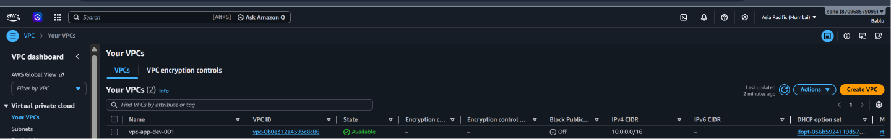
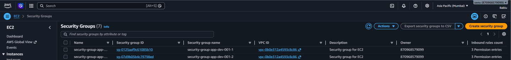
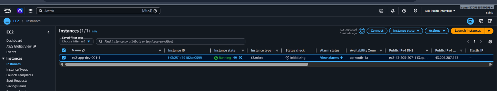
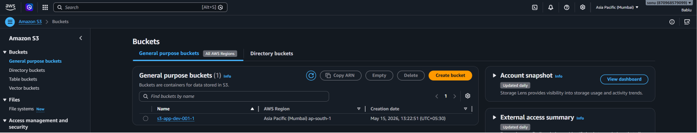
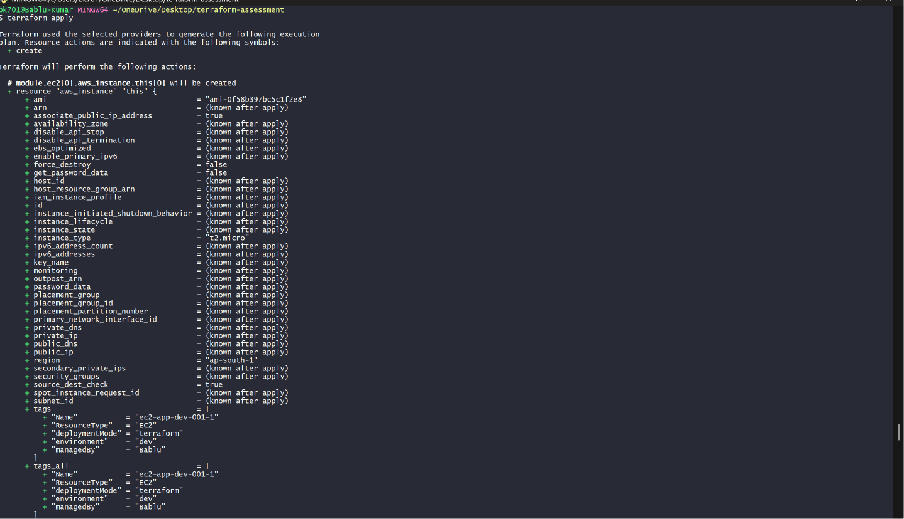
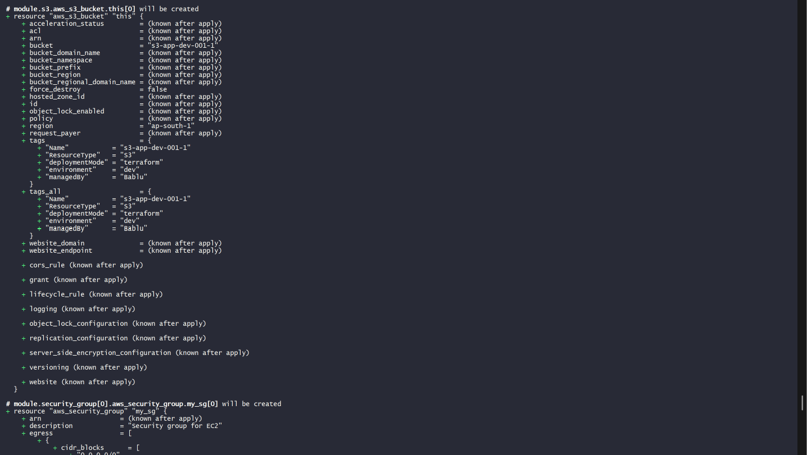
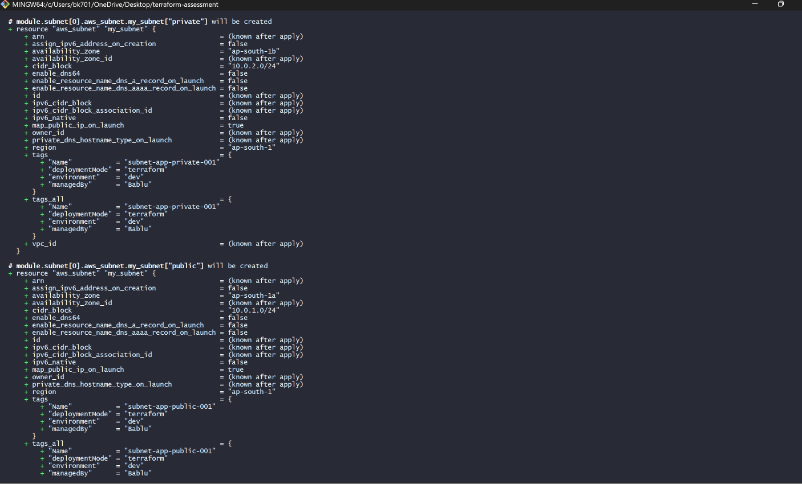
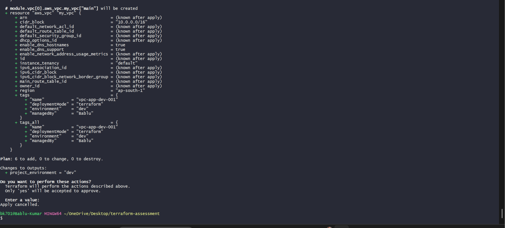

# Terraform AWS Infrastructure Deployment

This project is a Terraform-based AWS infrastructure setup created using reusable Terraform modules.
The goal of this project was to understand how real-world Terraform projects are structured and how different AWS resources connect with each other.

In this project, I created:

* VPC
* Subnets
* Security Groups
* EC2 Instances
* S3 Buckets

using separate Terraform modules and connected them together from the root module.

---

# Project Architecture

```text id="4pp00j"
VPC
 ↓
Subnet
 ↓
Security Group
 ↓
EC2 Instance

S3 Bucket
```

---

# Technologies Used

* Terraform
* AWS
* EC2
* VPC
* S3
* Security Groups

---

# Folder Structure

```text id="8ktjlwm"
terraform-aws-assessment/
│
├── main.tf
├── variables.tf
├── outputs.tf
├── versions.tf
├── locals.tf
├── terraform.tfvars
│
└── modules/
    │
    ├── vpc/
    ├── subnet/
    ├── security-group/
    ├── ec2/
    └── s3/
```

---

# What I Learned in This Project

During this project, I practiced and understood:

* Terraform Modules
* Resource Dependencies
* count Meta Argument
* for_each Meta Argument
* Dynamic Blocks
* Terraform Functions
* Lifecycle Blocks
* Variables and Outputs
* Reusable Infrastructure
* AWS Networking Basics

---

# Root Module Files Explanation

## versions.tf

This file is used to define:

* Terraform version
* AWS provider version

It also connects Terraform with AWS using provider configuration.

---

## variables.tf

This file contains input variables like:

* region
* project name
* environment
* tags

Instead of hardcoding values everywhere, variables make the project reusable.

---

## terraform.tfvars

This file stores actual values for variables.

Example:

```hcl id="njvmbo"
aws_region  = "ap-south-1"
project_name = "app"
environment  = "dev"
```

---

## locals.tf

Used for:

* common tags
* reusable naming convention
* cleaner code

Example naming structure:

```text id="x5jlwm"
vpc-app-dev-001
ec2-app-dev-001
```

---

## outputs.tf

Used to display values after deployment.

Example:

* VPC ID
* EC2 Public IP
* Bucket Name

---

# Modules Explanation

---

# 1. VPC Module

This module creates the AWS VPC.

The VPC acts like a private network where all resources are deployed.

Features used:

* for_each
* lifecycle block
* tags
* functions

---

## VPC Verification





---

# 2. Subnet Module

This module creates subnets inside the VPC.

Two subnets were created:

* Public Subnet
* Private Subnet

Features used:

* for_each
* dynamic naming
* lifecycle block

---

# 3. Security Group Module

This module creates Security Groups for EC2 instances.

Security Groups work like firewalls.

Allowed ports:

* 22 → SSH
* 80 → HTTP
* 443 → HTTPS

Features used:

* count
* dynamic block
* lifecycle block
* Terraform functions

---

## Security Group Verification





---

# 4. EC2 Module

This module launches EC2 instances inside the subnet and attaches Security Groups.

Features used:

* count
* lifecycle block
* reusable variables
* tags

Instance details:

* Instance Type → t2.micro
* Region → ap-south-1

---

## EC2 Verification





---

# 5. S3 Module

This module creates S3 buckets.

S3 is used for object storage like:

* backups
* logs
* files

Features used:

* count
* lifecycle block
* reusable naming
* tags

---

## S3 Verification





---


# Terraform Plan and Apply

After completing all module configurations and Terraform setup, the next step was to verify the infrastructure and deploy it into AWS.

Before creating resources, Terraform was used to check the execution plan and validate how many resources would be created.

---

# Terraform Plan

The following command was used:

```bash id="q9y4vx"
terraform plan
```

This command helps in understanding:

* what resources Terraform will create
* which resources will be modified
* whether any resources will be destroyed

It acts like a preview before actual deployment.

During the plan phase, Terraform showed:

* VPC creation
* Subnet creation
* Security Group creation
* EC2 Instance creation
* S3 Bucket creation

along with all tags, configurations, and dependencies.

---


---

# Terraform Apply

After verifying the execution plan, the infrastructure was deployed using:

```bash id="f7v9tk"
terraform apply
```

Terraform then asked for confirmation before creating resources.

Example:

```text id="p4m8wy"
Do you want to perform these actions?
Only 'yes' will be accepted to approve.
```

After entering:

```text id="t2x6rb"
yes
```

Terraform started creating all AWS resources automatically.


## Terraform Apply Output









---

# Resources Created Successfully

Terraform deployed:

* VPC
* Public and Private Subnets
* Security Groups
* EC2 Instance
* S3 Bucket

All resources were created with:

* reusable modules
* dynamic configuration
* proper tags
* naming conventions
* lifecycle blocks

---

# Terraform Apply Verification





---


