# Terraform Day-1
  
In this hands-on lab, Terraform was installed and configured, AWS resources were created and modified, and important Terraform commands like `plan`, `apply`, `refresh`, `validate`, `fmt`, `show`, and `state` were explored.

---

# What is Terraform?

Terraform is an Infrastructure as Code (IaC) tool developed by HashiCorp.

Using Terraform, cloud infrastructure can be created and managed using code instead of manually creating resources from the AWS Console.

Example resources:
--> VPC  
--> EC2 Instance  
--> S3 Bucket  
--> Subnets  
--> Security Groups

---

# Labs Covered

--> Lab 1 - Install and Verify Terraform  
--> Lab 2 - Setup Terraform Alias  
--> Lab 3 - Create First Terraform Resource  
--> Lab 4 - Create Multiple Resources Using Terraform  
--> Lab 5 - Modify Existing Terraform Resource  
--> Lab 6 - Terraform Refresh and State Management  
--> Lab 7 - Explore Additional Terraform Commands  

---

# Lab 1 - Install and Verify Terraform

In this lab, Terraform was installed from the official HashiCorp website and verified successfully in the local system using the `terraform version` command.

## Install Terraform

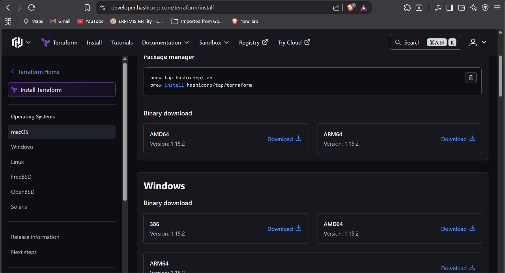

---

## Verify Terraform Installation

Command used:

```bash
terraform version
```

Terraform version output confirmed that Terraform was successfully installed and configured.

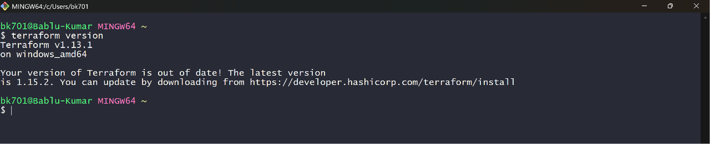

---

# Lab 2 - Setup Terraform Alias

In this lab, a Terraform alias was configured in Git Bash to simplify Terraform commands.

Instead of typing:

```bash
terraform
```

the shortcut command:

```bash
tf
```

was configured and used.

## Command Used

```bash
echo "alias tf='terraform'" >> ~/.bashrc
source ~/.bashrc
```

## Verify Alias

```bash
tf version
```

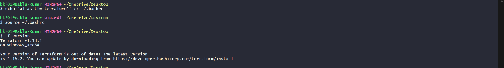

---

# Lab 3 - Create First Terraform Resource

In this lab, AWS provider configuration and the first VPC resource were created using Terraform.

## Provider Configuration

```hcl
provider "aws" {
  region = "ap-south-1"
}
```

## VPC Resource

```hcl
resource "aws_vpc" "example" {
  cidr_block = "10.0.0.0/16"
}
```

Terraform configuration and plan execution:

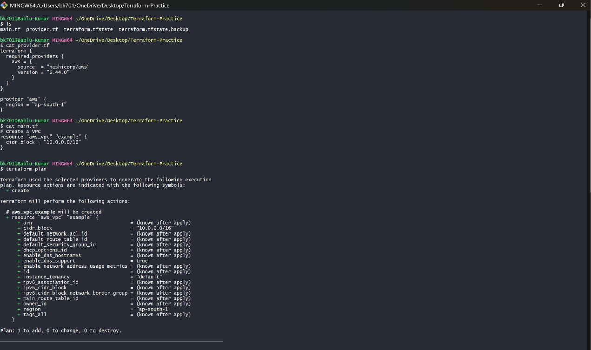

---

## Terraform Plan

The following command was used:

```bash
terraform plan
```

This command checks the Terraform configuration and shows what infrastructure changes Terraform is going to perform.

Output:

```text
Plan: 1 to add
```

meaning one new resource will be created.

---

## Terraform Validate

The following command was used to validate Terraform configuration syntax:

```bash
terraform validate
```

Output:

```text
Success! The configuration is valid.
```

---

## Terraform Apply

The following command was used:

```bash
terraform apply
```

Terraform asked for confirmation before creating infrastructure resources.

After approval, the VPC resource was successfully created in AWS.

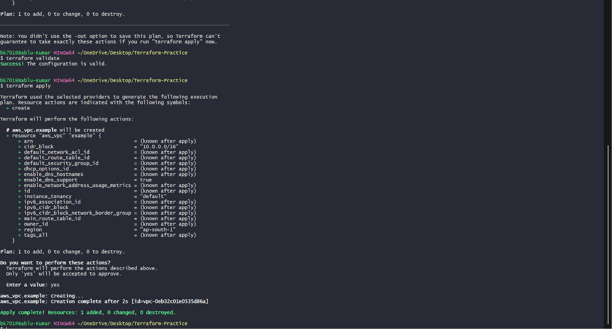

---

# Lab 4 - Create Multiple Resources Using Terraform

In this lab, multiple AWS resources such as EC2 Instance and VPC were created using Terraform configuration files.

---

## Create First EC2 Resource

Terraform EC2 configuration:

```hcl
resource "aws_instance" "example" {
  ami           = "ami-01b40e1bcccae197a"
  instance_type = "t2.micro"

  tags = {
    Name = "HelloWorld"
  }
}
```

Terraform detected the new resource using `terraform plan`.

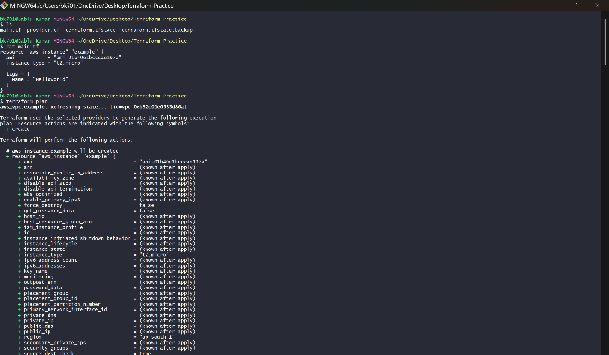

---

## Apply EC2 Resource

The following command was used:

```bash
terraform apply
```

Terraform successfully created the EC2 resource.

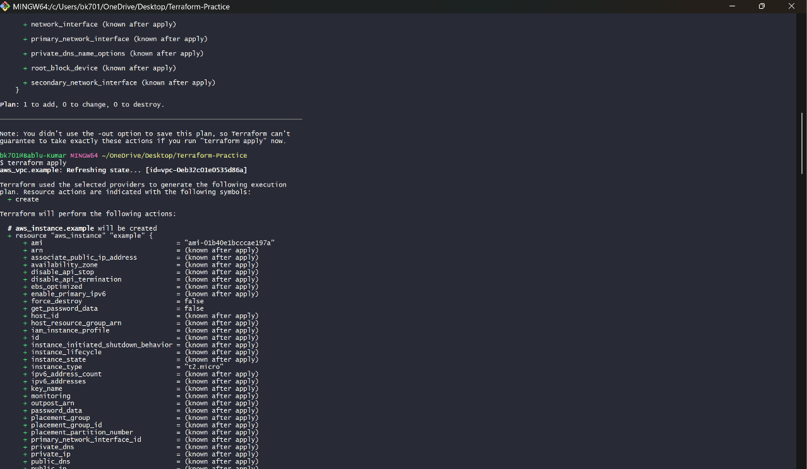

---

## Add Second Resource

A second VPC resource was added along with the EC2 instance.

```hcl
resource "aws_vpc" "my_vpc" {
  cidr_block = "172.16.0.0/16"

  tags = {
    Name = "tf-example"
  }
}
```

Terraform detected another new infrastructure resource.

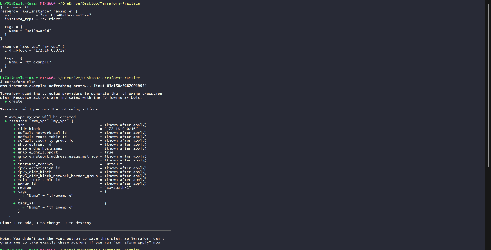

---

## Apply Second Resource

Terraform created the second VPC successfully.

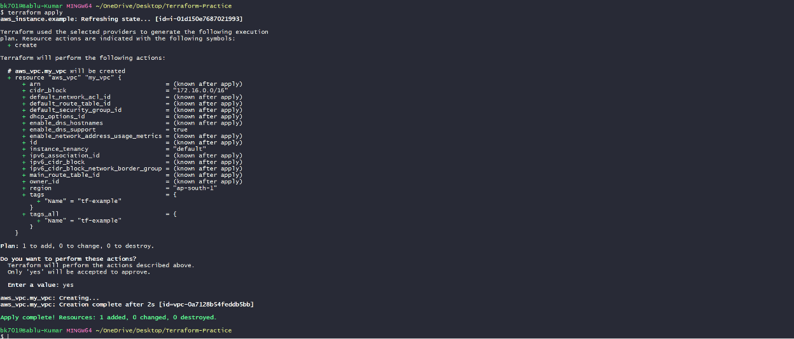

---

## Verify Resources in AWS Console

### Verify EC2 Resource

The EC2 instance was successfully running in AWS Console.

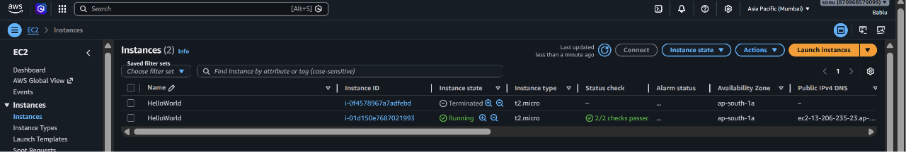

---

### Verify VPC Resource

The VPC resource was successfully created in AWS.

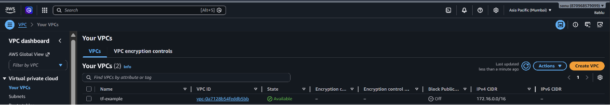

---

# Lab 5 - Modify Existing Terraform Resource

In this lab, existing VPC resource values such as CIDR block and Name tag were modified to understand Terraform change detection and replacement behavior.

---

## Existing Resource

Initial resource values:

```hcl
cidr_block = "172.16.0.0/16"
Name = "tf-example"
```

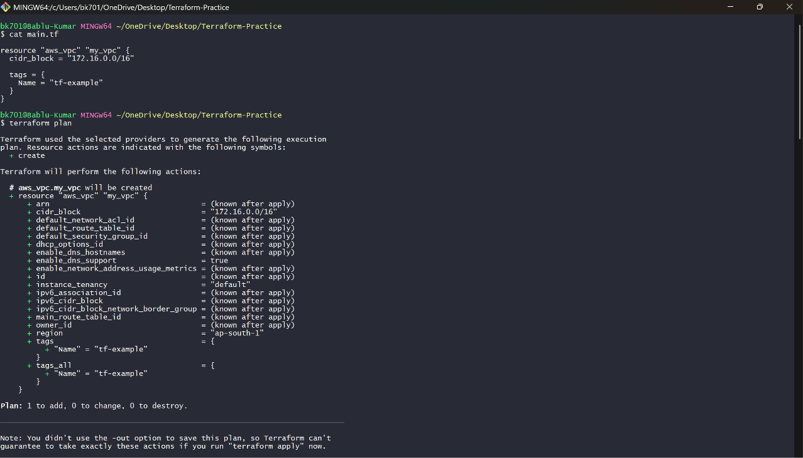

---

## Resource Creation

Terraform applied the initial infrastructure configuration.

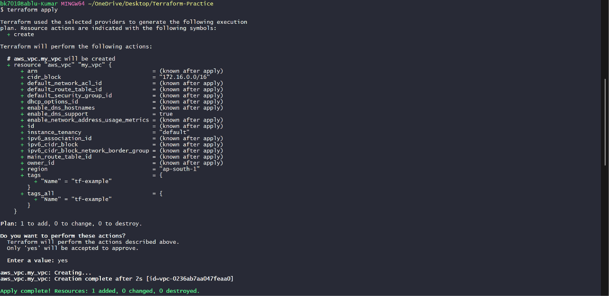

---

## Verify Resource

The created VPC resource was verified in AWS Console.

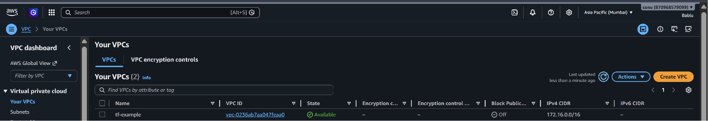

---

## Modify Existing Resource

The following changes were made:

```hcl
cidr_block = "10.0.0.0/16"
Name = "tf-example1"
```

Terraform detected infrastructure changes and planned to replace the VPC resource.

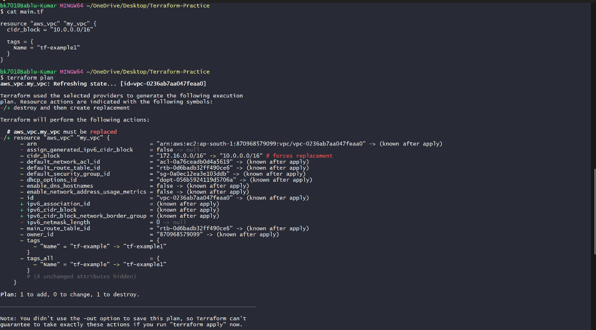

---

## Why Resource Was Replaced

Changing some properties like:

```hcl
cidr_block
```

forces Terraform to:
* Destroy existing resource  
* Create a new replacement resource

Terraform output showed:

```text
-/+ destroy and then create replacement
```

---

## Apply Modified Changes

Terraform destroyed the old VPC and created a new updated VPC.

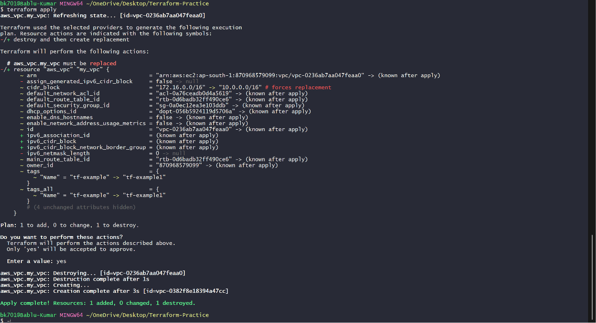

---

## Verify Updated Resource

The updated VPC resource was successfully visible in AWS Console.

Updated values:
--> CIDR Block  
--> Name Tag

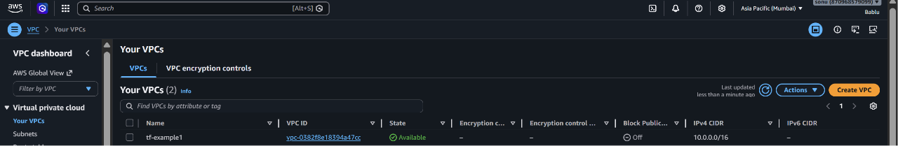

---

# Lab 6 - Terraform Refresh and State Management

In this lab, manual changes were performed directly in AWS Console to understand Terraform state management and configuration drift.

---

## Created Resource

Terraform created the VPC resource successfully.

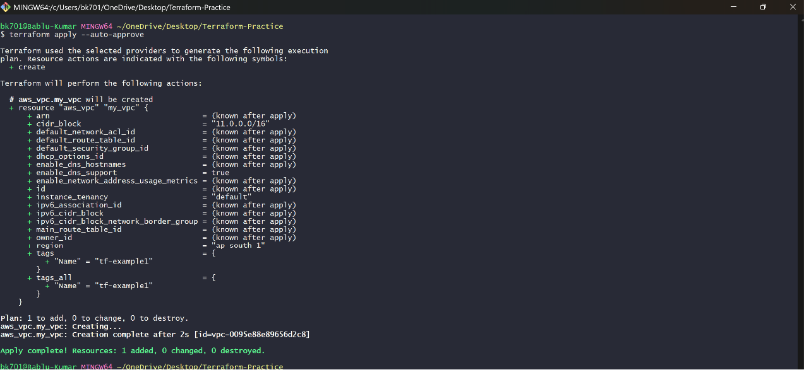

---

## Verify Resource in AWS

The created resource was verified from AWS Console.

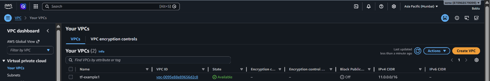

---

## Manual Change in AWS Console

The VPC Name tag was manually changed in AWS Console:

```text
tf-example1 → my-vpc
```

This created a situation called:

```text
Configuration Drift
```

Meaning:
--> AWS infrastructure no longer matches Terraform configuration.

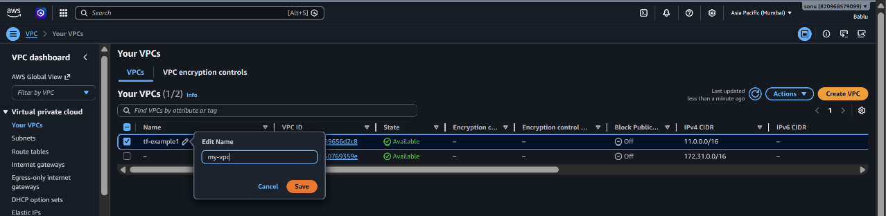

---

## Terraform State File Before Refresh

Terraform stores infrastructure details inside:

```text
terraform.tfstate
```

Before refresh, the local Terraform state file still stored:

```text
Name = tf-example1
```

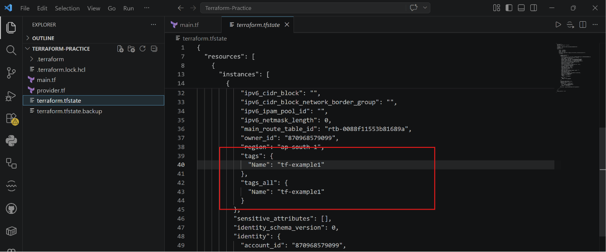

---

## Terraform Refresh Command

The following command was used:

```bash
terraform refresh
```

Purpose:
--> Sync Terraform state with actual AWS infrastructure values

Terraform checked AWS infrastructure and updated the local state file.

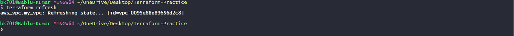

---

## Terraform State File After Refresh

After refresh, Terraform updated the local state file automatically:

```text
Name = my-vpc
```

Terraform now understood the actual AWS infrastructure value.

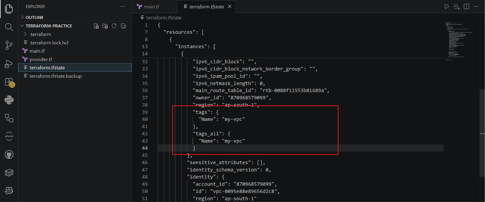

---

## Difference Between `terraform refresh` and `terraform plan`

| Command | Purpose |
|---|---|
| `terraform refresh` | Updates Terraform state from actual cloud resources |
| `terraform plan` | Shows what Terraform will change |

---

## Important Concept Learned

Terraform always treats:

```text
Terraform Code (.tf file)
```

as the main source of truth.

Even if someone manually changes AWS resources, Terraform tries to bring infrastructure back to the Terraform configuration state.

This concept is called:

```text
Desired State Management
```

---

# Lab 7 - Explore Additional Terraform Commands

In this lab, additional Terraform utility commands were explored to understand configuration validation, formatting, infrastructure details, and Terraform state management.

---

## `terraform validate`

Used to validate Terraform configuration syntax and check for errors before applying infrastructure.

Hands-on performed:
* Checked Terraform configuration syntax  
* Verified configuration validity before deployment

```bash
terraform validate
```

---

## `terraform fmt`

Used to automatically format Terraform configuration files into a clean and readable structure.

Hands-on performed:
* Formatted Terraform configuration files  
* Improved code readability and standard formatting

```bash
terraform fmt
```

---

## `terraform show`

Used to display detailed information about Terraform-managed infrastructure and Terraform state contents.

Hands-on performed:
* Viewed infrastructure details  
* Checked Terraform state information and metadata

```bash
terraform show
```

---

## `terraform state`

Used to explore and manage Terraform-managed resources stored inside the Terraform state file.

Hands-on performed:
* Explored Terraform-managed resources  
* Viewed resources tracked inside `terraform.tfstate`

```bash
terraform state list
```

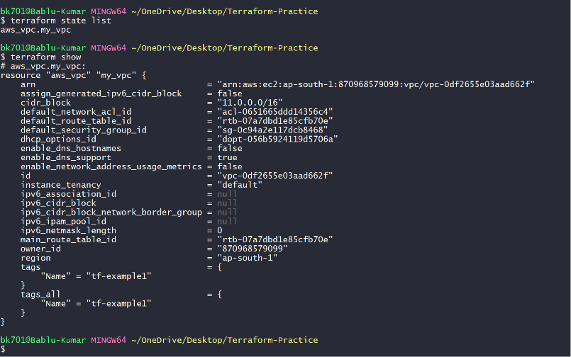

---

