# Terraform Variables, Locals, Backend, Outputs & Sensitive Variables Labs

This repository contains hands-on Terraform labs focused on learning:

* Variable declaration methods
* Different variable types
* Local values (`locals`)
* Combining locals with variables
* Remote backend configuration using AWS S3 + DynamoDB
* Terraform outputs
* Sensitive variables

These labs were performed using AWS resources and Terraform CLI.

---

# Prerequisites

Before starting these labs, make sure you have:

* AWS Account
* Terraform Installed
* AWS CLI Configured
* IAM User with required permissions
* Git Bash / Terminal

---

# Lab 1 — Try using every variable declaration method taught in Session 2

## Objective

Learn different ways to pass variables in Terraform and apply them across resources.

---

## Methods Covered

* Default Variables
* Manual Input Variables
* `.tfvars` File
* Command Line Variables
* Environment Variables

---

## 1. Using Default Variable Values

Terraform automatically uses the default values defined inside `variables.tf`.

### Image Reference

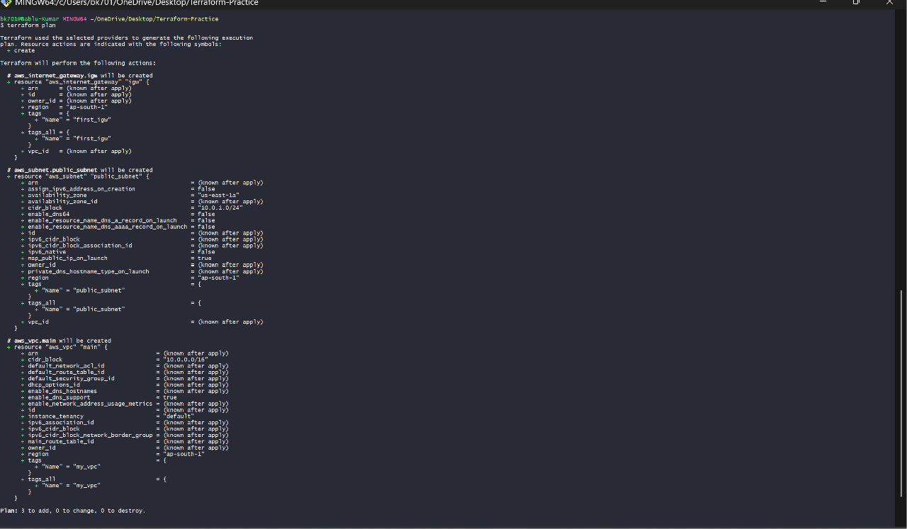

---

## 2. Passing Variables Manually During Execution

Terraform asks the user to provide variable values interactively.

### Image References

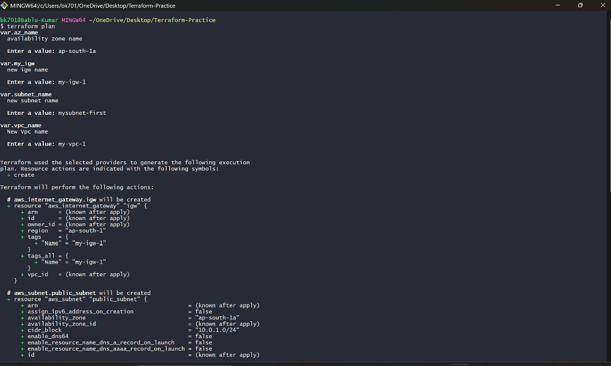

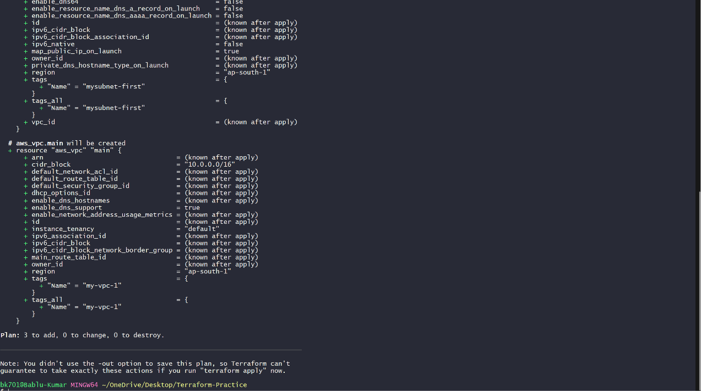

### What Happened

* Terraform prompted for variable values.
* Values were entered manually from terminal.
* Resources were planned using those values.

---

## 3. Using terraform.tfvars File

Variable values were stored inside a `.tfvars` file and automatically loaded by Terraform.

### Image Reference

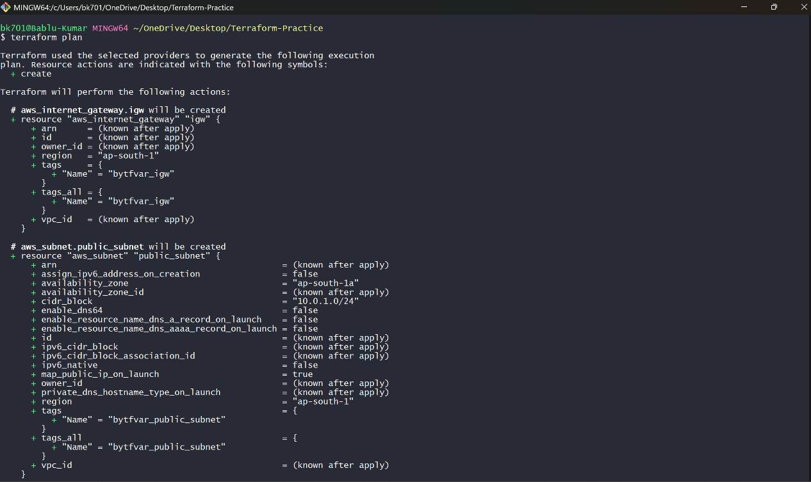

### Example

```hcl
vpc_name    = "bytfvars_my_vpc"
subnet_name = "bytfvar_public_subnet"
new_igw      = "bytfvar_igw"
az_name     = "ap-south-1a"
```

---

## 4. Passing Variables Through Command Line

Variables were passed directly using the `-var` flag.

### Command Used

```bash
terraform plan -var="vpc_name=var-vpc" -var="subnet_name=var-public-subnet" -var="new_igw=var-first-igw" -var="az_name=ap-south-1b"
```

### Image References

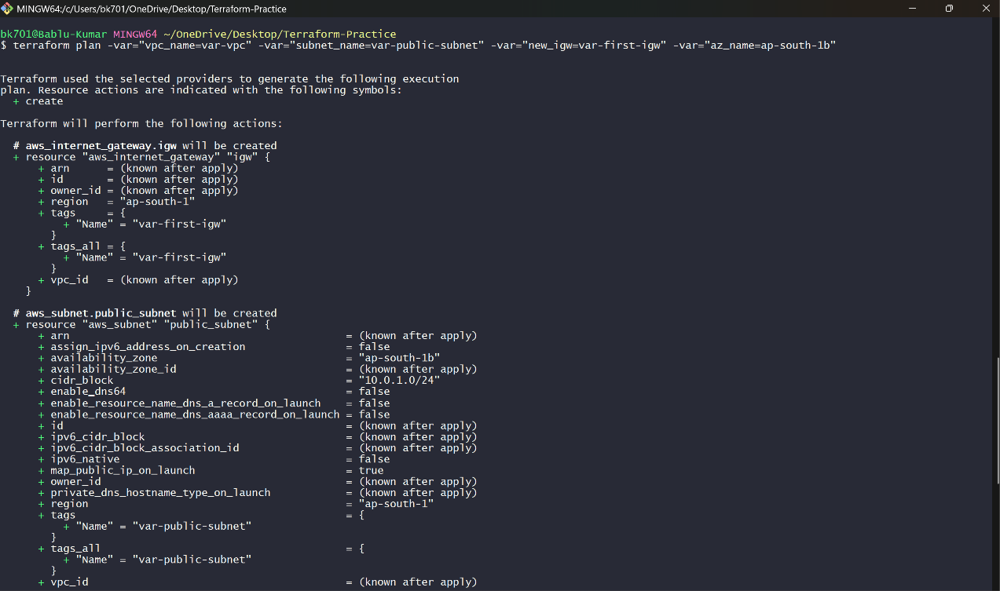

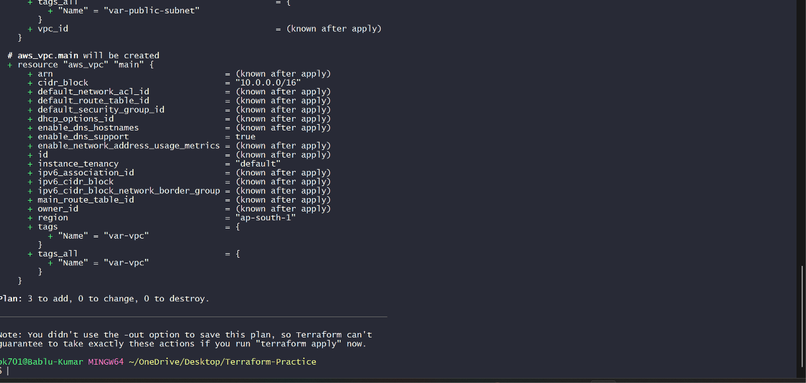

---

## 5. Using Environment Variables

Environment variables were exported using `TF_VAR_`.

### Commands Used

```bash
export TF_VAR_subnet_name="env_my_subnet"
export TF_VAR_new_igw="env_my-igw"
export TF_VAR_az_name="us-east-1b"
export TF_VAR_vpc_name="env_my_vpc"
```

### Image References

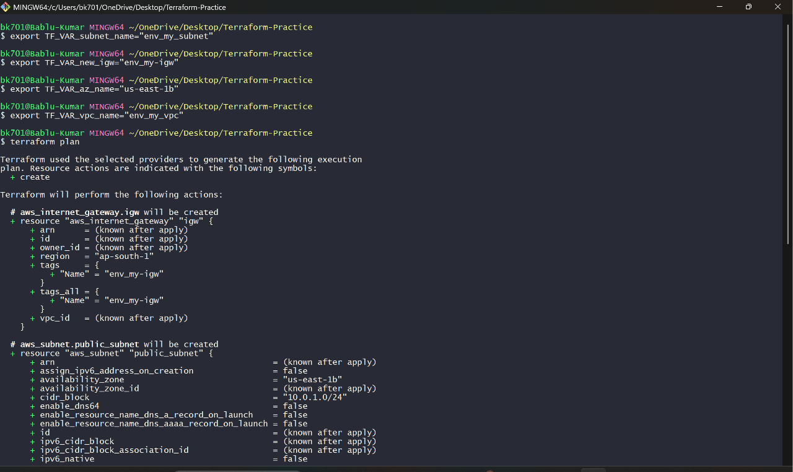

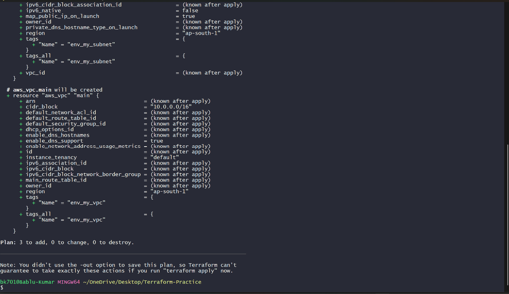

---

## 6. Using Custom Variable File with -var-file

Custom variable files were used during Terraform execution.

### Command Used

```bash
terraform plan -var-file=vars/dev.tfvars
```

### Image References

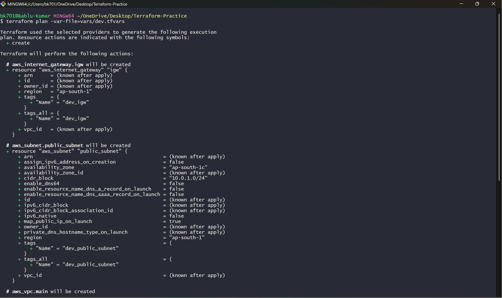

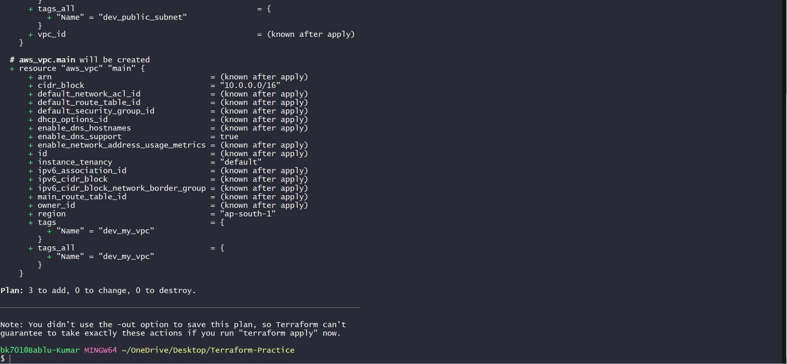

---

# Lab 2 — Deploy resources using Terraform with different variable types

## Objective

Use multiple Terraform variable types while deploying AWS infrastructure.

---

## Variable Types Used

* `string`
* `number`
* `bool`
* `list`

---

## Resources Created

* AWS VPC
* AWS EC2 Instances

---

## Example Variable Types

```hcl
variable "vpc_name" {
  type = string
  #default     = "my_vpc"
  description = "New Vpc name"
}

variable "instance_names" {
  type = list(string)

  #default = ["dev-server", "test-server", "prod-server"]
}

variable "instance_count" {
  type = number
  #default     = 1
  description = "number of EC2 instances to create"
  
}

variable "map_ip" {
  type        = bool
  #default     = true
  description = "map public ip on launch"
}

```

---

## What Happened

* Multiple EC2 instances were created using list variables.
* Boolean variable controlled public IP assignment.
* Number variable controlled instance count.
* String variable handled naming.

### Image References

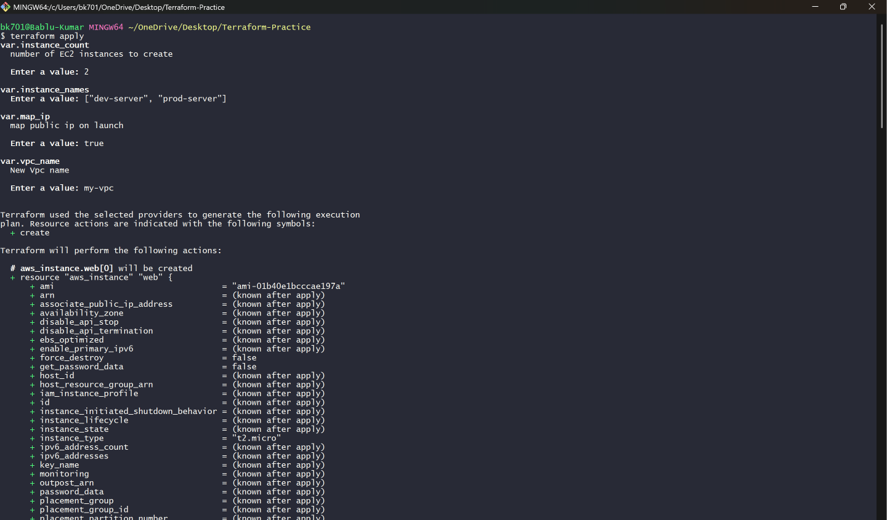

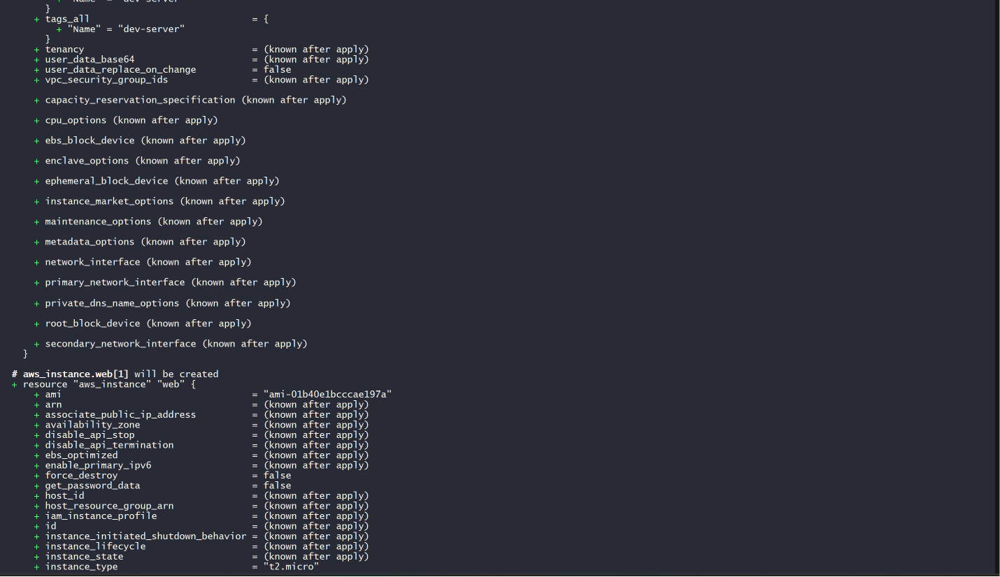

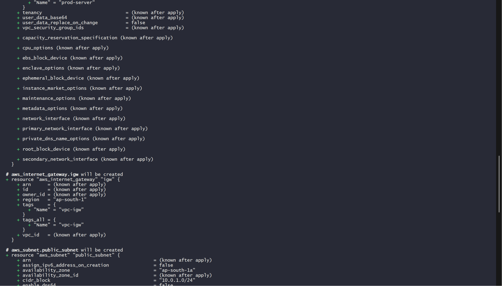

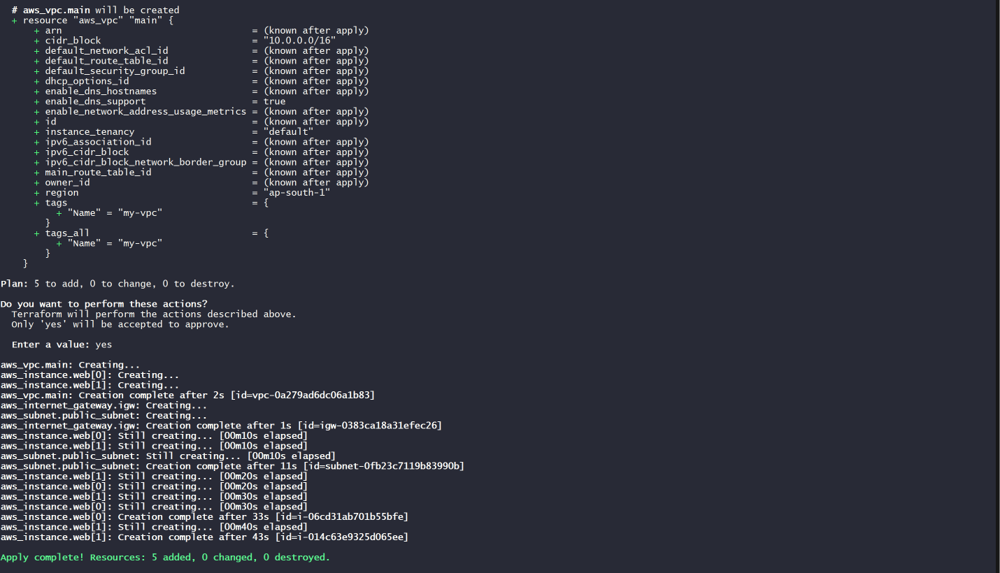

---

# Lab 3 — Use a locals block in a standard way

## Objective

Learn how to use Terraform `locals` to reduce repeated code and simplify naming.

---

## Example Used

```hcl
locals {
  prefix = "myapp"
  env = "dev"
  project = "terraform-project"
}
```

Resources reused the local value for naming consistency.

### Example

```hcl
Name = "${local.prefix}-${local.env}-${local.project}-vpc-igw"
```

---

## Benefits of Locals

* Avoid repeated values
* Improve readability
* Easier maintenance
* Standard naming conventions

---

### Image Reference

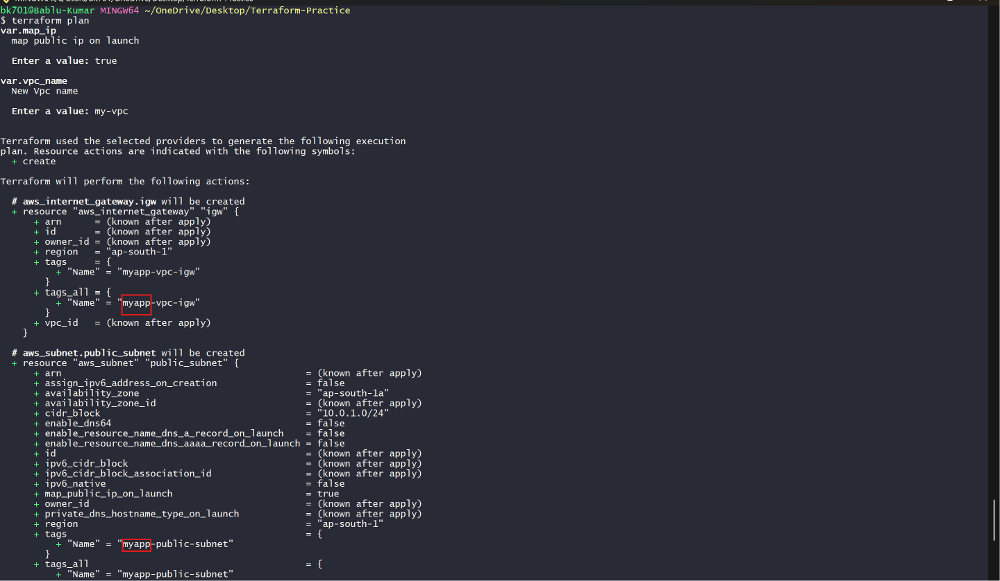

---

# Lab 4 — Combine locals and variables together

## Objective

Combine Terraform variables and local values to generate dynamic resource names.

---

## Example

```hcl
locals {
  project_name = "terraform-project"
  environment  = "dev"
}
```

```hcl
Name = "${var.app_name}-${local.environment}-${local.project_name}-vpc-igw"
```

---

## What Happened

* Variable input was combined with local values.
* Dynamic naming convention was implemented.
* Resources received standardized names automatically.

---

### Image References


---

# Lab 5 — Configure and test a remote backend

## Objective

Configure Terraform remote backend using:

* AWS S3 Bucket
* DynamoDB Table

This helps store Terraform state securely and enables state locking.

---

## Resources Created

* S3 Bucket
* DynamoDB Table

---

## Backend Configuration

```hcl
terraform {
  backend "s3" {
    bucket         = "first-my-s3-bucket70111"
    key            = "terraform.tfstate"
    region         = "ap-south-1"
    dynamodb_table = "my-first-dynamo-table"
  }
}
```

---

## What Happened

* Terraform state file moved from local system to S3.
* DynamoDB handled state locking.
* Backend initialization completed successfully.
* State file verified in S3 bucket.
* LockID verified inside DynamoDB table.

---

### Image References

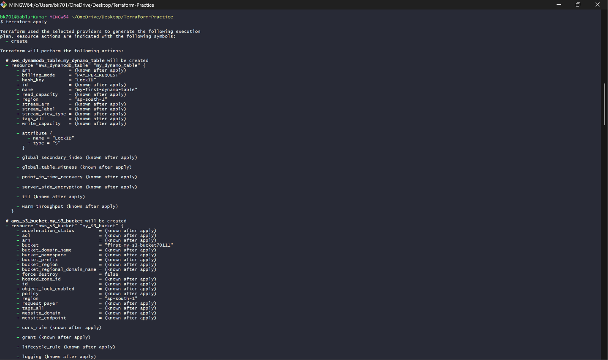

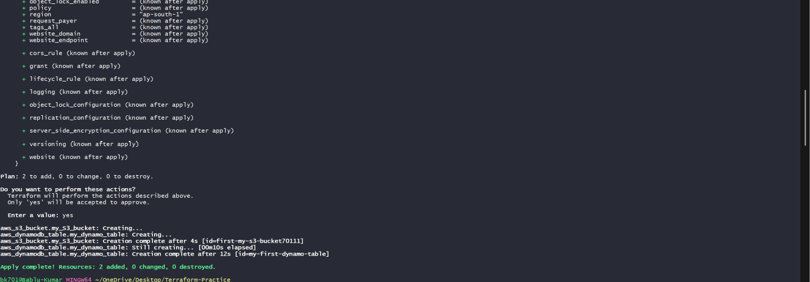

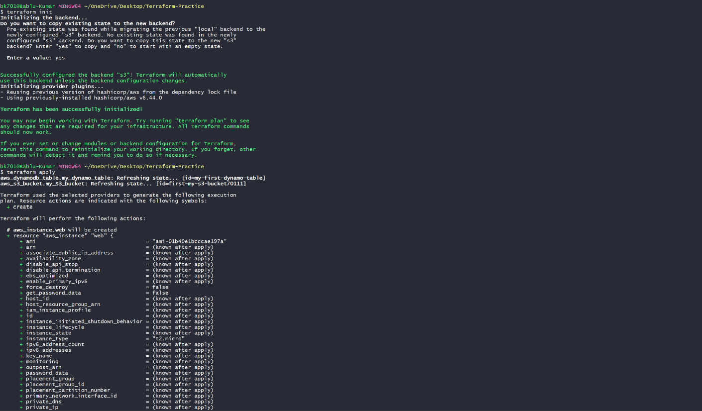

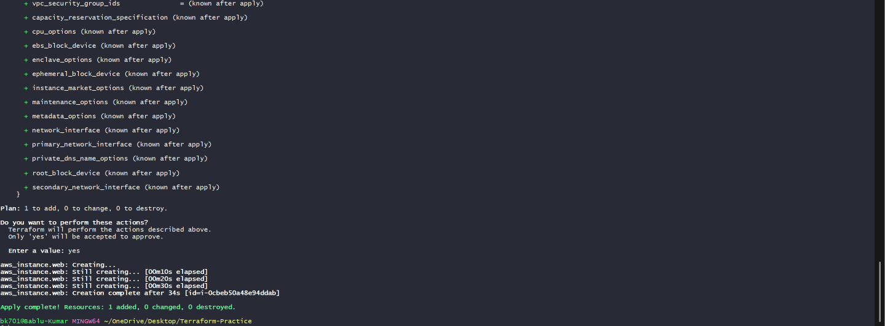

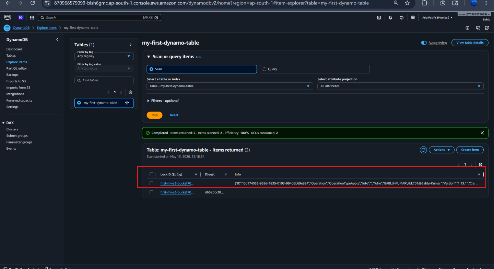

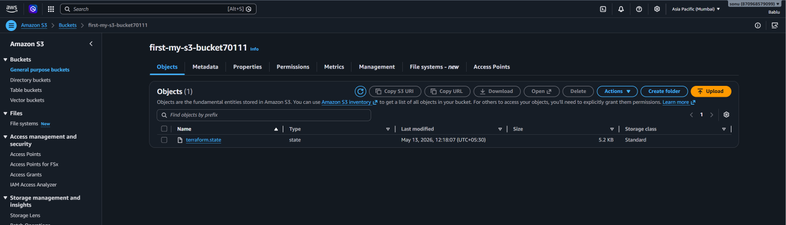

---

# Lab 6 — Use outputs to retrieve resource data

## Objective

Use Terraform outputs to display important infrastructure details after deployment.

---

## Example Outputs

```hcl
output "aws_vpc_id" {
  value = aws_vpc.main.id
}

output "instance_public_ip" {
  value = aws_instance.web.public_ip
}
```

---

## What Happened

Terraform displayed:

* VPC ID
* Public IP
* Private IP
* VPC Name

after successful deployment.

---

### Image References

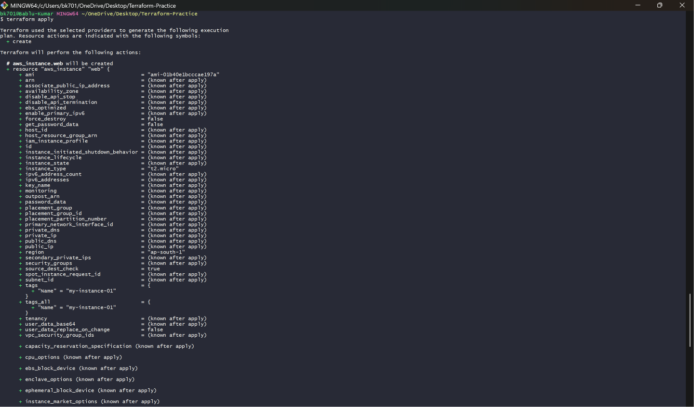

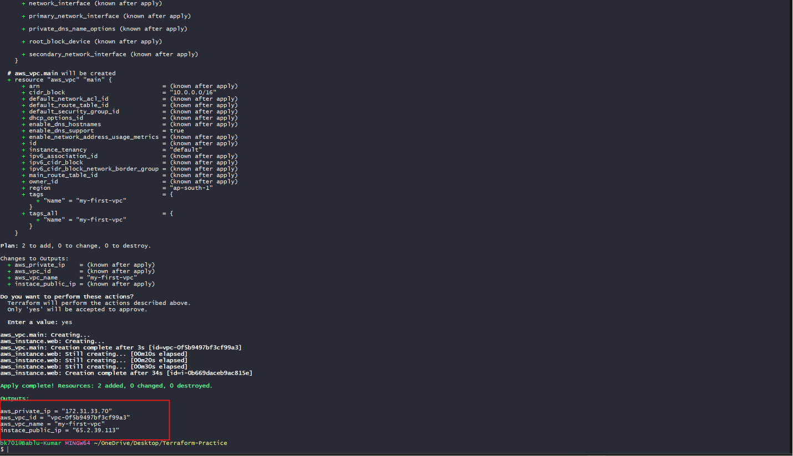

---

# Lab 7 — Experiment with sensitive variables

## Objective

Learn how Terraform masks sensitive values using:

```hcl
sensitive = true
```

---

## Example

```hcl
output "instance_public_ip" {
    value =aws_instance.web.public_ip
}

output "aws_vpc_id" {
    value =aws_vpc.main.id
    sensitive = true
}


output "aws_private_ip" {
    value = aws_instance.web.private_ip
    sensitive = true
}

output "aws_vpc_name" {
    value = aws_vpc.main.tags["Name"]
}


output "aws_instance_count" {
    value = length(aws_instance.web)
    sensitive = true
}

```

---

## What Happened

Terraform masked sensitive values during:

* Plan
* Apply
* Output display

Sensitive values appeared as:

```bash
<sensitive>
```

instead of revealing actual data.

---

## Benefits

* Prevent accidental secret exposure
* Improve security
* Hide sensitive infrastructure information

---

### Image References

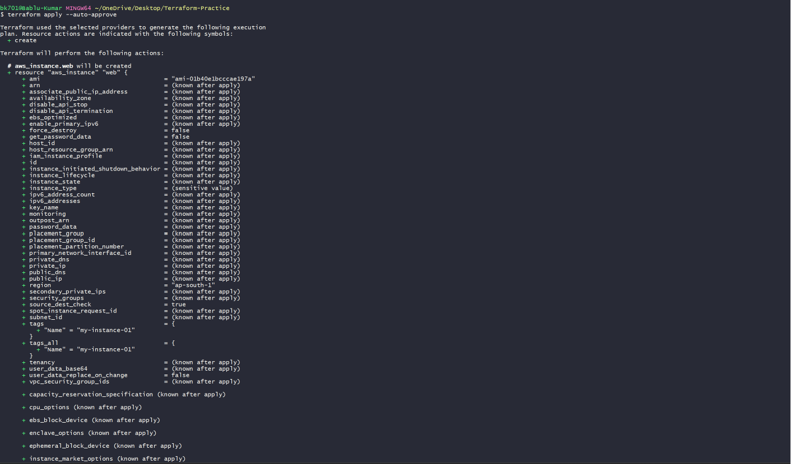

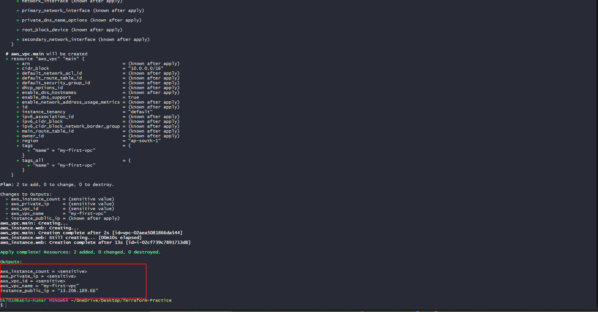

---

