# Terraform Practice Labs

This repository contains hands-on Terraform practice labs using AWS resources.
The purpose of these labs is to understand Terraform concepts like:

* Variables
* Count
* for_each
* Locals
* Dynamic Blocks
* Lifecycle
* depends_on
* Maps and Objects
* Conditional Resource Creation

---

# Tools Used

* Terraform
* AWS CLI
* VS Code
* AWS Cloud

---

# Lab 1 — Deploy S3 Buckets Using Count and List Variable

In this lab, multiple S3 buckets were created using:

* `count`
* list variable
* dynamic naming

The bucket names were generated automatically:

* storage0
* storage1
* storage2

This helps avoid writing the same resource multiple times manually.

---

## Terraform Code Logic

A list variable stores bucket names:

```hcl
variable "bucket_names" {
  default = ["storage0", "storage1", "storage2"]
}
```

Using:

```hcl
count = length(var.bucket_names)
```

Terraform creates 3 buckets automatically.

Each bucket name is accessed using:

```hcl
var.bucket_names[count.index]
```

---

## Terraform Plan Output

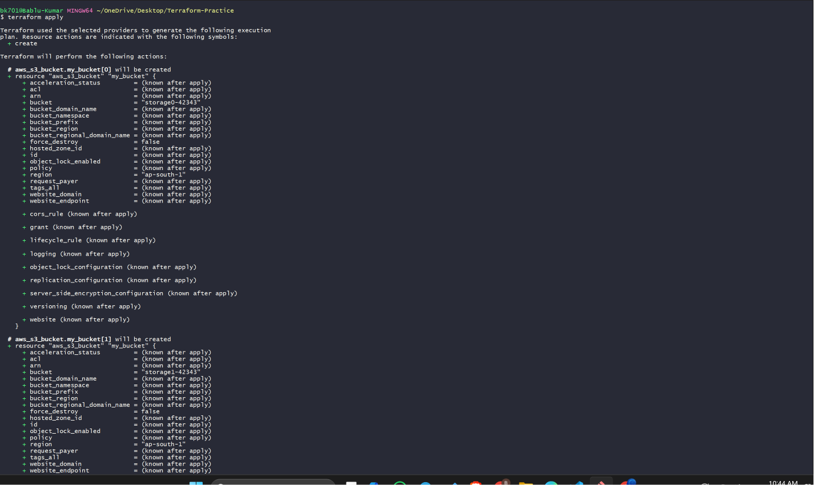

The output shows Terraform planning to create 3 S3 buckets.

---

## Terraform Apply Output

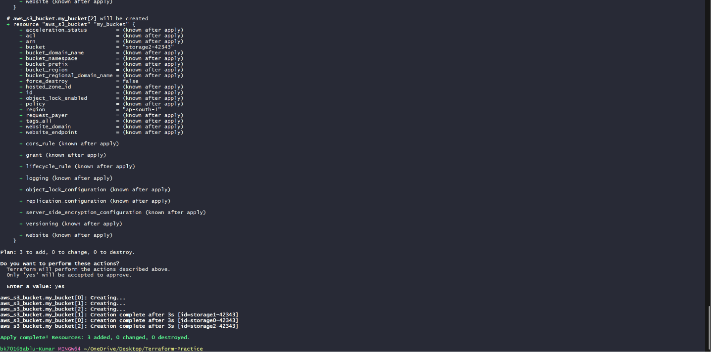

Terraform successfully created all buckets.

---

## AWS Console Verification

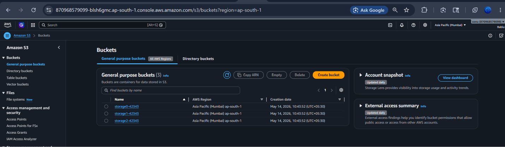

The buckets were successfully visible in AWS Console.

---

# Lab 2 — Deploy Resources Using Map and Object Variables

In this lab:

* `map`
* `object`

variable types were used.

This helps manage multiple configurations cleanly.

---

## Map Variable

Map variable was used for storing EC2 names.

Example:

```hcl
ec2_names = {
  dev  = "dev-server"
  prod = "prod-server"
}
```

Terraform accesses values using:

```hcl
var.ec2_names["dev"]
```

---

## Object Variable

Object variable stores structured data:

```hcl
object({
  instance_type = string
  count         = number
})
```

This helps store multiple related values together.

---

## Terraform Plan Output

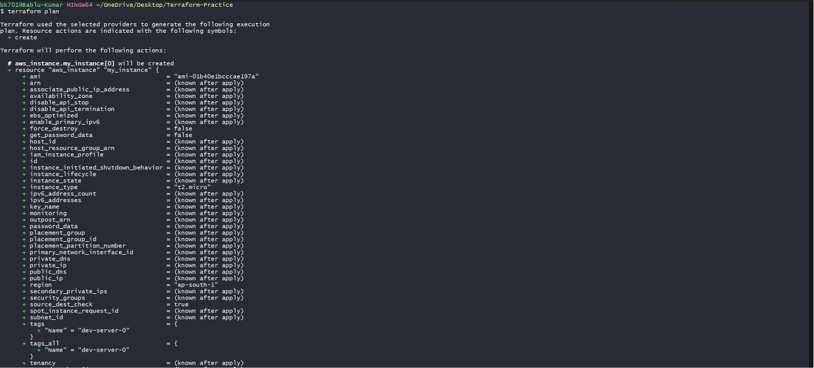
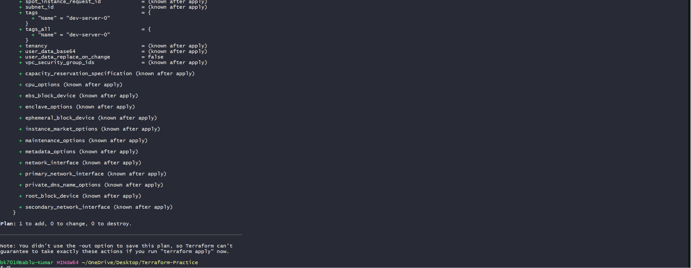

Terraform shows EC2 instance creation using map and object variables.

---

## Terraform Apply Output

The EC2 instance was successfully created.

---

# Lab 3 — Use Locals to Simplify Count Conditions

In this lab, `locals` were used to simplify conditions.

---

## Why Locals?

Instead of writing conditions repeatedly:

```hcl
count = var.environment == "dev" ? 1 : 0
```

a local value was created:

```hcl
locals {
  ec2_count = var.environment == "dev" ? 1 : 0
}
```

Then reused:

```hcl
count = local.ec2_count
```

This makes Terraform code cleaner and easier to manage.

---

## Local Variable Configuration

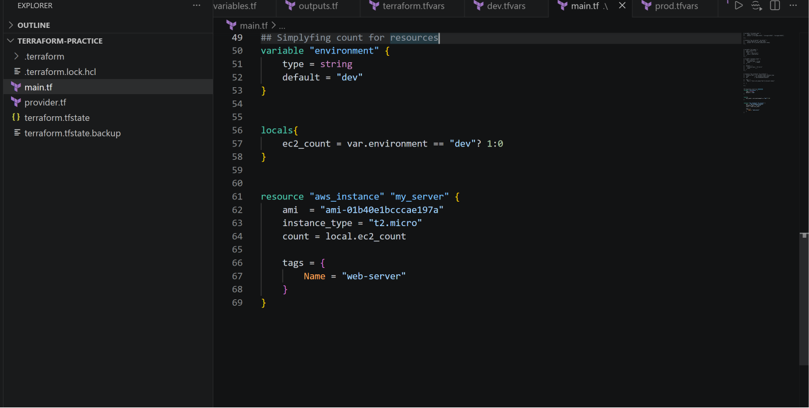

The image shows how local values simplify conditional resource creation.

---

# Lab 4 — Use for_each to Deploy Resources

In this lab:

* `for_each`
* conditional deployment
* boolean variables

were used.

Resources were deployed only when:

```hcl
enable_new = true
```

---

# Understanding for_each

`for_each` creates resources using keys and values.

Example:

```hcl
for_each = var.servers
```

Terraform loops through each item individually.

---

# Lab 4.1 — enable_new = false

When:

```hcl
enable_new = false
```

Terraform did not create additional resources.

---

## Output


No extra resources were created.

---

# Lab 4.1 — enable_new = true

When:

```hcl
enable_new = true
```

Terraform created resources.

---

## Output

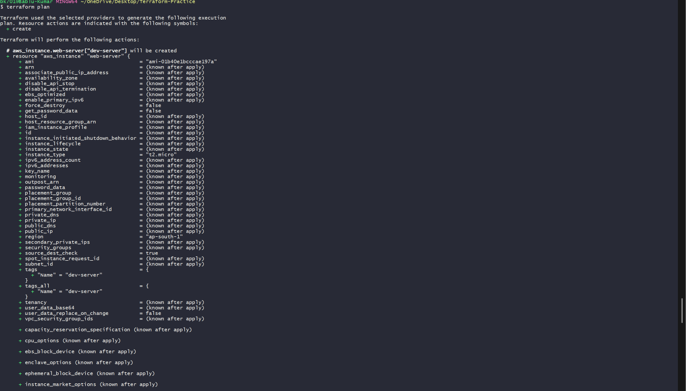

Resources were successfully planned.

---

# Lab 4.2 — for_each with Environment Variables

This lab demonstrates creating environment-specific servers.

Example:

* dev-server
* prod-server
* test-server

---

## Dev Server


Terraform planned creation of dev server.

---

## Prod Server


Terraform planned creation of prod server.

---

## Test Server

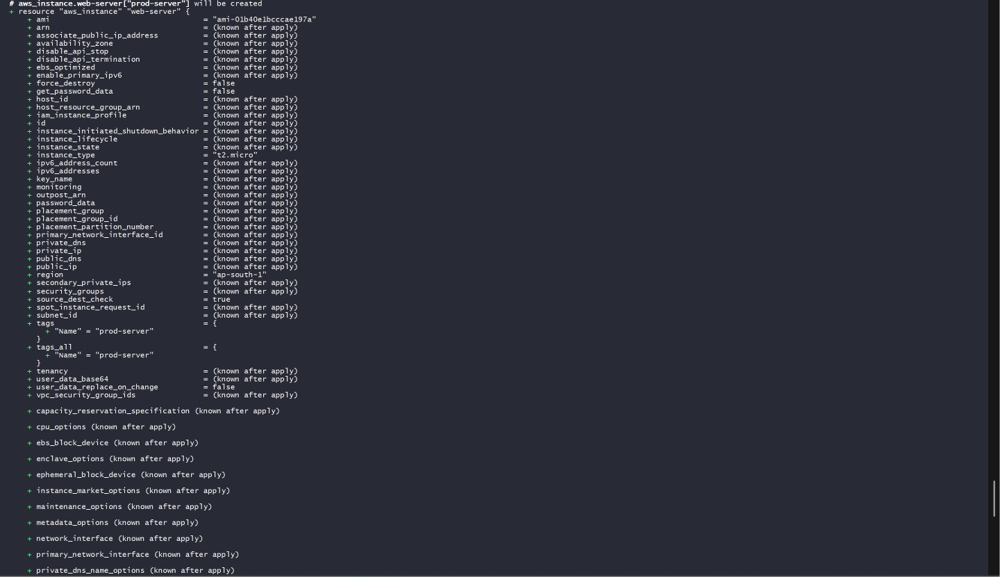
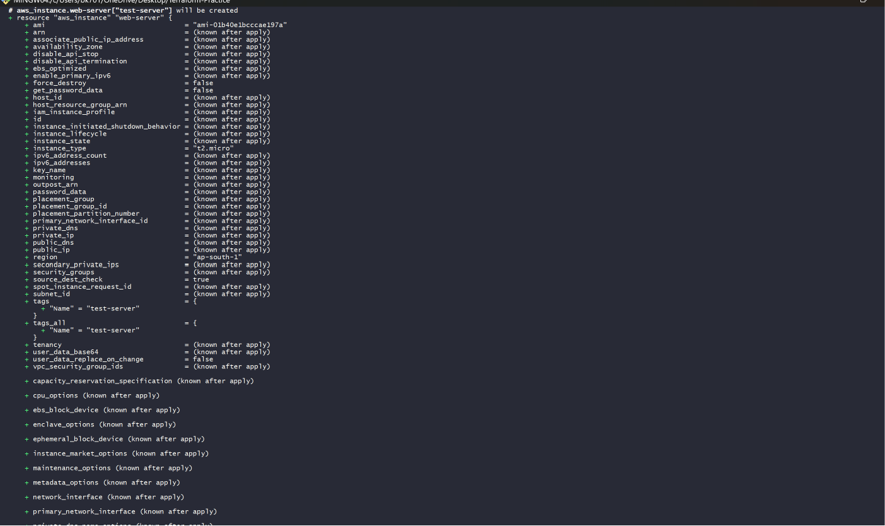

Terraform planned creation of test server.

---

# Lab 5 — Create Security Group Using Dynamic Block

In this lab:

* `dynamic block`
* ingress rules

were used.

---

## Why Dynamic Block?

Normally we write multiple ingress blocks manually:

```hcl
ingress {}
ingress {}
ingress {}
```

Dynamic block creates them automatically.

---

## Variable

Ports stored:

```hcl
[22, 80, 443]
```

Terraform loops through ports dynamically.

---

## Terraform Code

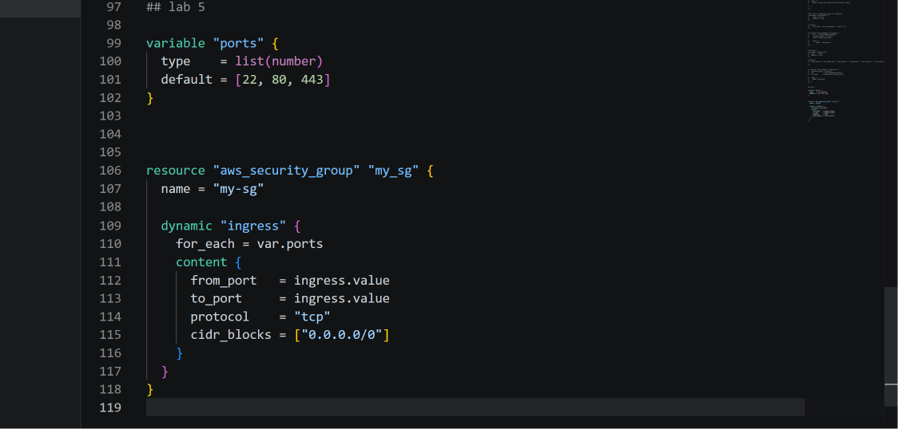

The dynamic block creates ingress rules automatically.

---

## Terraform Plan Output

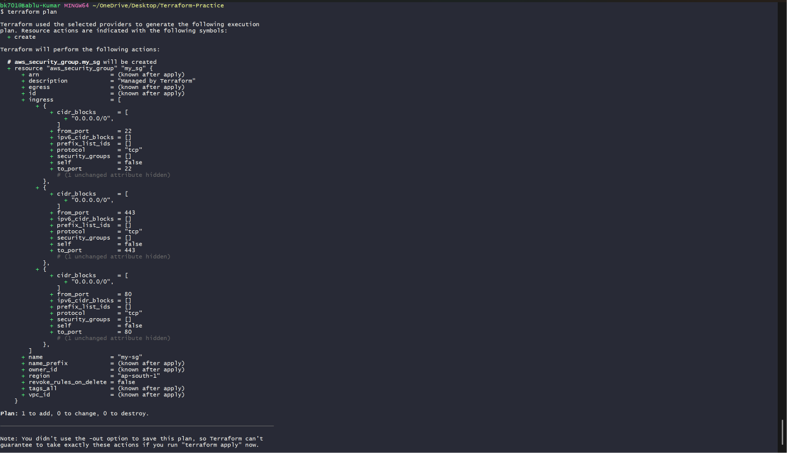

Terraform generated multiple ingress rules dynamically.

---

# Lab 6 — Use Dynamic Block and Count Together

In this lab:

* `count`
* `dynamic block`

were used together.

---

# What Happens?

`count = 2`

creates:

* my-sg-1
* my-sg-2

Inside each security group:

* port 22
* port 80
* port 443

were created dynamically.

---

## Terraform Code

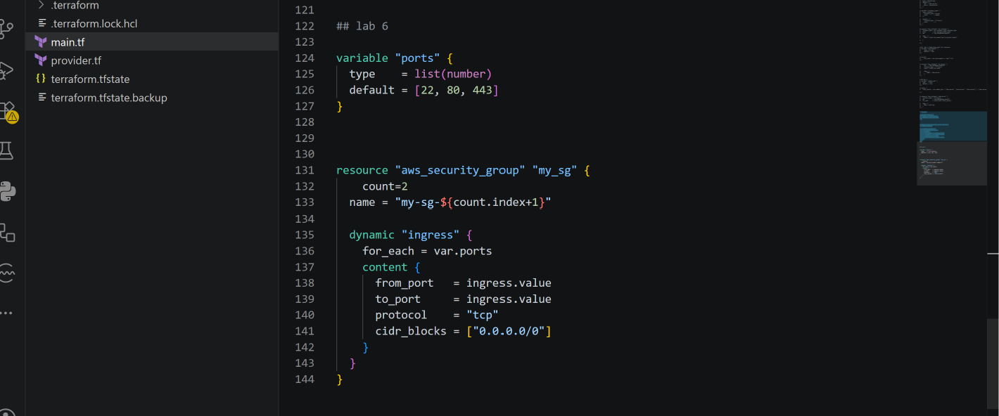

The image shows count and dynamic block together.

---

## Terraform Plan Output

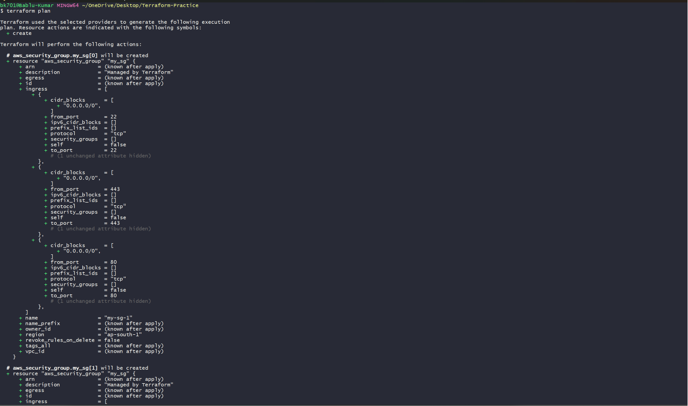

Terraform planned creation of multiple security groups.

---

## Terraform Generated Rules

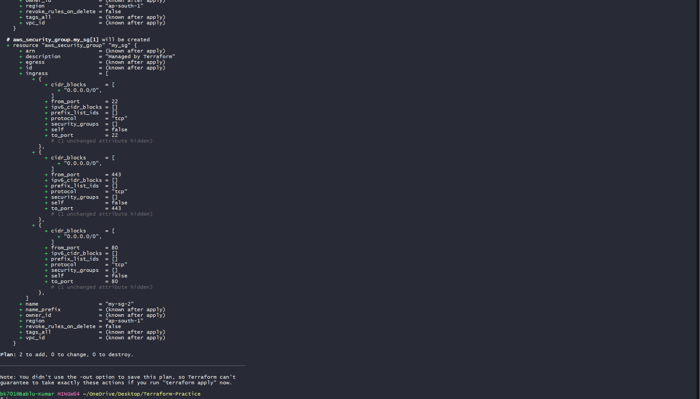

Each security group received multiple ingress rules dynamically.

---

# Lab 7 — depends_on and Lifecycle Configurations

This lab demonstrates:

* depends_on
* create_before_destroy
* prevent_destroy
* ignore_changes

---


# create_before_destroy

This lifecycle rule creates new resource first before deleting old resource during replacement.

This helps avoid downtime.

---

## Example Output

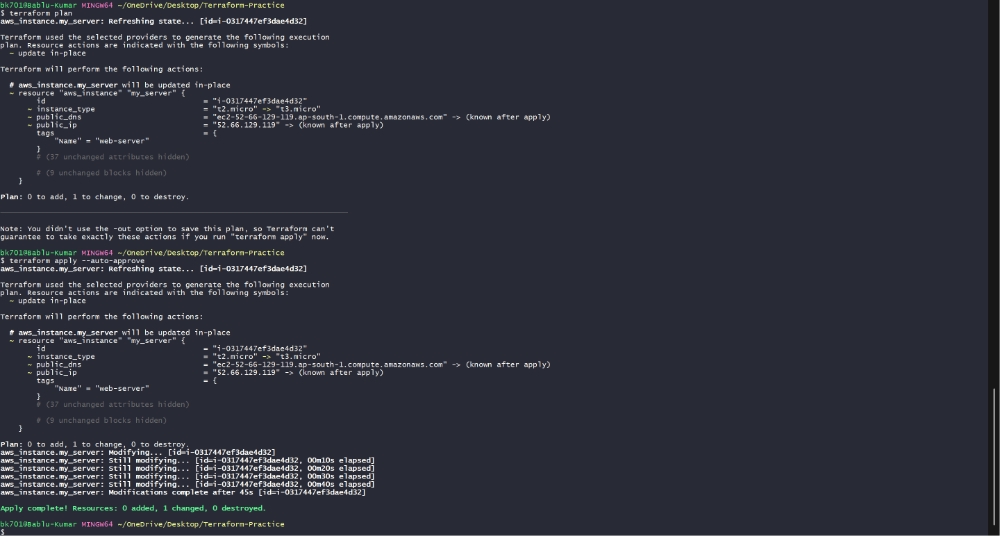


Terraform updated the EC2 instance configuration.

---

# prevent_destroy

This lifecycle rule prevents accidental deletion.

---

## Error Output

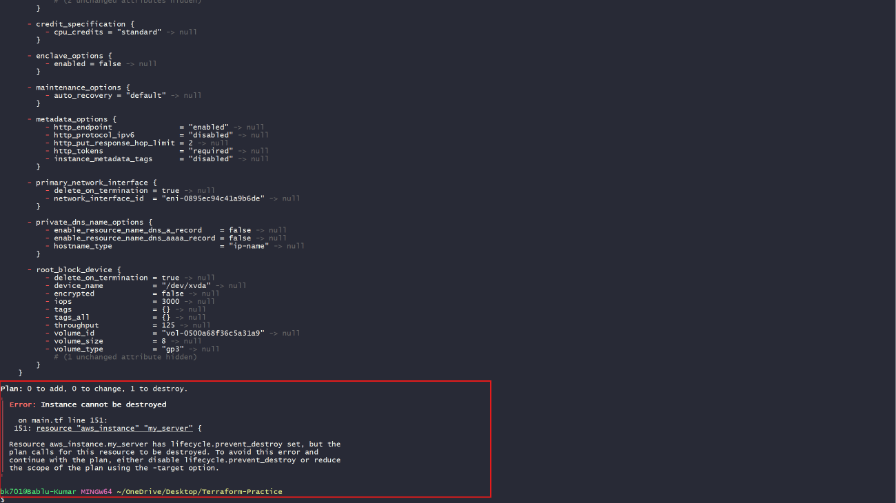

Terraform blocked resource destruction because `prevent_destroy = true`.

---

# ignore_changes

Terraform ignores manual changes made outside Terraform.

---

## Example

If someone changes EC2 tags manually in AWS Console:

Terraform will ignore those changes.

---

## Output

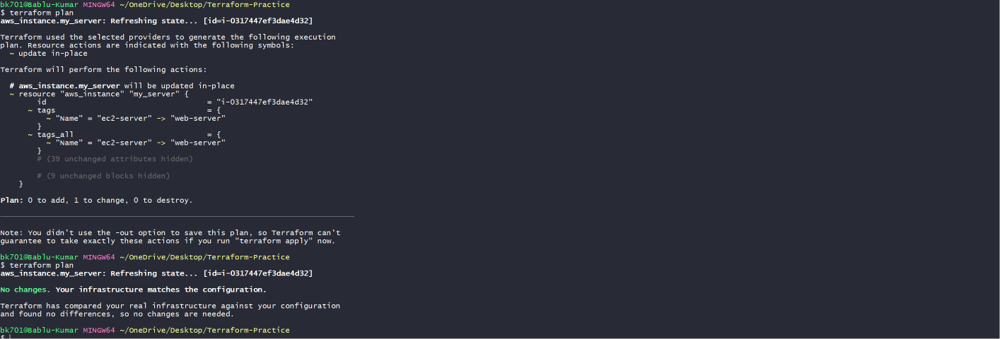

Terraform ignored tag modifications.

---

# depends_on

`depends_on` forces Terraform to create resources in a specific order.

Example:

```hcl
depends_on = [aws_security_group.my_sg]
```

This ensures EC2 is created only after Security Group.

---

## Terraform Apply Output
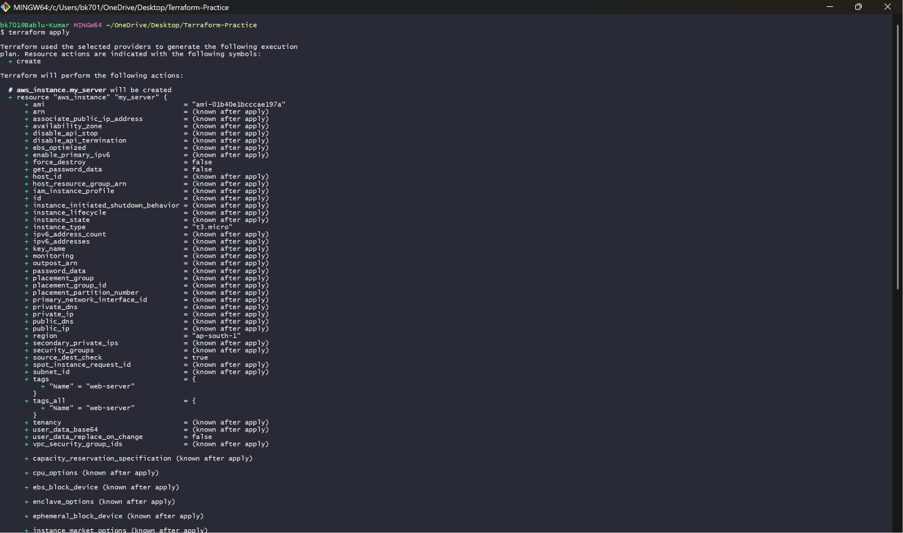
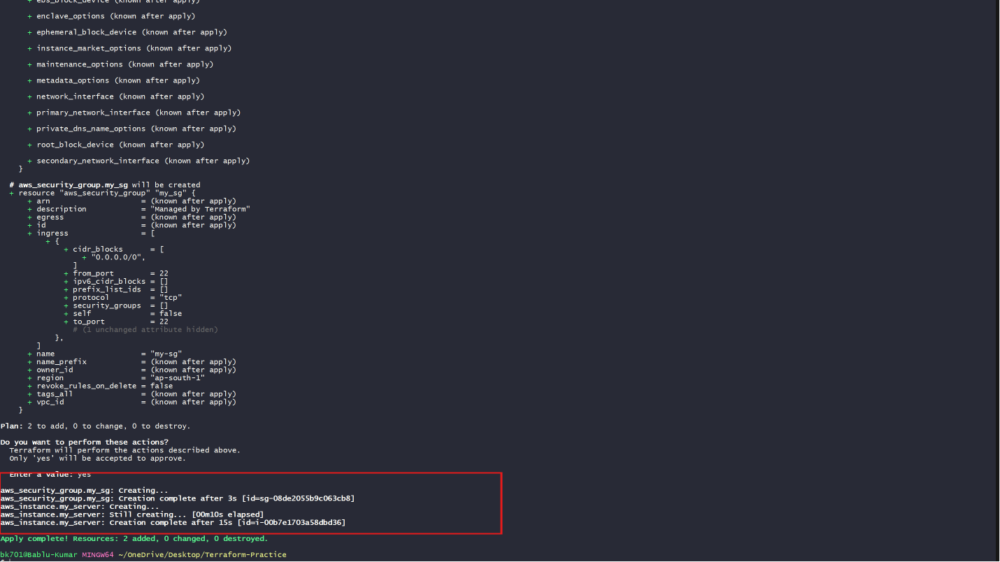

Terraform created Security Group first.

EC2 creation started after Security Group creation.

---

# Lab 8 — Use Dynamic Block with Multiple Nested Configurations

In this lab:

* nested ingress blocks
* dynamic block
* count

were combined.

---

# What Happened?

Terraform created:

* multiple security groups
* multiple ingress rules inside each group
* one egress rule

---

# Security Groups Created

* my-sg-1
* my-sg-2

---

# Ingress Rules Generated

Inside each SG:

* 22
* 80
* 443

ports were created automatically.

---

# Egress Rule

Allowed all outbound traffic:

```hcl
protocol = "-1"
```

---

## Terraform Plan Output

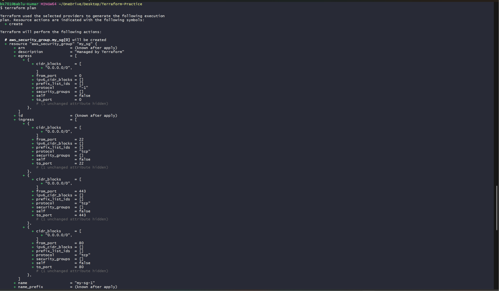

Terraform generated ingress and egress configurations dynamically.

---

## Multiple Nested Configurations

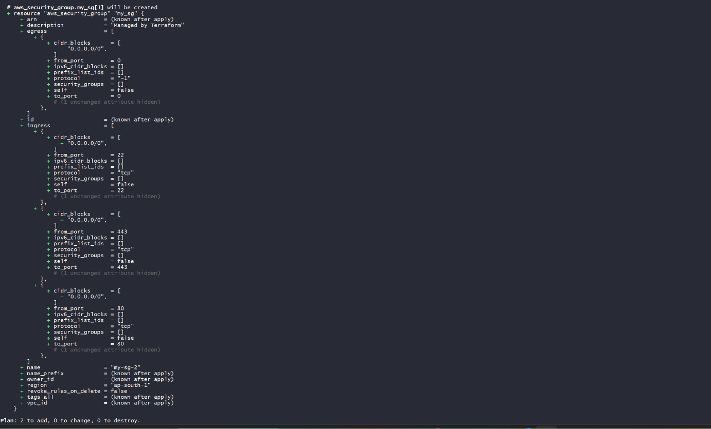

Terraform created multiple nested ingress rules inside multiple security groups.

---

# Important Terraform Concepts Learned

| Concept       | Purpose                            |
| ------------- | ---------------------------------- |
| count         | Create multiple resources          |
| for_each      | Create resources using keys/values |
| locals        | Simplify repeated logic            |
| dynamic block | Create repeated nested blocks      |
| lifecycle     | Control resource behavior          |
| depends_on    | Control resource creation order    |
| map           | Store key-value pairs              |
| object        | Store grouped structured values    |

---

# Commands Used

## Initialize Terraform

```bash
terraform init
```

---

## Validate Configuration

```bash
terraform validate
```

---

## Preview Changes

```bash
terraform plan
```

---

## Apply Configuration

```bash
terraform apply
```

---

## Destroy Resources

```bash
terraform destroy
```

---

