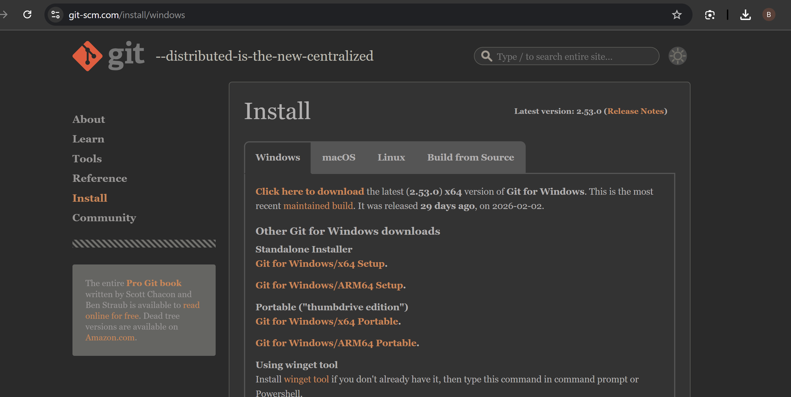
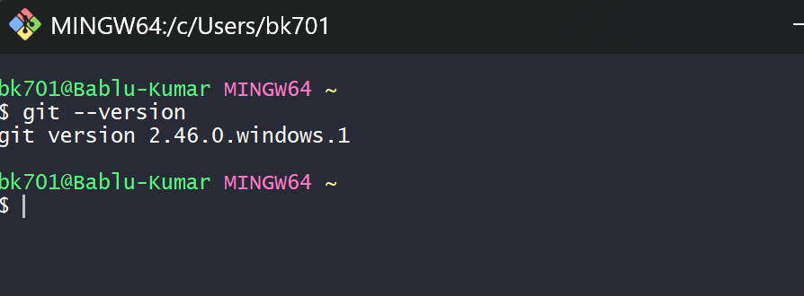
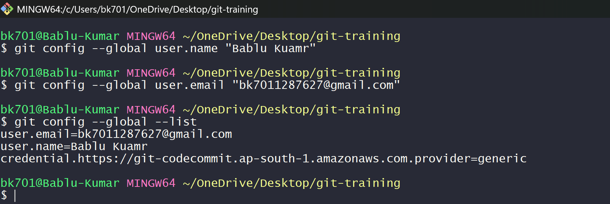
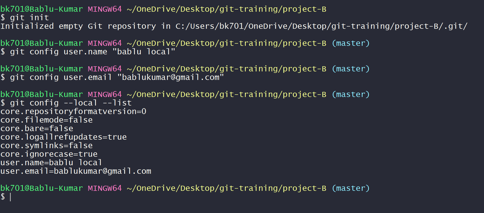
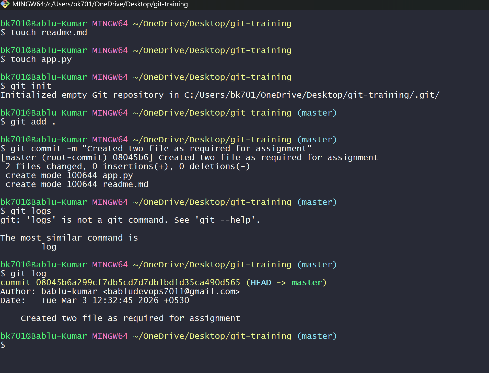
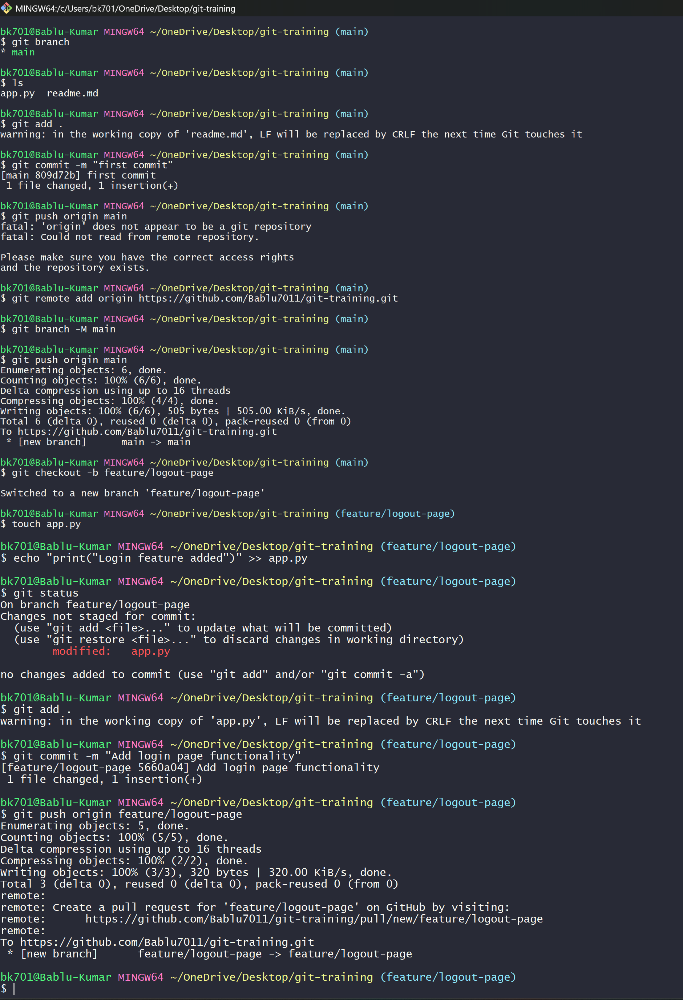
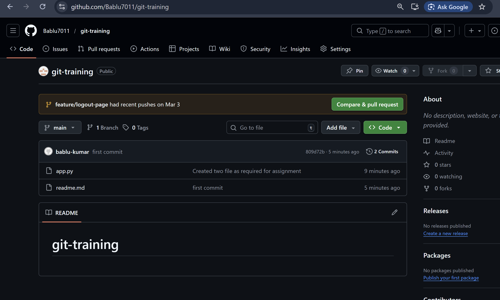
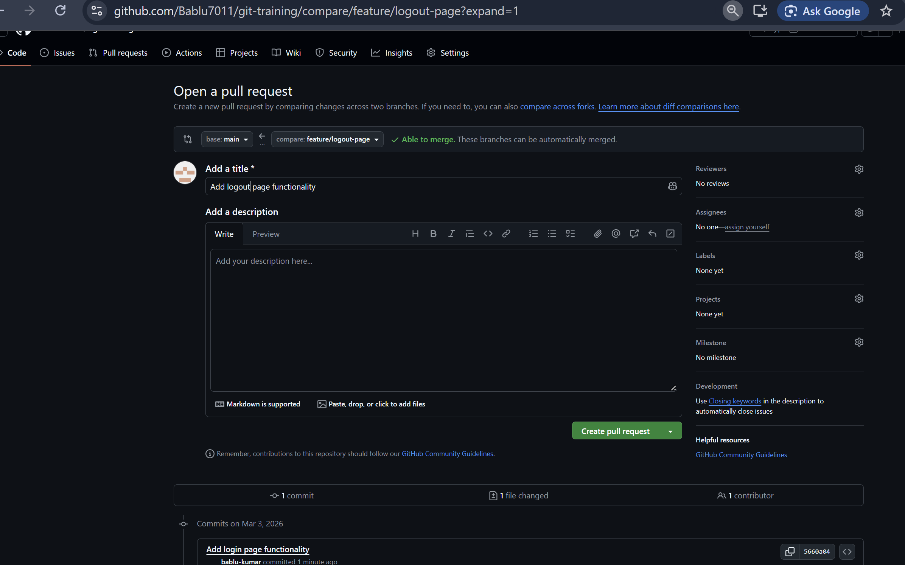
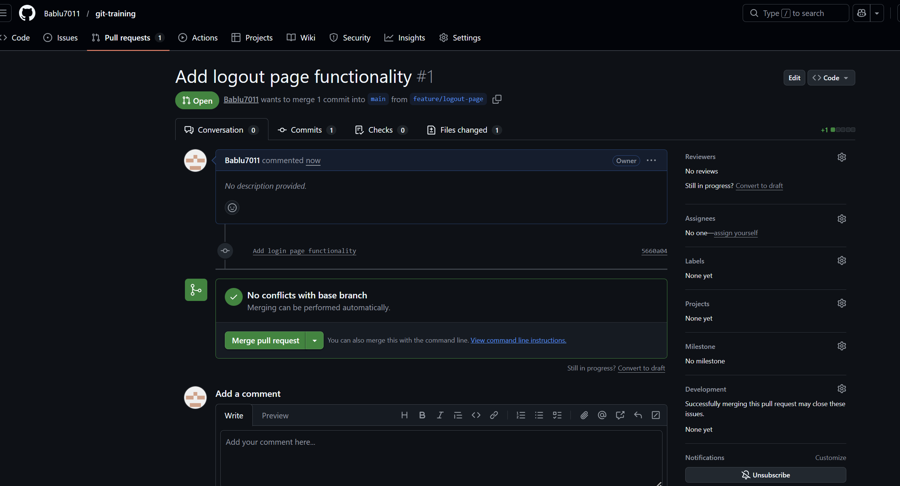

---

#  Git Training – Day 1

This repository contains practical implementation of Git basic commands including installation, configuration, repository creation, branching, and pull request.

---

#  Task 1 – Install Git & Verify

###  Step 1: Download Git

Download Git from official website:
[https://git-scm.com/](https://git-scm.com/)

###  Step 2: Download Git
 Done Installation



###  Step 3: Verify Installation

```bash
git --version
```

**Explanation:**
This command checks if Git is successfully installed and shows the installed version.



---

#  Task 2 – Configure Git (Global & Local)

##  Global Configuration

```bash
git config --global user.name "Your Name"
git config --global user.email "your@email.com"
```

**Explanation:**
Sets username and email for all repositories on this system.

```bash
git config --global --list
```

**Explanation:**
Displays global configuration settings.



---

##  Local Configuration

```bash
git init
git config user.name "local name"
git config user.email "local@email.com"
```

**Explanation:**
Sets username and email only for current repository.

```bash
git config --local --list
```

**Explanation:**
Shows local repository configuration.



---

#  Task 3 – Create Repository & Commit

##  Step 1: Create Files

```bash
touch readme.md
touch app.py
```

**Explanation:**
Creates two new files inside the project folder.

---

##  Step 2: Initialize Repository

```bash
git init
```

**Explanation:**
Initializes Git and creates a hidden `.git` folder.

---

##  Step 3: Add Files

```bash
git add .
```

**Explanation:**
Stages all files for commit.

---

##  Step 4: Commit Changes

```bash
git commit -m "Created two files as required for assignment"
```

**Explanation:**
Saves snapshot of staged files with message.

---

##  Step 5: View Log

```bash
git log
```

**Explanation:**
Displays commit history.



---

#  Task 4 – Branching & Pull Request

##  Step 1: Create New Branch

```bash
git checkout -b feature/logout-page
```

**Explanation:**
Creates and switches to a new branch.

---

##  Step 2: Make Changes

```bash
echo "print('Login Feature added')" >> app.py
```

**Explanation:**
Adds new line of code into app.py file.

---

##  Step 3: Stage Changes

```bash
git add .
```

**Explanation:**
Adds modified files to staging area.

---

##  Step 4: Commit Changes

```bash
git commit -m "Add login page functionality"
```

**Explanation:**
Creates a new commit in feature branch.

---

##  Step 5: Push Branch

```bash
git push origin feature/logout-page
```

**Explanation:**
Pushes branch to GitHub repository.



---

##  Step 6: Create Pull Request

On GitHub:

* Click "Compare & Pull Request"
* Add title and description
* Click "Create Pull Request"



---

##  Step 7: Merge Pull Request

Click "Merge Pull Request"






