# NGINX Web Server Practice

This repository contains hands-on practice tasks for learning **NGINX installation, configuration, reverse proxy, hosting multiple sites, and troubleshooting**.

All tasks were executed on an **Ubuntu Linux server**.

---

# Task 1 – Test NGINX Management Commands

## Install NGINX

First update the package list and install NGINX.

```bash
sudo apt update
sudo apt-get install nginx -y
```

This installs the NGINX web server and its dependencies.

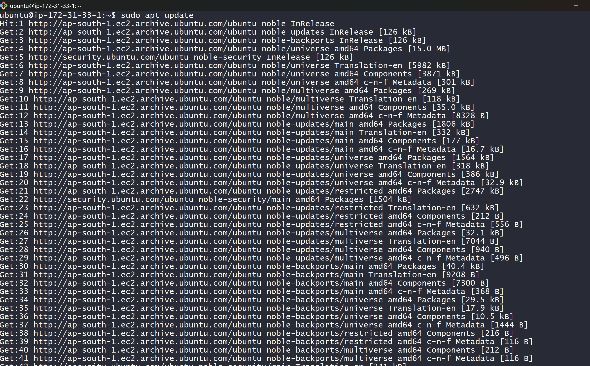

---

## Verify NGINX Installation

Check the installed version and confirm the default welcome page loads.

```bash
nginx -v
curl http://localhost
```

If NGINX is installed correctly, the **Welcome to nginx** page should appear.

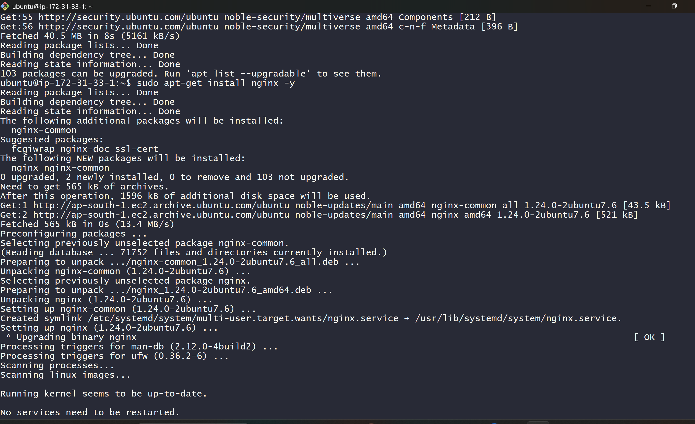

---

## Test NGINX Service Commands

NGINX service can be managed using systemctl.

```bash
sudo systemctl start nginx
sudo systemctl stop nginx
sudo systemctl restart nginx
sudo systemctl reload nginx
sudo systemctl enable nginx
```

Explanation:

* **start** → starts the service
* **stop** → stops the service
* **restart** → stops and starts again
* **reload** → reloads configuration without downtime
* **enable** → starts NGINX automatically on system boot

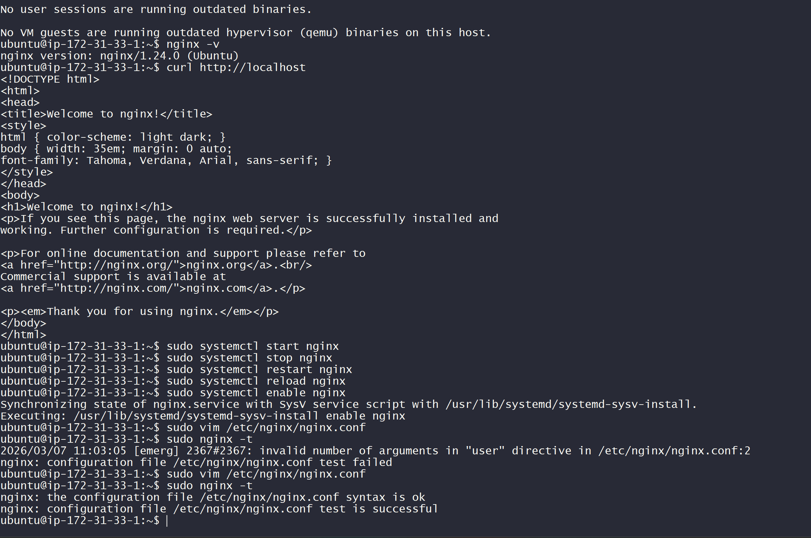

---

## Introduce a Syntax Error

To test configuration validation, intentionally introduce an error.

```bash
sudo vim /etc/nginx/nginx.conf
```

Remove a semicolon (`;`) from any directive.

Then run:

```bash
sudo nginx -t
```

NGINX will detect the error before reload.

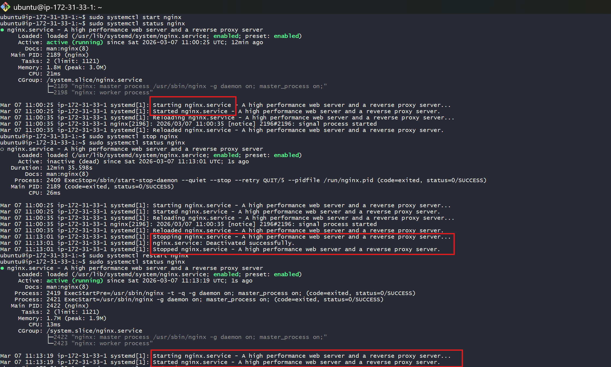

---

## Fix the Configuration

Correct the syntax error and test again.

```bash
sudo nginx -t
```

Expected result:

```
syntax is ok
test is successful
```

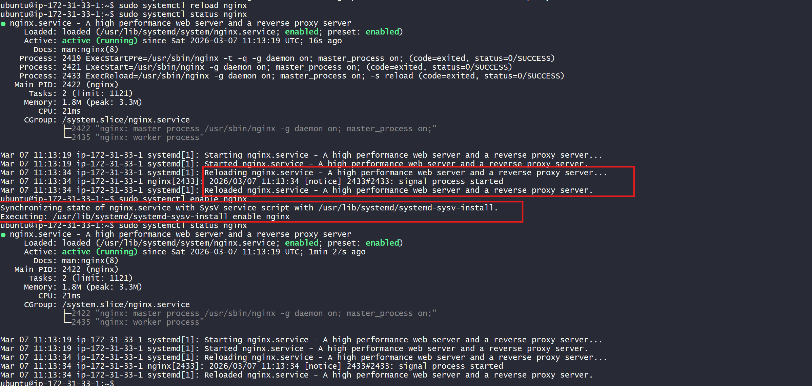

---

# Task 2 – Explore NGINX Configuration Hierarchy

The main configuration file is located at:

```
/etc/nginx/nginx.conf
```

View the configuration file:

```bash
cat /etc/nginx/nginx.conf
```

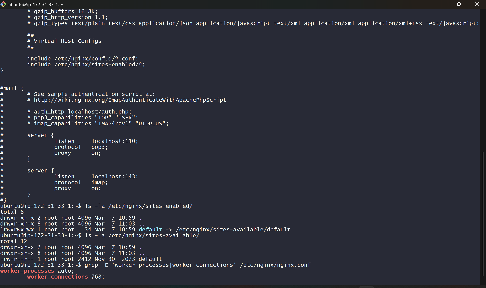

---

## Important Contexts

NGINX configuration contains multiple contexts:

### Main Context

Global settings like:

```
worker_processes
error_log
pid
```

### Events Context

Handles connections:

```
worker_connections
```

### HTTP Context

Contains:

* server blocks
* logging
* MIME types

---

## Check Worker Settings

```bash
grep -E 'worker_processes|worker_connections' /etc/nginx/nginx.conf
```

Explanation:

* **worker_processes** → number of worker processes handling requests
* **worker_connections** → maximum connections per worker

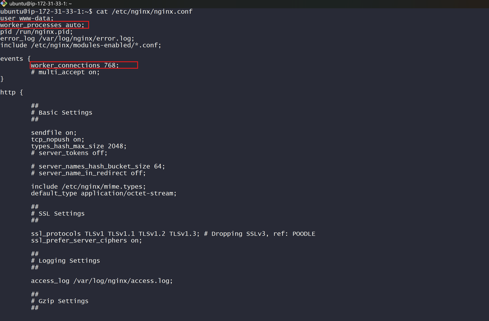

---

## Check Enabled Sites

```bash
ls -la /etc/nginx/sites-enabled/
ls -la /etc/nginx/sites-available/
```

Explanation:

* **sites-available** → all site configurations
* **sites-enabled** → active configurations via symbolic links

---

# Task 3 – Host a Multi-Page Static Website

Create a website directory.

```bash
sudo mkdir -p /var/www/mysite.local/html
```

Create HTML pages.

```bash
echo '<h1>Home</h1>' > /var/www/mysite.local/html/index.html
echo '<h1>About</h1>' > /var/www/mysite.local/html/about.html
echo '<h1>Contact</h1>' > /var/www/mysite.local/html/contact.html
```

Set permissions:

```bash
sudo chown -R $USER:www-data /var/www/mysite.local
sudo chmod -R 755 /var/www/mysite.local
```

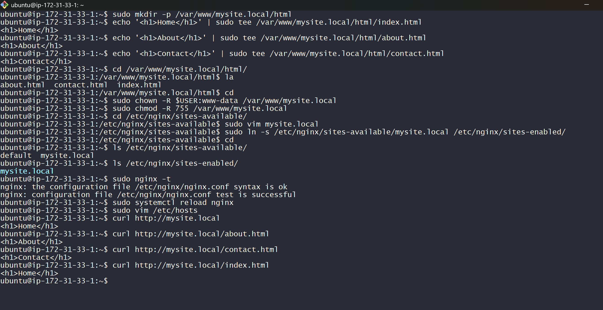

---

## Create Server Block

Create a new configuration file.

```bash
sudo vim /etc/nginx/sites-available/mysite.local
```

Example configuration:

```
server {
 listen 80;
 server_name mysite.local;

 root /var/www/mysite.local/html;
 index index.html about.html contact.html;

 location / {
  try_files $uri $uri/ =404;
 }
}
```

Enable the site:

```bash
sudo ln -s /etc/nginx/sites-available/mysite.local /etc/nginx/sites-enabled/
```

Reload NGINX:

```bash
sudo systemctl reload nginx
```

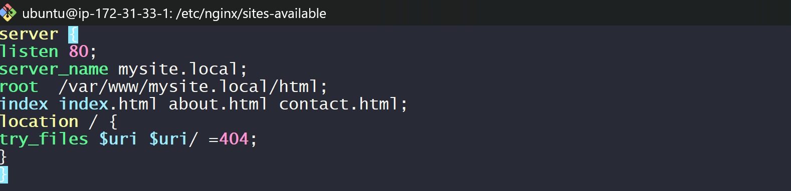

---

## Add Local Domain

Edit hosts file:

```bash
sudo vim /etc/hosts
```

Add:

```
127.0.0.1 mysite.local
```

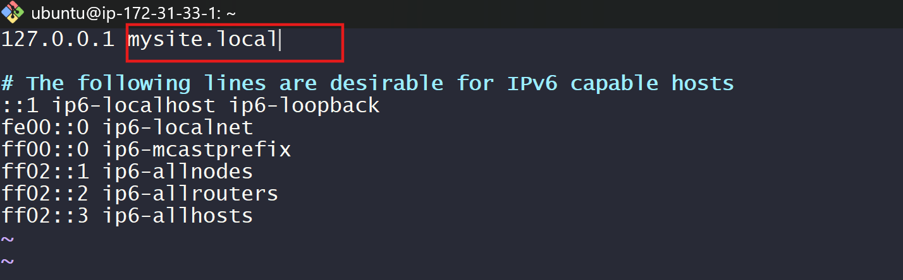

---

## Test Website

```bash
curl http://mysite.local
curl http://mysite.local/about.html
curl http://mysite.local/contact.html
```

Test missing page:

```bash
curl -o /dev/null -s -w '%{http_code}' http://mysite.local/missing
```

Expected result:

```
404
```

---

# Task 4 – Reverse Proxy with Docker

Run two Docker containers.

```bash
docker run -d --name app1 -p 8081:80 nginx:alpine
docker run -d --name app2 -p 8082:80 traefik/whoami
```

Explanation:

* **app1** runs NGINX container
* **app2** runs a diagnostic container that shows request details

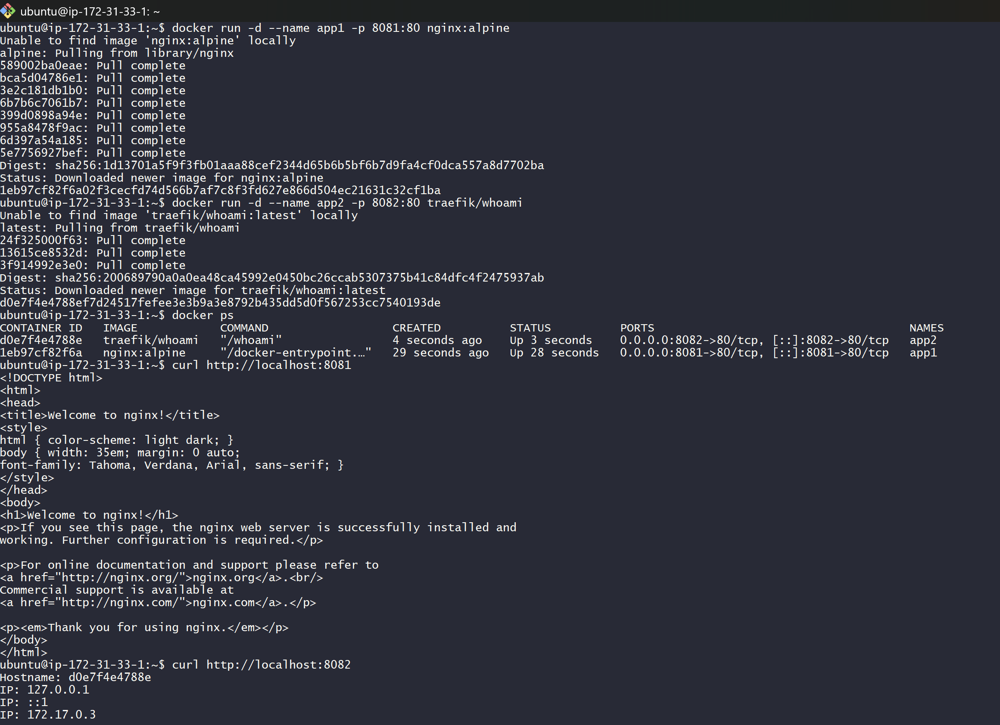

---

## Create Reverse Proxy Configuration

```
server {
 listen 80;
 server_name myapp.local;

 location /app1/ {
  proxy_pass http://127.0.0.1:8081/;
  proxy_set_header Host $host;
  proxy_set_header X-Real-IP $remote_addr;
 }

 location /app2/ {
  proxy_pass http://127.0.0.1:8082/;
  proxy_set_header Host $host;
  proxy_set_header X-Real-IP $remote_addr;
 }
}
```

Enable configuration and reload NGINX.

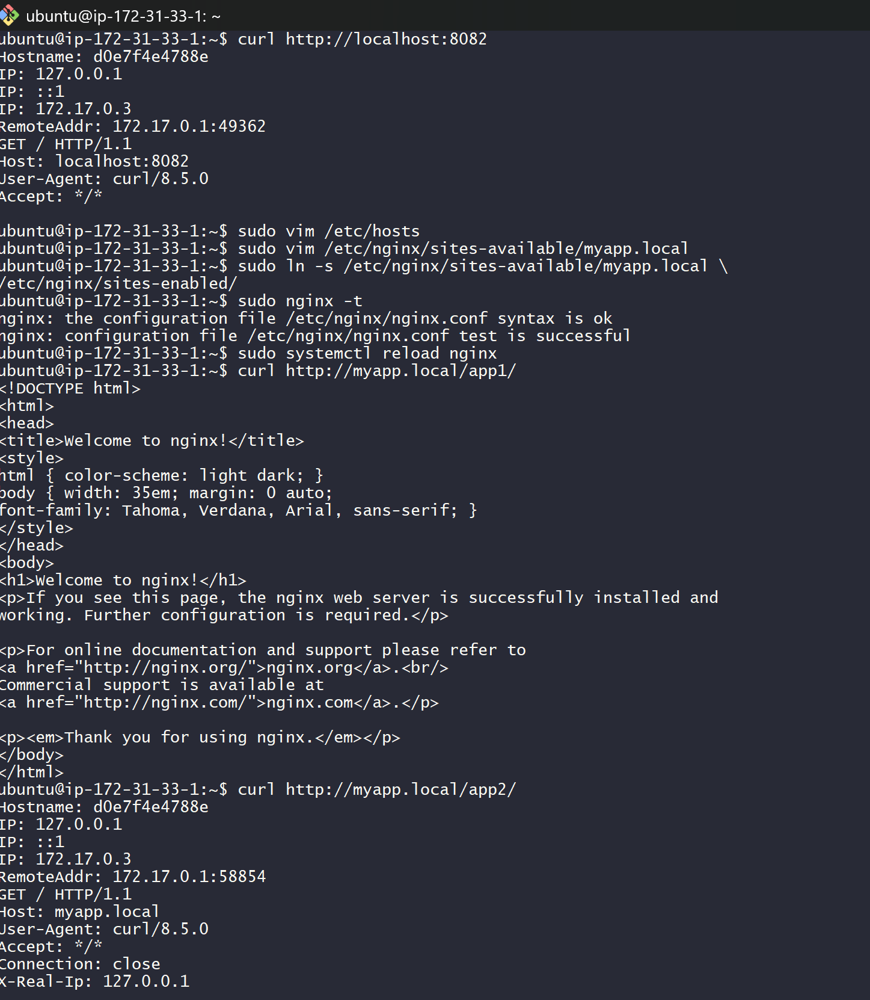

---

## Test Reverse Proxy

```bash
curl http://myapp.local/app1/
curl http://myapp.local/app2/
```

Results:

* `/app1` → nginx container response
* `/app2` → whoami container response

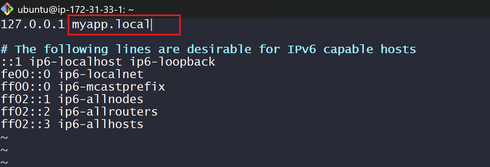

---

# Task 5 – Host Multiple Sites

Create directories for two sites.

```bash
sudo mkdir -p /var/www/app1.local/html
sudo mkdir -p /var/www/app2.local/html
```

Create HTML pages.

```bash
echo "<h1>Welcome to App 1</h1>" | sudo tee /var/www/app1.local/html/index.html
echo "<h1>Welcome to App 2</h1>" | sudo tee /var/www/app2.local/html/index.html
```

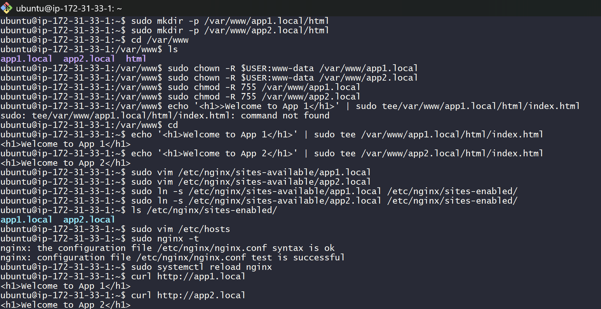

---

## Enable Both Sites

```bash
sudo ln -s /etc/nginx/sites-available/app1.local /etc/nginx/sites-enabled/
sudo ln -s /etc/nginx/sites-available/app2.local /etc/nginx/sites-enabled/
```

Test:

```bash
curl http://app1.local
curl http://app2.local
```

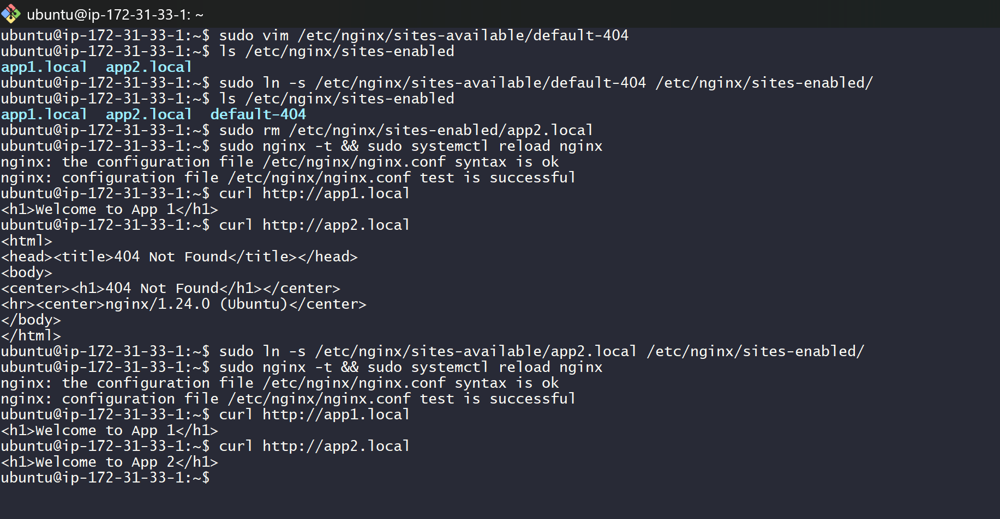

---

## Disable One Site

Remove app2 symlink.

```bash
sudo rm /etc/nginx/sites-enabled/app2.local
sudo nginx -t && sudo systemctl reload nginx
```

Test again:

```
app1.local → works
app2.local → 404
```

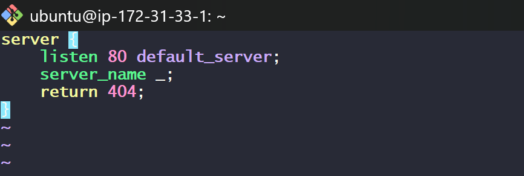

---

## Re-Enable Site

```bash
sudo ln -s /etc/nginx/sites-available/app2.local /etc/nginx/sites-enabled/
sudo systemctl reload nginx
```

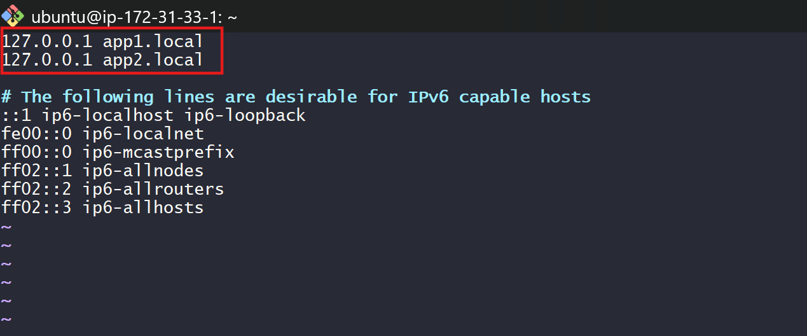

---

# Task 6 – Troubleshooting NGINX Errors

## Test 403 Forbidden

Restrict file permissions.

```bash
sudo chmod 600 /var/www/mysite.local/html/index.html
```

Test:

```bash
curl -o /dev/null -s -w '%{http_code}' http://mysite.local
```

Expected:

```
403
```

Fix permissions:

```bash
sudo chmod 644 /var/www/mysite.local/html/index.html
```

---

## Test 502 Bad Gateway

Change proxy to invalid port.

```
proxy_pass http://127.0.0.1:9999;
```

Reload NGINX and test.

Expected:

```
502
```

Logs can be checked using:

```bash
sudo tail -5 /var/log/nginx/error.log
```

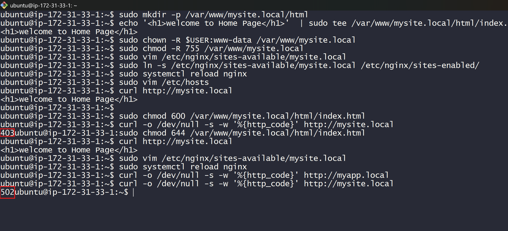

---

