---

# Day 4 – Securing Web Infrastructure (SSL/TLS, Self-Signed Certificates, Nginx Load Balancer)

## Objective

The goal of this lab is to secure and scale web infrastructure using:

* **SSL/TLS encryption**
* **Certificate inspection**
* **Self-signed certificates**
* **Nginx reverse proxy**
* **Load balancing using Docker containers**

---

# T1 – Inspect a Live TLS Certificate

In this task, we inspect the TLS certificate of a live HTTPS website using **curl** and **OpenSSL**.

We extract:

* Certificate **Subject (Domain)**
* Certificate **Issuer (Certificate Authority)**
* **Expiry Date**
* **Public Key Algorithm**
* **Key Size**

---

## Step 1 – Fetch TLS Certificate Details Using Curl

```bash
curl -vI https://example.com 2>&1 | grep -E 'subject|issuer|expire|SSL|TLS'
```

This command displays important TLS certificate information.

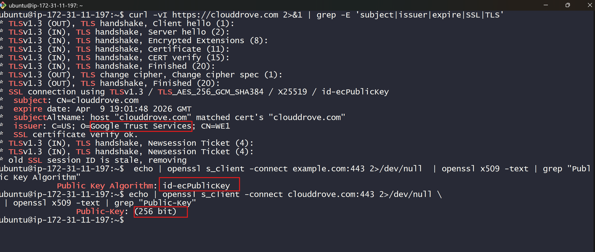

---

## Step 2 – Inspect Certificate Using OpenSSL

```bash
echo | openssl s_client -connect example.com:443 2>/dev/null \
| openssl x509 -noout -subject -issuer -dates
```

This command extracts:

* Subject
* Issuer
* Validity period

---

## Step 3 – Check Key Algorithm

```bash
echo | openssl s_client -connect example.com:443 2>/dev/null \
| openssl x509 -text | grep "Public Key Algorithm"
```

Example Output:

```
Public Key Algorithm: id-ecPublicKey
```

---

## Step 4 – Check Public Key Size

```bash
echo | openssl s_client -connect example.com:443 2>/dev/null \
| openssl x509 -text | grep "Public-Key"
```

Example Output:

```
Public-Key: (256 bit)
```

---

# T2 – Simulate Certbot Using Self-Signed Certificate

Since Let's Encrypt requires a public domain, we simulate SSL using a **self-signed certificate**.

We configure **Nginx with HTTPS on a local domain (`myapp.local`)**.

---

## Step 1 – Create Website Directory

```bash
sudo mkdir -p /var/www/myapp.local/html
sudo chown -R $USER:$USER /var/www/myapp.local/html
sudo chmod -R 755 /var/www/myapp.local
```

Create a simple webpage:

```bash
echo '<h1>Welcome to home page</h1>' > /var/www/myapp.local/html/index.html
```


---

## Step 2 – Install and Verify Nginx

```bash
sudo systemctl status nginx
sudo systemctl enable nginx
```


---

## Step 3 – Generate Self-Signed SSL Certificate

```bash
sudo openssl req -x509 -nodes -days 365 -newkey rsa:2048 \
-keyout /etc/ssl/private/myapp.key \
-out /etc/ssl/certs/myapp.crt \
-subj "/CN=myapp.local"
```


---

## Step 4 – Verify Certificate Files

```bash
sudo ls /etc/ssl/private
sudo ls /etc/ssl/certs | grep myapp.crt
```
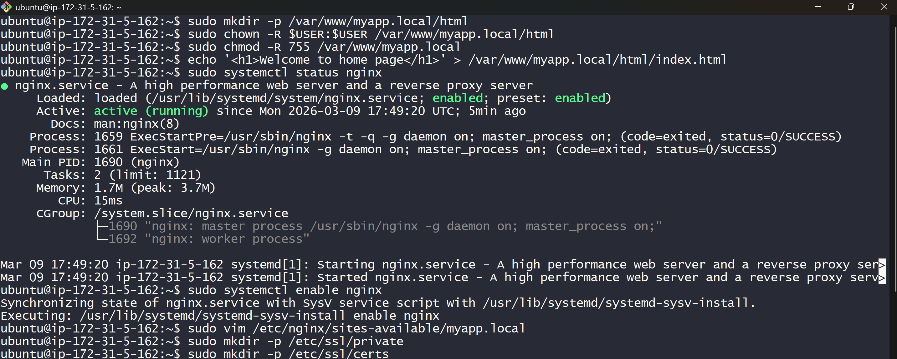
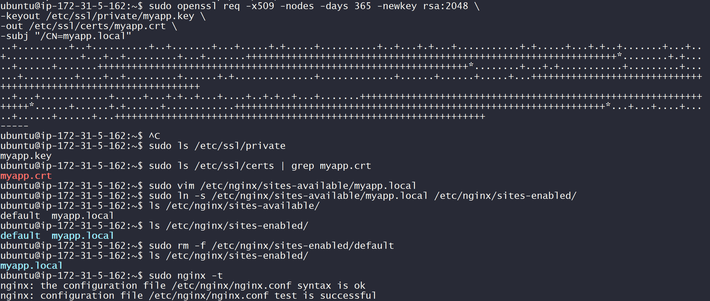


---

## Step 5 – Configure Nginx Virtual Host

Create config:

```bash
sudo vim /etc/nginx/sites-available/myapp.local
```

Configuration:

```nginx
server {
    listen 80;
    server_name myapp.local;

    return 301 https://$host$request_uri;
}

server {
    listen 443 ssl;
    server_name myapp.local;

    ssl_certificate /etc/ssl/certs/myapp.crt;
    ssl_certificate_key /etc/ssl/private/myapp.key;

    location / {
        root /var/www/myapp.local/html;
        index index.html;
    }
}
```
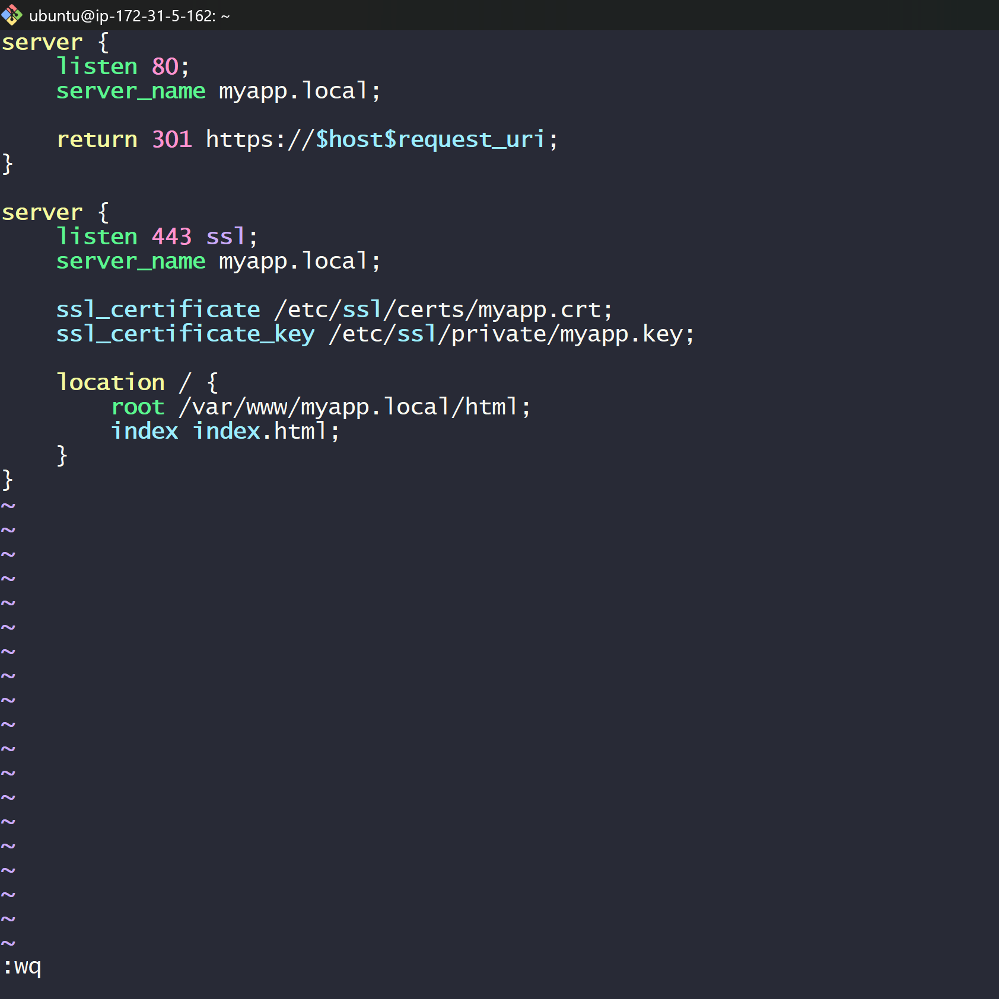


---

## Step 6 – Enable Nginx Site

```bash
sudo ln -s /etc/nginx/sites-available/myapp.local /etc/nginx/sites-enabled/
```

Remove default config:

```bash
sudo rm -f /etc/nginx/sites-enabled/default
```


---

## Step 7 – Test and Reload Nginx

```bash
sudo nginx -t
sudo systemctl reload nginx
```


---

## Step 8 – Map Local Domain

Edit hosts file on your local machine.

Windows:

```
C:\Windows\System32\drivers\etc\hosts
```

Add:

```
EC2_PUBLIC_IP myapp.local
```

Example:

```
3.108.254.22 myapp.local
```
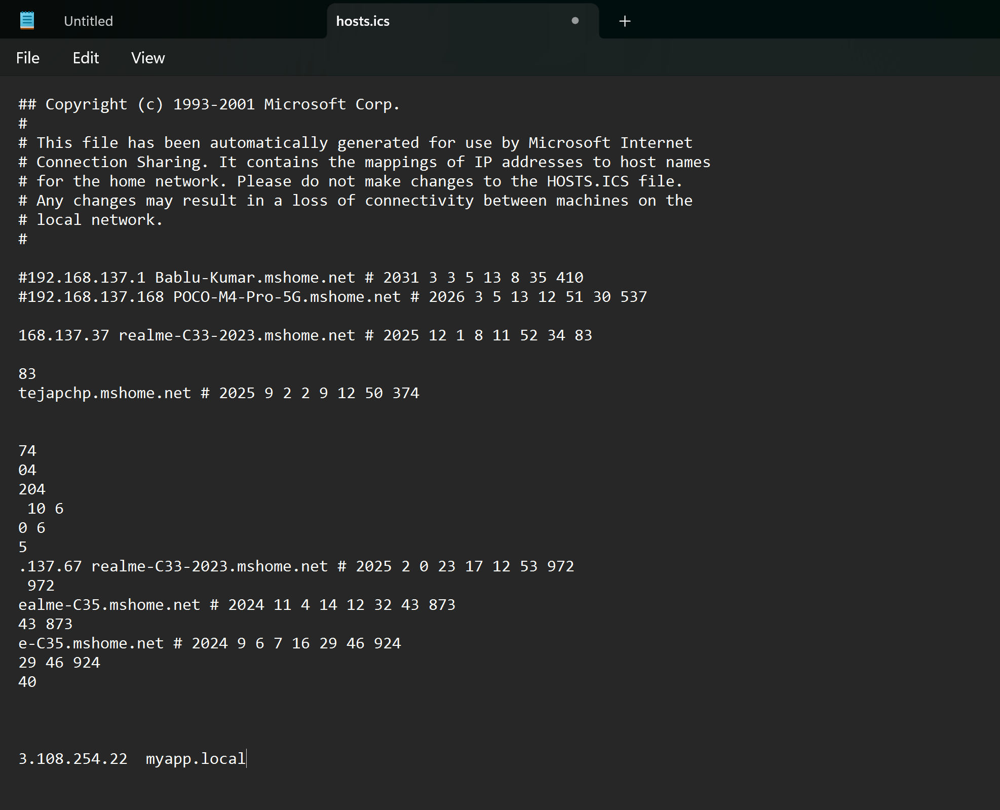


---

## Step 9 – Access Website via HTTPS

Open:

```
https://myapp.local
```

Since the certificate is self-signed, the browser shows **"Not Secure" warning**, which is expected.

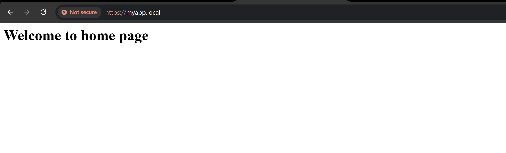

---

## Step 10 – Inspect Certificate in Browser

You can view certificate details like:

* Issued To
* Issued By
* Validity Period

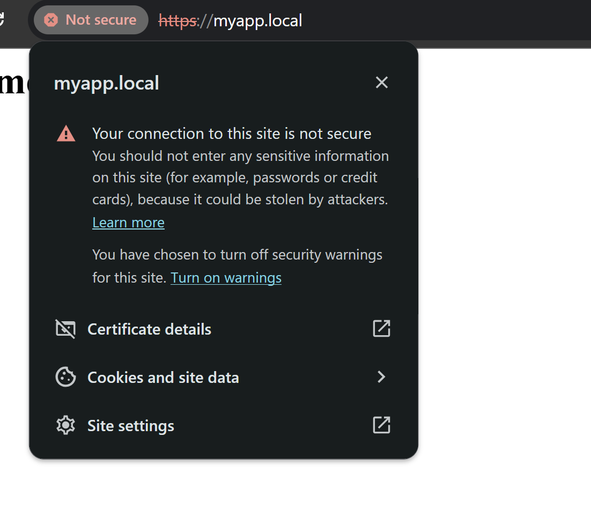
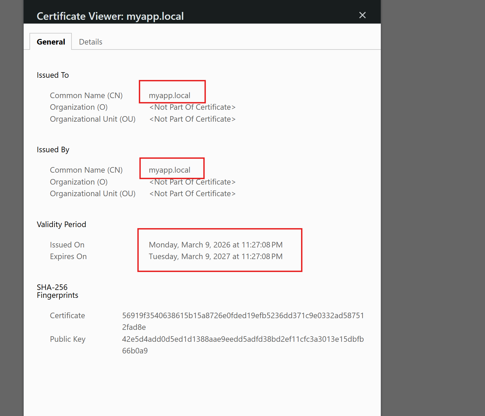

---

# T3 – Nginx Load Balancing with Docker Containers

This task demonstrates **load balancing using Nginx** across two backend containers.

---

## Step 1 – Run Backend Containers

```bash
docker run -d --name backend1 -p 8081:80 traefik/whoami
docker run -d --name backend2 -p 8082:80 traefik/whoami
```

Verify containers:

```bash
docker ps
```

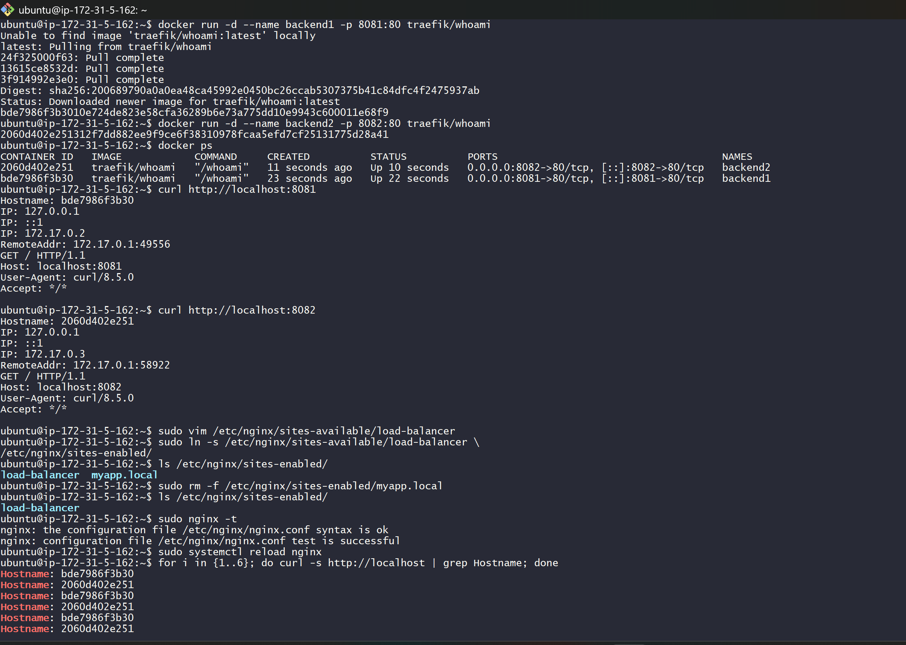

---

## Step 2 – Test Backend Servers

```bash
curl http://localhost:8081
curl http://localhost:8082
```

Each container returns its hostname.

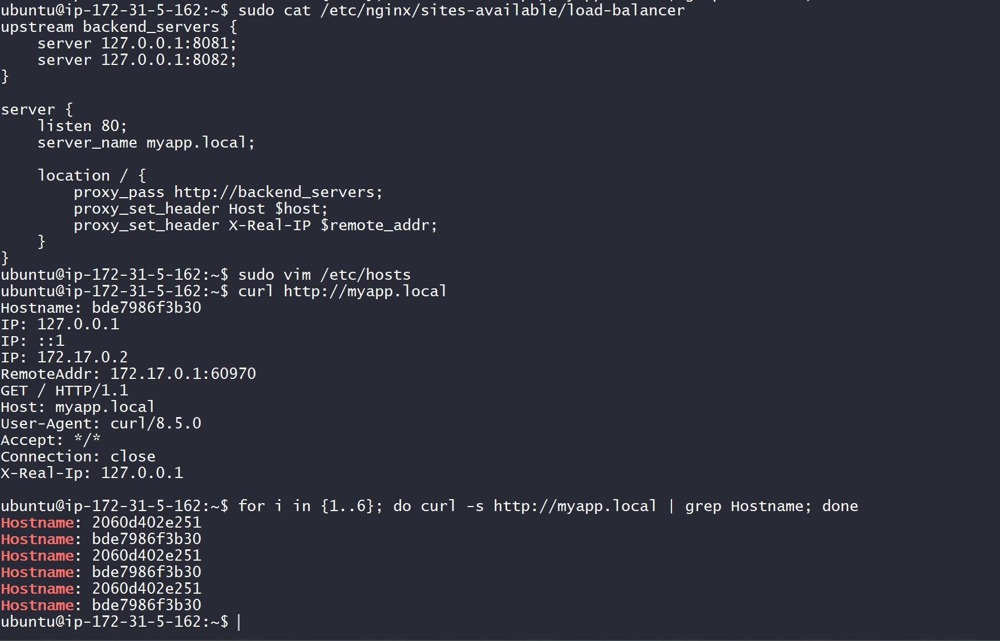

---

## Step 3 – Configure Nginx Load Balancer

Edit configuration:

```bash
sudo vim /etc/nginx/sites-available/load-balancer
```

Configuration:

```nginx
upstream backend_servers {
    server 127.0.0.1:8081;
    server 127.0.0.1:8082;
}

server {
    listen 80;
    server_name myapp.local;

    location / {
        proxy_pass http://backend_servers;
        proxy_set_header Host $host;
        proxy_set_header X-Real-IP $remote_addr;
    }
}
```

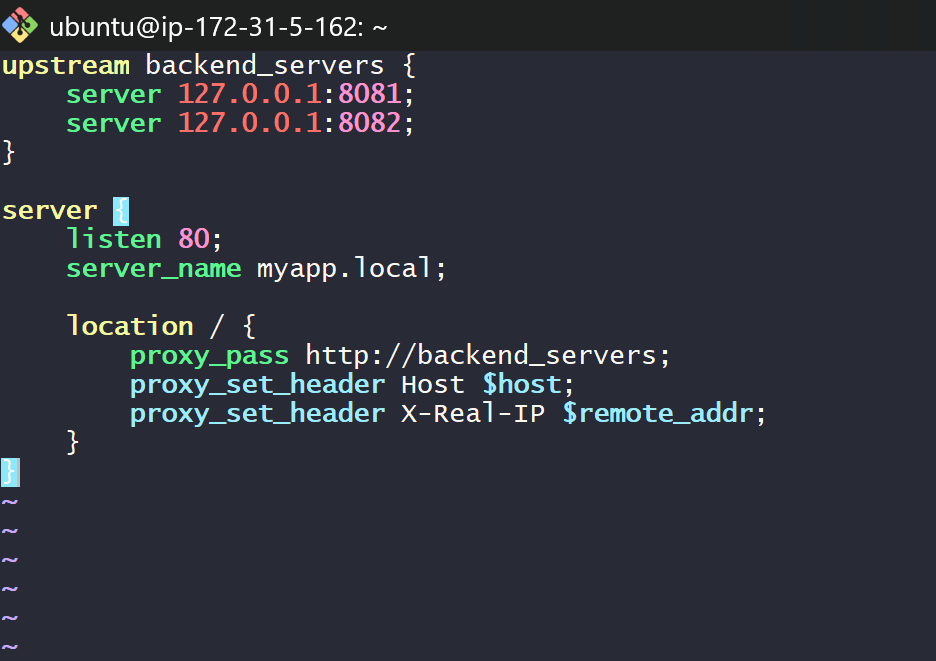

---

## Step 4 – Test Round-Robin Load Balancing

Send multiple requests:

```bash
for i in {1..6}; do curl -s http://myapp.local | grep Hostname; done
```

Expected output alternates between containers:

```
Hostname: backend1
Hostname: backend2
Hostname: backend1
Hostname: backend2
```

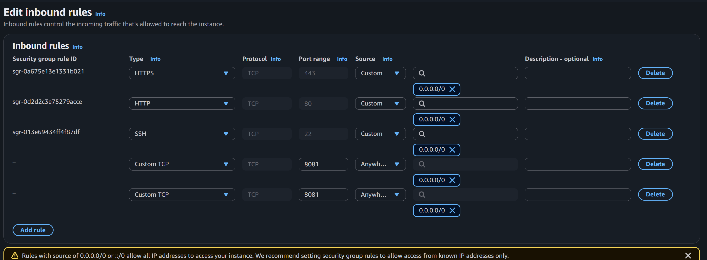

---

# Final Architecture

```
User Request
      ↓
   Nginx
      ↓
Load Balancer
   ↓       ↓
Backend1  Backend2
(8081)    (8082)
```

---

