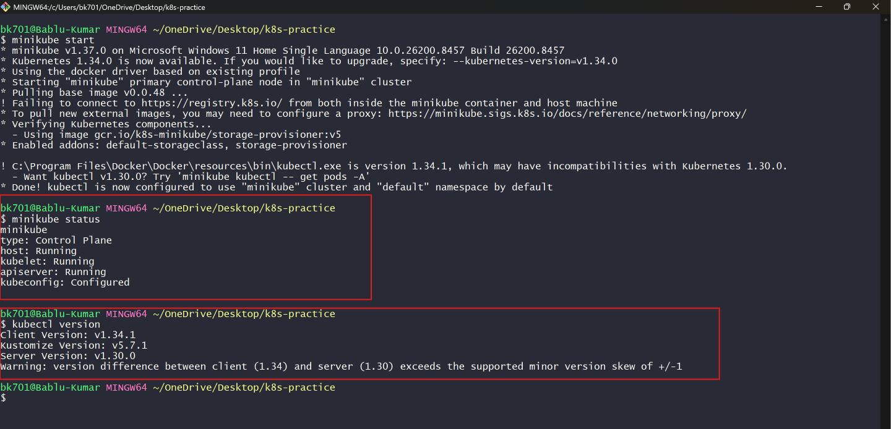

# Kubernetes Setup and Basics

## What is Kubernetes?

Kubernetes (K8s) is an open-source container orchestration platform used to automate the deployment, scaling, and management of containerized applications.

It helps manage Docker containers efficiently across multiple servers.

---

# Why Do We Need Kubernetes?

Before Kubernetes, managing containers manually was difficult.

## Problems Without Kubernetes

--> Manual deployment management  
--> No auto healing if container crashes  
--> Difficult scaling  
--> Load balancing issues  
--> High downtime during updates  
--> Hard to manage multiple containers  

## Kubernetes Solves These Problems By Providing

--> Auto scaling  
--> Self healing  
--> Load balancing  
--> Rolling updates  
--> High availability  
--> Container orchestration  

---

# Companies Using Kubernetes

Many top companies use Kubernetes in production:

--> Google  
--> Netflix  
--> Amazon  
--> Spotify  
--> Airbnb  
--> Adobe  
--> PayPal  
--> OpenAI  

---

# Kubernetes Architecture

## Control Plane (Master Node)

Responsible for managing the cluster.

### Components

### API Server
--> Entry point for all Kubernetes commands.

### Scheduler
--> Decides where Pods should run.

### Controller Manager
--> Maintains desired cluster state.

### ETCD
--> Stores cluster data and configuration.

---

## Worker Node

Runs application workloads.

### Components

### Kubelet
--> Communicates with the control plane.

### Kube Proxy
--> Handles networking.

### Container Runtime
--> Runs containers using Docker/containerd.

### Pods
--> Smallest deployable unit in Kubernetes.

---

# Kubernetes Architecture Flow

```text
User
  ↓
kubectl
  ↓
API Server
  ↓
Scheduler
  ↓
Worker Node
  ↓
Pods / Containers
````

---

# Install kubectl on Windows

## Step 1: Download kubectl

Open PowerShell as Administrator and run:

```bash
curl.exe -LO "https://dl.k8s.io/release/v1.34.1/bin/windows/amd64/kubectl.exe"
```

---

## Step 2: Add kubectl to PATH

Move `kubectl.exe` to any folder and add that folder to Environment Variables PATH.

Example:

```text
C:\kubectl
```

---

## Step 3: Verify Installation

```bash
kubectl version --client
```

---

# Install Minikube on Windows

Minikube creates a local Kubernetes cluster.

## Step 1: Download Minikube

Open PowerShell and run:

```bash
curl.exe -LO https://github.com/kubernetes/minikube/releases/latest/download/minikube-installer.exe
```

Run the installer after download completes.

---

## Step 2: Verify Installation

```bash
minikube version
```

---

# Start Minikube Cluster

```bash
minikube start
```

---

# Verify Cluster Status

```bash
minikube status
```

Example Output:

```text
type: Control Plane
host: Running
kubelet: Running
apiserver: Running
kubeconfig: Configured
```

---

# kubectl and Minikube Version Output

```text
Client Version: v1.34.1
Server Version: v1.30.0
```

The warning appears because the client and server versions are slightly different.

---

# Installation Verification Screenshot



---

# Basic Kubernetes Commands

## Check Cluster Information

```bash
kubectl cluster-info
```

---

## Check Nodes

```bash
kubectl get nodes
```

---

## Check Pods

```bash
kubectl get pods
```

---

## Check Deployments

```bash
kubectl get deployments
```

---

## Create Deployment

```bash
kubectl create deployment nginx --image=nginx
```

---

## Scale Deployment

```bash
kubectl scale deployment nginx --replicas=3
```

---

## Describe Pod

```bash
kubectl describe pod <pod-name>
```

---

## View Logs

```bash
kubectl logs <pod-name>
```

---

## Delete Pod

```bash
kubectl delete pod <pod-name>
```

---

## Delete Deployment

```bash
kubectl delete deployment nginx
```

---

# Example Deployment YAML

```yaml
apiVersion: apps/v1
kind: Deployment

metadata:
  name: apache-deployment

spec:
  replicas: 2

  selector:
    matchLabels:
      app: apache

  template:
    metadata:
      labels:
        app: apache

    spec:
      containers:
      - name: apache
        image: httpd:latest

        ports:
        - containerPort: 80
```

---

# Apply Deployment

```bash
kubectl apply -f deployment.yml
```

---

# Check Running Pods

```bash
kubectl get pods
```

---

# Expose Deployment to Internet

```bash
kubectl expose deployment apache-deployment --type=NodePort --port=80
```

---

# Open Service in Browser

```bash
minikube service apache-deployment
```

---

## Advantages of Kubernetes

* High availability
* Auto scaling
* Self healing
* Easy deployment
* Rolling updates
* Better resource utilization
* Supports cloud-native applications

---

# Conclusion

Kubernetes is one of the most important DevOps and Cloud technologies used for container orchestration. It simplifies deployment and management of applications at scale and is widely adopted across the IT industry.
